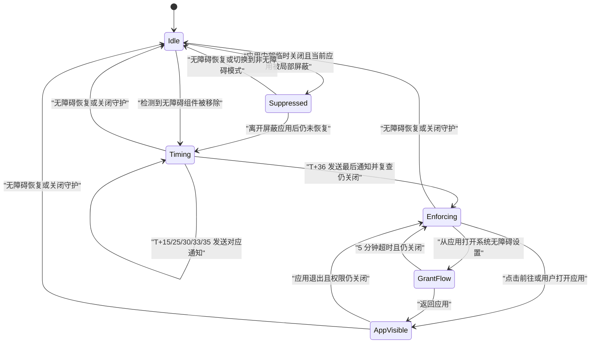

# 无障碍权限守护 Implementation Plan

> **For Codex:** REQUIRED SUB-SKILL: Use superpowers:executing-plans to implement this plan task-by-task.

**Goal:** 当用户主动开启“无障碍权限守护”后，检测到本应用的无障碍组件被关闭时，按 `15 → 10 → 5 → 3 → 2 → 1` 分钟的间隔发送六次本地通知，并在第六次通知后仍未恢复时进入全屏悬浮窗提醒流程。

**Architecture:** 复用现有 `StatusService` 作为前台存活载体，新增纯策略层、私有持久化会话、运行时协调器和独立的 Compose 全屏悬浮窗服务。所有提醒按首次检测时间的绝对时间点 `[15, 25, 30, 33, 35, 36]` 分钟计算；状态变化、进程恢复和计时唤醒都进入同一个幂等 `reconcile` 流程。

**Tech Stack:** Kotlin、Kotlin Coroutines/Flow、kotlinx.serialization、Jetpack Compose Material3、Android Foreground Service、NotificationChannel、`TYPE_APPLICATION_OVERLAY`、JUnit4、Gradle、GitHub Actions（Ubuntu + Zulu JDK 21）。

---

## 1. 已确认的产品行为

### 1.1 时间线

这里的 `10、5、3、2、1` 是“上一条通知之后继续等待的时长”，不是从关闭时刻重新计算。

| 序号 | 本次继续等待 | 相对关闭时刻 | 动作 |
|---|---:|---:|---|
| 1 | 15 分钟 | `T+15` | 第 1 次通知 |
| 2 | 10 分钟 | `T+25` | 第 2 次通知 |
| 3 | 5 分钟 | `T+30` | 第 3 次通知 |
| 4 | 3 分钟 | `T+33` | 第 4 次通知 |
| 5 | 2 分钟 | `T+35` | 第 5 次通知 |
| 6 | 1 分钟 | `T+36` | 第 6 次/最后一次通知；立即复查权限，仍关闭则进入全屏提醒 |

明确不再等待第 37 分钟。第六次通知和“开始全屏提醒”属于同一个 `T+36` 检查点，执行顺序为：

1. 再次直接读取系统无障碍组件列表。
2. 若已经开启，立即清理会话，不发送最后一条，也不显示悬浮窗。
3. 若仍关闭，发送第六次通知。
4. 再做一次幂等状态确认并持久化 `enforcementStarted=true`。
5. 当前不在本应用、屏幕已解锁且悬浮窗权限有效时，显示全屏悬浮窗。

### 1.2 通知和悬浮窗

- 这里的“推送”是设备本地通知，不引入 FCM、服务端或网络依赖。
- 每次通知使用新的通知 ID，发下一条前取消上一条，避免通知抽屉堆积，同时让每次提醒都作为一次新通知提交给系统。
- 新建独立的高重要性通知渠道。Android 最终是否显示顶部横幅仍受用户的渠道设置、勿扰模式、厂商策略和系统节流影响，应用只能做到“尽力触发”，不能承诺百分之百弹出。
- 不申请或使用 `USE_FULL_SCREEN_INTENT`。本需求使用用户已明确授予的 `SYSTEM_ALERT_WINDOW` 和 `TYPE_APPLICATION_OVERLAY`，避免把来电/闹钟专用的全屏通知能力用于不匹配的场景。
- 全屏悬浮窗只显示应用身份、无障碍已关闭的说明和“前往”按钮，不伪装成 Android 系统警告。
- 点击“前往”后，关闭悬浮窗并以清空任务栈的方式打开应用首页控制页。
- 应用可见期间不覆盖应用自身；用户按 Home、返回退出或切换到其他应用后，如果无障碍仍关闭，则在短暂防抖后重新显示。
- 从应用打开系统无障碍设置时，暂时抑制悬浮窗，避免遮挡授权页面；回到应用后结束抑制。若用户没有返回应用，抑制最多保留 5 分钟。
- 锁屏或熄屏时只持久化“已进入强提醒”，不强行加窗；解锁后再显示。

### 1.3 启用范围和退出能力

- 功能默认关闭，必须由用户在应用内明确开启。
- 开启前展示一次清晰说明，列出六个时间点和第 36 分钟后的全屏行为。
- 开启前必须满足：
  - 当前为无障碍模式，而不是 Shizuku/Automation 模式；
  - 本应用无障碍组件当前已开启；
  - 通知权限有效；
  - 特殊用途前台服务权限有效；
  - 悬浮窗权限有效；
  - `StatusService` 成功启动。
- 开启守护后，不允许单独关闭“常驻通知”；必须先关闭守护。关闭守护会取消所有提醒、停止本功能的悬浮窗并清空会话。
- 应用首页始终保留关闭守护的入口，用户仍可在系统设置中撤销权限、强制停止或卸载应用。
- 严格全屏行为只对 `gkd` 渠道开放；`play` 渠道仍编译同一套代码，但不展示开关、不会进入严格守护。若未来要在 Play 渠道开放，必须先单独完成 Google Play Accessibility API、前台服务和干扰性界面政策审核。

### 1.4 不应触发的情况

- 应用在局部屏蔽列表中主动执行 `shutdown(true)` 的临时关闭。
- 当前切换到了 Automation/Shizuku 模式。
- 无障碍组件仍在系统已启用列表中、但服务进程没有运行；这是现有“无障碍发生故障”路径，不属于“权限被关闭”。
- 用户尚未主动开启本功能。

手动在系统设置中关闭权限时，即使当前前台应用恰好在局部屏蔽列表内，只要没有应用内部的“预期临时关闭”标记，仍要启动守护。

---

## 2. 状态机和恢复规则



### 2.1 持久化字段

使用独立私有文件保存运行时会话，不把瞬态数据塞入主设置文件：

```kotlin
@Serializable
data class AccessibilityGuardSession(
    val generation: Long = 0L,
    val disabledAtEpochMs: Long = 0L,
    val lastReminderIndex: Int = -1,
    val enforcementStarted: Boolean = false,
    val temporaryShutdownExpected: Boolean = false,
    val grantFlowUntilEpochMs: Long = 0L,
)
```

- `generation`：每次新关闭会话递增，废弃旧计时任务和旧副作用。
- `disabledAtEpochMs`：首次确认权限关闭的墙上时钟时间；`0` 表示没有计时会话。
- `lastReminderIndex`：最后已提交的提醒序号，范围 `-1..5`。
- `enforcementStarted`：第 36 分钟检查点是否已经到达。
- `temporaryShutdownExpected`：应用内部在 `shutdown(true)` 前写入，用于区分局部关闭和用户手动关闭。
- `grantFlowUntilEpochMs`：系统无障碍设置页的最长让路时间。

### 2.2 绝对时间重算

生产常量固定为：

```kotlin
val REMINDER_INTERVALS_MINUTES = intArrayOf(15, 10, 5, 3, 2, 1)
val REMINDER_OFFSETS_MS = longArrayOf(15, 25, 30, 33, 35, 36)
    .map { it * 60_000L }
```

不能写成六段相互串联的 `delay()`。每次进程恢复或状态变化都用：

```text
elapsed = nowEpochMs - disabledAtEpochMs
```

重新求当前应到达的最高检查点。

- 正常存活时会依次发送六次。
- 如果进程在 `T+17` 恢复，只补第 1 次。
- 如果进程在 `T+34` 恢复，只补第 4 次，不瞬间补发前四次。
- 如果进程在 `T+40` 恢复，只提交第 6 次并进入强提醒，不连续轰炸六条。
- 同一个 `generation + reminderIndex` 只允许提交一次；稳定通知 ID 使偶发重复提交也只会替换同一条。
- 系统休眠或厂商限制造成的延迟通过绝对时间重算纠正，但不能保证硬实时准点。

---

## 3. 关键架构决定

### 3.1 复用 `StatusService`

不新增第二个前台服务。`StatusService` 已使用 `specialUse` 类型并持有常驻通知，新增协调器由它的 `scope` 托管：

- 降低多个前台通知和服务声明的复杂度。
- `START_STICKY` 后，普通进程回收时可恢复并读取持久化会话。
- 守护开启时，`StatusService.needRestart` 同时考虑 `accessibilityGuardEnabled`。
- 用户通过系统前台服务任务管理器停止应用或“强制停止”时，Android 会终止应用能力；应用不能合法绕过用户的停止决定。

不加入 Exact Alarm、WorkManager 或远程推送。该功能本身要求常驻服务和持续观察权限状态，额外调度器只会增加重复唤醒、权限和状态竞争。

### 3.2 单一协调入口

`AccessibilityGuardCoordinator` 的所有输入只负责调用 `requestReconcile()`：

- 无障碍已启用组件 Flow；
- 主设置 Flow；
- 私有会话 Flow；
- 当前应用/局部屏蔽状态；
- 应用可见性 Flow；
- 悬浮窗服务运行状态；
- `ACTION_SCREEN_ON`、`ACTION_SCREEN_OFF`、`ACTION_USER_PRESENT`；
- 当前检查点的单一计时任务。

`reconcile` 使用 `Mutex` 串行化，并在每次执行后只安排一个“下个绝对时间点”任务。不得让多个 `collect` 各自发送通知或启动悬浮窗。

### 3.3 渠道和政策边界

使用现有 `META.isGkdChannel` 作为严格功能开关，不额外复制 flavor 配置：

```kotlin
val strictFeatureAvailable = META.isGkdChannel
```

`play` 构建仍需通过编译，以防公共代码、Manifest 或资源只在一个 flavor 下可用。严格悬浮窗功能在 Play 渠道默认不可用，原因是 Google Play 明确限制 Accessibility API、前台服务和干扰性全屏体验。

---

## 4. File Map

### Create

- `app/src/main/kotlin/li/songe/gkd/sdp/util/AccessibilityGuardPolicy.kt`
- `app/src/main/kotlin/li/songe/gkd/sdp/store/AccessibilityGuardStore.kt`
- `app/src/main/kotlin/li/songe/gkd/sdp/service/AccessibilityGuardCoordinator.kt`
- `app/src/main/kotlin/li/songe/gkd/sdp/service/AccessibilityGuardOverlayService.kt`
- `app/src/test/kotlin/li/songe/gkd/sdp/util/AccessibilityGuardPolicyTest.kt`
- `app/src/test/kotlin/li/songe/gkd/sdp/store/AccessibilityGuardSessionTest.kt`

### Modify

- `app/src/main/kotlin/li/songe/gkd/sdp/store/SettingsStore.kt`
- `app/src/main/kotlin/li/songe/gkd/sdp/store/StoreExt.kt`
- `app/src/main/kotlin/li/songe/gkd/sdp/notif/NotifChannel.kt`
- `app/src/main/kotlin/li/songe/gkd/sdp/notif/Notif.kt`
- `app/src/main/kotlin/li/songe/gkd/sdp/service/StatusService.kt`
- `app/src/main/kotlin/li/songe/gkd/sdp/service/A11yService.kt`
- `app/src/main/kotlin/li/songe/gkd/sdp/MainActivity.kt`
- `app/src/main/kotlin/li/songe/gkd/sdp/util/IntentExt.kt`
- `app/src/main/kotlin/li/songe/gkd/sdp/ui/home/ControlPage.kt`
- `app/src/main/AndroidManifest.xml`
- `README_DEV.md`
- `.github/workflows/Verify-Merge.yml`
- `.github/workflows/Build-Apk.yml`
- `.github/workflows/Build-Release.yml`

### Existing code to reuse

- `a11y/A11yExt.kt`：`useA11yServiceEnabledFlow()`。
- `service/UsageGuardTimeoutOverlayService.kt`：Compose 全屏 Overlay 的生命周期和 `WindowManager` 写法。
- `service/UsageGuardCountdownOverlayService.kt`：安全 add/remove View 的实现习惯。
- `store/StorageExt.kt`：`createAnyFlow()` 和原子替换写入。
- `MainActivity.kt`：现有 `onStart`/`onStop` 可见性统计。
- `App.kt`：`startLaunchActivity()`。
- `permission/PermissionState.kt`：通知、前台服务和悬浮窗权限状态。

---

### Task 1: 用纯 JVM 测试锁定时间线和显示决策

**Files:**

- Create: `app/src/test/kotlin/li/songe/gkd/sdp/util/AccessibilityGuardPolicyTest.kt`
- Create: `app/src/main/kotlin/li/songe/gkd/sdp/util/AccessibilityGuardPolicy.kt`

- [ ] **Step 1: 先写时间点和迟到恢复测试**

测试至少包含：

```kotlin
package li.songe.gkd.sdp.util

import org.junit.Assert.assertArrayEquals
import org.junit.Assert.assertEquals
import org.junit.Assert.assertFalse
import org.junit.Assert.assertNull
import org.junit.Assert.assertTrue
import org.junit.Test

class AccessibilityGuardPolicyTest {
    private val minute = 60_000L
    private val startedAt = 1_000_000L

    @Test
    fun scheduleUsesSequential15_10_5_3_2_1MinuteWaits() {
        assertArrayEquals(
            longArrayOf(15, 25, 30, 33, 35, 36).map { it * minute }.toLongArray(),
            AccessibilityGuardPolicy.REMINDER_OFFSETS_MS,
        )
    }

    @Test
    fun nothingIsDueBefore15Minutes() {
        val result = AccessibilityGuardPolicy.evaluate(
            disabledAtEpochMs = startedAt,
            lastReminderIndex = -1,
            enforcementStarted = false,
            nowEpochMs = startedAt + 15 * minute - 1,
        )
        assertNull(result.dueReminderIndex)
        assertFalse(result.startEnforcement)
        assertEquals(startedAt + 15 * minute, result.nextWakeAtEpochMs)
    }

    @Test
    fun eachBoundaryMapsToTheExpectedReminder() {
        AccessibilityGuardPolicy.REMINDER_OFFSETS_MS.forEachIndexed { index, offset ->
            val result = AccessibilityGuardPolicy.evaluate(
                disabledAtEpochMs = startedAt,
                lastReminderIndex = index - 1,
                enforcementStarted = false,
                nowEpochMs = startedAt + offset,
            )
            assertEquals(index, result.dueReminderIndex)
        }
    }

    @Test
    fun lateResumeOnlyReturnsLatestDueReminder() {
        val result = AccessibilityGuardPolicy.evaluate(
            disabledAtEpochMs = startedAt,
            lastReminderIndex = -1,
            enforcementStarted = false,
            nowEpochMs = startedAt + 34 * minute,
        )
        assertEquals(3, result.dueReminderIndex)
    }

    @Test
    fun finalBoundaryReturnsLastReminderAndEnforcementTogether() {
        val result = AccessibilityGuardPolicy.evaluate(
            disabledAtEpochMs = startedAt,
            lastReminderIndex = 4,
            enforcementStarted = false,
            nowEpochMs = startedAt + 36 * minute,
        )
        assertEquals(5, result.dueReminderIndex)
        assertTrue(result.startEnforcement)
        assertNull(result.nextWakeAtEpochMs)
    }

    @Test
    fun completedFinalBoundaryDoesNotDuplicateActions() {
        val result = AccessibilityGuardPolicy.evaluate(
            disabledAtEpochMs = startedAt,
            lastReminderIndex = 5,
            enforcementStarted = true,
            nowEpochMs = startedAt + 40 * minute,
        )
        assertNull(result.dueReminderIndex)
        assertFalse(result.startEnforcement)
    }
}
```

- [ ] **Step 2: 写触发、临时关闭和 Overlay 决策测试**

必须覆盖：

- 功能关闭、`play` 渠道、非无障碍模式或权限已恢复时返回 `RESET`。
- `temporaryShutdownExpected=true && currentAppBlocked=true` 时返回 `SUPPRESSED_TEMPORARY`。
- 手动关闭时 `temporaryShutdownExpected=false`，即便 `currentAppBlocked=true` 也返回 `TRACK`。
- 强提醒已开始但应用可见、正在授权、锁屏、熄屏或无悬浮窗权限时不显示 Overlay。
- 应用不可见、未抑制、已解锁且权限有效时显示 Overlay。

加入以下测试：

```kotlin
@Test
fun expectedTemporaryShutdownIsSuppressedOnlyInsideBlockedApp() {
    assertEquals(
        AccessibilityGuardPolicy.SessionMode.SUPPRESSED_TEMPORARY,
        AccessibilityGuardPolicy.sessionMode(
            featureEnabled = true,
            strictChannelAvailable = true,
            useA11yMode = true,
            a11yEnabled = false,
            temporaryShutdownExpected = true,
            currentAppBlocked = true,
        ),
    )
    assertEquals(
        AccessibilityGuardPolicy.SessionMode.TRACK,
        AccessibilityGuardPolicy.sessionMode(
            featureEnabled = true,
            strictChannelAvailable = true,
            useA11yMode = true,
            a11yEnabled = false,
            temporaryShutdownExpected = true,
            currentAppBlocked = false,
        ),
    )
}

@Test
fun manualDisableStillTracksWhenCurrentAppIsBlocked() {
    assertEquals(
        AccessibilityGuardPolicy.SessionMode.TRACK,
        AccessibilityGuardPolicy.sessionMode(
            featureEnabled = true,
            strictChannelAvailable = true,
            useA11yMode = true,
            a11yEnabled = false,
            temporaryShutdownExpected = false,
            currentAppBlocked = true,
        ),
    )
}

@Test
fun restoredPermissionResetsTheSession() {
    assertEquals(
        AccessibilityGuardPolicy.SessionMode.RESET,
        AccessibilityGuardPolicy.sessionMode(
            featureEnabled = true,
            strictChannelAvailable = true,
            useA11yMode = true,
            a11yEnabled = true,
            temporaryShutdownExpected = false,
            currentAppBlocked = false,
        ),
    )
}

@Test
fun overlayOnlyShowsOutsideTheAppAfterSuppressionExpires() {
    val common = AccessibilityGuardPolicy.OverlayInput(
        enforcementStarted = true,
        a11yEnabled = false,
        appVisible = false,
        grantFlowUntilEpochMs = 0L,
        nowEpochMs = startedAt,
        canDrawOverlays = true,
        screenInteractive = true,
        keyguardLocked = false,
    )

    assertTrue(AccessibilityGuardPolicy.shouldShowOverlay(common))
    assertFalse(
        AccessibilityGuardPolicy.shouldShowOverlay(
            common.copy(appVisible = true)
        )
    )
    assertFalse(
        AccessibilityGuardPolicy.shouldShowOverlay(
            common.copy(grantFlowUntilEpochMs = startedAt + 1)
        )
    )
    assertFalse(
        AccessibilityGuardPolicy.shouldShowOverlay(
            common.copy(screenInteractive = false)
        )
    )
    assertFalse(
        AccessibilityGuardPolicy.shouldShowOverlay(
            common.copy(keyguardLocked = true)
        )
    )
    assertFalse(
        AccessibilityGuardPolicy.shouldShowOverlay(
            common.copy(canDrawOverlays = false)
        )
    )
}
```

- [ ] **Step 3: 运行测试确认 RED**

Run:

```bash
./gradlew :app:testGkdDebugUnitTest --tests "*AccessibilityGuardPolicyTest"
```

Expected: FAIL，原因是 `AccessibilityGuardPolicy` 尚不存在。

- [ ] **Step 4: 实现最小纯策略**

核心 API 固定为：

```kotlin
object AccessibilityGuardPolicy {
    const val MINUTE_MS = 60_000L
    val REMINDER_INTERVALS_MINUTES = intArrayOf(15, 10, 5, 3, 2, 1)
    val REMINDER_OFFSETS_MS = longArrayOf(15, 25, 30, 33, 35, 36)
        .map { it * MINUTE_MS }
        .toLongArray()

    enum class SessionMode {
        RESET,
        SUPPRESSED_TEMPORARY,
        TRACK,
    }

    data class Evaluation(
        val dueReminderIndex: Int?,
        val startEnforcement: Boolean,
        val nextWakeAtEpochMs: Long?,
    )

    data class OverlayInput(
        val enforcementStarted: Boolean,
        val a11yEnabled: Boolean,
        val appVisible: Boolean,
        val grantFlowUntilEpochMs: Long,
        val nowEpochMs: Long,
        val canDrawOverlays: Boolean,
        val screenInteractive: Boolean,
        val keyguardLocked: Boolean,
    )

    fun sessionMode(
        featureEnabled: Boolean,
        strictChannelAvailable: Boolean,
        useA11yMode: Boolean,
        a11yEnabled: Boolean,
        temporaryShutdownExpected: Boolean,
        currentAppBlocked: Boolean,
    ): SessionMode {
        if (!featureEnabled || !strictChannelAvailable || !useA11yMode || a11yEnabled) {
            return SessionMode.RESET
        }
        if (temporaryShutdownExpected && currentAppBlocked) {
            return SessionMode.SUPPRESSED_TEMPORARY
        }
        return SessionMode.TRACK
    }

    fun evaluate(
        disabledAtEpochMs: Long,
        lastReminderIndex: Int,
        enforcementStarted: Boolean,
        nowEpochMs: Long,
    ): Evaluation {
        require(disabledAtEpochMs > 0L)
        val elapsed = (nowEpochMs - disabledAtEpochMs).coerceAtLeast(0L)
        val highestDue = REMINDER_OFFSETS_MS.indexOfLast { elapsed >= it }
        val reminder = highestDue.takeIf { it > lastReminderIndex }
        val finalDue = elapsed >= REMINDER_OFFSETS_MS.last()
        return Evaluation(
            dueReminderIndex = reminder,
            startEnforcement = finalDue && !enforcementStarted,
            nextWakeAtEpochMs = REMINDER_OFFSETS_MS
                .firstOrNull { elapsed < it }
                ?.let(disabledAtEpochMs::plus),
        )
    }

    fun shouldShowOverlay(input: OverlayInput): Boolean {
        return input.enforcementStarted &&
            !input.a11yEnabled &&
            !input.appVisible &&
            input.nowEpochMs >= input.grantFlowUntilEpochMs &&
            input.canDrawOverlays &&
            input.screenInteractive &&
            !input.keyguardLocked
    }
}
```

- [ ] **Step 5: 运行测试确认 GREEN**

Run:

```bash
./gradlew :app:testGkdDebugUnitTest --tests "*AccessibilityGuardPolicyTest"
```

Expected: PASS。

- [ ] **Step 6: Commit**

```bash
git add app/src/main/kotlin/li/songe/gkd/sdp/util/AccessibilityGuardPolicy.kt app/src/test/kotlin/li/songe/gkd/sdp/util/AccessibilityGuardPolicyTest.kt
git commit -m "feat: define accessibility guard policy"
```

---

### Task 2: 持久化开关和守护会话

**Files:**

- Modify: `app/src/main/kotlin/li/songe/gkd/sdp/store/SettingsStore.kt`
- Create: `app/src/main/kotlin/li/songe/gkd/sdp/store/AccessibilityGuardStore.kt`
- Modify: `app/src/main/kotlin/li/songe/gkd/sdp/store/StoreExt.kt`
- Create: `app/src/test/kotlin/li/songe/gkd/sdp/store/AccessibilityGuardSessionTest.kt`

- [ ] **Step 1: 写默认值和序列化往返测试**

```kotlin
package li.songe.gkd.sdp.store

import kotlinx.serialization.json.Json
import kotlinx.serialization.decodeFromString
import kotlinx.serialization.encodeToString
import org.junit.Assert.assertEquals
import org.junit.Assert.assertFalse
import org.junit.Test

class AccessibilityGuardSessionTest {
    @Test
    fun defaultsAreInactiveAndBackwardCompatible() {
        val session = Json.decodeFromString<AccessibilityGuardSession>("{}")
        assertEquals(0L, session.disabledAtEpochMs)
        assertEquals(-1, session.lastReminderIndex)
        assertFalse(session.enforcementStarted)
        assertFalse(session.temporaryShutdownExpected)
    }

    @Test
    fun activeSessionRoundTripsWithoutLosingGeneration() {
        val expected = AccessibilityGuardSession(
            generation = 7,
            disabledAtEpochMs = 1_000,
            lastReminderIndex = 3,
            enforcementStarted = true,
            grantFlowUntilEpochMs = 2_000,
        )
        val actual = Json.decodeFromString<AccessibilityGuardSession>(
            Json.encodeToString(expected)
        )
        assertEquals(expected, actual)
    }
}
```

- [ ] **Step 2: 运行测试确认 RED**

Run:

```bash
./gradlew :app:testGkdDebugUnitTest --tests "*AccessibilityGuardSessionTest"
```

Expected: FAIL，数据类不存在。

- [ ] **Step 3: 在主设置增加默认关闭开关**

在 `SettingsStore` 尾部添加：

```kotlin
val accessibilityGuardEnabled: Boolean = false,
```

保持默认值，确保旧版 `store.json` 可以反序列化。

- [ ] **Step 4: 建立独立私有会话 Flow**

`AccessibilityGuardStore.kt`：

```kotlin
package li.songe.gkd.sdp.store

import kotlinx.serialization.Serializable

@Serializable
data class AccessibilityGuardSession(
    val generation: Long = 0L,
    val disabledAtEpochMs: Long = 0L,
    val lastReminderIndex: Int = -1,
    val enforcementStarted: Boolean = false,
    val temporaryShutdownExpected: Boolean = false,
    val grantFlowUntilEpochMs: Long = 0L,
)

val accessibilityGuardSessionFlow by lazy {
    createAnyFlow(
        key = "accessibility_guard_session",
        default = { AccessibilityGuardSession() },
        private = true,
    )
}
```

- [ ] **Step 5: 在 `initStore()` 预加载**

加入：

```kotlin
accessibilityGuardSessionFlow.value
```

保证 `StatusService` 启动协调器前已经完成磁盘初始读取。

- [ ] **Step 6: 运行测试和主设置兼容测试**

Run:

```bash
./gradlew :app:testGkdDebugUnitTest --tests "*AccessibilityGuardSessionTest"
./gradlew :app:testGkdDebugUnitTest
```

Expected: PASS，既有设置测试不回归。

- [ ] **Step 7: Commit**

```bash
git add app/src/main/kotlin/li/songe/gkd/sdp/store/SettingsStore.kt app/src/main/kotlin/li/songe/gkd/sdp/store/AccessibilityGuardStore.kt app/src/main/kotlin/li/songe/gkd/sdp/store/StoreExt.kt app/src/test/kotlin/li/songe/gkd/sdp/store/AccessibilityGuardSessionTest.kt
git commit -m "feat: persist accessibility guard sessions"
```

---

### Task 3: 增加独立高重要性通知渠道和六条提醒

**Files:**

- Modify: `app/src/main/kotlin/li/songe/gkd/sdp/notif/NotifChannel.kt`
- Modify: `app/src/main/kotlin/li/songe/gkd/sdp/notif/Notif.kt`

- [ ] **Step 1: 让渠道显式携带重要性**

给 `NotifChannel` 增加：

```kotlin
val importance: Int = NotificationManager.IMPORTANCE_LOW
```

新增稳定渠道，不能复用已有低重要性渠道：

```kotlin
data object AccessibilityGuard : NotifChannel(
    id = "3",
    name = "无障碍权限守护",
    desc = "无障碍权限关闭后的分阶段提醒",
    importance = NotificationManager.IMPORTANCE_HIGH,
)
```

把它加入 `initChannel()` 的 `channels`，创建时使用 `it.importance`。不要改变已有三个渠道的重要性。

- [ ] **Step 2: 把普通通知和前台服务权限检查解耦**

`Notif.notifySelf()` 只检查 `notificationState`。`FOREGROUND_SERVICE_SPECIAL_USE` 只属于 `notifyService()` 的前台服务启动条件，不能阻断普通本地通知。

- [ ] **Step 3: 给 `Notif` 增加可选优先级和类别**

新增默认不影响现有通知的字段：

```kotlin
val priority: Int = NotificationCompat.PRIORITY_DEFAULT,
val category: String? = null,
```

构建器设置 `setPriority(priority)`，并在非空时设置 `setCategory(category)`。

- [ ] **Step 4: 定义提醒 ID、文案和取消函数**

使用 ID `110..115`：

```kotlin
const val ACCESSIBILITY_GUARD_NOTIF_ID_START = 110
const val ACCESSIBILITY_GUARD_NOTIF_COUNT = 6

fun accessibilityGuardNotif(index: Int): Notif {
    require(index in 0 until ACCESSIBILITY_GUARD_NOTIF_COUNT)
    val elapsedMinutes = intArrayOf(15, 25, 30, 33, 35, 36)[index]
    return Notif(
        channel = NotifChannel.AccessibilityGuard,
        id = ACCESSIBILITY_GUARD_NOTIF_ID_START + index,
        title = "无障碍权限已关闭",
        text = if (index == ACCESSIBILITY_GUARD_NOTIF_COUNT - 1) {
            "已关闭 $elapsedMinutes 分钟，将显示全屏提醒，请前往重新开启"
        } else {
            "已关闭 $elapsedMinutes 分钟，请前往重新开启"
        },
        ongoing = false,
        autoCancel = true,
        uri = "gkd://page?tab=0",
        priority = NotificationCompat.PRIORITY_HIGH,
        category = NotificationCompat.CATEGORY_ERROR,
    )
}
```

增加：

```kotlin
fun cancelAccessibilityGuardNotifications()
fun postAccessibilityGuardNotification(index: Int)
```

`postAccessibilityGuardNotification()` 先取消 `110..115`，再提交当前 ID。不要设置 `setOnlyAlertOnce(true)`。

- [ ] **Step 5: 编译验证**

Run:

```bash
./gradlew :app:compileGkdDebugKotlin :app:compilePlayDebugKotlin
```

Expected: BUILD SUCCESSFUL。

- [ ] **Step 6: Commit**

```bash
git add app/src/main/kotlin/li/songe/gkd/sdp/notif/NotifChannel.kt app/src/main/kotlin/li/songe/gkd/sdp/notif/Notif.kt
git commit -m "feat: add accessibility guard notifications"
```

---

### Task 4: 标记应用内部的预期临时关闭

**Files:**

- Modify: `app/src/main/kotlin/li/songe/gkd/sdp/service/A11yService.kt`
- Modify: `app/src/main/kotlin/li/songe/gkd/sdp/service/AccessibilityGuardCoordinator.kt`（先放运行时入口骨架）
- Test: `app/src/test/kotlin/li/songe/gkd/sdp/util/AccessibilityGuardPolicyTest.kt`

- [ ] **Step 1: 在纯策略测试中锁定“局部关闭”和“手动关闭”的差异**

确认 Task 1 中的 `expectedTemporaryShutdownIsSuppressedOnlyInsideBlockedApp()` 和
`manualDisableStillTracksWhenCurrentAppIsBlocked()` 均为 GREEN；本 Task 不另写一套重复测试。

- [ ] **Step 2: 增加幂等运行时入口**

在 `AccessibilityGuardCoordinator.kt` 先定义：

```kotlin
object AccessibilityGuardRuntime {
    const val GRANT_FLOW_TIMEOUT_MS = 5 * 60_000L

    fun markTemporaryShutdownExpected()
    fun clearTemporaryShutdownExpected()
    fun beginGrantFlow(nowEpochMs: Long = System.currentTimeMillis())
    fun onAppVisible()
    fun requestReconcile()
    fun disableAndReset()
}
```

这些方法只更新 `accessibilityGuardSessionFlow` 并发送一个 conflated wake-up，不直接发送通知或启动 Service。

- [ ] **Step 3: 在 `shutdown(true)` 之前写入标记**

`A11yService.shutdown(temp)`：

```kotlin
if (temp) {
    tempShutdownFlag = true
    AccessibilityGuardRuntime.markTemporaryShutdownExpected()
}
disableSelf()
```

在无障碍成功连接/创建时调用 `clearTemporaryShutdownExpected()`。协调器观察到无障碍已启用后仍会执行完整 reset，形成双重幂等保护。

- [ ] **Step 4: 检查所有既有 `shutdown(true)` 调用点**

至少人工检查：

- `service/A11yService.kt`
- `service/GkdTileService.kt`
- `a11y/A11yRuleEngine.kt`
- `shizuku/ShizukuApi.kt`

Expected:

- 局部屏蔽：标记为预期关闭并抑制。
- 模式切换：由于 `store.useA11y=false` 直接 reset。
- 非临时 `shutdown(false)` 或系统设置关闭：不写预期标记。

- [ ] **Step 5: 运行策略测试**

Run:

```bash
./gradlew :app:testGkdDebugUnitTest --tests "*AccessibilityGuardPolicyTest"
```

Expected: PASS。

- [ ] **Step 6: Commit**

```bash
git add app/src/main/kotlin/li/songe/gkd/sdp/service/A11yService.kt app/src/main/kotlin/li/songe/gkd/sdp/service/AccessibilityGuardCoordinator.kt app/src/test/kotlin/li/songe/gkd/sdp/util/AccessibilityGuardPolicyTest.kt
git commit -m "feat: distinguish temporary accessibility shutdowns"
```

---

### Task 5: 实现协调器并接入 `StatusService`

**Files:**

- Modify: `app/src/main/kotlin/li/songe/gkd/sdp/service/AccessibilityGuardCoordinator.kt`
- Modify: `app/src/main/kotlin/li/songe/gkd/sdp/service/StatusService.kt`
- Modify: `app/src/main/kotlin/li/songe/gkd/sdp/MainActivity.kt`
- Test: `app/src/test/kotlin/li/songe/gkd/sdp/util/AccessibilityGuardPolicyTest.kt`

- [ ] **Step 1: 把应用可见性改为 Flow**

保留现有 `isActivityVisible` 兼容接口，同时增加：

```kotlin
val activityVisibleCountFlow = MutableStateFlow(0)
val isActivityVisible get() = activityVisibleCountFlow.value > 0
```

`MainActivity.onStart()` 递增，`onStop()` 递减并 `coerceAtLeast(0)`。不要继续维护第二份普通整数，避免状态分叉。

- [ ] **Step 2: 构造协调器输入**

`AccessibilityGuardCoordinator` 接收 `StatusService` 的 `scope` 和已有的 `a11yServiceEnabledFlow`。监听：

```text
storeFlow(accessibilityGuardEnabled, useA11y)
accessibilityGuardSessionFlow
a11yServiceEnabledFlow
a11yPartDisabledFlow/currentAppBlocked
activityVisibleCountFlow
AccessibilityGuardOverlayService.isRunning
AccessibilityGuardRuntime.wakeups
```

动态注册屏幕开关和解锁广播，每次只调用 `requestReconcile()`，在销毁时注销。

- [ ] **Step 3: 实现串行 `reconcile`**

严格按以下顺序：

1. 用 `Mutex` 防止重入。
2. 读取同一时刻的 store、session、无障碍 enabled component、当前应用和权限状态快照。
3. 调用 `AccessibilityGuardPolicy.sessionMode()`。
4. `RESET`：
   - 只有会话非空时才递增 generation 并清空；
   - 取消 `110..115`；
   - 停止本功能 Overlay；
   - 取消下次唤醒。
5. `SUPPRESSED_TEMPORARY`：
   - 不设置 `disabledAtEpochMs`；
   - 停止本功能 Overlay；
   - 等待 top-app 或无障碍状态变化。
6. `TRACK`：
   - 如果是从临时关闭离开屏蔽应用，先清除 `temporaryShutdownExpected`；
   - `disabledAtEpochMs==0` 时，以当前时间创建新 generation；
   - 调用 `evaluate()`。
7. 有到期通知时，在提交前直接调用 `app.getSecureA11yServices()` 复查；
   - 已恢复：回到 reset；
   - 未恢复：提交最高到期的一条，再写 `lastReminderIndex`。
8. `startEnforcement=true` 时先确保最后通知已提交，再持久化 `enforcementStarted=true`。
9. 根据 `shouldShowOverlay()` 启停 Overlay。
10. 只为下一个绝对提醒时间、授权抑制到期时间或退出应用防抖时间保留一个 timer Job。

所有异步回调必须捕获 generation，并在副作用前检查仍等于当前 generation。

- [ ] **Step 4: 处理进程恢复和迟到检查**

协调器启动时立即 `requestReconcile()`。不得把 `disabledAtEpochMs` 改成当前时间；使用持久化的原始时间求最高到期提醒。

持久化与通知的顺序采用“先提交稳定 ID 的通知，再记录 index”。极端崩溃可能导致同一 ID 再提交一次，但不会漏掉提醒或堆积重复通知。

- [ ] **Step 5: 接入 `StatusService`**

在 `StatusService`：

- `onCreated` 后创建并启动协调器；
- `onStartCommand()` 返回 `START_STICKY`；
- `needRestart` 改为：

```kotlin
(storeFlow.value.enableStatusService || storeFlow.value.accessibilityGuardEnabled) &&
    !isRunning.value &&
    notificationState.updateAndGet() &&
    foregroundServiceSpecialUseState.updateAndGet()
```

- `requestStart()` 继续维护 `enableStatusService=true`；
- 守护开启时，普通 UI 路径不能停止该服务。

- [ ] **Step 6: 加入日志但不记录敏感内容**

每次状态迁移记录：

```text
generation, fromState, toState, reminderIndex, reason
```

不要记录用户屏幕内容、无障碍节点或其他应用的详细信息。

- [ ] **Step 7: 运行 JVM 测试和编译**

Run:

```bash
./gradlew :app:testGkdDebugUnitTest --tests "*AccessibilityGuardPolicyTest"
./gradlew :app:compileGkdDebugKotlin :app:compilePlayDebugKotlin
```

Expected: PASS / BUILD SUCCESSFUL。

- [ ] **Step 8: Commit**

```bash
git add app/src/main/kotlin/li/songe/gkd/sdp/service/AccessibilityGuardCoordinator.kt app/src/main/kotlin/li/songe/gkd/sdp/service/StatusService.kt app/src/main/kotlin/li/songe/gkd/sdp/MainActivity.kt app/src/test/kotlin/li/songe/gkd/sdp/util/AccessibilityGuardPolicyTest.kt
git commit -m "feat: coordinate accessibility guard lifecycle"
```

---

### Task 6: 实现最高优先级的全屏悬浮窗

**Files:**

- Create: `app/src/main/kotlin/li/songe/gkd/sdp/service/AccessibilityGuardOverlayService.kt`
- Modify: `app/src/main/kotlin/li/songe/gkd/sdp/service/AccessibilityGuardCoordinator.kt`
- Modify: `app/src/main/AndroidManifest.xml`

- [ ] **Step 1: 复用现有 Compose Overlay 生命周期**

以 `UsageGuardTimeoutOverlayService` 为模板，但使用独立服务：

```kotlin
class AccessibilityGuardOverlayService :
    LifecycleService(),
    SavedStateRegistryOwner
```

要求：

- `MATCH_PARENT × MATCH_PARENT`；
- `TYPE_APPLICATION_OVERLAY`；
- `FLAG_LAYOUT_IN_SCREEN | FLAG_LAYOUT_NO_LIMITS`；
- `PixelFormat.TRANSLUCENT`；
- `ComposeView` 设置 lifecycle/saved-state owner；
- `onDestroy()` 中安全移除 View；
- `onStartCommand()` 幂等且返回 `START_NOT_STICKY`，存活由 `StatusService` 负责；
- 暴露 `isRunning: StateFlow<Boolean>` 以及 `start()`/`stop()`。

- [ ] **Step 2: 实现明确、非系统仿冒的 UI**

UI 文案建议：

```text
无障碍权限已关闭
为保证已启用的自动化功能正常工作，请返回应用重新开启无障碍权限。
[前往]
```

必须显示应用名称或图标。按钮使用全宽 Material3 `Button`，页面考虑状态栏/导航栏 Insets 和大字体，不提供伪系统图标。

- [ ] **Step 3: 实现“前往”**

点击时：

1. 防重复点击；
2. `stopSelf()`；
3. 调用 `app.startLaunchActivity()`，清空任务栈并进入默认首页控制页；
4. 不清空 guard session，不重置 `enforcementStarted`。

应用 `onStart` 会使协调器确认 Overlay 已隐藏；应用再次不可见后，如果权限仍关闭，500–800ms 防抖后重显。

- [ ] **Step 4: 处理 Overlay 冲突**

显示本功能 Overlay 前停止以下竞争性全屏/交互 Overlay：

- `FocusOverlayService`
- `AppBlockerOverlayService`
- `InterceptOverlayService`
- `UsageGuardRequestOverlayService`
- `UsageGuardTimeoutOverlayService`
- `UsageGuardCountdownOverlayService`

无障碍守护恢复后不主动伪造这些功能的旧状态；各自现有引擎在后续状态变化时按自身规则恢复。人工测试必须覆盖“数字自律 Overlay 正在显示时进入无障碍强提醒”。

- [ ] **Step 5: 锁屏和权限失效降级**

- `PowerManager.isInteractive=false` 或 `KeyguardManager.isKeyguardLocked=true`：停止/不启动 Overlay，保留 enforcement 状态。
- `Settings.canDrawOverlays=false`：不崩溃；保留最后通知，并在下次打开应用时显示权限缺失提示。
- `WindowManager.addView()` 捕获 `SecurityException` 和 `BadTokenException`，记录错误并停止自身，不能让 `StatusService` 崩溃。

- [ ] **Step 6: 注册 Manifest 服务**

在其他 Overlay service 旁加入：

```xml
<service
    android:name=".service.AccessibilityGuardOverlayService"
    android:exported="false" />
```

不新增权限；Manifest 已声明 `SYSTEM_ALERT_WINDOW`。

- [ ] **Step 7: 编译两个 flavor**

Run:

```bash
./gradlew :app:assembleGkdDebug :app:assemblePlayDebug
```

Expected: 两个 APK 均生成。

- [ ] **Step 8: Commit**

```bash
git add app/src/main/kotlin/li/songe/gkd/sdp/service/AccessibilityGuardOverlayService.kt app/src/main/kotlin/li/songe/gkd/sdp/service/AccessibilityGuardCoordinator.kt app/src/main/AndroidManifest.xml
git commit -m "feat: add accessibility guard overlay"
```

---

### Task 7: 系统无障碍设置页让路和应用退出重显

**Files:**

- Modify: `app/src/main/kotlin/li/songe/gkd/sdp/util/IntentExt.kt`
- Modify: `app/src/main/kotlin/li/songe/gkd/sdp/MainActivity.kt`
- Modify: `app/src/main/kotlin/li/songe/gkd/sdp/service/AccessibilityGuardCoordinator.kt`
- Test: `app/src/test/kotlin/li/songe/gkd/sdp/util/AccessibilityGuardPolicyTest.kt`

- [ ] **Step 1: 打开设置前开始 grant flow**

在 `openA11ySettings()` 创建 Intent 前调用：

```kotlin
AccessibilityGuardRuntime.beginGrantFlow()
```

然后继续使用 `Settings.ACTION_ACCESSIBILITY_SETTINGS`。保留 `tryStartActivity()` 异常保护；如果没有匹配 Activity，立即取消 grant flow 并提示跳转失败。

- [ ] **Step 2: 回到应用时结束 grant flow**

`MainActivity.onStart()` 调用：

```kotlin
AccessibilityGuardRuntime.onAppVisible()
```

该方法清空 `grantFlowUntilEpochMs` 并触发 reconcile。调用顺序放在可见性计数更新之后。

- [ ] **Step 3: 应用退出时防抖重显**

`activityVisibleCountFlow` 从正数变为 `0` 时，不立即启动 Overlay；协调器安排 500–800ms 的 generation-aware timer。计时结束仍满足以下条件才显示：

```text
enforcementStarted
无障碍仍关闭
应用仍不可见
不在 grant flow
屏幕已解锁
悬浮窗权限有效
```

这样不会在应用内部 Activity 切换、权限弹窗或启动系统设置的瞬间闪一下。

- [ ] **Step 4: 增加 grant-flow 边界测试**

测试 `now == grantFlowUntil` 时抑制结束，`now < grantFlowUntil` 时不显示。

- [ ] **Step 5: 运行测试和编译**

Run:

```bash
./gradlew :app:testGkdDebugUnitTest --tests "*AccessibilityGuardPolicyTest"
./gradlew :app:compileGkdDebugKotlin
```

Expected: PASS。

- [ ] **Step 6: Commit**

```bash
git add app/src/main/kotlin/li/songe/gkd/sdp/util/IntentExt.kt app/src/main/kotlin/li/songe/gkd/sdp/MainActivity.kt app/src/main/kotlin/li/songe/gkd/sdp/service/AccessibilityGuardCoordinator.kt app/src/test/kotlin/li/songe/gkd/sdp/util/AccessibilityGuardPolicyTest.kt
git commit -m "feat: suppress guard overlay during accessibility grant"
```

---

### Task 8: 增加显式开关、同意说明和权限门禁

**Files:**

- Modify: `app/src/main/kotlin/li/songe/gkd/sdp/ui/home/ControlPage.kt`
- Modify: `app/src/main/kotlin/li/songe/gkd/sdp/service/StatusService.kt`
- Modify: `app/src/main/kotlin/li/songe/gkd/sdp/service/AccessibilityGuardCoordinator.kt`

- [ ] **Step 1: 仅在 `gkd` 渠道展示开关**

在“常驻通知”附近增加：

```text
无障碍权限守护
关闭后按 15/10/5/3/2/1 分钟提醒，最后进入全屏提示
```

使用 `META.isGkdChannel` 隐藏 Play 渠道入口；协调器也必须重复检查该条件，不能只依赖 UI。

- [ ] **Step 2: 开启前展示显式说明**

确认对话框完整说明：

- 六次等待间隔及累计时间；
- 第 36 分钟最后通知后立即进入全屏提醒；
- 点击“前往”回到首页；
- 未恢复时离开应用会再次出现；
- 可随时从本页关闭守护。

只有用户点击“同意并开启”才进入权限请求链。

- [ ] **Step 3: 串行验证前置条件**

顺序：

1. `store.useA11y`，否则提示切换到无障碍模式。
2. `mainVm.a11yServiceEnabledFlow.value`，否则导航到 `AuthA11yRoute`，本次不启用开关。
3. `requiredPermission(context, notificationState)`。
4. `requiredPermission(context, foregroundServiceSpecialUseState)`。
5. `requiredPermission(context, canDrawOverlaysState)`。
6. `StatusService.requestStart(context)`。
7. 再次检查全部权限和无障碍状态。
8. 最后才写 `accessibilityGuardEnabled=true` 并触发 reconcile。

任一步取消或失败都保持开关为 false，不创建计时会话。

- [ ] **Step 4: 实现关闭路径**

关闭开关时：

```kotlin
storeFlow.update { it.copy(accessibilityGuardEnabled = false) }
AccessibilityGuardRuntime.disableAndReset()
```

关闭后 `StatusService` 可以继续作为原有常驻通知运行，不自动帮用户关闭它。

- [ ] **Step 5: 阻止单独关闭常驻通知**

当 `accessibilityGuardEnabled=true` 且用户关闭“常驻通知”时：

- 不调用 `StatusService.stop()`；
- 不写 `enableStatusService=false`；
- 提示“请先关闭无障碍权限守护”。

同时在 `StatusService.stop()` 内增加防御性检查，避免未来其他 UI 绕过。

- [ ] **Step 6: 在强提醒期间保持退出通道**

用户从 Overlay 回到首页后可以：

- 点击服务状态进入无障碍授权；
- 或主动关闭“无障碍权限守护”并确认。

不要隐藏关闭入口，也不要自动修改系统无障碍设置。

- [ ] **Step 7: 编译和 Compose 检查**

Run:

```bash
./gradlew :app:compileGkdDebugKotlin :app:compilePlayDebugKotlin
```

Expected: 两个 flavor 编译成功，Play 构建没有缺失符号或资源。

- [ ] **Step 8: Commit**

```bash
git add app/src/main/kotlin/li/songe/gkd/sdp/ui/home/ControlPage.kt app/src/main/kotlin/li/songe/gkd/sdp/service/StatusService.kt app/src/main/kotlin/li/songe/gkd/sdp/service/AccessibilityGuardCoordinator.kt
git commit -m "feat: add accessibility guard controls"
```

---

### Task 9: 文档化平台限制和运维行为

**Files:**

- Modify: `README_DEV.md`

- [ ] **Step 1: 记录运行前提**

增加“无障碍权限守护”章节：

- 仅 `gkd` 渠道启用严格行为；
- 依赖通知、特殊用途前台服务、悬浮窗和无障碍权限；
- 依赖 `StatusService` 常驻；
- 生产时间点固定为 `[15,25,30,33,35,36]` 分钟；
- 不使用 FCM、WorkManager、Exact Alarm 和 Full-screen Intent。

- [ ] **Step 2: 记录不可保证事项**

- 用户关闭通知渠道或进入勿扰模式时，顶部横幅不可保证。
- Doze/OEM 调度可能让通知晚于检查点，恢复后只补最新一条。
- Android “强制停止”会把包置于 stopped state，应用不能自行重新启动。
- Android 13+ 前台服务任务管理器的“停止”会结束整个应用；普通返回、Home、切换应用和从最近任务划走必须单独测试，不能混称“强制停止”。
- 系统窗口始终高于应用 Overlay，因此“全屏”是应用可获得范围内的全屏。

- [ ] **Step 3: 记录测试加速方法**

生产常量不得改成秒。人工调试通过向协调器注入 schedule/clock，或使用仅 debug 构建可见的开发配置：

```text
[15s, 25s, 30s, 33s, 35s, 36s]
```

release 构建必须断言仍使用分钟常量。不要把调试开关存入正式用户设置。

- [ ] **Step 4: Commit**

```bash
git add README_DEV.md
git commit -m "docs: describe accessibility guard operations"
```

---

### Task 10: 把测试和双渠道编译落实到 GitHub Actions

**Files:**

- Modify: `.github/workflows/Verify-Merge.yml`
- Modify: `.github/workflows/Build-Apk.yml`
- Modify: `.github/workflows/Build-Release.yml`

本项目的发布编译在 GitHub Actions 完成，因此 CI 成功是最终构建证据。本机命令用于快速反馈，不替代 Actions。

- [ ] **Step 1: 扩充 PR/merge 验证**

保留现有测试：

```bash
./gradlew :selector:jvmTest :app:testGkdDebugUnitTest
```

把构建步骤改为同时验证：

```bash
./gradlew \
  :app:assembleGkdDebug \
  :app:assemblePlayDebug \
  :app:assembleGkdRelease
```

目的：

- `GkdDebug`：开发渠道功能与单测目标。
- `PlayDebug`：严格功能关闭时公共代码仍可编译。
- `GkdRelease`：提前捕获 R8、资源压缩、Manifest 合并和 serialization 问题。

PR 中没有正式签名 secret 时，现有 Gradle 配置会使用 debug signing config 构建验证用 release APK；不得把它作为发布产物。

- [ ] **Step 2: 在 latest 发布工作流中先跑测试**

在 `.github/workflows/Build-Apk.yml` 的 Gradle setup 后、签名和发布前加入：

```yaml
- name: Test selector and app
  run: |
    chmod +x ./gradlew
    ./gradlew :selector:jvmTest :app:testGkdDebugUnitTest
```

保留：

- Zulu JDK 21；
- 现有 secret 名称；
- `app-gkd-release.apk` 路径；
- `latest` tag 移动和 prerelease 发布行为。

不要为了验证 feature branch 手动运行这个工作流，因为它有移动 tag 和发布资产的外部副作用。

- [ ] **Step 3: 在 tag 发布工作流中先跑测试**

在 `.github/workflows/Build-Release.yml` 同样加入测试步骤，放在签名、打包和 `softprops/action-gh-release` 之前。保留 tag `v*` 触发条件、资产文件名和 zip 路径。

- [ ] **Step 4: 不引入或输出新 secrets**

本功能不需要：

- FCM key；
- 服务端 token；
- 新签名文件；
- GitHub PAT。

工作流日志不能打印现有签名 secret。

- [ ] **Step 5: 检查工作流 diff**

Run:

```bash
git diff --check
git diff -- .github/workflows/Verify-Merge.yml .github/workflows/Build-Apk.yml .github/workflows/Build-Release.yml
```

Expected:

- 无空白错误；
- 只新增测试/构建门禁；
- 发布路径、secret 名和 release action 未改变。

- [ ] **Step 6: Commit**

```bash
git add .github/workflows/Verify-Merge.yml .github/workflows/Build-Apk.yml .github/workflows/Build-Release.yml
git commit -m "ci: verify accessibility guard builds"
```

---

### Task 11: 完整自动化验证

**Files:**

- All files above

- [ ] **Step 1: 运行目标单测**

```bash
./gradlew :app:testGkdDebugUnitTest \
  --tests "*AccessibilityGuardPolicyTest" \
  --tests "*AccessibilityGuardSessionTest"
```

Expected: PASS。

- [ ] **Step 2: 运行现有 JVM 测试**

```bash
./gradlew :selector:jvmTest :app:testGkdDebugUnitTest
```

Expected: PASS，无现有功能回归。

- [ ] **Step 3: 构建两个 debug flavor**

```bash
./gradlew :app:assembleGkdDebug :app:assemblePlayDebug
```

Expected:

- `app/build/outputs/apk/gkd/debug/app-gkd-debug.apk`
- `app/build/outputs/apk/play/debug/app-play-debug.apk`

- [ ] **Step 4: 构建 GKD release**

```bash
./gradlew :app:assembleGkdRelease
```

Expected:

- BUILD SUCCESSFUL；
- `app/build/outputs/apk/gkd/release/app-gkd-release.apk` 存在；
- 无 R8 missing class、资源缺失或 Manifest merger 错误。

- [ ] **Step 5: 最终静态检查**

```bash
git diff --check
git status --short
```

Expected: 只有本计划列出的实现文件发生变化，没有 keystore、`gradle.properties`、APK 或 build 目录进入版本控制。

- [ ] **Step 6: 推送 feature branch 并等待 `Verify Merge`**

GitHub Actions 必须显示：

- selector tests：成功；
- app GKD unit tests：成功；
- GKD debug：成功；
- Play debug：成功；
- GKD release：成功；
- 验证 artifacts 已上传。

只有这组 Actions 成功后，才把“项目可编译”标记为完成。`Build Latest APK` 和 `Build Tagged Release` 分别属于 main/tag 的发布门禁，不用于 PR 日常验证。

---

### Task 12: 真机验收矩阵

GitHub Actions 无法验证 Heads-up、系统授权页让路和 Overlay 层级，至少使用一台 Android 13+ 真机完成以下测试；最好再补一台目标厂商设备。

- [ ] **正常六段时间线**

使用 debug 加速 schedule：

```text
关闭权限
15s 通知 1
25s 通知 2
30s 通知 3
33s 通知 4
35s 通知 5
36s 通知 6 + 立即进入强提醒
```

确认没有第 37 秒额外等待。

- [ ] **每个阶段恢复权限**

分别在通知 1、通知 3、通知 5 和通知 6 前恢复：

- 后续通知全部取消；
- Overlay 不出现/立即消失；
- session 回到 inactive；
- 再次关闭从新的 `T0` 开始。

- [ ] **进程恢复**

在计时中通过可恢复的进程终止方式重启应用/服务：

- 原始 `disabledAtEpochMs` 保留；
- 只补最新到期通知；
- 不补发一串历史通知；
- 第 36 分钟之后恢复会进入 enforcement。

- [ ] **前往和退出重显**

1. Overlay 中点击“前往”。
2. Overlay 消失，进入首页控制页。
3. 不开启无障碍，按 Home 或返回离开。
4. 防抖后 Overlay 重现。
5. 再次进入应用并关闭守护，Overlay 和通知全部消失。

- [ ] **无障碍系统设置让路**

1. 从首页进入系统无障碍设置。
2. Overlay 不遮挡设置页。
3. 开启权限：回到应用后会话清理。
4. 不开启并返回应用：应用内不覆盖；再次离开后 Overlay 重现。
5. 不返回应用：5 分钟超时后按策略恢复强提醒。

- [ ] **临时局部关闭**

- 进入配置的局部屏蔽应用，确认 `shutdown(true)` 不启动 15 分钟计时。
- 离开该应用后自动恢复成功，不产生通知。
- 模拟离开后恢复失败，从“离开屏蔽应用”的时刻开始新计时。
- 在屏蔽应用内手动从系统设置关闭权限，确认仍启动计时。

- [ ] **模式切换**

- 切到 Automation/Shizuku 模式时清理会话，不通知、不显示 Overlay。
- 切回无障碍模式不会沿用旧会话；必须在权限已开启的前提下重新观察下一次关闭。

- [ ] **权限降级**

- 撤销通知权限：不崩溃，最终 Overlay 仍可执行。
- 降低通知渠道重要性或开启勿扰：记录系统无法保证顶部弹出，不重复请求权限。
- 撤销悬浮窗权限：不崩溃，保留最终通知并在应用内提示。
- 撤销特殊用途前台服务权限：下一次进入应用显示依赖缺失，不能假装守护仍可靠运行。

- [ ] **锁屏**

- 第 36 分钟到达时锁屏：最后通知可提交，Overlay 不在锁屏上强加。
- 解锁且仍未开启：Overlay 出现。

- [ ] **竞争 Overlay**

分别让 Focus、AppBlocker、UsageGuard Overlay 活跃，再触发无障碍强提醒，确认本功能在最上层且按钮可点击，不出现两个窗口互相抢触摸。

- [ ] **Android 停止语义**

分别测试并记录：

- Home；
- 返回退出；
- 最近任务划走；
- Android 13+ 前台服务任务管理器“停止”；
- 设置页“强制停止”。

前三项在设备允许 `StatusService` 继续运行时应重显。后两项结束应用是系统和用户的明确决定，不能要求应用自行绕过；用户再次显式启动应用后再根据持久化状态和当前权限进行 reconcile。

---

## 5. 验收标准

- [ ] 六次提醒累计时间严格为 `15/25/30/33/35/36` 分钟。
- [ ] 第六次通知后不多等 1 分钟，复查仍关闭即进入 enforcement。
- [ ] 权限恢复、功能关闭、模式切换都会取消通知和 Overlay 并清理会话。
- [ ] 迟到恢复只补最新一条，不连续补发历史通知。
- [ ] 应用内部临时局部关闭不误触发，用户手动关闭不会被误判为临时关闭。
- [ ] 点击 Overlay“前往”打开首页；离开应用且仍未恢复时 Overlay 重显。
- [ ] 系统无障碍授权页在最长 5 分钟内不被 Overlay 遮挡。
- [ ] 用户始终能从应用内关闭守护，不自动篡改系统权限。
- [ ] `play` flavor 能编译但严格功能不可用。
- [ ] GitHub `Verify Merge` 通过 app/selector 单测、GKD debug、Play debug 和 GKD release。
- [ ] main/tag 发布工作流在发布前运行测试，且签名 secret、产物路径和发布行为不变。

---

## 6. 官方平台依据

- Android 8.0+ 的 Heads-up 行为取决于高重要性渠道，用户可以自行修改渠道重要性：[About notifications](https://developer.android.com/develop/ui/compose/notifications)
- Android 13+ 普通通知需要 `POST_NOTIFICATIONS` 运行时权限：[Notification runtime permission](https://developer.android.com/develop/ui/compose/notifications/notification-permission)
- `SYSTEM_ALERT_WINDOW` 需要用户显式授权，并通过 `Settings.canDrawOverlays()` 检查：[Manifest.permission.SYSTEM_ALERT_WINDOW](https://developer.android.com/reference/android/Manifest.permission#SYSTEM_ALERT_WINDOW)
- Android 14+ `specialUse` 前台服务需要类型、权限和 Manifest 中的用途说明：[Foreground service types are required](https://developer.android.com/about/versions/14/changes/fgs-types-required)
- Activity 的 `onStart`/`onStop` 对应可见和不可见状态：[The activity lifecycle](https://developer.android.com/guide/components/activities/activity-lifecycle)
- 包被强制停止后不能自行启动，直到用户显式交互解除 stopped state：[Intent.ACTION_PACKAGE_UNSTOPPED](https://developer.android.com/reference/android/content/Intent#ACTION_PACKAGE_UNSTOPPED)
- Android 13+ 用户可从任务管理器停止整个前台服务应用：[Handle user-initiated stopping of apps running foreground services](https://developer.android.com/develop/background-work/services/fgs/handle-user-stopping)
- Accessibility API 不得绕过系统安全控制或阻止用户关闭/卸载应用：[Google Play Developer Program Policy](https://support.google.com/googleplay/android-developer/answer/17105854)
- 应用通知和警告不得伪装或干扰系统功能：[Unauthorized Use or Imitation of System Functionality](https://support.google.com/googleplay/android-developer/answer/9969861)

---

## 7. 实施交接

实施时先创建 `codex/` 前缀的隔离分支/工作树，再使用 `superpowers:executing-plans` 按 Task 1–12 顺序执行。每个 Task 都遵循 RED → GREEN → 回归测试 → 小提交；不要提前触发带发布副作用的 `Build Latest APK`，最终以 PR 的 `Verify Merge` 结果作为编译门禁。
