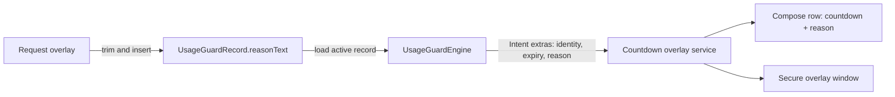

# Usage Guard Reason Reminder Overlay Implementation Plan

> **For Codex:** REQUIRED SUB-SKILL: Use superpowers:executing-plans to implement this plan task-by-task.

**Goal:** Extend the active digital-self-discipline countdown overlay so it shows the submitted application reason beside the remaining time, while keeping the complete overlay out of screenshots and screen recordings.

**Architecture:** Reuse the existing `UsageGuardRecord.reasonText` as the single source of truth and pass it with the active record from `UsageGuardEngine` to `UsageGuardCountdownOverlayService`. Render the timer and reason in one bounded Compose row inside the existing movable overlay window, and mark that whole window with `WindowManager.LayoutParams.FLAG_SECURE`. Keep request validation, Room schema, grant modes, expiry handling, dragging, and early termination behavior unchanged.

**Tech Stack:** Android 8.0+ (minSdk 26), Kotlin, Jetpack Compose, `LifecycleService`, `WindowManager.TYPE_APPLICATION_OVERLAY`, Room, JUnit 4, Gradle/JDK 21, GitHub Actions.

---

## Confirmed Product Decisions

1. During an active approved session, the top-left floating control is one horizontal unit:

   ```text
   [ 09:58 | 查资料准备演讲 ]
   ```

2. The countdown stays on the left. The submitted reason is shown on the right.
3. The reason may occupy at most two lines. Text beyond two lines uses an ellipsis.
4. Typical reasons of roughly 8–10 Chinese characters should display in full on an ordinary portrait phone.
5. Countdown and reason belong to one overlay window. The whole floating control must be protected from screenshots and screen recording.
6. A screenshot is accepted when no readable countdown or reason appears. Depending on Android version and OEM, the protected area may be blank/black or capture may be rejected; reconstructing the underlying third-party app pixels is not a supported guarantee.
7. Dragging the floating control and tapping it to open the existing “terminate usage” confirmation must remain unchanged.
8. The full-screen terminate confirmation uses the same secure window, so it is also capture-protected while open.
9. No setting is added. Capture protection is always enabled for this overlay.
10. No Room entity or schema migration is needed because `UsageGuardRecord.reasonText` already stores the submitted reason.

## Research Findings

### Existing data and runtime path

- `UsageGuardRequestOverlayService` trims the submitted reason and stores it in `UsageGuardRecord.reasonText`.
- `UsageGuardEngine` reloads the complete active `UsageGuardRecord` before showing the countdown overlay.
- `UsageGuardEngine.showCountdownOverlay()` currently passes only `appId`, `recordId`, and `expiresAt` through the service `Intent`.
- `UsageGuardCountdownOverlayService` owns the movable `TYPE_APPLICATION_OVERLAY` window and currently renders only the formatted remaining time.
- `UsageGuardCountdownOverlayPolicy` already contains pure formatting and visibility logic and is the appropriate place for reason-display normalization.
- The overlay is stopped when the controlled app leaves the foreground, a competing request/timeout overlay appears, the session expires, the user terminates it, or the accessibility service is destroyed.

The required data flow is therefore:



### Screenshot/privacy approach

Use `WindowManager.LayoutParams.FLAG_SECURE` on the existing overlay window. Android documents this flag as preventing the window content from appearing in screenshots or on non-secure displays:

- <https://developer.android.com/reference/android/view/WindowManager.LayoutParams#FLAG_SECURE>
- <https://developer.android.com/security/fraud-prevention/activities#flag_secure>

Do not implement screenshot detection or briefly hide/re-add the view:

- `Activity.ScreenCaptureCallback` is scoped to an `Activity`, whereas this UI is owned by a service overlay.
- The callback reports that a capture occurred; it is not a dependable pre-capture interception mechanism.
- `View.setContentSensitivity()` is API 35+ and protects the hosting window during active media projection. It does not provide a better cross-version result than `FLAG_SECURE` for this minSdk 26 overlay.
- MediaStore observers and OEM screenshot accessibility events arrive too late or are device-specific.

### Alternatives rejected

1. **Two independent windows:** Keep countdown non-secure and reason secure. Rejected because the chosen behavior protects the whole control, and two windows would introduce drag synchronization, z-order, lifecycle, and stale-window risks.
2. **Screenshot detection plus temporary invisibility:** Rejected because detection is not reliably available before the captured frame and does not work uniformly from this service-owned overlay.
3. **Limit reason input length:** Rejected because the product decision is presentation-only; existing request validation and stored history should not change.

## Scope Boundaries

### In scope

- Passing the active reason into the countdown overlay.
- Trimming/fallback behavior for malformed or legacy blank reason data.
- Horizontal countdown/reason layout with two-line overflow handling.
- Width bounding so the expanded control stays inside a normal phone screen at its initial top-left position.
- `FLAG_SECURE` capture protection for the complete overlay window.
- Unit tests for pure reason and layout policies.
- Developer documentation and physical-device capture verification.
- Existing GitHub Actions unit-test and multi-variant build verification.

### Out of scope

- Database/entity/schema changes.
- Editing a reason after a grant starts.
- Displaying selected tags in the floating control.
- A user toggle for screenshot protection.
- Screenshot callbacks, MediaStore monitoring, or OEM screenshot-button automation.
- Guaranteeing that screenshots reveal the obscured underlying app pixels instead of a blank/black protected region.
- Redesigning the terminate confirmation.
- Changing strict/resumable grant semantics, expiry scheduling, or foreground-app detection.

## Acceptance Criteria

1. Submitting a valid usage application opens the controlled app with a floating overlay containing both remaining time and the exact trimmed reason.
2. An 8-character and a 10-character Chinese reason display completely on a representative portrait phone.
3. A long reason uses no more than two lines and ellipsizes without expanding beyond the safe screen width.
4. The overlay starts at the existing top-left safe position and remains draggable.
5. Tapping anywhere on the combined control still opens the current termination confirmation.
6. Expiry, manual termination, app switching, strict-mode exit, resumed sessions, and competing overlays retain current behavior.
7. Blank/corrupt reason data does not crash or suppress the timer; it shows the explicit fallback `未填写申请理由`.
8. Hardware-key and Quick Settings screenshots contain no readable countdown or reason.
9. Screen recording/casting contains no readable countdown or reason.
10. A blank/black secure region or capture rejection is acceptable platform behavior and is documented.
11. No Room schema file changes are generated.
12. `gkdDebug`, `playDebug`, and `gkdRelease` compile successfully in GitHub Actions.

---

### Task 0: Create an isolated implementation worktree and confirm the baseline

**Files:**
- No source changes.

**Step 1: Use the worktree workflow**

Use `@superpowers/using-git-worktrees` and create an isolated branch from the current `main`:

```bash
git fetch origin main
git worktree add .worktrees/usage-guard-reason-overlay -b codex/usage-guard-reason-overlay main
```

Expected: the new worktree checks out `codex/usage-guard-reason-overlay` and the original `main` worktree remains untouched.

**Step 2: Verify both worktrees are clean**

Run:

```bash
git status -sb
git -C .worktrees/usage-guard-reason-overlay status -sb
```

Expected: neither worktree reports modified or untracked files.

**Step 3: Run the focused baseline tests with JDK 21**

From the feature worktree, run:

```bash
./gradlew :app:testGkdDebugUnitTest \
  --tests "*UsageGuardCountdownOverlayPolicyTest" \
  --tests "*UsageGuardCountdownOverlayLayoutPolicyTest"
```

Expected: PASS. If local dependency resolution is unavailable, record the exact error and continue only after confirming that the same unmodified baseline resolves in GitHub Actions; do not change application code to work around a local repository/network problem.

---

### Task 1: Define and test reason presentation policy

**Files:**
- Modify: `app/src/test/kotlin/li/songe/gkd/sdp/util/UsageGuardCountdownOverlayPolicyTest.kt`
- Modify: `app/src/main/kotlin/li/songe/gkd/sdp/util/UsageGuardCountdownOverlayPolicy.kt`

Use `@superpowers/test-driven-development` for this task.

**Step 1: Add failing normalization tests**

Append these tests to `UsageGuardCountdownOverlayPolicyTest`:

```kotlin
@Test
fun displayReasonTextTrimsOnlyOuterWhitespace() {
    assertEquals(
        "查资料 准备演讲",
        UsageGuardCountdownOverlayPolicy.displayReasonText("  查资料 准备演讲  "),
    )
}

@Test
fun displayReasonTextUsesExplicitFallbackForBlankData() {
    assertEquals(
        "未填写申请理由",
        UsageGuardCountdownOverlayPolicy.displayReasonText("   "),
    )
}

@Test
fun displayReasonTextDoesNotPretruncateTheStoredReason() {
    val reason = "查资料并整理今晚演讲所需的全部重点内容"

    assertEquals(reason, UsageGuardCountdownOverlayPolicy.displayReasonText(reason))
}
```

The third test is important: business logic must retain the full reason and leave two-line ellipsis behavior to Compose.

**Step 2: Run the tests and verify the intended failure**

Run:

```bash
./gradlew :app:testGkdDebugUnitTest --tests "*UsageGuardCountdownOverlayPolicyTest"
```

Expected: FAIL because `displayReasonText` does not exist.

**Step 3: Add the minimal policy implementation**

Add to `UsageGuardCountdownOverlayPolicy`:

```kotlin
const val MISSING_REASON_TEXT = "未填写申请理由"

fun displayReasonText(reasonText: String): String {
    return reasonText.trim().ifEmpty { MISSING_REASON_TEXT }
}
```

Do not add a maximum length or alter `UsageGuardPolicy.validateRequest()`.

**Step 4: Run the focused policy tests**

Run:

```bash
./gradlew :app:testGkdDebugUnitTest --tests "*UsageGuardCountdownOverlayPolicyTest"
```

Expected: PASS, including all existing timer-format and visibility tests.

**Step 5: Commit the policy increment**

```bash
git add \
  app/src/main/kotlin/li/songe/gkd/sdp/util/UsageGuardCountdownOverlayPolicy.kt \
  app/src/test/kotlin/li/songe/gkd/sdp/util/UsageGuardCountdownOverlayPolicyTest.kt
git commit -m "feat: define usage guard reason display policy"
```

---

### Task 2: Pass the persisted reason into the active overlay service

**Files:**
- Modify: `app/src/main/kotlin/li/songe/gkd/sdp/a11y/UsageGuardEngine.kt:338`
- Modify: `app/src/main/kotlin/li/songe/gkd/sdp/service/UsageGuardCountdownOverlayService.kt:50`

**Step 1: Add one shared extra key and observable reason state**

In `UsageGuardCountdownOverlayService`, add a companion key rather than duplicating a new string literal across files:

```kotlin
companion object {
    const val EXTRA_REASON_TEXT = "reasonText"
}
```

Add service state beside `expiresAtState`:

```kotlin
private var reasonTextState by mutableStateOf(
    UsageGuardCountdownOverlayPolicy.MISSING_REASON_TEXT,
)
```

**Step 2: Read and normalize the reason on every start command**

In `onStartCommand`, read the extra before updating the current session fields:

```kotlin
val incomingReasonText = UsageGuardCountdownOverlayPolicy.displayReasonText(
    intent?.getStringExtra(EXTRA_REASON_TEXT).orEmpty(),
)
```

After validating `appId`, `recordId`, and `expiresAt`, assign:

```kotlin
reasonTextState = incomingReasonText
```

The reason must update even when the service instance already owns a view and receives a new record. Do not reject an otherwise valid timer because the reason extra is missing; the fallback protects old/corrupt input.

**Step 3: Put the record reason into the service intent**

In `UsageGuardEngine.showCountdownOverlay`, extend the existing `Intent`:

```kotlin
putExtra(
    UsageGuardCountdownOverlayService.EXTRA_REASON_TEXT,
    record.reasonText,
)
```

Continue loading the reason from the active Room record. Do not cache a second independent copy in `UsageGuardEngine`.

**Step 4: Reset reason state during service destruction**

At the end of `onDestroy`, reset:

```kotlin
reasonTextState = UsageGuardCountdownOverlayPolicy.MISSING_REASON_TEXT
```

This prevents a stale reason from surviving an unusual service/view handoff.

**Step 5: Compile the affected Kotlin source**

Run:

```bash
./gradlew :app:compileGkdDebugKotlin
```

Expected: PASS. The UI does not use the state yet, but the engine/service contract compiles.

**Step 6: Commit the data-flow increment**

```bash
git add \
  app/src/main/kotlin/li/songe/gkd/sdp/a11y/UsageGuardEngine.kt \
  app/src/main/kotlin/li/songe/gkd/sdp/service/UsageGuardCountdownOverlayService.kt
git commit -m "feat: pass usage reason to countdown overlay"
```

---

### Task 3: Bound the wider overlay to the available screen width

**Files:**
- Modify: `app/src/test/kotlin/li/songe/gkd/sdp/util/UsageGuardCountdownOverlayLayoutPolicyTest.kt`
- Modify: `app/src/main/kotlin/li/songe/gkd/sdp/util/UsageGuardCountdownOverlayLayoutPolicy.kt`

Use `@superpowers/test-driven-development` for this task.

**Step 1: Add failing width-policy tests**

Append:

```kotlin
@Test
fun maxPillWidthKeepsBothHorizontalMargins() {
    assertEquals(
        1032,
        UsageGuardCountdownOverlayLayoutPolicy.maxPillWidthPx(
            screenWidthPx = 1080,
            horizontalMarginPx = 24,
        ),
    )
}

@Test
fun maxPillWidthNeverReturnsNegativePixels() {
    assertEquals(
        0,
        UsageGuardCountdownOverlayLayoutPolicy.maxPillWidthPx(
            screenWidthPx = 30,
            horizontalMarginPx = 24,
        ),
    )
}
```

**Step 2: Run the test and verify failure**

```bash
./gradlew :app:testGkdDebugUnitTest --tests "*UsageGuardCountdownOverlayLayoutPolicyTest"
```

Expected: FAIL because `maxPillWidthPx` does not exist.

**Step 3: Implement the pure width calculation**

Add:

```kotlin
fun maxPillWidthPx(
    screenWidthPx: Int,
    horizontalMarginPx: Int,
): Int {
    val safeScreenWidth = screenWidthPx.coerceAtLeast(0)
    val safeMargin = horizontalMarginPx.coerceAtLeast(0)
    return (safeScreenWidth - safeMargin * 2).coerceAtLeast(0)
}
```

Use one margin value for both the initial `x` coordinate and available-width calculation so the control cannot begin beyond the right edge.

**Step 4: Run the layout-policy tests**

```bash
./gradlew :app:testGkdDebugUnitTest --tests "*UsageGuardCountdownOverlayLayoutPolicyTest"
```

Expected: PASS, including existing initial-position and session-reset tests.

**Step 5: Commit the layout-policy increment**

```bash
git add \
  app/src/main/kotlin/li/songe/gkd/sdp/util/UsageGuardCountdownOverlayLayoutPolicy.kt \
  app/src/test/kotlin/li/songe/gkd/sdp/util/UsageGuardCountdownOverlayLayoutPolicyTest.kt
git commit -m "feat: bound usage guard reminder width"
```

---

### Task 4: Render countdown and reason as one horizontal two-line control

**Files:**
- Modify: `app/src/main/kotlin/li/songe/gkd/sdp/service/UsageGuardCountdownOverlayService.kt:90`
- Modify: `app/src/main/kotlin/li/songe/gkd/sdp/service/UsageGuardCountdownOverlayService.kt:238`

**Step 1: Compute the maximum content width once per overlay composition**

Use the existing 12 dp horizontal margin and screen-width helper:

```kotlin
val horizontalMarginPx = 12.dp.px.roundToInt()
val maxPillWidthPx = UsageGuardCountdownOverlayLayoutPolicy.maxPillWidthPx(
    screenWidthPx = ScreenUtils.getScreenWidth(),
    horizontalMarginPx = horizontalMarginPx,
)
```

Pass `reasonTextState` and `maxPillWidthPx` through:

```kotlin
UsageGuardCountdownOverlayContent(
    expiresAt = expiresAtState,
    reasonText = reasonTextState,
    maxPillWidthPx = maxPillWidthPx,
    // existing callbacks unchanged
)
```

When the full-screen termination confirmation is displayed, it does not need the reason or width argument.

**Step 2: Extend the compact content API**

Change `UsageGuardCountdownPill` to accept:

```kotlin
reasonText: String,
maxPillWidthPx: Int,
```

Convert the pixel constraint inside composition:

```kotlin
val maxPillWidth = with(LocalDensity.current) {
    maxPillWidthPx.toDp()
}
```

**Step 3: Replace the timer-only body with a horizontal row**

Keep both existing `pointerInput` modifiers on the outer `Surface`, then render:

```kotlin
Row(
    modifier = Modifier
        .widthIn(max = maxPillWidth)
        .padding(horizontal = 12.dp, vertical = 6.dp),
    horizontalArrangement = Arrangement.spacedBy(8.dp),
    verticalAlignment = Alignment.CenterVertically,
) {
    Text(
        text = remainingText,
        color = Color.White,
        style = MaterialTheme.typography.labelLarge,
        maxLines = 1,
    )
    Box(
        modifier = Modifier
            .width(1.dp)
            .height(24.dp)
            .background(Color.White.copy(alpha = 0.36f)),
    )
    Text(
        text = reasonText,
        color = Color.White,
        style = MaterialTheme.typography.labelMedium,
        maxLines = 2,
        overflow = TextOverflow.Ellipsis,
        modifier = Modifier.weight(1f, fill = false),
    )
}
```

Required imports include `width`, `height`, `widthIn`, `TextOverflow`, and `LocalDensity`. Reuse existing `Row`, `Box`, `background`, and alignment imports where possible.

Do not:

- put the reason in a second overlay window;
- pretruncate the string;
- add marquee animation;
- make the reason independently clickable or draggable;
- change the existing tap-to-terminate behavior.

**Step 4: Check compilation and focused tests**

Run:

```bash
./gradlew :app:testGkdDebugUnitTest \
  --tests "*UsageGuardCountdownOverlayPolicyTest" \
  --tests "*UsageGuardCountdownOverlayLayoutPolicyTest"
./gradlew :app:compileGkdDebugKotlin
```

Expected: PASS with no Compose overload, measurement, or missing-import errors.

**Step 5: Commit the UI increment**

```bash
git add app/src/main/kotlin/li/songe/gkd/sdp/service/UsageGuardCountdownOverlayService.kt
git commit -m "feat: show usage reason beside countdown"
```

---

### Task 5: Protect the complete overlay window from capture

**Files:**
- Create: `app/src/test/kotlin/li/songe/gkd/sdp/service/UsageGuardCountdownOverlayWindowFlagsTest.kt`
- Modify: `app/src/main/kotlin/li/songe/gkd/sdp/service/UsageGuardCountdownOverlayService.kt:126`

Use `@superpowers/test-driven-development` for the flag contract.

**Step 1: Add a failing flag-contract unit test**

Create:

```kotlin
package li.songe.gkd.sdp.service

import android.view.WindowManager
import org.junit.Assert.assertEquals
import org.junit.Test

class UsageGuardCountdownOverlayWindowFlagsTest {
    @Test
    fun overlayIsSecureWithoutLosingExistingInteractionFlags() {
        val requiredFlags = listOf(
            WindowManager.LayoutParams.FLAG_SECURE,
            WindowManager.LayoutParams.FLAG_NOT_FOCUSABLE,
            WindowManager.LayoutParams.FLAG_NOT_TOUCH_MODAL,
            WindowManager.LayoutParams.FLAG_LAYOUT_IN_SCREEN,
        )

        requiredFlags.forEach { flag ->
            assertEquals(flag, USAGE_GUARD_COUNTDOWN_OVERLAY_FLAGS and flag)
        }
    }
}
```

**Step 2: Run the new test and verify its initial failure**

```bash
./gradlew :app:testGkdDebugUnitTest --tests "*UsageGuardCountdownOverlayWindowFlagsTest"
```

Expected: FAIL until the constant exists and includes `FLAG_SECURE`.

**Step 3: Extract and use the tested flag set**

Define this at file level in `UsageGuardCountdownOverlayService.kt`:

```kotlin
internal val USAGE_GUARD_COUNTDOWN_OVERLAY_FLAGS =
    WindowManager.LayoutParams.FLAG_NOT_FOCUSABLE or
        WindowManager.LayoutParams.FLAG_NOT_TOUCH_MODAL or
        WindowManager.LayoutParams.FLAG_LAYOUT_IN_SCREEN or
        WindowManager.LayoutParams.FLAG_SECURE
```

Replace the inline flags passed to `WindowManager.LayoutParams` with:

```kotlin
USAGE_GUARD_COUNTDOWN_OVERLAY_FLAGS
```

Do not set `FLAG_SECURE` on the controlled third-party app or on `MainActivity`; only this service-owned window is in scope.

Because the existing termination confirmation expands the same window to `MATCH_PARENT`, it automatically remains secure without a second flag transition.

**Step 4: Run the flag test and compile both debug flavors**

```bash
./gradlew :app:testGkdDebugUnitTest --tests "*UsageGuardCountdownOverlayWindowFlagsTest"
./gradlew :app:assembleGkdDebug :app:assemblePlayDebug
```

Expected: PASS. No new manifest permission is required.

**Step 5: Commit the capture-protection increment**

```bash
git add \
  app/src/main/kotlin/li/songe/gkd/sdp/service/UsageGuardCountdownOverlayService.kt \
  app/src/test/kotlin/li/songe/gkd/sdp/service/UsageGuardCountdownOverlayWindowFlagsTest.kt
git commit -m "feat: protect usage reminder from screen capture"
```

---

### Task 6: Document the digital-self-discipline overlay contract

**Files:**
- Modify: `README_DEV.md:92`

**Step 1: Add a `Digital Self-Discipline / Usage Guard` runtime subsection**

Document these invariants near the restriction-engine and overlay sections:

```markdown
### Digital Self-Discipline / Usage Guard

An approved usage request is persisted as a `UsageGuardRecord`. Its
`reasonText` remains the source of truth for the active countdown reminder;
the overlay must not keep an independently editable reason.

The countdown service renders remaining time and reason in one movable
`TYPE_APPLICATION_OVERLAY` window. That window uses `FLAG_SECURE`, so neither
field should be readable in screenshots, screen recording, or non-secure
display output. Android/OEM capture behavior may produce a blank or black
protected region, or reject capture; the app does not promise reconstruction
of the third-party app pixels behind the secure window.
```

Also note that screenshot protection requires physical-device/manual verification; JVM unit tests only validate the configured flag contract.

**Step 2: Confirm no Room or manifest changes slipped in**

Run:

```bash
git diff --name-only origin/main...HEAD
```

Expected: no files under `app/schemas/`, no `AppDb.kt`, no `UsageGuardRecord.kt`, and no `AndroidManifest.xml` unless an independently discovered compile requirement is documented first. `FLAG_SECURE` requires none of them.

**Step 3: Commit documentation**

```bash
git add README_DEV.md
git commit -m "docs: describe secure usage reason reminder"
```

---

### Task 7: Run automated regression and multi-variant build verification

**Files:**
- Verify only; modify source only if a failing test exposes a defect in this feature.

Use `@superpowers/verification-before-completion` before making any success claim.

**Step 1: Run all focused countdown-overlay tests**

```bash
./gradlew :app:testGkdDebugUnitTest \
  --tests "*UsageGuardCountdownOverlayPolicyTest" \
  --tests "*UsageGuardCountdownOverlayLayoutPolicyTest" \
  --tests "*UsageGuardCountdownOverlayWindowFlagsTest"
```

Expected: PASS.

**Step 2: Run all selector and app unit tests**

```bash
./gradlew :selector:jvmTest :app:testGkdDebugUnitTest
```

Expected: PASS with no new test failures.

**Step 3: Build the same variants checked by merge CI**

```bash
./gradlew \
  :app:assembleGkdDebug \
  :app:assemblePlayDebug \
  :app:assembleGkdRelease
```

Expected: PASS and APK outputs under `app/build/outputs/apk/`.

**Step 4: Check formatting and worktree state**

```bash
git diff --check origin/main...HEAD
git status -sb
git log --oneline origin/main..HEAD
```

Expected: no whitespace errors, a clean worktree, and the incremental commits from Tasks 1–6.

**Step 5: Use GitHub Actions as the authoritative clean-environment build**

Push `codex/usage-guard-reason-overlay` and open a PR targeting `main`. The existing `.github/workflows/Verify-Merge.yml` already runs:

- `:selector:jvmTest`
- `:app:testGkdDebugUnitTest`
- `:app:assembleGkdDebug`
- `:app:assemblePlayDebug`
- `:app:assembleGkdRelease`

No workflow edit is planned. Wait for `Verify Merge` to finish. If it fails, inspect the failing job logs, make a focused fix commit, push again, and do not merge until the latest head SHA is green.

After a green merge, wait for `Build Latest APK` on `main` to complete and confirm the signed release APK publication path still succeeds.

---

### Task 8: Perform physical-device UI and capture verification

**Files:**
- Verification only.

CI cannot prove screenshot composition behavior. Test at least one AOSP-like device/emulator and one available OEM physical device. Include the oldest practical API in the project range and one current API; priority is API 26/30 and API 34+.

**Step 1: Verify ordinary reason display**

For each of these reasons, approve a short session and enter the controlled app:

```text
查资料完成作业
整理今晚演讲资料
查资料并整理今晚演讲所需的全部重点内容然后完成笔记
```

Expected:

- first two display completely beside the countdown;
- the long reason uses at most two lines and ends with an ellipsis when necessary;
- the control stays within the screen at its initial top-left position.

**Step 2: Verify interaction regression**

1. Drag the combined control to all four screen edges.
2. Tap the reason portion and the countdown portion separately.
3. Dismiss the terminate confirmation once.
4. Open it again and confirm termination.

Expected: dragging remains smooth; either portion opens the same confirmation; dismissal restores the bounded combined control; confirmation terminates the correct record and returns Home.

**Step 3: Verify session lifecycle regression**

Test:

- normal/resumable mode: leave and return before expiry;
- strict mode: leave the app and confirm the record closes;
- natural expiry while the controlled app remains foreground;
- request overlay replaced by active countdown;
- timeout overlay replacing the countdown;
- accessibility service destruction and restart;
- starting a new record for the same app.

Expected: reason always matches the current active record, and no stale reason or duplicate overlay survives a handoff.

**Step 4: Verify screenshot protection**

With the combined control visible:

1. Take a hardware-key screenshot.
2. Take a Quick Settings screenshot if the device offers it.
3. Start a screen recording and use the controlled app for at least five seconds.
4. If available, cast/share the screen to a non-secure display.
5. Repeat once with the full-screen terminate confirmation open.

Expected: neither countdown nor reason is readable in any captured output. A blank/black region or rejected capture is acceptable. The overlay must remain fully visible and usable on the phone's own secure display.

**Step 5: Record device-specific outcomes in the PR**

Include Android version, device/OEM, capture method, and whether the result was blank region, black region, or capture rejection. Do not claim transparent omission unless the tested devices actually demonstrate it, and do not generalize one OEM result to all Android devices.

---

## Final Review Checklist

- [ ] Active `UsageGuardRecord.reasonText` is the only reason source.
- [ ] No Room migration or schema diff exists.
- [ ] Countdown and reason render in one horizontal window.
- [ ] Reason is limited to two display lines, not truncated in storage/business logic.
- [ ] Typical 8–10 character reasons display fully.
- [ ] Existing drag and terminate gestures work across the entire combined control.
- [ ] `FLAG_SECURE` is present alongside all previous window flags.
- [ ] Screenshot and screen-recording output contains no readable overlay content.
- [ ] Blank/black capture behavior is documented as platform-dependent.
- [ ] Focused and full unit tests pass.
- [ ] `gkdDebug`, `playDebug`, and `gkdRelease` build in GitHub Actions.
- [ ] Incremental commits exist for policy, data flow, layout, capture protection, and docs.
- [ ] PR is merged only after the latest head SHA has green checks.

## Expected Commit Sequence

```text
feat: define usage guard reason display policy
feat: pass usage reason to countdown overlay
feat: bound usage guard reminder width
feat: show usage reason beside countdown
feat: protect usage reminder from screen capture
docs: describe secure usage reason reminder
```
