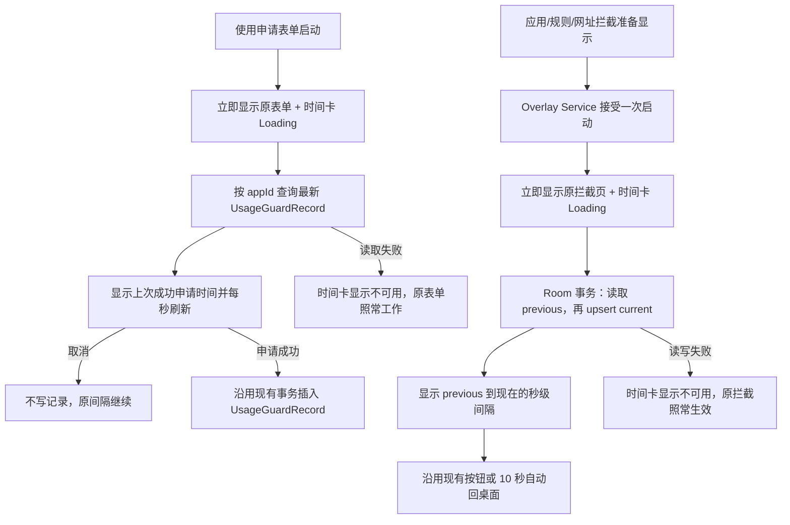

# Self-Control Elapsed Awareness Implementation Plan

> **For Codex:** REQUIRED SUB-SKILL: Use superpowers:executing-plans to implement this plan task-by-task.

**Goal:** 在“使用申请”表单和现有自律拦截全屏页中增加“距离上一次相关行为”的秒级动态提示，让用户在再次申请或再次尝试打开时看见时间间隔，并且完全保留现有申请、拦截、自动退出和回桌面逻辑。

**Architecture:** 使用混合数据源：`UsageGuardRecord.requestedAt` 继续作为“上一次成功提交申请”的唯一事实来源；为应用拦截、订阅规则拦截和网址拦截新增一个每个稳定目标仅保留一行的 `self_control_attempt` Room 表。共享纯 Kotlin 时间策略和 Compose 提示卡；Overlay 先按现有方式立即显示，再异步读取/记录时间，数据库失败时只隐藏时间信息，绝不放行、延迟或关闭原有拦截。

**Tech Stack:** Android 8.0+（minSdk 26）、Kotlin、Jetpack Compose、`LifecycleService`、`WindowManager.TYPE_APPLICATION_OVERLAY`、Room 2.8.4、JUnit 4、Gradle/JDK 21、GitHub Actions、GitHub CLI。

---

## 一、需求细化后的产品定义

### 1. 核心目标

这个功能不是一个新的封锁规则，而是一层“时间觉察提示”：

- 用户再次进入受“使用申请”保护的应用时，看到上一次成功提交申请的绝对时间和已经过去的时长。
- 用户可以明确知道：如果这次点“取消”，上一次申请时间不会改变，这段未申请间隔会继续增长。
- 用户再次触发应用拦截或规则拦截时，看到距离上一次同类尝试已经过去多久。
- 时间以秒变化，让十秒拦截页和可能停留更久的申请表单都能呈现真实的时间流逝。
- 这层信息只增加觉察和决策摩擦，不改变任何原有开关、规则、按钮、授权或放行语义。

### 2. “上一次”的准确语义

| 场景 | 页面显示的起点 | 当前行为何时成为下一次的起点 | 不会重置时间的情况 |
| --- | --- | --- | --- |
| 使用申请表单 | 当前应用上一次**成功提交**申请的 `UsageGuardRecord.requestedAt` | 只有本次申请通过校验并成功插入记录时 | 打开表单、停留、校验失败、点“取消”、进程因表单退出而结束 |
| 应用拦截 | 当前包名上一次真正被 `AppBlockerOverlayService` 接受并显示的时间 | 本次 Overlay 被接受时 | 2 秒冷却内的噪声事件、已有 Overlay 时收到的重复 `startService` |
| 订阅规则拦截 | 同一 `subsId + 实际前台 appId + groupKey` 上一次真正显示拦截页的时间 | 本次 Overlay 被接受时 | 未匹配规则、已临时允许、已有 Overlay 时的重复事件 |
| 网址拦截 | 同一 `UrlBlockRule.id` 上一次真正显示拦截页的时间 | 本次 Overlay 被接受时 | `showIntercept=false`、只完成重定向但未显示 Overlay、已有 Overlay 时的重复事件 |

这里必须显示“上一次”，再记录“这一次”。如果先覆盖数据库再查询，用户每次只能看到 `00:00:00`，属于实现错误。

### 3. 建议文案与版式

使用申请表单中，在“申请打开应用 / 严格或普通模式”说明之后、标签表单之前插入：

```text
距离上次申请
2天 03:14:08
上次申请：2026年07月30日 08:12:03
如果这次选择“取消”，这段未申请时间会继续延长。
```

没有历史申请时：

```text
此前没有提交过使用申请
这次选择“取消”不会创建申请记录。
```

应用拦截页中，在现有拦截文案和“算了（退出）”按钮之间插入：

```text
距离上次尝试打开
00:42:17
上次尝试：2026年08月01日 09:20:12
退出后，下一段间隔会从本次尝试继续累计。
```

订阅规则和网址拦截使用“距离上次触发拦截 / 上次触发”。第一次出现通用拦截页时，从本次被接受的 Overlay 时刻显示 `00:00:00` 并按秒增长，同时说明“首次记录，从本次触发开始累计”。

### 4. 产品措辞边界

- 可以使用“时间觉察”“延长间隔”“帮助自己在决定前停一下”等描述。
- 不写“修复前额叶”“提升前额叶功能”“一定能戒断”等医学或因果承诺。
- 2023 年一项随机现场实验发现，增加设计摩擦可立即降低客观屏幕时间，目标设定的变化更小且更渐进，但没有发现降低屏幕时间会立即改善主观幸福感或学业表现的因果证据：<https://pubmed.ncbi.nlm.nih.gov/36577008/>。
- 另一项自我监测随机对照试验没有发现实时反馈显著改变客观久坐指标：<https://pubmed.ncbi.nlm.nih.gov/32845553/>。
- 因此，本方案把动态时间展示视为一个待验证的行为设计假设，而不是已经证实的神经训练方法。这是基于相邻研究作出的产品推断，不是上述研究直接验证了本功能。

---

## 二、现有代码调研结论

### 1. 使用申请链路已有可靠历史源

- `app/src/main/kotlin/li/songe/gkd/sdp/a11y/UsageGuardEngine.kt`
  - 只有没有有效记录时才启动 `UsageGuardRequestOverlayService`。
  - 专注模式和应用拦截优先于使用申请；本计划不改变这个优先级。
- `app/src/main/kotlin/li/songe/gkd/sdp/service/UsageGuardRequestOverlayService.kt`
  - 当前表单包含标签、理由、时长、“开始使用”和“取消”。
  - 只有申请校验通过后才插入 `UsageGuardRecord`，其中 `requestedAt`、`grantedAt` 均使用提交时刻。
  - “取消”只回到桌面并关闭 Overlay，不写申请记录，正好符合“取消后继续延长”的语义。
- `app/src/main/kotlin/li/songe/gkd/sdp/data/UsageGuardRecord.kt`
  - 已保存 `appId` 和 `requestedAt`，无需复制到新表。
  - 当前缺少按 `appId` 读取最新一条记录的 DAO 方法。

### 2. 应用拦截和规则拦截缺少持久化的上次触发时间

- `AppBlockerEngine` 只有进程内 2 秒 `cooldownMap`；它是防抖，不是可跨进程、重启或重启手机的历史记录。
- `AppBlockerOverlayService` 当前展示拦截文案和 10 秒自动退出按钮，没有打开应用的按钮。
- `A11yRuleEngine` 启动 `InterceptOverlayService` 时只传 `subsId`、`groupKey`、文案和 cooldown，没有传实际匹配到的 `rightAppId`。
- `UrlBlockerEngine` 也复用 `InterceptOverlayService`，当前用 `subsId=-2` 和 `groupKey=rule.id.toInt()` 区分网址拦截。
- `InterceptOverlayService` 保留了未使用的 `onContinue` 参数，但界面当前只有退出按钮；本计划不恢复或新增继续打开入口。

### 3. 不应复用的现有数据

- `AppVisitLog` 的职责是维护最近访问排序，而且应用切换时会覆盖当前包名的 `mtime`。当拦截页开始读取时，它通常已经是“这一次”的时间，无法可靠得到“上一次”。改造它还会影响现有应用排序，违反“只添加、不影响原功能”的要求。
- `TimeExt.formatTimeAgo()` 只到分钟粒度，内部直接读取系统当前时间，未来时间会落入“刚刚”，也不便注入 `now` 做单元测试。因此保留它给原调用方，本功能新增独立的秒级纯策略。
- `FocusOverlayService` 已显示专注会话剩余时间，而且可能提供白名单应用按钮；它不是用户所描述的“只有回桌面”的拦截页，本期不改。
- `UsageGuardTimeoutOverlayService` 是已获批会话到时后的结束页，不是新的申请或打开尝试，本期不改。

### 4. Android 实现约束

- 跨进程和重启手机保存的事件需要日历时间，因此表中保存 epoch wall-clock。Android 文档说明 `System.currentTimeMillis()` 可能因用户或网络校时向前/向后跳，而 `elapsedRealtime()` 虽适合单次启动内测量间隔，却会在重启后重新开始：<https://developer.android.com/reference/android/os/SystemClock>。本方案使用 epoch 持久化，并在展示策略中把负间隔夹到 0；不把它当安全计时器。
- Compose 的 `LaunchedEffect` 在离开 Composition 时会自动取消协程，适合让秒级刷新只在 Overlay 可见期间运行：<https://developer.android.com/develop/ui/compose/side-effects>。
- 共享提示卡接收外部状态，Overlay Service 负责加载状态，符合 Compose 状态提升和单一事实来源原则：<https://developer.android.com/develop/ui/compose/state>。
- 项目已配置 `room.schemaDirectory`，数据库当前为 v30，且 `DbSet` 使用 `fallbackToDestructiveMigration(false)`。Room 自动迁移依赖前后版本的导出 schema，因此新增表必须提交 v31 schema：<https://developer.android.com/training/data-storage/room/migrating-db-versions>。
- `.github/workflows/Verify-Merge.yml` 已使用 JDK 21，运行 `:selector:jvmTest`、`:app:testGkdDebugUnitTest`，并构建 `gkdDebug`、`playDebug`、`gkdRelease`。本功能不需要为了编译另造工作流，但 PR 必须通过该工作流。

---

## 三、方案比较与最终选择

### 方案 A：混合事实源（推荐）

- 使用申请读取既有 `UsageGuardRecord`。
- 其他拦截使用新的单行状态表。
- 优点：不复制申请数据；取消不会误重置；每个拦截目标只有一行，存储有界；语义最准确。
- 代价：两条数据读取路径最终汇入一个共享 UI 状态。

### 方案 B：所有场景统一写通用事件表

- 每次申请表单出现也写 `self_control_attempt`。
- 优点：数据管线表面统一。
- 拒绝原因：表单一出现就会重置时间，无法表达“取消后继续延长”；若改成提交才写，又与 `UsageGuardRecord` 重复并可能产生事务漂移。

### 方案 C：复用 `AppVisitLog` 或只放在内存/偏好设置

- 优点：可能不需要 Room 新表或迁移。
- 拒绝原因：`AppVisitLog` 已被当前访问覆盖且承担排序职责；内存记录在进程死亡后消失；多个键写入偏好设置缺少原子“读取上次并写入本次”的清晰事务。

最终采用方案 A。

---

## 四、数据流与失败策略



### 通用拦截表

新增 `self_control_attempt`，每个稳定 key 只有一行：

```text
event_key          TEXT PRIMARY KEY
event_kind         INTEGER NOT NULL
last_occurred_at   INTEGER NOT NULL
```

稳定 key：

- `app_blocker:<packageName>`
- `selector_intercept:<subsId>:<actualAppId>:<groupKey>`
- `url_intercept:<urlRuleId>`

只保存本地包名/规则标识和时间，不保存申请理由、拦截文案、实际 URL、网页内容或可上传的分析数据。

DAO 的 `@Transaction recordAndGetPrevious(attempt)` 必须依次：

1. 查询该 key 当前行并保存 `previousOccurredAt`。
2. 用本次 `occurredAt` 插入或替换该行。
3. 返回第一步读到的旧值。

### Overlay 启动防重

- `onStartCommand()` 在主线程串行执行。
- 服务一旦已有 `view`，立即沿用当前行为返回，不进行第二次数据库记录。
- 第一次合法启动先同步创建 Overlay，再启动 `lifecycleScope` 的 IO 工作。
- 因此数据库慢或失败都不会推迟原有全屏拦截；重复无障碍事件也不会把“上一次”偷偷改成几毫秒前。

---

## 五、范围边界

### In scope

- 使用申请表单显示上一次成功申请的绝对时间和秒级间隔。
- “取消”不改变申请历史。
- 应用拦截、订阅规则拦截、网址拦截显示上一次 Overlay 触发间隔。
- 第一次通用拦截从本次 Overlay 时刻显示增长中的 `00:00:00`。
- 应用进程重启和手机重启后保留通用拦截的上次时间。
- 设备时钟回拨时夹到 `00:00:00`，不崩溃、不显示负数。
- Room v30 → v31 自动迁移和 schema 提交。
- JVM 单元测试、GitHub Actions 多变体构建、实体设备/模拟器回归。

### Out of scope

- 修改哪些应用受保护、规则优先级、锁定、自动重开或无障碍守护。
- 新增“仍然打开”“继续使用”或绕过按钮。
- 修改现有 10 秒自动退出、回桌面动作、冷却时间或 URL 重定向。
- 在当前有效的可恢复申请会话中再次弹表单。
- 修改使用申请倒计时悬浮条、超时页或专注模式 Overlay。
- 上传遥测、用户画像、云同步或对外暴露事件历史。
- 通过监听系统截图、后台定时器、AlarmManager 或常驻服务刷新时间。
- 宣称前额叶或其他医学改善。

---

## 六、验收标准

1. 同一受保护应用有历史申请时，新申请表单显示其最新 `requestedAt` 和正确的秒级动态间隔。
2. 用户在申请表单点“取消”后再次打开，计时仍从原来的成功申请开始，没有被取消行为重置。
3. 用户成功提交新申请后，下一次需要申请时以这次提交时间为新起点。
4. 没有申请历史时显示明确的首次状态，不伪造 `00:00:00` 的“上次申请”。
5. 同一受应用拦截保护的包第二次被拦截时，显示距离第一次真正出现 Overlay 的时间。
6. 订阅规则按 `subsId + 实际 appId + groupKey` 分开计时；全局规则在两个应用内触发时不会互相覆盖。
7. 网址拦截按 `UrlBlockRule.id` 分开计时，不保存实际 URL。
8. 通用拦截第一次出现时显示“首次记录”并从本次触发开始按秒增长。
9. 重复 `startService`、2 秒引擎冷却内的事件或已有 Overlay 状态不会额外重置时间。
10. 手动退出按钮和 10 秒自动退出仍执行原有 `GLOBAL_ACTION_HOME`；没有新增打开应用入口。
11. 数据库查询或写入失败时，原 Overlay 仍立即显示且按钮可用，只把时间卡降级成“暂时无法读取上次记录”。
12. 设备时钟回拨不会显示负数；向前调整会按新的 wall-clock 重新计算，并在文档中视为已知限制。
13. v30 数据库升级到 v31 后原有申请、设置、锁和规则均保留，仅新增 `self_control_attempt` 表。
14. 大字体、普通竖屏和小尺寸/横屏上，时间卡不遮挡退出按钮或申请表单字段。
15. 没有后台秒级任务；Overlay 销毁后 `LaunchedEffect` 和 `lifecycleScope` 工作随生命周期取消。
16. GitHub `Verify Merge` 中 selector 测试、app 单元测试、`gkdDebug`、`playDebug`、`gkdRelease` 全部通过。

---

## 七、实验与评估方案

这是本地自我实验，不在本期加入遥测代码。

### 阶段 1：可理解性验证

让测试者在不看设计说明的情况下完成以下任务：

1. 读申请卡片并说明这个时间从何时开始。
2. 说明点“取消”后时间是否会清零。
3. 读应用拦截卡片并说明“上次尝试”和“本次尝试”的关系。

通过标准：测试者不把它误解为本次授权剩余时间，也不认为只要打开表单就会重置。

### 阶段 2：个人前后对照

- 基线期 7 天：使用现有版本，记录每个受保护应用的每日成功申请次数，并从本地 `UsageGuardRecord` 观察连续成功申请间隔。
- 体验期 7 天：使用新版本，保护应用、规则和日常场景尽量保持一致。
- 主要观察：每个应用连续成功申请的中位间隔是否增长、每日成功申请数是否下降。
- 次要观察：看到时间后主动点取消的主观次数、是否觉得文案造成压力或误解。
- 应用/规则拦截本期只保留最后一次时间，不能据此计算完整历史分布；若以后确实需要量化触发次数和中位间隔，应单独设计本地聚合或事件保留策略，不能在本计划中悄悄扩展采集。

### 阶段 3：结论边界

- 单人前后对照会受星期、工作量和规则变化影响，只能用于产品调优。
- 即使间隔增长，也只能说明行为指标变化，不能推导神经功能改善。
- 如果动态数字本身造成焦虑或反复查看，应优先调整文案/视觉权重，而不是增加更强的惩罚。

---

### Task 0: 创建隔离工作区并确认基线

**Files:**

- No source changes.

**Step 1: 使用 worktree 流程**

调用 `@superpowers/using-git-worktrees`，从最新 `origin/main` 创建功能分支：

```bash
git fetch origin main
git worktree add .worktrees/self-control-elapsed-awareness \
  -b codex/self-control-elapsed-awareness origin/main
```

Expected: 原 `main` 工作区不受影响，新 worktree 位于 `codex/self-control-elapsed-awareness`。

**Step 2: 确认当前数据库基线**

```bash
git -C .worktrees/self-control-elapsed-awareness status -sb
rg -n 'version = 30|AutoMigration\(from = 29, to = 30\)' \
  .worktrees/self-control-elapsed-awareness/app/src/main/kotlin/li/songe/gkd/sdp/db/AppDb.kt
test -f .worktrees/self-control-elapsed-awareness/app/schemas/li.songe.gkd.sdp.db.AppDb/30.json
```

Expected: 工作区干净，数据库仍为 v30 且 schema 30 存在。如果实施时 `main` 已经升级数据库，先更新本计划中的版本号为“当前版本 → 下一版本”，不要覆盖别人生成的 schema。

**Step 3: 运行基线测试**

```bash
./gradlew :selector:jvmTest :app:testGkdDebugUnitTest
```

Expected: PASS。若本机缺少 Android SDK、JDK 21 或依赖缓存，记录精确错误；不要修改应用代码绕过本机环境，后续以 GitHub Actions 同一基线验证。

---

### Task 1: 用 TDD 定义时间、状态和文案策略

**Files:**

- Create: `app/src/main/kotlin/li/songe/gkd/sdp/util/SelfControlElapsedPolicy.kt`
- Create: `app/src/test/kotlin/li/songe/gkd/sdp/util/SelfControlElapsedPolicyTest.kt`

使用 `@superpowers/test-driven-development`。

**Step 1: 先写失败测试**

覆盖以下纯 JVM 用例：

```kotlin
@Test fun elapsedTextFormatsSecondsMinutesHoursAndDays()
@Test fun elapsedTextClampsFutureAnchorToZero()
@Test fun absoluteTextUsesInjectedZoneAndIncludesSeconds()
@Test fun usageRequestCopySaysCancelDoesNotCreateARecord()
@Test fun appAttemptAndRuleTriggerUseDifferentLabels()
@Test fun firstGenericAttemptUsesCurrentAttemptAsAnchor()
@Test fun noUsageHistoryDoesNotPretendThereWasAPreviousRequest()
```

固定示例至少断言：

```text
0 ms                         -> 00:00:00
65_000 ms                    -> 00:01:05
3 h + 4 min + 5 sec          -> 03:04:05
2 d + 3 h + 4 min + 5 sec    -> 2天 03:04:05
now < anchor                 -> 00:00:00
```

绝对时间测试必须注入 `ZoneId`，避免 GitHub Ubuntu 与开发机时区不同导致测试漂移。

**Step 2: 验证测试失败**

```bash
./gradlew :app:testGkdDebugUnitTest --tests '*SelfControlElapsedPolicyTest'
```

Expected: FAIL，因为策略文件和类型还不存在。

**Step 3: 实现最小纯策略**

策略至少包含：

- `ElapsedContext.USAGE_REQUEST`
- `ElapsedContext.APP_OPEN_ATTEMPT`
- `ElapsedContext.RULE_TRIGGER`
- `ElapsedState.Loading`
- `ElapsedState.NoHistory`
- `ElapsedState.Unavailable`
- `ElapsedState.Running(anchorAtEpochMs, firstOccurrence)`
- `formatElapsed(anchorAtEpochMs, nowEpochMs)`
- `formatAbsolute(epochMs, zoneId)`
- 每个 context 的标题、绝对时间标签、首次文案和辅助文案。

实现要求：

- 所有计算显式接收 `nowEpochMs`，不要在纯函数内部读取系统时间。
- 用整数总秒格式化，不使用“月”或“年”近似值。
- `coerceAtLeast(0L)` 防止时钟回拨产生负数。
- 使用 `java.time` 和确定的中文 pattern；minSdk 26 已原生支持。
- 文案中不出现医学承诺。

**Step 4: 运行测试**

```bash
./gradlew :app:testGkdDebugUnitTest --tests '*SelfControlElapsedPolicyTest'
```

Expected: PASS。

**Step 5: 提交**

```bash
git add \
  app/src/main/kotlin/li/songe/gkd/sdp/util/SelfControlElapsedPolicy.kt \
  app/src/test/kotlin/li/songe/gkd/sdp/util/SelfControlElapsedPolicyTest.kt
git commit -m 'feat: define self control elapsed awareness policy'
```

---

### Task 2: 创建共享的秒级时间提示卡

**Files:**

- Create: `app/src/main/kotlin/li/songe/gkd/sdp/ui/component/SelfControlElapsedCard.kt`
- Modify: `app/src/main/kotlin/li/songe/gkd/sdp/util/SelfControlElapsedPolicy.kt` only if the UI exposes a missing pure presentation state.
- Modify: `app/src/test/kotlin/li/songe/gkd/sdp/util/SelfControlElapsedPolicyTest.kt` only for that pure state.

**Step 1: 定义无业务副作用的 Composable API**

建议签名：

```kotlin
@Composable
fun SelfControlElapsedCard(
    context: ElapsedContext,
    state: ElapsedState,
    modifier: Modifier = Modifier,
)
```

Service/调用方持有 `state`；卡片不读 DAO、不写数据库、不执行回桌面动作。

**Step 2: 实现只在可见时运行的 ticker**

- `Running` 状态用 `remember(anchorAtEpochMs)` 保存当前 `now`。
- `LaunchedEffect(anchorAtEpochMs)` 每 1 秒更新 `System.currentTimeMillis()`。
- 离开 Composition 后循环自动取消。
- `Loading`、`NoHistory`、`Unavailable` 不启动无限 ticker。
- 组件重新进入 Composition 时重新读取系统时间，不能假设上次协程一直运行。

**Step 3: 实现紧凑且可访问的布局**

- 使用一张 `Card` 或 `Surface`，宽度由调用方控制。
- 动态间隔是主要视觉层级，使用等宽数字特征或项目已有的稳定数字排版方式，避免每秒跳宽。
- 绝对时间和辅助文案为次级颜色。
- 文本允许换行，不固定高度，不截断关键信息。
- 为整个卡片提供可读 semantics；不要每秒发送强制无障碍播报，避免 TalkBack 每秒打断用户。

**Step 4: 编译并回归纯测试**

```bash
./gradlew :app:compileGkdDebugKotlin \
  :app:testGkdDebugUnitTest --tests '*SelfControlElapsedPolicyTest'
```

Expected: PASS。

**Step 5: 提交**

```bash
git add \
  app/src/main/kotlin/li/songe/gkd/sdp/ui/component/SelfControlElapsedCard.kt \
  app/src/main/kotlin/li/songe/gkd/sdp/util/SelfControlElapsedPolicy.kt \
  app/src/test/kotlin/li/songe/gkd/sdp/util/SelfControlElapsedPolicyTest.kt
git commit -m 'feat: add shared elapsed awareness card'
```

---

### Task 3: 把“上一次成功申请”接入使用申请表单

**Files:**

- Modify: `app/src/main/kotlin/li/songe/gkd/sdp/data/UsageGuardRecord.kt`
- Create: `app/src/test/kotlin/li/songe/gkd/sdp/data/UsageGuardRecordDaoContractTest.kt`
- Modify: `app/src/main/kotlin/li/songe/gkd/sdp/service/UsageGuardRequestOverlayService.kt`

使用 `@superpowers/test-driven-development`。

**Step 1: 先增加 DAO 合约失败测试**

```kotlin
class UsageGuardRecordDaoContractTest {
    @Test
    fun latestRecordForAppContractExists() {
        assertNotNull(UsageGuardRecord.UsageGuardRecordDao::getLatestRecord)
    }
}
```

**Step 2: 验证失败**

```bash
./gradlew :app:testGkdDebugUnitTest --tests '*UsageGuardRecordDaoContractTest'
```

Expected: FAIL，因为 `getLatestRecord` 不存在。

**Step 3: 添加只读 DAO 查询**

```kotlin
@Query(
    "SELECT * FROM usage_guard_record " +
        "WHERE app_id = :appId " +
        "ORDER BY requested_at DESC, id DESC LIMIT 1"
)
suspend fun getLatestRecord(appId: String): UsageGuardRecord?
```

不要把 `ended_at` 作为过滤条件；最新成功申请可能已经过期、离开、被替换或手动终止，但仍然是上一次成功申请。

**Step 4: Overlay 先显示，再异步查询**

在 `UsageGuardRequestOverlayService`：

- 增加一个 Compose 可观察的 `elapsedState`，初始为 `Loading`。
- 保持 `showOverlay()` 的同步调用和现有 Window flags 不变。
- Overlay 建立后用 `lifecycleScope.launch`，在 `withContext(Dispatchers.IO)` 查询 `getLatestRecord(appId)`。
- 回到主线程映射为：有记录 → `Running(requestedAt, false)`；无记录 → `NoHistory`；异常 → `Unavailable`。
- Service 销毁时由 `lifecycleScope` 自动取消查询，不启动 `appScope` 的长生命周期工作。

**Step 5: 把卡片插入表单顶部**

在 `UsageGuardRequestContent` 增加 `elapsedState` 参数，并在授权模式说明之后、标签选择之前调用：

```kotlin
SelfControlElapsedCard(
    context = ElapsedContext.USAGE_REQUEST,
    state = elapsedState,
    modifier = Modifier.fillMaxWidth(),
)
```

不要移动或修改标签、理由、时长、“开始使用”和“取消”的业务回调。

**Step 6: 明确不改写取消与提交事务**

- `onCancel` 继续只执行 `GLOBAL_ACTION_HOME` 和 `stopSelf()`。
- `onSubmit` 继续在校验成功后写现有 `UsageGuardRecord`。
- 不在表单出现、字段输入或校验失败时写任何新时间。

**Step 7: 运行聚焦测试和编译**

```bash
./gradlew :app:kspGkdDebugKotlin :app:compileGkdDebugKotlin
./gradlew :app:testGkdDebugUnitTest \
  --tests '*UsageGuardRecordDaoContractTest' \
  --tests '*SelfControlElapsedPolicyTest'
```

Expected: PASS；没有生成新的 Room schema，因为只增加 DAO 查询，没有改变实体。

**Step 8: 提交**

```bash
git add \
  app/src/main/kotlin/li/songe/gkd/sdp/data/UsageGuardRecord.kt \
  app/src/main/kotlin/li/songe/gkd/sdp/service/UsageGuardRequestOverlayService.kt \
  app/src/test/kotlin/li/songe/gkd/sdp/data/UsageGuardRecordDaoContractTest.kt
git commit -m 'feat: show previous request interval in usage guard form'
```

---

### Task 4: 为通用拦截新增有界的 Room 状态表

**Files:**

- Create: `app/src/main/kotlin/li/songe/gkd/sdp/data/SelfControlAttempt.kt`
- Create: `app/src/test/kotlin/li/songe/gkd/sdp/data/SelfControlAttemptDaoContractTest.kt`
- Modify: `app/src/main/kotlin/li/songe/gkd/sdp/util/SelfControlElapsedPolicy.kt`
- Modify: `app/src/test/kotlin/li/songe/gkd/sdp/util/SelfControlElapsedPolicyTest.kt`
- Modify: `app/src/main/kotlin/li/songe/gkd/sdp/db/AppDb.kt`
- Create: `app/schemas/li.songe.gkd.sdp.db.AppDb/31.json`

使用 `@superpowers/test-driven-development`。

**Step 1: 先写 key 与 DAO 合约失败测试**

纯策略测试必须断言：

```text
app_blocker:com.example.video
selector_intercept:123:com.example.video:7
url_intercept:456
```

并断言同一全局订阅规则在两个不同实际 appId 下生成不同 key。

DAO 合约测试：

```kotlin
@Test
fun recordAndGetPreviousContractExists() {
    assertNotNull(SelfControlAttempt.SelfControlAttemptDao::recordAndGetPrevious)
}
```

**Step 2: 验证失败**

```bash
./gradlew :app:testGkdDebugUnitTest \
  --tests '*SelfControlElapsedPolicyTest' \
  --tests '*SelfControlAttemptDaoContractTest'
```

Expected: FAIL。

**Step 3: 实现实体验证和事务**

`SelfControlAttempt` 只包含：

```kotlin
@PrimaryKey @ColumnInfo(name = "event_key") val eventKey: String
@ColumnInfo(name = "event_kind") val eventKind: Int
@ColumnInfo(name = "last_occurred_at") val lastOccurredAt: Long
```

事件类型使用稳定整数常量：应用拦截、订阅规则拦截、网址拦截。不要使用 enum ordinal。

DAO 包含：

- `getByKey(eventKey)`。
- `insert(..., OnConflictStrategy.REPLACE)`。
- `@Transaction recordAndGetPrevious(attempt): Long?`，先读旧值、再写新值、最后返回旧时间。

不要保存每次历史列表；主键 upsert 保证表大小只随被保护目标数增长。

**Step 4: 注册数据库 v31**

在 `AppDb.kt`：

- `version = 30` 改成 `31`。
- entities 增加 `SelfControlAttempt::class`。
- auto migrations 增加 `AutoMigration(from = 30, to = 31)`。
- `AppDb` 增加 DAO 抽象方法。
- `DbSet` 增加 getter。

保留 `fallbackToDestructiveMigration(false)`；严禁添加 destructive fallback。

**Step 5: 生成并审查 schema**

```bash
./gradlew :app:kspGkdDebugKotlin
test -f app/schemas/li.songe.gkd.sdp.db.AppDb/31.json
rg -n 'self_control_attempt|event_key|event_kind|last_occurred_at' \
  app/schemas/li.songe.gkd.sdp.db.AppDb/31.json
git diff -- app/schemas/li.songe.gkd.sdp.db.AppDb/30.json \
  app/schemas/li.songe.gkd.sdp.db.AppDb/31.json
```

Expected: 30.json 未改变；31.json 相对 v30 只新增目标表并更新 identity hash/version。Room 不报告缺失迁移。

**Step 6: 运行测试**

```bash
./gradlew :app:testGkdDebugUnitTest \
  --tests '*SelfControlElapsedPolicyTest' \
  --tests '*SelfControlAttemptDaoContractTest'
```

Expected: PASS。

**Step 7: 提交迁移增量**

```bash
git add \
  app/src/main/kotlin/li/songe/gkd/sdp/data/SelfControlAttempt.kt \
  app/src/main/kotlin/li/songe/gkd/sdp/db/AppDb.kt \
  app/src/main/kotlin/li/songe/gkd/sdp/util/SelfControlElapsedPolicy.kt \
  app/src/test/kotlin/li/songe/gkd/sdp/data/SelfControlAttemptDaoContractTest.kt \
  app/src/test/kotlin/li/songe/gkd/sdp/util/SelfControlElapsedPolicyTest.kt \
  app/schemas/li.songe.gkd.sdp.db.AppDb/31.json
git commit -m 'feat: persist latest self control attempts'
```

---

### Task 5: 把上次尝试时间接入应用拦截页

**Files:**

- Modify: `app/src/main/kotlin/li/songe/gkd/sdp/a11y/AppBlockerEngine.kt`
- Modify: `app/src/main/kotlin/li/songe/gkd/sdp/service/AppBlockerOverlayService.kt`
- Modify: `app/src/test/kotlin/li/songe/gkd/sdp/util/SelfControlElapsedPolicyTest.kt` only if a missing mapping is exposed.

**Step 1: 集中 Intent extra 名称**

在 `AppBlockerOverlayService` companion object 中定义 message、blocked app 等 extra 常量，并让 `AppBlockerEngine.showBlockerOverlay()` 使用同一常量，避免继续散落字符串。

不要改变引擎的 `shouldBlock()`、规则排序、2 秒 cooldown 或默认拦截文案。

**Step 2: 明确一次启动只记录一次**

在 `onStartCommand()` 读取参数前后保留以下等价门禁：

```kotlin
if (view != null) return START_NOT_STICKY
```

捕获一个本次 Overlay 的 `occurredAt = System.currentTimeMillis()`，同步调用现有 `showOverlay()`。只有这次被服务接受的启动会进入记录协程。

**Step 3: 异步执行“读旧写新”**

Overlay 显示后，用 service `lifecycleScope`：

1. IO 中构造 `app_blocker:<blockedApp>` key。
2. 调用 `recordAndGetPrevious(SelfControlAttempt(..., occurredAt))`。
3. 旧值存在时映射成 `Running(previous, false)`。
4. 旧值为空时映射成 `Running(occurredAt, true)`。
5. 异常映射成 `Unavailable`，记录本地 debug 日志但不终止服务。

**Step 4: 在现有文案与按钮之间添加卡片**

给 `AppBlockerInterceptScreen` 增加 `elapsedState` 参数，使用 `ElapsedContext.APP_OPEN_ATTEMPT`。

必须保留：

- `timeLeft` 初始为 10。
- 每秒递减和到 0 调用 `onExit()`。
- 按钮仍调用相同 `onExit()`。
- 按钮文案语义仍是退出。
- `GLOBAL_ACTION_HOME` 和 `stopSelf()` 顺序不被时间读取影响。

**Step 5: 编译和测试**

```bash
./gradlew :app:testGkdDebugUnitTest --tests '*SelfControlElapsedPolicyTest'
./gradlew :app:compileGkdDebugKotlin
```

Expected: PASS。

**Step 6: 提交**

```bash
git add \
  app/src/main/kotlin/li/songe/gkd/sdp/a11y/AppBlockerEngine.kt \
  app/src/main/kotlin/li/songe/gkd/sdp/service/AppBlockerOverlayService.kt \
  app/src/test/kotlin/li/songe/gkd/sdp/util/SelfControlElapsedPolicyTest.kt
git commit -m 'feat: show elapsed interval on app blocker overlay'
```

---

### Task 6: 把订阅规则和网址规则接入通用拦截页

**Files:**

- Modify: `app/src/main/kotlin/li/songe/gkd/sdp/a11y/A11yRuleEngine.kt`
- Modify: `app/src/main/kotlin/li/songe/gkd/sdp/a11y/UrlBlockerEngine.kt`
- Modify: `app/src/main/kotlin/li/songe/gkd/sdp/service/InterceptOverlayService.kt`
- Modify: `app/src/test/kotlin/li/songe/gkd/sdp/util/SelfControlElapsedPolicyTest.kt`

使用 `@superpowers/test-driven-development` 补齐事件 key 和 context 映射测试。

**Step 1: 为通用拦截定义可选事件 extras**

在 `InterceptOverlayService` companion object 集中定义：

- 现有 `subsId`、`groupKey`、`message`、`cooldown` extra。
- 新的 `eventKey`、`eventKind` extra。

新 extras 必须是可选的：旧调用方或异常 Intent 没有它们时，原拦截仍显示，只把时间状态设成 `Unavailable`。

**Step 2: 订阅规则传入实际匹配应用**

在 `A11yRuleEngine` 已经得到 `rightAppId`、并确认 `interceptConfig.enabled` 的分支中生成：

```text
selector_intercept:<subsId>:<rightAppId>:<groupKey>
```

传入 selector event kind。这里必须使用实际 `rightAppId`，不能只使用可能为空的 `rule.g.appId`，否则全局规则在不同应用中的计时会串线。

不要移动当前 `return`，不要执行原本被拦截的 `rule.performAction(target)`。

**Step 3: 网址规则使用 Long rule id 生成 key**

在 `UrlBlockerEngine.showInterceptOverlay()` 传：

```text
url_intercept:<rule.id>
```

使用原始 Long ID，不依赖现有 `groupKey=rule.id.toInt()` 生成新 key。保留旧 extras，避免改变 `InterceptOverlayService` 的现有合法性判断和回调接口。

不要改变先重定向、延迟 300 ms、再根据 `showIntercept` 显示 Overlay 的顺序。

**Step 4: 通用服务先显示、后异步记录**

- 先验证现有 `subsId != -1L && groupKey != -1`；非法 Intent 继续 `stopSelf()`。
- 若 `view != null`，立即返回且不记录重复事件。
- 第一次启动同步显示 Overlay，状态初始 `Loading`。
- event extras 合法时执行 Room 事务；否则设 `Unavailable`。
- selector 和 URL 均使用 `ElapsedContext.RULE_TRIGGER`，但 event kind 和 key 保持分离。

**Step 5: 添加卡片但不恢复 continue 路径**

给 `InterceptScreen` 增加 `elapsedState`，在现有 message 和退出按钮之间插入共享卡片。

保留 `cooldown`、`onContinue` 参数的现有兼容状态；不要让 `onContinue` 出现在 UI，也不要调用 `InterceptUtils.setAllowed()`。

**Step 6: 运行测试和编译**

```bash
./gradlew :app:testGkdDebugUnitTest --tests '*SelfControlElapsedPolicyTest'
./gradlew :app:compileGkdDebugKotlin
```

Expected: PASS；规则匹配和 URL 重定向代码除新增 extras 外没有行为差异。

**Step 7: 提交**

```bash
git add \
  app/src/main/kotlin/li/songe/gkd/sdp/a11y/A11yRuleEngine.kt \
  app/src/main/kotlin/li/songe/gkd/sdp/a11y/UrlBlockerEngine.kt \
  app/src/main/kotlin/li/songe/gkd/sdp/service/InterceptOverlayService.kt \
  app/src/test/kotlin/li/songe/gkd/sdp/util/SelfControlElapsedPolicyTest.kt
git commit -m 'feat: show elapsed interval on rule intercept overlays'
```

---

### Task 7: 做静态非回归审计和完整本地验证

**Files:**

- Modify only files required to fix a verified test/compile issue.

使用 `@superpowers/verification-before-completion`。如果出现失败，先使用 `@superpowers/systematic-debugging` 找到原因，不要凭猜测重写规则逻辑。

**Step 1: 审计差异中不应出现的变化**

```bash
git diff origin/main...HEAD -- \
  app/src/main/kotlin/li/songe/gkd/sdp/a11y \
  app/src/main/kotlin/li/songe/gkd/sdp/service \
  app/src/main/kotlin/li/songe/gkd/sdp/data \
  app/src/main/kotlin/li/songe/gkd/sdp/db/AppDb.kt
```

逐项确认：

- 没有改 `UsageGuardPolicy.shouldProtectApp()` 或 `validateRequest()`。
- 没有改 Usage Guard 的 grant mode、expiry 或 record end reason。
- 没有改 AppBlocker 的规则生效判定和 cooldown。
- 没有改 selector 的匹配、执行或 allow cooldown。
- 没有改 URL 的匹配、redirect 或 `showIntercept` 判断。
- 没有新增打开/继续按钮。
- 没有改 Overlay window type 和原 flags。
- 没有后台定时器、AlarmManager、Worker 或新权限。

**Step 2: 运行格式与 schema 检查**

```bash
git diff --check
test -f app/schemas/li.songe.gkd.sdp.db.AppDb/31.json
git status --short
```

Expected: 无空白错误；只有预期文件变化；schema 已跟踪。

**Step 3: 运行完整测试**

```bash
./gradlew :selector:jvmTest :app:testGkdDebugUnitTest
```

Expected: PASS。

**Step 4: 至少完成本地 debug 编译**

```bash
./gradlew :app:assembleGkdDebug
```

Expected: PASS。`playDebug` 与 release 仍必须由 GitHub Actions 验证。

**Step 5: 如果审计产生修复，单独提交**

```bash
git add <verified-fix-files>
git commit -m 'fix: preserve self control overlay behavior'
```

没有修复则不要创建空 commit。

---

### Task 8: 做升级、界面和行为实验验证

**Files:**

- No source changes unless a reproducible defect is found.

**Step 1: 验证 v30 → v31 非破坏升级**

在保留真实测试数据的设备/模拟器上：

1. 安装当前 main 构建并创建至少一条使用申请、一条应用规则和一项锁定设置。
2. 原地安装功能分支 APK，不清数据。
3. 打开设置和复盘页，确认旧数据仍在。
4. 分别触发应用拦截两次，确认新表可读写。

Expected: 不发生启动崩溃，不清除原数据库。

**Step 2: 验证使用申请语义**

1. 第一次打开没有申请历史的受保护应用，确认首次文案。
2. 提交申请，结束/过期后再次进入，确认绝对时间与间隔。
3. 观察至少 3 秒，确认数字逐秒变化。
4. 点“取消”，等待后再打开，确认仍从同一历史申请计时。
5. 再提交一次，下一轮确认起点更新。
6. 普通模式、严格模式各验证一次。

**Step 3: 验证三类拦截和防重**

- 单应用 AppBlocker：第一次、第二次、重启 app 进程后、重启手机后各验证。
- AppGroup 规则：组内两个应用必须各自计时。
- 订阅全局规则：两个实际应用的 key 不串线。
- 网址规则：两个不同 rule id 不串线，实际 URL 不出现在新表。
- 在一个 Overlay 存活的 10 秒中制造重复无障碍事件，下一次间隔不能只剩几毫秒或几秒。

**Step 4: 验证原有退出行为**

- 手动点退出立即回桌面。
- 不操作仍在 10 秒后自动回桌面。
- 页面中不存在继续打开入口。
- Usage Guard 取消仍回桌面；提交仍按原申请流程进入。

**Step 5: 验证异常与可访问布局**

- 将系统时间调到上次记录之前，确认显示 `00:00:00` 而不是负数/崩溃；随后恢复自动时间。
- 测试默认字体和至少 1.5x 字体。
- 测试普通竖屏和一台可用的小尺寸/横屏设备。
- TalkBack 不应每秒重复朗读整张卡片。

在 PR 描述中记录设备、Android 版本、各场景结果和任何 OEM 差异。

---

### Task 9: 推送、通过 GitHub Actions、审查并合并

**Files:**

- No expected source changes unless review or CI finds a defect.

使用 `@superpowers/requesting-code-review` 和 `@superpowers/finishing-a-development-branch`。

**Step 1: 最终确认分支与提交粒度**

```bash
git status -sb
git log --oneline origin/main..HEAD
git diff --stat origin/main...HEAD
```

Expected: 工作区干净；数据库、共享策略、申请表单、应用拦截、规则拦截分别有清晰 commit。

**Step 2: 推送功能分支**

```bash
git push -u origin codex/self-control-elapsed-awareness
```

**Step 3: 创建非 Draft PR**

```bash
gh pr create \
  --base main \
  --head codex/self-control-elapsed-awareness \
  --title 'feat: show elapsed time since previous self-control action' \
  --body-file <prepared-pr-body.md>
```

PR 描述必须包含：

- 三种计时语义和“取消不重置”。
- v30 → v31 schema 变化。
- 明确未修改的原有行为。
- 本地测试命令和结果。
- 实体设备/模拟器验证结果。
- 行为研究只支持实验假设，不作医学承诺。

准备 PR body 临时文件时使用安全的临时目录，并在创建 PR 后删除；不要把临时正文提交到仓库。

**Step 4: 等待 GitHub Actions**

PR 会触发 `.github/workflows/Verify-Merge.yml`：

```bash
gh pr checks --watch
```

必须确认以下都成功：

- selector JVM tests
- app gkdDebug unit tests
- `assembleGkdDebug`
- `assemblePlayDebug`
- `assembleGkdRelease`

若失败，使用 `@github:gh-fix-ci` 或 `gh run view --log-failed` 读取真实日志，再修复并追加 commit；不要通过删除测试、跳过 schema 或改变工作流触发条件来制造绿灯。

**Step 5: 请求最终代码审查**

审查重点：

- “先读旧、后写新”的事务顺序。
- Usage Guard 取消路径完全不写时间。
- 已显示 Overlay 的重复 start 不写事件。
- selector key 包含实际 appId。
- URL key 使用 Long rule id。
- DB 失败不影响拦截。
- 没有隐式恢复 continue/open 路径。

**Step 6: 仅在检查和审查完成后合并**

```bash
gh pr merge --merge --delete-branch
git -C <main-worktree> pull --ff-only origin main
```

Expected: PR 以 merge commit 合并并保留各阶段 commit 记录，远端 main 包含功能，main worktree 干净并与 `origin/main` 一致。

---

## 八、实施时的最终检查清单

- [ ] 表单显示的是上一次成功提交，不是上一次打开表单。
- [ ] 点取消不写 `UsageGuardRecord` 或通用事件。
- [ ] 通用拦截事务返回旧值后才覆盖当前值。
- [ ] 重复 Overlay start 不重置。
- [ ] 秒级刷新只在 Composition 可见期间运行。
- [ ] Room 31 schema 已提交，30 schema 未修改。
- [ ] 原按钮、10 秒自动退出、回桌面、规则优先级全部保留。
- [ ] Focus、UsageGuard timeout、倒计时悬浮条未被顺带改造。
- [ ] 失败降级不放行、不延迟拦截。
- [ ] 没有网络遥测和医学承诺。
- [ ] 本地验证有证据，GitHub Actions 三变体全绿。
