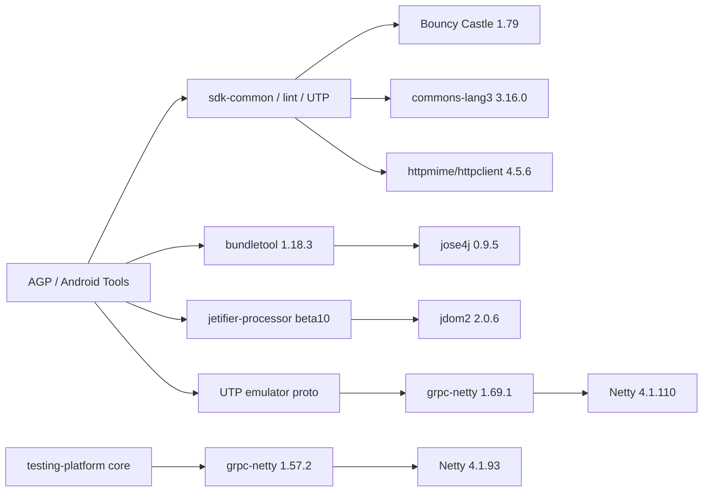

# GKD-SDP Dependabot 45 项传递依赖漏洞修复 Implementation Plan

> **For Codex:** REQUIRED SUB-SKILL: Use `superpowers:executing-plans` to implement this plan task-by-task；开始前使用 `superpowers:using-git-worktrees`，每次遇到 Gradle、GitHub Actions 或依赖解析异常时先使用 `superpowers:systematic-debugging`，脚本和构建策略改动使用 `superpowers:test-driven-development`，准备合并前使用 `superpowers:requesting-code-review` 与 `superpowers:verification-before-completion`，最后使用 `superpowers:finishing-a-development-branch` 完成 PR、合并、分支清理和本地/远端同步。禁止通过关闭 Dependabot、缩减依赖图或批量 dismiss 告警来制造“0 漏洞”的假结果。

**Goal:** 修复 2026-08-02 `main` 上现有的 45 条 Dependabot 漏洞告警，使 Gradle 在 GitHub Actions 中实际解析到已修补版本，保持 APK 运行时行为不变，并建立自动回归门禁；完成后把修复分支更新到最新 `main`、合并 PR，删除确认无用的已合并分支，再把本地与远端 `main` 同步到完全相同的提交。

**Architecture:** 将问题视为 Android/Gradle 构建供应链的传递依赖风险，而不是 45 个应用运行时代码缺陷。先用可机器判定的报告和测试固定基线，再把 Android Gradle Plugin（AGP）升级到当前稳定版本；由于上游 AGP 仍解析出旧的 Netty、Bouncy Castle、jose4j、JDOM、Commons Lang 和 Apache HttpClient，继续增加一个范围严格、带最低安全版本和退出条件的临时 Gradle 安全策略。该策略必须同时覆盖插件/构建脚本 classpath 与普通项目 configuration，并由 GitHub Actions 报告、Dependency Graph、Dependabot 告警状态和 APK DEX 审计共同验证。

**Tech Stack:** Gradle 9.5.1、Kotlin DSL、JDK 21、Android Gradle Plugin 9.3.0、GitHub Actions、Gradle Dependency Submission、Dependabot Alerts、GitHub CLI、Python 3 标准库 `unittest`、Android `apkanalyzer`、Git。

---

## 一、执行摘要

### 1. 告警不是 45 个独立根因

截至 2026-08-02，仓库 `wskeei/gkd-SDP` 的 `main` 为 `7edfbb2bc1de002778756af99d3290bce81a8b76`，Dependabot 有 45 条 open 告警：

| 严重等级 | 数量 |
|---|---:|
| Critical | 1 |
| High | 19 |
| Medium | 23 |
| Low | 2 |
| **合计** | **45** |

共同特征：

- 45 条全部属于 Maven/Gradle 生态。
- 45 条全部标记为 `transitive`，不是 `app/build.gradle.kts` 中直接声明的应用依赖。
- GitHub 将它们归到 `settings.gradle.kts`，来源是 `.github/workflows/dependency-graph.yml` 提交的完整 Gradle 解析图。
- 每一条都已有修补版本，不存在“上游尚未修复”的阻塞。
- 其中 38 条来自 Netty 4.1.x；剩余 7 条分布在 6 个 package coordinates、5 个依赖家族。

因此实施时按“Netty + 5 个非 Netty 家族”共 6 个家族修复和回归，不能创建 45 份互相覆盖的版本规则。

### 2. 当前证据表明它们没有被打进用户 APK

对已发布的 `v2.0.0-beta.1` APK 做 DEX `class_defs` 审计：

- APK 共 7,524 个 class definitions。
- `io.netty`、`org.bouncycastle`、`org.jose4j`、`org.jdom`、`org.apache.commons.lang3`、`org.apache.http` 对应包的 class definitions 均为 0。
- 因此当前证据指向“构建/测试/Android 工具链暴露”，而不是用户设备上可直接调用的运行时库。

这会降低用户手机的直接利用面，但不会消除 CI、签名构建和开发机供应链风险。修复目标仍然是让构建实际使用安全版本，而不是 dismiss 为“仅开发依赖”。

### 3. Dependabot 没有自动 PR 的根因

GitHub 对 Gradle 的依赖提交会收集传递依赖，但其安全更新无法在仓库清单中定位这类未直接声明、未锁定的传递依赖。因此 Netty 的自动安全更新运行以 `security_update_dependency_not_found` 失败；继续调整 `.github/dependabot.yml` 的分组或频率不会直接解决这 45 条告警。

修复应由人工控制父依赖和 Gradle 解析下限，Dependabot 继续负责发现与确认，不能把“没有自动 PR”误判成告警无效。

### 4. AGP 9.3.0 升级是必要维护，但单独升级不够

项目当前：

- AGP：`9.2.1`。
- Gradle Wrapper：`9.5.1`。
- JDK：GitHub Actions 使用 21。

AGP 9.3.0 是 2026-07 发布的稳定版本，最低/默认 Gradle 为 9.5.0，因此与本项目 Gradle 9.5.1 兼容。但官方 Google Maven POM 对比显示：

- AGP 9.2.1 使用 Android Tools 32.2.1。
- AGP 9.3.0 使用 Android Tools 32.3.0。
- 32.3.0 仍包含 `httpmime:4.5.6`、`bundletool:1.18.3`、`jetifier-processor:1.0.0-beta10`、Bouncy Castle 1.79 和 grpc-netty 1.69.1 等旧叶子依赖。

所以本计划采用“升级父工具 + 窄范围安全下限”的组合方案。执行者不得在只改完 `agp = "9.3.0"` 后就宣称漏洞已修复。

---

## 二、范围与硬性约束

### 1. 本次允许修改

- Gradle/Android 构建工具版本。
- Gradle 传递依赖解析策略。
- 只用于安全依赖审计的脚本、fixture、测试和 Actions 步骤。
- 依赖安全维护文档。
- 为验证本次改动所需的 CI 报告上传路径。

### 2. 本次禁止修改

- 数字自律、应用拦截、使用申请、Self Control、无障碍守护等业务逻辑。
- Compose UI、数据库 schema、权限、Service、Receiver、通知和悬浮窗行为。
- `gradle/version.properties` 的 `versionName`/`versionCode`，以及 Release tag/CHANGELOG 版本内容。
- APK applicationId、签名证书、release secrets。
- Dependabot 告警开关、Dependency Graph、Dependency Submission、CodeQL 或现有 required checks。
- 为了过检查而删除完整依赖图、排除 buildscript configuration、关闭 transitive 解析或 dismiss 告警。

### 3. 不采用的方案

| 方案 | 结论 | 原因 |
|---|---|---|
| 只升级 AGP | 不采用 | AGP 9.3.0 的 POM 仍带入多组旧依赖，不能关闭 45 条告警 |
| 给所有 configuration 做无条件 `force` | 不采用 | 会把未来更高安全版本降级，也可能混用 Netty/Bouncy 家族版本 |
| 只对 6 个有告警的 Netty artifact 升级 | 不采用 | Netty 同一 4.1.x 家族必须对齐，否则可能发生二进制不兼容 |
| 在 GitHub 上批量 dismiss | 不采用 | 没有改变实际构建 classpath，只隐藏风险 |
| 从依赖提交中排除构建工具 | 不采用 | 会让依赖图失真并丢失未来工具链告警 |
| 一次性改 7 个家族后再排错 | 不采用 | Actions 失败时无法快速定位是哪一个家族造成兼容问题 |
| 为此立即生成全工程 lockfile | 暂不采用 | Android/AGP configuration 数量大，锁文件噪音和更新成本高；本次先用安全下限与报告门禁，锁定可另开计划评估 |

---

## 三、45 条告警覆盖矩阵

### 1. 修复目标

| 依赖/家族 | 告警编号 | 数量 | 当前解析版本 | 本计划最低安全目标 | 说明 |
|---|---|---:|---|---|---|
| `io.netty:netty-codec` | 10, 23, 43 | 3 | 4.1.93 / 4.1.110 | 4.1.136.Final | 随 Netty 4.1 家族统一对齐 |
| `io.netty:netty-codec-http` | 4, 11, 13, 15, 19, 21, 22, 24, 25, 26, 33, 36, 37, 38, 39, 40, 41, 44 | 18 | 4.1.93 / 4.1.110 | 4.1.136.Final | 数量最多的一组 |
| `io.netty:netty-codec-http2` | 3, 9, 16, 27, 30, 31, 34, 42, 45 | 9 | 4.1.93 / 4.1.110 | 4.1.136.Final | 包含多条 High |
| `io.netty:netty-common` | 6, 7 | 2 | 4.1.93 / 4.1.110 | 4.1.136.Final | 单条 advisory 的 floor 较低，但跟随家族最高 floor |
| `io.netty:netty-handler` | 2, 5, 28, 29, 32 | 5 | 4.1.93 / 4.1.110 | 4.1.136.Final | 跟随家族统一对齐 |
| `io.netty:netty-handler-proxy` | 20 | 1 | 4.1.93 / 4.1.110 | 4.1.136.Final | 低危，但同家族处理 |
| `org.apache.commons:commons-lang3` | 8 | 1 | 3.16.0 | 3.18.0 | CVE-2025-48924 |
| `org.apache.httpcomponents:httpclient` | 1 | 1 | 4.5.6 / 4.5.14 | 4.5.14 | 同时把 `httpmime` 对齐到 4.5.14，避免它继续请求 4.5.6 |
| `org.bitbucket.b_c:jose4j` | 14 | 1 | 0.9.5 | 0.9.6 | CVE-2024-29371 |
| `org.bouncycastle:bcpkix-jdk18on` | 17 | 1 | 1.79 | 1.84 | 与 bcprov/bcutil 一起对齐 |
| `org.bouncycastle:bcprov-jdk18on` | 18, 35 | 2 | 1.79 | 1.84 | 编号 35 为唯一 Critical |
| `org.jdom:jdom2` | 12 | 1 | 2.0.6 | 2.0.6.1 | CVE-2021-33813 |
| **合计** | **1–45** | **45** |  |  |  |

### 2. Netty 实际需要对齐的完整 4.1.x 模块

虽然告警只点名其中 6 个 artifact，当前依赖图还解析了以下同版本族模块：

```text
netty-buffer
netty-codec
netty-codec-http
netty-codec-http2
netty-codec-socks
netty-common
netty-handler
netty-handler-proxy
netty-resolver
netty-transport
netty-transport-native-unix-common
```

安全策略应把“`group == io.netty` 且请求版本属于 `4.1.x`”的模块统一提高到不低于 `4.1.136.Final`。不得影响 `netty-tcnative` 等 2.x artifact，也不得把未来 4.1.137+ 或 4.2.x 降回 4.1.136。

### 3. 已确认的主要引入链



执行中必须用实际报告重新确认这些链。若升级 AGP 后链发生变化，以 Actions 的 `buildEnvironment`/dependency report 为准，不要照抄旧版本号。

---

## 四、目标文件结构

实施完成后的建议结构：

```text
gradle/
├── libs.versions.toml
└── security-dependency-floors.properties
scripts/
├── generate-security-dependency-report.sh
├── verify-security-dependency-report.py
└── tests/
    ├── fixtures/
    │   ├── security-dependencies-patched.txt
    │   ├── security-dependencies-vulnerable.txt
    │   ├── security-dependencies-incomplete.txt
    │   ├── security-sbom-patched.json
    │   └── security-sbom-vulnerable.json
    └── test_verify_security_dependency_report.py
docs/maintenance/
└── dependency-security.md
```

Gradle 策略优先放在 `settings.gradle.kts` 与根 `build.gradle.kts` 的最小早期 hook 中；只有验证证明外部 settings 脚本能在插件 classpath 解析前生效时，才创建：

```text
gradle/security-dependency-policy.settings.gradle.kts
```

不要为了“文件看起来整洁”把策略移到一个执行时机过晚、实际上触达不了插件 classpath 的脚本里。

---

## 五、Phase 0：同步基线与建立安全分支

### Task 0：从最新远端 main 创建隔离 worktree

**Files:** 无。

**Step 1: 检查原工作区**

```bash
git status --short --branch
git worktree list --porcelain
git fetch origin --prune
```

若原工作区有用户未提交改动，不得 stash、reset 或覆盖；继续在新的隔离 worktree 工作。

**Step 2: 创建分支**

```bash
TASK_BRANCH=codex/dependabot-vulnerability-repair
git worktree add .worktrees/dependabot-vulnerability-repair -b "$TASK_BRANCH" origin/main
cd .worktrees/dependabot-vulnerability-repair
git status --short --branch
git rev-list --left-right --count HEAD...origin/main
```

预期最后输出 `0 0`。如果分支名已存在，先检查它是否属于同一任务；禁止覆盖未知分支。

**Step 3: 确认 GitHub 权限和门禁**

```bash
gh auth status
gh api repos/wskeei/gkd-SDP/rulesets/20211725 \
  --jq '{name,enforcement,conditions,rules}'
gh repo view wskeei/gkd-SDP \
  --json defaultBranchRef,mergeCommitAllowed,squashMergeAllowed,rebaseMergeAllowed,deleteBranchOnMerge
```

预期 `main-quality-gate` 处于 active，required checks 仍为 `quality`、`build`、`dependency-review`，并要求分支保持最新。

**Commit:** 无。

### Task 1：保存只读告警基线，不把 API 快照提交进仓库

**Files:** 无。

**Step 1: 获取 45 条 open 告警**

```bash
gh api --method GET repos/wskeei/gkd-SDP/dependabot/alerts \
  -f state=open \
  -f per_page=100 \
  --paginate > /tmp/gkd-sdp-dependabot-open-before.json
jq 'length' /tmp/gkd-sdp-dependabot-open-before.json
jq 'group_by(.security_advisory.severity) | map({severity: .[0].security_advisory.severity, count: length})' \
  /tmp/gkd-sdp-dependabot-open-before.json
```

预期总数为 45，严重等级与执行摘要一致。不得使用仓库目录保存带 GitHub 元数据的原始响应。

**Step 2: 确认全部为传递依赖且已有补丁**

```bash
jq '[.[] | select(.dependency.relationship != "transitive")] | length' \
  /tmp/gkd-sdp-dependabot-open-before.json
jq '[.[] | select(.security_vulnerability.first_patched_version == null)] | length' \
  /tmp/gkd-sdp-dependabot-open-before.json
```

两个输出都应为 0。若数量变化，更新执行记录和 floors，但不能删除本计划原有 1–45 的验收要求。

**Step 3: 获取当前 SBOM**

```bash
gh api repos/wskeei/gkd-SDP/dependency-graph/sbom > /tmp/gkd-sdp-sbom-before.json
jq '.sbom.packages | length' /tmp/gkd-sdp-sbom-before.json
```

**Commit:** 无。

---

## 六、Phase 1：先建立可失败的依赖安全验证

### Task 2：为版本判断器写测试 fixture

**Files:**

- Create: `gradle/security-dependency-floors.properties`
- Create: `scripts/tests/fixtures/security-dependencies-vulnerable.txt`
- Create: `scripts/tests/fixtures/security-dependencies-patched.txt`
- Create: `scripts/tests/fixtures/security-dependencies-incomplete.txt`
- Create: `scripts/tests/fixtures/security-sbom-vulnerable.json`
- Create: `scripts/tests/fixtures/security-sbom-patched.json`
- Create: `scripts/tests/test_verify_security_dependency_report.py`
- Create: `scripts/verify-security-dependency-report.py`

**Step 1: 建立唯一的 floor 数据源**

`gradle/security-dependency-floors.properties` 至少包含：

```properties
netty4_1=4.1.136.Final
commonsLang3=3.18.0
httpcomponents4_5=4.5.14
jose4j=0.9.6
bouncycastleJdk18on=1.84
jdom2=2.0.6.1
```

文件顶部说明：这是上游 Android 工具链尚未抬高版本前的临时安全下限；任何下调都必须链接新的 advisory 证据并经 Actions 验证。

**Step 2: 先写失败测试**

测试至少覆盖：

1. vulnerable fixture 含 Netty 4.1.93/4.1.110、BC 1.79、jose4j 0.9.5 等，验证器退出非 0，并列出每个不安全坐标。
2. patched fixture 全部达到 floor，退出 0。
3. 未来更高版本（例如 Netty 4.1.137.Final）必须通过，证明策略不是“固定并降级到 4.1.136”。
4. `io.netty` 2.x 非 Netty 4.1 家族，不应被误判成需要 4.1.136。
5. incomplete fixture 缺少报告完整性 sentinel，必须退出非 0，避免空报告被当作安全。
6. 报告里同一坐标同时出现安全和不安全版本时必须失败，因为 GitHub 依赖图会保留两条解析路径。
7. `httpclient` 安全但 `httpmime:4.5.6` 仍存在时必须失败，确保 Apache HttpComponents 同线对齐。
8. `bcpkix`、`bcprov`、`bcutil` 任一低于 1.84 都必须失败。
9. `--sbom` 能读取 GitHub SPDX SBOM 的 `.sbom.packages[].name`/`.versionInfo`；vulnerable SBOM 失败、patched SBOM 通过。

先运行：

```bash
python3 -m unittest scripts.tests.test_verify_security_dependency_report -v
```

预期因为实现尚不存在而失败。

**Step 3: 实现最小验证器**

要求：

- 只用 Python 标准库。
- 互斥接收 `--report <path>` 或 `--sbom <path>`。
- 从 properties 读取 floor，不在 Python 中再复制版本号。
- 对 Netty 使用明确的 `4.1.<patch>.Final` 解析，不用浮点数比较。
- 对四段版本 `2.0.6.1` 做整数分段比较。
- 输出每个失败项的坐标、发现版本、要求 floor。
- 安全时输出被检查的家族和发现版本摘要。
- 报告必须包含 `SECURITY_DEPENDENCY_REPORT_COMPLETE=1` 和 AGP 坐标 sentinel。

再次运行同一测试，预期全部通过。

**Step 4: 静态检查**

```bash
python3 -m compileall -q scripts/verify-security-dependency-report.py scripts/tests
git diff --check
```

**Commit:**

```bash
git add gradle/security-dependency-floors.properties scripts/verify-security-dependency-report.py scripts/tests
git commit -m "test: add vulnerable build dependency audit"
```

### Task 3：生成真实 Gradle 插件与项目依赖报告

**Files:**

- Create: `scripts/generate-security-dependency-report.sh`
- Modify: `scripts/tests/test_verify_security_dependency_report.py`

**Step 1: 生成器必须覆盖插件 classpath**

脚本使用 `set -euo pipefail`，在 `build/reports/security-dependencies.txt` 中依次记录：

```bash
./gradlew --console=plain buildEnvironment
./gradlew --console=plain :app:buildEnvironment
./gradlew --console=plain :hidden_api:buildEnvironment
./gradlew --console=plain :selector:buildEnvironment
./gradlew --console=plain :app:dependencies
./gradlew --console=plain :hidden_api:dependencies
./gradlew --console=plain :selector:dependencies
```

每段前写固定 section marker；全部成功后才在文件末尾写：

```text
SECURITY_DEPENDENCY_REPORT_COMPLETE=1
```

脚本不得用 `|| true` 吞掉 Gradle 解析失败。报告路径属于 `build/`，不得提交生成结果。

**Step 2: 扩充测试**

测试生成器在 Gradle 命令中途失败时不会留下完整性 sentinel，并验证报告目录创建逻辑。可通过把 fake `gradlew` 放入测试临时目录模拟，不运行真实 Android 构建。

**Step 3: 本地只跑脚本单测**

```bash
python3 -m unittest discover -s scripts/tests -p 'test_*.py' -v
git diff --check
```

本地缺少 Android/JDK 时不要把真实 Gradle 报告结果当作结论。

**Commit:**

```bash
git add scripts/generate-security-dependency-report.sh scripts/tests
git commit -m "test: report Gradle build dependency versions"
```

### Task 4：在 Draft PR 上取得“修复前失败”证据

**Files:**

- Modify: `.github/workflows/ci.yml`

**Step 1: 暂时接入报告但不吞掉验证失败**

在 `quality` job 中，Java/Gradle setup 后先运行 audit tests 和生成报告；保留现有 unit tests/lint，最后才运行 floor verifier。这样“修复前预期失败”不会阻止原有测试提供回归证据：

```yaml
- name: Test security dependency audit
  run: python3 -m unittest discover -s scripts/tests -p 'test_*.py' -v

- name: Generate security dependency report
  run: bash scripts/generate-security-dependency-report.sh

# Keep the existing "Run unit tests and lint" step here.

- name: Verify security dependency floors
  run: python3 scripts/verify-security-dependency-report.py \
    --report build/reports/security-dependencies.txt
```

把 `build/reports/security-dependencies.txt` 加入现有 `Upload quality reports` artifact path。

**Step 2: 提交并创建 Draft PR**

```bash
git add .github/workflows/ci.yml
git commit -m "ci: detect vulnerable Gradle dependency resolution"
git push -u origin codex/dependabot-vulnerability-repair
gh pr create \
  --repo wskeei/gkd-SDP \
  --base main \
  --head codex/dependabot-vulnerability-repair \
  --draft \
  --title "build: repair vulnerable Gradle transitive dependencies" \
  --body "Implements docs/plans/2026-08-02-dependabot-vulnerability-repair.md."
```

**Step 3: 读取失败日志和 Artifact**

```bash
gh pr checks --repo wskeei/gkd-SDP --watch
gh run list --repo wskeei/gkd-SDP --branch codex/dependabot-vulnerability-repair --limit 5
gh run view <RUN_ID> --repo wskeei/gkd-SDP --log-failed
```

预期 `quality` 只因报告发现本文列出的旧版本而失败；脚本测试、Gradle 配置和原有单测不应先失败。如果失败原因不同，先按 systematic debugging 修正报告基础设施，不得直接进入版本覆盖。

**Go/No-Go Gate A:** 必须在 Artifact 中看到 AGP 和至少一条 Netty/Android tools 引入链，证明报告触达插件/构建 classpath。看不到时，报告是不完整的，禁止继续。

---

## 七、Phase 2：先升级直接父工具 AGP

### Task 5：AGP 9.2.1 升级到 9.3.0

**Files:**

- Modify: `gradle/libs.versions.toml`

**Step 1: 单独修改 AGP**

```toml
agp = "9.3.0"
```

不要同时改 Kotlin、KSP、Compose、Gradle Wrapper 或 Android SDK 版本。

**Step 2: 静态检查并提交**

```bash
git diff -- gradle/libs.versions.toml
git diff --check
git add gradle/libs.versions.toml
git commit -m "build: upgrade Android Gradle plugin to 9.3.0"
git push
```

**Step 3: 等待 Actions**

当前 security verifier 预计仍失败，但必须确认：

- Gradle 配置成功。
- `:selector:jvmTest`、`:app:testGkdDebugUnitTest`、两个 Lint 和三个 assemble 不出现 AGP 兼容错误。
- 新报告确实从 AGP 9.3.0/Android Tools 32.3.0 解析。
- 原有 45 条不会因为这个 commit 已全部消失；这是预期，不得 dismiss。

若 AGP 9.3.0 本身导致构建失败，先查官方迁移说明和精确日志。只允许做与 AGP 兼容有关的最小构建配置修改，禁止借机改业务代码。

**Go/No-Go Gate B:** AGP 9.3.0 能完成原有测试、Lint 和 assemble 后才能进入安全下限策略。

---

## 八、Phase 3：实现可触达插件 classpath 的窄范围安全策略

### Task 6：先验证策略挂载点，不假设 settings hook 有效

**Files:**

- Modify: `settings.gradle.kts`
- Modify: `build.gradle.kts`
- Optional Create: `gradle/security-dependency-policy.settings.gradle.kts`

**Primary approach:**

1. 在 `settings.gradle.kts` 尽早注册 `gradle.beforeProject`，对每个 project 的 `buildscript.configurations.configureEach` 和 `project.configurations.configureEach` 应用同一条规则。
2. 根 `build.gradle.kts` 的 `buildscript`/插件 classpath 如在 hook 之前解析，则在其最前部注册同一策略；版本只从 `gradle/security-dependency-floors.properties` 读取。
3. 策略只在发现目标坐标且版本低于 floor 时调用 `useVersion(...)`，并使用 `because(...)` 写明告警和临时覆盖原因。

伪代码边界必须等价于：

```kotlin
when {
    group == "io.netty" && requestedVersion.isNetty41Below(nettyFloor) -> useVersion(nettyFloor)
    group == "org.bouncycastle" && name in bouncyJdk18onModules && requestedVersion < bouncyFloor -> useVersion(bouncyFloor)
    group == "org.apache.httpcomponents" && name in setOf("httpclient", "httpmime") && requestedVersion < httpFloor -> useVersion(httpFloor)
    group == "org.apache.commons" && name == "commons-lang3" && requestedVersion < commonsFloor -> useVersion(commonsFloor)
    group == "org.bitbucket.b_c" && name == "jose4j" && requestedVersion < joseFloor -> useVersion(joseFloor)
    group == "org.jdom" && name == "jdom2" && requestedVersion < jdomFloor -> useVersion(jdomFloor)
}
```

`bouncyJdk18onModules` 必须恰好覆盖：

```text
bcpkix-jdk18on
bcprov-jdk18on
bcutil-jdk18on
```

**禁止实现：**

```kotlin
resolutionStrategy.force("io.netty:...")
```

无条件 force 会降级未来安全版本。也禁止匹配所有 `org.bouncycastle:*`，因为其他 JDK 线或 artifact 可能有不同兼容边界。

**Fallback only if the report proves the primary hook misses plugin classpath:**

1. 不得把 verifier 改成忽略旧版本。
2. 把 AGP 从 root `plugins { alias(...) apply false }` 的解析路径迁到受控的 root `buildscript.configurations.classpath`。
3. 在受控 classpath 中声明 `com.android.tools.build:gradle:9.3.0`，应用同一 floor 规则。
4. `app/build.gradle.kts` 和 `hidden_api/build.gradle.kts` 只把 Android plugin alias 改成无版本 `id("com.android.application")` / `id("com.android.library")`；其他插件保持原样。
5. 增加静态测试保证 buildscript 中 AGP 版本与 `libs.versions.toml` 一致，避免双版本漂移。
6. 再跑报告；仍解析旧版本则停止，不允许继续叠加更多全局 force。此时应记录具体 configuration 和 `dependencyInsight`，重新设计插件管理方式。

### Task 7：先只处理 Netty 家族

**Files:** 同 Task 6。

**Step 1: 启用 Netty 规则，其他家族暂不启用**

规则必须：

- 仅匹配 group `io.netty`。
- 仅匹配请求版本 `4.1.<number>.Final`。
- 仅在 patch `< 136` 时提高到 `4.1.136.Final`。
- 允许 4.1.136、4.1.137+ 和 4.2.x 保持原值。
- 将 11 个实际出现的 4.1.x 模块解析为同一版本。

**Step 2: 提交、推送、等待 Actions**

```bash
git add settings.gradle.kts build.gradle.kts gradle/security-dependency-floors.properties
git commit -m "build: align Netty on its patched 4.1 release"
git push
gh pr checks --repo wskeei/gkd-SDP --watch
```

仅 stage 实际修改文件。如果实际创建了 `gradle/security-dependency-policy.settings.gradle.kts`，先用 `git status --short` 确认后再单独 `git add`；不得用 `|| true` 掩盖真实 Git 错误。

**Expected:** 报告不再列出任何 Netty 4.1.93/4.1.110；其他家族仍让 verifier 失败。原有测试、Lint、assemble 必须继续成功。

**Step 3: 需要排错时使用 dependency insight**

根据报告里的实际 configuration 运行，例如：

```bash
./gradlew :app:dependencyInsight \
  --dependency io.netty:netty-codec-http \
  --configuration <RESOLVABLE_CONFIGURATION> \
  --console=plain
```

若该依赖只在 buildscript classpath，使用 `buildEnvironment` 与 `--info` 日志，不要虚构 configuration 名称。

### Task 8：处理 Bouncy Castle 与剩余工具依赖

**Files:** 同 Task 6。

按以下小批次开启规则；每批至少运行脚本测试和一次 Actions：

1. Bouncy Castle：`bcpkix-jdk18on`、`bcprov-jdk18on`、`bcutil-jdk18on` → 最低 1.84。
2. `jose4j` → 最低 0.9.6；`jdom2` → 最低 2.0.6.1。
3. `commons-lang3` → 最低 3.18.0。
4. `httpclient` 与 `httpmime` → 最低 4.5.14。

每批检查：

```bash
python3 -m unittest discover -s scripts/tests -p 'test_*.py' -v
git diff --check
git add <ONLY_THE_FILES_CHANGED_IN_THIS_BATCH>
git commit -m "build: raise patched cryptography dependency floors"
git push
gh pr checks --repo wskeei/gkd-SDP --watch
```

后续批次分别使用准确 commit message，例如：

```text
build: raise patched Android tool utility floors
build: align Apache HttpComponents on 4.5.14
```

不要为了机械追求每批一个 commit 而提交空 commit；但不得把所有家族压成一个无法排错的提交。

**Go/No-Go Gate C:** 最终 `Verify security dependency floors` 必须退出 0，报告中不得存在任何目标坐标低于 floor，同时原有 unit tests、Lint 和 assemble 全部成功。

---

## 九、Phase 4：把安全验证固化到 CI 和维护文档

### Task 9：完成 CI 门禁和报告 Artifact

**Files:**

- Modify: `.github/workflows/ci.yml`
- Modify: `.github/workflows/dependency-graph.yml`（仅当现有 path filter 无法覆盖新增策略文件时）

**Step 1: 保持 required check 名称稳定**

安全依赖验证继续放在现有 `quality` job 内，不新增 required check，不修改 job name `quality`。这样不需要在修复过程中调整 active Ruleset。

最终顺序：

1. Python audit tests。
2. 生成 Gradle security dependency report。
3. 原有 selector/app unit tests 与 Android Lint。
4. 验证 security dependency floors。
5. `always()` 上传所有质量报告，包含 `build/reports/security-dependencies.txt`。

**Step 2: 检查 workflow 安全边界**

- `permissions: contents: read` 保持不变。
- 所有 Action 继续使用完整 SHA pin。
- 不向 fork PR 提供 release secrets。
- 不增加 `pull_request_target`。
- 不下载或执行 Dependabot 告警正文中的任意代码。

**Step 3: 确认依赖图触发路径**

`.github/workflows/dependency-graph.yml` 已监听 `gradle/**`、`settings.gradle.kts` 和 `**/*.gradle.kts`，正常情况下无需修改。若最终策略放到其他目录，必须把该路径加入 filter，确保合并到 main 后重新提交图。

**Commit:**

```bash
git add .github/workflows/ci.yml
git commit -m "ci: enforce patched Gradle dependency resolution"
```

只 stage 实际修改文件；如果确实修改了 `.github/workflows/dependency-graph.yml`，经 `git diff -- <file>` 确认后再单独 `git add`。

### Task 10：记录临时 override、维护责任和退出条件

**Files:**

- Create: `docs/maintenance/dependency-security.md`
- Modify: `SECURITY.md`

文档必须包含：

- 45 条告警的严重等级汇总和本文档链接。
- 每个 floor、引入父依赖、加入日期、对应 alert 编号。
- 说明这些库当前不在 release APK 的 DEX class definitions 中，但属于构建供应链。
- Dependabot 对 Gradle 已提交传递依赖无法自动生成修复 PR 的限制。
- 每周 Dependabot 更新继续运行；不得关闭。
- 移除 override 的条件：升级父工具后，未应用该规则的报告也自然解析到 floor 或更高，并且全部 Actions 通过。
- floor 上调流程：更新 properties → 更新 fixture → 先看红测 → 更新策略/父依赖 → Actions → Dependency Graph → 告警状态。
- 任何告警 dismiss 必须逐条有可审计理由；本次 45 条不允许 dismiss。

`SECURITY.md` 只增加维护文档链接，不重复整份说明。

**Commit:**

```bash
git add docs/maintenance/dependency-security.md SECURITY.md
git commit -m "docs: document build dependency security policy"
```

---

## 十、Phase 5：完整 GitHub Actions 与 APK 隔离验证

### Task 11：让 PR 分支吸收最新 main，解决“落后”状态

**Files:** 仅冲突解决可能涉及的文件。

**Step 1: 获取最新远端状态**

```bash
git status --short --branch
git fetch origin --prune
git rev-list --left-right --count HEAD...origin/main
```

输出第一列是分支独有提交数，第二列是落后 `origin/main` 的提交数。若第二列大于 0：

```bash
git merge --no-edit origin/main
```

解决冲突时只整合双方真实意图，不得用 `ours`/`theirs` 整体覆盖安全策略或用户业务改动。完成后：

```bash
git status --short
git push
```

Ruleset 使用 strict required checks，因此合并前分支必须基于最新 main，更新后所有 Actions 会重新运行。

### Task 12：执行 PR 级完整验证

**Files:** 无，除修复验证发现的问题。

```bash
gh pr ready <PR_NUMBER> --repo wskeei/gkd-SDP
gh pr checks <PR_NUMBER> --repo wskeei/gkd-SDP --watch
gh pr view <PR_NUMBER> --repo wskeei/gkd-SDP \
  --json mergeable,mergeStateStatus,reviewDecision,statusCheckRollup,url
```

必须通过：

- `quality`：security audit tests、真实依赖报告、selector/app unit tests、两个 Lint。
- `build`：GKD debug、Play debug、GKD release。
- `dependency-review`：没有新增 High/Critical 漏洞。
- CodeQL Java/Kotlin：没有由本次构建脚本改动造成的新告警。

下载并检查 `ci-quality-reports-*` Artifact，确认报告不是空文件且所有目标家族达到 floor。

### Task 13：合并前做未签名 APK 隔离检查

从 PR 的 `ci-apk-outputs-*` Artifact 取 GKD debug/release APK，使用 Android SDK 自带 `apkanalyzer` 做 defined-package 审计。至少检查：

```text
io.netty
org.bouncycastle
org.jose4j
org.jdom
org.apache.commons.lang3
org.apache.http
```

预期仍然是 0 个对应 class definitions。若命令行版本不支持相同参数，可使用经过测试的 DEX class_defs 解析脚本，但不得只用 `strings` 推断“未打包”。发现任何对应 class definition 时停止合并并调查依赖 scope。

---

## 十一、Phase 6：合并 PR、刷新依赖图、关闭 45 条告警

### Task 14：请求代码审查并合并到 main

**Step 1: 审查重点**

请求 reviewer/审查 agent 核对：

- 版本比较不会把未来新版本降级。
- Netty/Bouncy 家族完整对齐。
- 插件 classpath 和 project configurations 都被真实报告覆盖。
- 没有告警排除、dismiss 或 workflow 权限扩张。
- 没有业务代码、版本号、签名或发布行为改动。
- 测试 fixture 的“安全样本”没有漏掉目标坐标。

处理所有 actionable review comment 后再次更新分支并等待 required checks。

**Step 2: 最后一次同步和合并**

```bash
git fetch origin --prune
git rev-list --left-right --count HEAD...origin/main
gh pr checks <PR_NUMBER> --repo wskeei/gkd-SDP --watch
gh pr view <PR_NUMBER> --repo wskeei/gkd-SDP --json mergeStateStatus,mergeable
```

必须是未落后、可合并、checks 全绿。使用 merge commit 保留本计划要求的阶段性 commit：

```bash
gh pr merge <PR_NUMBER> \
  --repo wskeei/gkd-SDP \
  --merge \
  --delete-branch
```

不得使用 admin bypass 跳过 required checks。若 main 在等待期间前进，回到 Task 11 合并最新 `origin/main`，不要强推。

### Task 15：等待 main 的 CI、Nightly 和 Dependency Graph

```bash
git fetch origin --prune
gh run list --repo wskeei/gkd-SDP --branch main --limit 15
```

等待并验证本次 merge SHA 对应：

- CI 成功。
- Nightly 成功。
- Dependency graph `submit` 成功。
- CodeQL 成功。

若 dependency graph 没有自动触发，确认最终改动路径；必要时手动运行：

```bash
gh workflow run dependency-graph.yml --repo wskeei/gkd-SDP --ref main
gh run list --repo wskeei/gkd-SDP --workflow dependency-graph.yml --limit 5
gh run watch <RUN_ID> --repo wskeei/gkd-SDP --exit-status
```

### Task 16：验证原始 45 条告警是 fixed，而不是 dismissed

Dependency Submission 成功后，GitHub 重新计算可能有短暂延迟。每 2–3 分钟检查一次，最多等待约 30 分钟，不做高频 API 轮询。

逐条检查原始编号 1–45：

```bash
for alert_number in $(seq 1 45); do
  gh api "repos/wskeei/gkd-SDP/dependabot/alerts/$alert_number" \
    --jq '[.number,.state,.dependency.package.name,.dependency.manifest_path,.dismissed_reason] | @tsv'
done
```

验收要求：

- 1–45 全部为 `fixed`。
- `dismissed_reason` 全部为 null。
- 目标 package 的 open 告警数为 0。
- 若修复期间出现新的 advisory，使 floor 高于本文版本，更新 floor 并重新走 Actions；不得只为了满足“原 45 条”而留下同包新告警。

获取新 SBOM 并用同一验证器检查：

```bash
gh api repos/wskeei/gkd-SDP/dependency-graph/sbom > /tmp/gkd-sdp-sbom-after.json
python3 scripts/verify-security-dependency-report.py \
  --sbom /tmp/gkd-sdp-sbom-after.json
```

Task 2 已要求验证器支持 GitHub SPDX SBOM 的 `.sbom.packages[].name`/`.versionInfo` 输入；这里必须复用同一实现，不能另写一套版本判断。

如果告警仍 open：

1. 查看 Dependency Graph 中实际版本，不先重跑 Dependabot。
2. 确认新 snapshot 对应 merge SHA，而不是旧 main。
3. 用报告定位仍旧版本的 configuration/父依赖。
4. 修复策略触达问题并走新的 PR；不得在 main 上直接推送。

### Task 17：在合并后的 main 上做签名 Release dry-run

本次不改版本号、不打 tag、不创建 Release。手动触发受保护 main 上的 Release workflow：

```bash
gh workflow run release.yml \
  --repo wskeei/gkd-SDP \
  --ref main \
  -f publish=false \
  -f tag=
gh run list --repo wskeei/gkd-SDP --workflow release.yml --limit 5
gh run watch <RUN_ID> --repo wskeei/gkd-SDP --exit-status
```

预期：

- unit tests、Lint、release compile 成功。
- 签名 APK 构建成功。
- `apksigner` 证书 SHA-256 与 `RELEASE_CERT_SHA256` 相同。
- 只上传 7 天 dry-run Artifact，不创建或覆盖 GitHub Release。
- 日志不输出 secret 值。
- signed APK 再次通过 Task 13 的 DEX 包隔离检查。

如果 main 上任何一项回归，立即从最新 main 建 hotfix PR；不要修改已合并提交历史，也不要发布新版本。

---

## 十二、Phase 7：删除无用分支并同步本地/远端

### Task 18：审计所有非 main 分支，先证明“无用且已合并”

2026-08-02 调研时，远端除 main 外保留：

```text
codex/accessibility-guard
codex/accessibility-guard-hardening
codex/add-countdown-termination-feature
codex/digital-self-discipline-runtime-repair
merge/upstream-v1.12.1
```

这 5 个分支当时均已是 `origin/main` 的祖先，内容已经合并，只剩无用引用。执行结束时必须重新审计，因为状态可能变化。

对 `gh api repos/wskeei/gkd-SDP/branches --paginate` 返回的**每一个非 main 分支**逐个满足以下删除前置条件：

1. `git merge-base --is-ancestor origin/<branch> origin/main` 返回 0。
2. `gh pr list --state open --head <branch>` 没有 open PR。
3. `git worktree list --porcelain` 没有 worktree 正在使用该本地分支。
4. 分支不是 release/tag 恢复手册指定的长期分支。
5. 记录分支名和删除前 tip SHA，便于必要时从 SHA 恢复。

审计示例：

```bash
git fetch origin --prune
gh api repos/wskeei/gkd-SDP/branches --paginate \
  --jq '.[] | select(.name != "main") | [.name,.commit.sha] | @tsv'
git merge-base --is-ancestor origin/<BRANCH_NAME> origin/main
gh pr list --repo wskeei/gkd-SDP --state open --head <BRANCH_NAME>
git worktree list --porcelain
```

若某分支不是 main 祖先，它不是“无用分支”：先检查 diff、原 PR 和用途。与本次漏洞修复无关的未合并内容不得偷偷混入 main，也不得删除；单独报告给用户。

### Task 19：删除确认无用的远端和本地分支

用户已经明确要求任务完成后删除无用分支。对 Task 18 全部条件通过的分支执行：

```bash
git push origin --delete <BRANCH_NAME>
git fetch origin --prune
git branch -d <BRANCH_NAME>
```

说明：

- `gh pr merge --delete-branch` 通常已经删除本次修复远端分支；仍需检查并 prune。
- 本地没有同名分支时跳过 `git branch -d`，不要用 `-D`。
- 删除前必须保存 tip SHA 到最终交付记录。
- 不使用批量通配符删除；逐个显式删除并逐个检查结果。
- main 永远不是删除目标。

删除后复查：

```bash
gh api repos/wskeei/gkd-SDP/branches --paginate --jq '.[].name'
git branch --all --verbose
git worktree list --porcelain
```

预期远端只保留 `main`，除非 Task 18 发现了真实未合并/长期分支并已明确报告。

### Task 20：同步本地 main 与远端 main

先通过 `git worktree list --porcelain` 找到实际检出 `main` 的本地 worktree。进入该目录后：

```bash
git status --short --branch
git fetch origin --prune
git pull --ff-only origin main
git rev-parse main
git rev-parse origin/main
gh api repos/wskeei/gkd-SDP/branches/main --jq '.commit.sha'
```

三个 SHA 必须完全一致。

如果本地 main 有未提交改动：

- 不得 reset、stash 或覆盖。
- 先报告具体文件；远端 main 已合并不受影响。
- 只有在用户处理/授权这些改动后再做本地 fast-forward。

### Task 21：清理本次 worktree 并留下可审计结果

确认 PR 已合并、远端修复分支已删除、worktree 无未提交文件后：

```bash
git status --short
cd <MAIN_WORKTREE>
git worktree remove <SECURITY_WORKTREE>
git branch -d codex/dependabot-vulnerability-repair
git fetch origin --prune
```

不得用 `-D` 强删未被本地 main 识别为已合并的分支；先检查本地 main 是否已经 fast-forward 到 merge commit。

最终交付记录必须包含：

- PR URL 和 merge commit SHA。
- 每个阶段的 commit SHA。
- PR/main CI、Dependency Graph、CodeQL、Nightly、Release dry-run 的 run URL。
- 原始 45 条 alert 的最终状态汇总。
- 新 SBOM 中目标依赖的实际版本。
- APK DEX 隔离结论。
- 本地 main、origin/main、GitHub main 三个相同 SHA。
- 每个被删除分支的分支名和删除前 tip SHA。
- 任何未删除分支及其未删除原因。

---

## 十三、故障隔离与回滚策略

### 1. 某个依赖家族导致 Actions 失败

按 commit 边界定位：

1. 读取失败 task 的完整日志。
2. 在同一 configuration 使用 `dependencyInsight` 或 `buildEnvironment`。
3. 确认是否家族未完全对齐、API 真正不兼容、或策略作用到了错误 scope。
4. 只回退当前未合并分支上的问题 commit，保留已经证明安全的前序家族。
5. 寻找更高的直接父依赖；如果没有兼容路径，记录 blocker，不 dismiss 告警。

不要用 `git reset --hard`。需要撤销已提交改动时使用可审计的 `git revert <SHA>`；需要修改未推送 commit 时也应优先新增修复 commit，保留排错过程。

### 2. 报告安全，但 GitHub SBOM 仍旧

这通常表示策略没有覆盖 Dependency Submission 扫描的某些 configuration，或 snapshot 仍对应旧 SHA。先核对：

- dependency graph run 的 head SHA。
- 报告是否覆盖 root/app/hidden_api/selector buildEnvironment。
- GitHub SBOM 是否同时包含新旧版本。
- 策略是否只在 CI quality 命令生效，而 dependency-submission action 没有生效。

策略必须是仓库 Gradle 配置的一部分，不能依赖 CI 专用 `--init-script`。否则开发机和 Dependency Submission 仍会暴露旧版本。

### 3. 新版本在 APK 中出现

立即停止 merge/release。检查依赖是否错误地加到 `implementation`/`runtimeOnly`，或安全约束是否意外“引入”了原本不存在的模块。正确的约束/resolve rule 应只提高已经被请求的依赖，不应新增 app runtime 依赖。

### 4. 连续三次因同一 floor 失败

不要继续盲目换版本。汇总：请求方、configuration、异常堆栈、尝试版本、上游兼容信息，再重新设计父工具升级或插件 classpath 管理；保留 PR 为 Draft。严禁用 alert dismissal 结束任务。

### 5. PR 已合并但 main 验证失败

不改写 main 历史、不强推。基于最新 `origin/main` 建立 `codex/dependabot-vulnerability-hotfix`：

1. 先保留失败日志和 Artifact。
2. 最小修复可以走新 PR；如果必须完整撤销，使用 `git revert -m 1 <MERGE_COMMIT_SHA>` 生成可审计 revert commit。
3. hotfix 仍须通过 `quality`、`build`、`dependency-review`，不得 admin bypass。
4. 失败期间禁止触发正式 tag 发布。

---

## 十四、完成定义（Definition of Done）

只有以下各项全部满足，任务才算完成：

- [ ] 原始 45 条 Dependabot alert 编号 1–45 均为 `fixed`，不是 `dismissed`。
- [ ] Critical 1、High 19、Medium 23、Low 2 全部被覆盖。
- [ ] AGP 已升级到 9.3.0，Gradle Wrapper 仍为 9.5.1。
- [ ] Netty 4.1 家族解析版本不低于 4.1.136.Final，且全家族一致。
- [ ] Bouncy jdk18on 家族不低于 1.84。
- [ ] commons-lang3、HttpComponents、jose4j、jdom2 达到本文 floor。
- [ ] 策略不会降级未来更高版本，相关测试已覆盖。
- [ ] GitHub Actions `quality`、`build`、`dependency-review` 全绿。
- [ ] main 上 CodeQL、Nightly、Dependency Graph 全绿。
- [ ] signed Release dry-run 成功，证书指纹匹配，未创建 Release。
- [ ] APK 中仍没有目标构建工具包的 class definitions。
- [ ] 没有关闭安全功能、排除完整依赖图、扩大 workflow 权限或泄露 secret。
- [ ] 没有修改业务功能、版本号、数据库、权限和 UI。
- [ ] 修复 PR 已通过普通规则合并到 main，没有 admin bypass。
- [ ] 修复分支合并前已吸收最新 origin/main 并重新通过 Actions。
- [ ] 本地 main、origin/main、GitHub main SHA 完全一致。
- [ ] 所有确认已合并、无开放 PR、无 worktree 占用、非长期用途的无用分支均已从本地和远端删除。
- [ ] 每个删除分支的 tip SHA 已记录，任何保留分支都有明确原因。
- [ ] 维护文档写明 override 的所有者、原因和移除条件。

---

## 十五、推荐 commit 顺序

```text
test: add vulnerable build dependency audit
test: report Gradle build dependency versions
ci: detect vulnerable Gradle dependency resolution
build: upgrade Android Gradle plugin to 9.3.0
build: align Netty on its patched 4.1 release
build: raise patched cryptography dependency floors
build: raise patched Android tool utility floors
build: align Apache HttpComponents on 4.5.14
ci: enforce patched Gradle dependency resolution
docs: document build dependency security policy
```

允许根据实际文件合并相邻的纯测试 commit，但至少保持“报告基线、AGP、Netty、其他家族、CI/文档”五个可独立审查边界。每个高风险构建 commit 推送后都要等待 Actions，不要积累到最后一次性验证。

---

## 十六、官方参考资料

- [GitHub：Dependabot 支持的生态与 Gradle 传递依赖限制](https://docs.github.com/en/code-security/reference/supply-chain-security/supported-ecosystems-and-repositories)
- [GitHub：Dependabot security updates](https://docs.github.com/en/code-security/concepts/supply-chain-security/dependabot-security-updates)
- [GitHub：Dependabot vulnerability detection](https://docs.github.com/en/code-security/reference/supply-chain-security/troubleshoot-dependabot/vulnerability-detection)
- [GitHub：Dependabot errors](https://docs.github.com/en/code-security/reference/supply-chain-security/troubleshoot-dependabot/dependabot-errors)
- [Gradle：升级传递依赖](https://docs.gradle.org/current/userguide/how_to_upgrade_transitive_dependencies.html)
- [Gradle：Dependency constraints](https://docs.gradle.org/current/userguide/dependency_constraints.html)
- [Gradle：Resolution rules 与 force 风险](https://docs.gradle.org/current/userguide/resolution_rules.html)
- [Gradle：Dependency locking](https://docs.gradle.org/current/userguide/dependency_locking.html)
- [Android：AGP 9.3.0 release notes](https://developer.android.com/build/releases/agp-9-3-0-release-notes)
- [Google Maven：AGP 9.3.0 POM](https://dl.google.com/dl/android/maven2/com/android/tools/build/gradle/9.3.0/gradle-9.3.0.pom)
- [本仓库 Dependabot 告警页](https://github.com/wskeei/gkd-SDP/security/dependabot)
