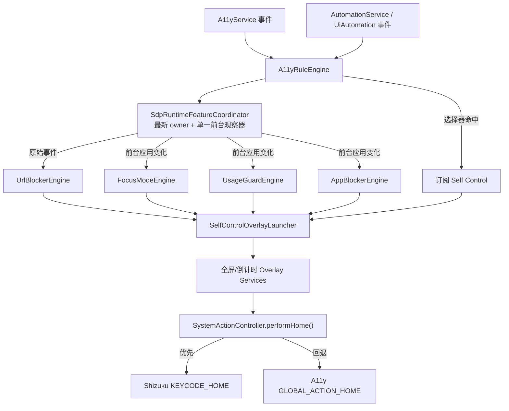

# 数字自律运行链路失效修复 Implementation Plan

> **For Codex:** REQUIRED SUB-SKILL: Use `superpowers:executing-plans` to implement this plan task-by-task；开始前使用 `superpowers:using-git-worktrees`，每个功能增量使用 `superpowers:test-driven-development`，完成前使用 `superpowers:requesting-code-review`、`superpowers:verification-before-completion` 和 `superpowers:finishing-a-development-branch`。

**Goal:** 修复应用拦截、使用申请及相关数字自律功能在双运行模式架构中的失联问题，让无障碍模式与 Automation/Shizuku 模式都能可靠接收前台应用和无障碍事件；同时修复 Self Control 在自动化模式下无法回到桌面、规则或悬浮窗失败无提示等问题，并完整保留已经实现的“上一次行为经过时长”展示。

**Architecture:** 在通用 `A11yRuleEngine` 和各业务引擎之间新增进程级 `SdpRuntimeFeatureCoordinator`。协调器只维护一个前台应用观察器，以“最新连接的 `A11yCommonImpl` 实例”为唯一事件所有者；传统 `A11yService` 和 `AutomationService` 均通过 `A11yRuleEngine` 接入，不再分别复制钩子。应用拦截、使用申请、专注模式和网址拦截改用应用级 `Context` 启停 Overlay，不再把 `A11yService` 当作运行前提；回桌面动作统一走“Shizuku 注入 HOME，失败再回退无障碍全局动作”的兼容入口。规则判定和 Overlay 启动返回结构化结果，既用于测试，也用于页面状态和可导出的诊断日志。

**Tech Stack:** Android 8.0+（minSdk 26）、Kotlin、Kotlin Coroutines/Flow、`AccessibilityService`、`UiAutomation`、Shizuku、Jetpack Compose、`LifecycleService`、`WindowManager.TYPE_APPLICATION_OVERLAY`、Room 2.8.4、JUnit 4、Gradle/JDK 21、GitHub CLI、GitHub Actions。

---

## 一、调研结论与故障定性

### 1. 当前基线

- 审计基线：`main` / `origin/main`，提交 `605e9420393660c6e162ea14a221d843e795f323`。
- 该提交是 PR #6 的合并提交，包含“经过时长提示”，但应用拦截规则判定和使用申请触发条件没有被该 PR 改写。
- 本轮只有源码静态审计，没有连接到用户手机，也没有可读取的设备日志；因此能确定架构必现问题，但不能在文档阶段伪造用户设备的实际运行模式或具体系统异常。
- 当前环境访问 `api.github.com` 失败，未重新读取线上历史 Actions 结果；本计划以仓库内现有工作流为准，并要求执行阶段通过 GitHub Actions 重新验证。

### 2. 已确认的第一根因：双运行模式合并后，自律钩子只接到了 `A11yService`

提交 `a651265929fa96858766b253bbf04220ceb5ea72`（`merge: integrate upstream GKD v1.12.1`）引入了 `A11yCommonImpl` 和 `AutomationService` 双运行模式，但当时保留的 SDP 自定义功能仍然是下面这种结构：

```kotlin
fun A11yService.onSdpA11yEvent(event: AccessibilityEvent) { ... }

fun A11yService.initSdpA11yFeatures() {
    topActivityFlow.collect { activity ->
        FocusModeEngine.onAppChanged(...)
        UsageGuardEngine.onAppChanged(...)
        AppBlockerEngine.onAppChanged(...)
    }
}
```

`AutomationService` 的事件监听器当前只调用：

```kotlin
ruleEngine.onA11yEvent(event)
```

它没有调用 `onSdpA11yEvent()`，也没有启动 `initSdpA11yFeatures()`。同时这些扩展函数和业务引擎参数被写死为 `A11yService`，`AutomationService` 即使想复用也无法直接调用。

结果是：通用订阅规则引擎在 Automation 模式下仍然运行，但挂在传统服务外侧的 SDP 自律功能完全收不到事件。这不是时间卡 UI 导致的偶发问题，而是代码路径必现的接线缺口。

### 3. 三项用户关心功能的当前状态

| 功能 | 无障碍模式 | Automation/Shizuku 模式 | 当前结论 |
|---|---|---|---|
| 应用拦截 | `topActivityFlow → AppBlockerEngine` 路径存在 | 没有注册前台应用观察器 | **Automation 模式完全失效** |
| 使用申请 | `topActivityFlow → UsageGuardEngine` 路径存在 | 没有注册前台应用观察器 | **Automation 模式完全失效** |
| Self Control（订阅选择器全屏拦截） | 位于通用 `A11yRuleEngine.queryAction()` 中 | 同样位于通用规则引擎中 | 规则触发路径仍存在，但自动退出/按钮的 HOME 动作在 Automation 模式失效 |
| 网址拦截 | 原始无障碍事件会传给 `UrlBlockerEngine` | 原始事件没有传给它 | **Automation 模式完全失效** |
| 专注模式 | 前台应用变化会传给 `FocusModeEngine` | 没有注册前台应用观察器 | **Automation 模式完全失效** |
| 普通订阅点击规则 | 通用 `A11yRuleEngine` 执行 | 通用 `A11yRuleEngine` 执行 | 不属于本次失联路径 |

这里的 “Self Control” 特指数字自律页中给订阅规则配置的十秒全屏拦截。它并没有和应用拦截、使用申请一起完全失去触发入口；但是 `InterceptOverlayService` 的退出逻辑只调用 `A11yService.instance?.performGlobalAction(GLOBAL_ACTION_HOME)`，Automation 模式没有 `A11yService.instance`，所以倒计时结束或点击退出时只会关闭 Overlay，不会可靠返回桌面。

### 4. 第二根因：多处业务代码错误地把 `A11yService` 当作唯一运行载体

下列路径都直接依赖 `A11yService`：

- `AppBlockerEngine.onAppChanged(..., service: A11yService)`。
- `UsageGuardEngine` 的请求页、倒计时条、超时页启停和提前结束。
- `FocusModeEngine.onAppChanged(..., service: A11yService)` 及手动专注会话立即显示。
- `UrlBlockerEngine` 读取节点、跳转网址和启动拦截页。
- `AppBlockerOverlayService`、`InterceptOverlayService`、`UsageGuardRequestOverlayService`、`UsageGuardTimeoutOverlayService` 的 HOME 动作。

实际上：

- 启动/停止本应用 Service 和 `startActivity()` 只需要应用级 `Context`。
- 读取当前节点只需要当前活动的 `A11yRuleEngine` / `A11yCommonImpl`。
- HOME 动作才需要系统操作能力，而且项目已有 `performActionBack()` 的 Shizuku 优先、无障碍回退范式，可以为 HOME 建立对称实现。

继续把所有功能参数写成 `A11yService` 会让以后每增加一个运行模式都再次产生同类回归。

### 5. 第三根因：同一个前台应用 collector 承载多个引擎，异常会让它永久退出

当前 `initSdpA11yFeatures()` 的一个协程依次调用专注、使用申请和应用拦截。`BlockTimeRule.isActiveNow()`、`FocusRule.isActiveNow()` 等函数直接解析数据库中的 `HH:mm` 字符串；应用拦截保存表单没有在写入前完整校验时间格式。

因此只要历史数据或输入中存在非法时间：

1. `LocalTime.of(...)` 可抛出异常。
2. 异常会终止该 `collect` 子协程。
3. 后续前台应用变化不再到达应用拦截；同一个 collector 上的其他自律功能也不再被调用。
4. 当前页面没有显示监听协程已经退出，用户看到的只有“规则存在但完全不拦截”。

这不一定就是用户设备本次故障的实际触发条件，但它是已确认的同链路可靠性缺陷，必须和接线问题一起修复，不能只在 Automation 服务中再复制一份同样脆弱的 collector。

### 6. 无障碍模式下仍需区分的配置和系统分支

如果用户手机实际选择的是“无障碍”模式，静态代码中事件入口仍然存在；此时必须按下面顺序读取运行证据：

1. 应用组是否启用。
2. 应用组/单独应用是否至少存在一条已启用时间规则。
3. 测试时刻是否落在规则时间窗口内。
4. 是否有非法时间数据导致判定或 collector 异常。
5. `Settings.canDrawOverlays()` 是否为 true。
6. `startService()` 是否被后台启动限制拒绝。
7. `WindowManager.addView()` 是否被权限、厂商策略或窗口 token 拒绝。

当前 UI 有两个容易误导用户的地方：

- **仅把应用加入应用组并不会产生拦截。** 还必须有启用且当前生效的时间规则，但数字自律首页的应用拦截卡始终显示“拦截指定应用”，零规则应用组也没有醒目的“尚未生效”提示。
- 应用拦截和使用申请页面允许进入和配置，但不像订阅 Self Control 那样在保存入口统一检查悬浮窗权限；Overlay 失败后大多只写一条笼统日志。

所以本计划不把“用户配置错误”冒充唯一根因，而是让运行时返回明确的 `skip reason / launch result`，以后能直接判断是模式接线、规则未生效、权限缺失还是系统拒绝。

### 7. “经过时长提示”不是本次触发失效的根因

对比 `9f08a6f0..605e9420`：

- 应用拦截只增加稳定事件 key、历史写入和时间卡 UI。
- Self Control 选择器分支只增加 Intent 常量、事件 key 和事件类型。
- 使用申请只增加读取上一次记录并显示时间卡。
- `AppBlockerEngine.shouldBlock()`、`UsageGuardPolicy.shouldProtectApp()` 和选择器匹配本身没有被重写。

修复时必须保留这些时间觉察功能；不能通过回退 PR #6 来掩盖真正的运行时接线问题。

---

## 二、修复后的产品与运行规则

### 1. 两种模式功能一致

- 用户选择“无障碍”模式时，五个数字自律引擎继续工作。
- 用户选择“自动化”模式时，应用拦截、使用申请、专注模式、网址拦截和订阅 Self Control 也必须工作。
- 模式切换的一秒共存窗口只能由最新连接的运行实例产生业务副作用，旧实例事件必须丢弃。
- 新运行实例接管时应对当前前台应用做一次幂等 reconcile，不能要求用户额外回桌面再重新打开。

### 2. 应用拦截的明确生效条件

应用只有同时满足以下条件才弹全屏拦截：

1. 当前运行时已连接。
2. 悬浮窗权限有效。
3. 单独应用规则或所属的已启用应用组命中该包名。
4. 至少一条规则已启用且当前时间生效。
5. 当前不在同包名的短防抖窗口内。
6. Overlay 启动请求被系统接受。

“创建应用组/向应用组加应用”和“增加时间规则”继续是两个步骤，不暗中替用户创建或修改规则；但 UI 必须明确显示“仅完成分组，尚未配置时间规则，当前不会拦截”。

### 3. 使用申请的优先级保持不变

- 专注模式拦截优先于应用拦截。
- 应用拦截优先于使用申请。
- 没有有效申请记录时才显示申请表单。
- 有有效记录时继续显示倒计时悬浮条；严格模式离开应用后继续按现有逻辑结束记录。
- 本计划不改变申请理由、最少字数、时长、标签、严格/普通模式和“上一次申请”时间语义。

### 4. Self Control 保持“只能退出”的现有语义

- 订阅规则命中后继续显示十秒全屏拦截和经过时长。
- 不恢复当前未使用的“继续”按钮，也不增加打开应用入口。
- 点击退出或十秒结束后，无障碍模式和 Automation 模式都应回到桌面。
- HOME 系统动作失败时必须记录结果，Overlay 仍要安全关闭，不能卡死或崩溃。

### 5. 单个功能失败不能拖垮其他功能

- 前台应用分发器对每个业务 handler 独立捕获异常。
- 一条非法应用拦截规则只能让该规则返回 `INVALID_RULE`，不能终止 collector。
- 一个 Overlay 被系统拒绝不能让其他 Overlay 或后续应用变化失去监听。
- 日志不得包含申请理由、拦截文案正文、网页内容或实际 URL。

---

## 三、方案比较与最终选择

### 方案 A：把现有钩子复制到 `AutomationService`

做法：在 Automation 监听器中额外调用 `onSdpA11yEvent()`，再复制一份 `topActivityFlow.collect`。

优点：代码改动表面较小。

拒绝原因：

- 仍需把多个引擎从 `A11yService` 改成其他类型，实际并不小。
- 两个 collector 在模式切换共存窗口会重复弹层。
- 以后修改优先级或新增引擎时很容易只改一个服务。
- 现有异常终止和静默失败问题原样保留。

### 方案 B：通用运行时协调器（采用）

做法：把业务接入点放到两种模式都必经的 `A11yRuleEngine`，由一个进程级协调器维护活动 owner、原始事件入口和前台应用分发。

优点：

- 两种模式天然共用一条业务路径。
- 可以用 owner token 解决模式交接重复事件。
- 可以统一异常隔离、日志和运行状态。
- 业务引擎不再依赖具体 Android 无障碍 Service。

代价：需要一次有边界的运行时解耦和较完整的回归测试。

### 方案 C：声明数字自律只能在无障碍模式使用

优点：无需适配 Automation。

拒绝原因：用户已经可以选择 Automation 作为主运行模式，普通订阅规则也在该模式运行；让数字自律功能静默失效既不符合产品预期，也没有 UI 前置限制。强制用户切换模式还会和现有双模式架构目标冲突。

最终采用方案 B。

---

## 四、目标架构



### 1. `SdpRuntimeFeatureCoordinator`

建议接口轮廓：

```kotlin
object SdpRuntimeFeatureCoordinator {
    val statusFlow: StateFlow<RuntimeStatus>

    fun attach(runtime: A11yCommonImpl)
    fun detach(runtime: A11yCommonImpl)
    fun onAccessibilityEvent(runtime: A11yCommonImpl, event: AccessibilityEvent)
    fun reconcileCurrentApp(reason: ReconcileReason)
}
```

实现约束：

- 只在 `appScope` 中创建一个 `topActivityFlow` collector。
- `attach()` 用实例身份而不只是 mode 数字标记 owner；新 owner 覆盖旧 owner。
- `detach(oldOwner)` 不能清掉已经接管的新 owner。
- 原始事件只有来自当前 owner 时才分发。
- `(ownerGeneration, appId)` 去重；owner 变化时允许对当前 appId 做一次幂等 reconcile。
- 每个 handler 使用独立 `runCatching`/监督边界；失败写结构化日志后继续处理下一事件。
- `A11yRuleEngine.onA11yConnected()` 负责 attach；两种服务断开时都必须调用对称 detach。

### 2. 业务引擎解耦

- `AppBlockerEngine.onAppChanged(packageName)`：不再接收 `A11yService`。
- `UsageGuardEngine.onAppChanged(packageName)`：请求、倒计时和超时 Service 使用全局 `app` Context 启停；teardown 改为通用 runtime teardown。
- `FocusModeEngine.onAppChanged(packageName)`：Overlay 使用 `app` Context；手动会话在 Automation 模式也可立即显示。
- `UrlBlockerEngine.onAccessibilityEvent(event, ruleEngine)`：从当前通用 rule engine 读取节点；跳转和 Overlay 使用 `app` Context。
- 任何延迟任务都通过当前 coordinator 状态确认仍有有效 runtime，不能事后重新读取 `A11yService.instance`。

### 3. 公共系统 HOME 动作

在 `A11yRuleEngine` companion 或独立 `SystemActionController` 中增加：

```kotlin
fun performActionHome(): Boolean
```

执行顺序：

1. 如果 Shizuku `inputManager` 可用，注入 `KeyEvent.KEYCODE_HOME`；只有按键的 down/up 均被输入服务接受时才返回成功。
2. 否则调用 `A11yService.instance?.performGlobalAction(GLOBAL_ACTION_HOME)`。
3. 两者都不可用时返回 false 并记录一次诊断结果。

当前 `SafeInputManager.key()` 返回 `Unit`，无法区分“input manager 存在”和“按键实际注入成功”。实现时需要让 `InputShellCommand.runKeyEvent()` / `SafeInputManager.key()` 返回布尔结果，并同步把既有 `performActionBack()` 的判断改为“结果为 true 才成功”，避免 HOME 和 BACK 在 Binder 拒绝时都产生假成功。

Android 官方将 `GLOBAL_ACTION_HOME` 定义为回到桌面的全局动作，并由 `performGlobalAction()` 执行：<https://developer.android.com/reference/android/accessibilityservice/AccessibilityService>。

### 4. Overlay 启动与权限网关

新增 `SelfControlOverlayLauncher`，所有数字自律引擎通过它启动/停止 Overlay：

```kotlin
sealed interface OverlayLaunchResult {
    data object Accepted : OverlayLaunchResult
    data object MissingPermission : OverlayLaunchResult
    data object RuntimeUnavailable : OverlayLaunchResult
    data class Rejected(val category: FailureCategory) : OverlayLaunchResult
}
```

规则：

- 启动前调用 `Settings.canDrawOverlays(app)`；缺失时不设置业务 cooldown，更新状态并记录明确原因。
- 捕获后台 Service 启动拒绝和安全异常；不能只保存 `e.message`。
- 每个 Overlay Service 的 `WindowManager.addView()` 仍要有最终 try/catch，因为“startService 被接受”不等于窗口一定挂载成功。
- addView 失败时释放 ComposeView、清空内部状态并 `stopSelf()`，避免留下永远认为“已有 view”的假运行状态。
- 项目已有 `StatusService` 前台服务；自动化运行时应继续通过现有入口确保它启动。Android 8+ 对后台 Service 有启动限制，而拥有前台 Service 的应用会被视为可创建 Service 的前台状态之一：<https://developer.android.com/about/versions/oreo/background>。
- `TYPE_APPLICATION_OVERLAY` 需要 `SYSTEM_ALERT_WINDOW`，系统也可调整其位置、大小或可见性：<https://developer.android.com/reference/android/view/WindowManager.LayoutParams#TYPE_APPLICATION_OVERLAY>。
- 官方建议用 `Settings.canDrawOverlays()` 判断能力、用 `ACTION_MANAGE_OVERLAY_PERMISSION` 引导授权：<https://developer.android.com/reference/android/provider/Settings#canDrawOverlays(android.content.Context)>。

### 5. 应用拦截纯判定

新增可注入 `LocalDateTime` 的纯策略，返回结构化结果而不是 `Pair<Boolean, String?>`：

```kotlin
sealed interface AppBlockerDecision {
    data class Block(val ruleId: Long, val message: String) : AppBlockerDecision
    data object EngineDisabled : AppBlockerDecision
    data object NoMatchingTarget : AppBlockerDecision
    data object GroupDisabled : AppBlockerDecision
    data object NoEnabledRule : AppBlockerDecision
    data object OutsideSchedule : AppBlockerDecision
    data class InvalidRule(val ruleIds: List<Long>) : AppBlockerDecision
}
```

时间规则要求：

- 使用传入的 `now`，不在纯策略内部读取系统时间。
- 非法 `HH:mm` 返回 `InvalidRule`，不能抛出并终止 collector。
- 普通时间窗口开始时刻包含、结束时刻不包含，保持现有主要语义。
- 跨午夜窗口按“规则选中的起始日”解释：星期一 `22:00–08:00` 应覆盖星期一晚间和星期二凌晨。
- “全天候”模板及已有 `00:00–23:59` 数据必须覆盖 23:59 这一分钟，不留近一分钟空窗。
- 多条规则仍按 `createdAt` 倒序选择文案，不改变现有优先级。

规则、组缓存用单个不可变 snapshot 发布，避免规则流和组流短暂不一致；Overlay launch 返回 `Accepted` 后才写入 2 秒 cooldown。

### 6. 可诊断运行状态

数字自律首页增加紧凑的“自律拦截运行状态”，只显示当前过程状态，不写 Room：

- 当前运行模式：无障碍 / 自动化。
- 运行引擎：已连接 / 未连接 / 正在切换。
- 悬浮窗：已授权 / 未授权（提供前往授权按钮）。
- 最近一次判定：功能名、时间和公开的 skip reason，例如“当前不在时间规则内”或“悬浮窗权限缺失”。

应用拦截卡和组卡还应显示：

- 已配置应用数、启用规则数。
- 零时间规则时显示“尚未生效：请添加时间规则”。
- 规则存在但当前不在时间窗口时显示“已配置，当前时段不拦截”。

日志字段限制为：mode、runtime generation、feature、packageName、ruleId、decision、overlayResult、异常类别。不得记录理由文本、拦截文案、实际 URL 或节点内容。

---

## 五、文件地图

### Create

- `app/src/main/kotlin/li/songe/gkd/sdp/a11y/SdpRuntimeFeatureCoordinator.kt`
- `app/src/main/kotlin/li/songe/gkd/sdp/a11y/SelfControlOverlayLauncher.kt`
- `app/src/main/kotlin/li/songe/gkd/sdp/util/AppBlockerDecisionPolicy.kt`
- `app/src/main/kotlin/li/songe/gkd/sdp/util/SelfControlRuntimeReadiness.kt`
- `app/src/test/kotlin/li/songe/gkd/sdp/a11y/SdpRuntimeFeatureCoordinatorTest.kt`
- `app/src/test/kotlin/li/songe/gkd/sdp/a11y/SystemActionControllerTest.kt`
- `app/src/test/kotlin/li/songe/gkd/sdp/a11y/SelfControlOverlayLauncherTest.kt`
- `app/src/test/kotlin/li/songe/gkd/sdp/util/AppBlockerDecisionPolicyTest.kt`
- `app/src/test/kotlin/li/songe/gkd/sdp/util/SelfControlRuntimeReadinessTest.kt`

### Modify

- `app/src/main/kotlin/li/songe/gkd/sdp/a11y/A11yRuleEngine.kt`
- `app/src/main/kotlin/li/songe/gkd/sdp/a11y/A11yFeat.kt`
- `app/src/main/kotlin/li/songe/gkd/sdp/service/A11yService.kt`
- `app/src/main/kotlin/li/songe/gkd/sdp/shizuku/AutomationService.kt`
- `app/src/main/kotlin/li/songe/gkd/sdp/shizuku/InputManager.kt`
- `app/src/main/kotlin/li/songe/gkd/sdp/shizuku/InputShellCommand.kt`
- `app/src/main/kotlin/li/songe/gkd/sdp/a11y/AppBlockerEngine.kt`
- `app/src/main/kotlin/li/songe/gkd/sdp/a11y/UsageGuardEngine.kt`
- `app/src/main/kotlin/li/songe/gkd/sdp/a11y/FocusModeEngine.kt`
- `app/src/main/kotlin/li/songe/gkd/sdp/a11y/UrlBlockerEngine.kt`
- `app/src/main/kotlin/li/songe/gkd/sdp/data/BlockTimeRule.kt`
- `app/src/main/kotlin/li/songe/gkd/sdp/service/AppBlockerOverlayService.kt`
- `app/src/main/kotlin/li/songe/gkd/sdp/service/InterceptOverlayService.kt`
- `app/src/main/kotlin/li/songe/gkd/sdp/service/UsageGuardRequestOverlayService.kt`
- `app/src/main/kotlin/li/songe/gkd/sdp/service/UsageGuardTimeoutOverlayService.kt`
- `app/src/main/kotlin/li/songe/gkd/sdp/service/UsageGuardCountdownOverlayService.kt`
- `app/src/main/kotlin/li/songe/gkd/sdp/service/FocusOverlayService.kt`（仅当公共 launcher/安全挂载需要）
- `app/src/main/kotlin/li/songe/gkd/sdp/ui/FocusLockPage.kt`
- `app/src/main/kotlin/li/songe/gkd/sdp/ui/AppBlockerPage.kt`
- `app/src/main/kotlin/li/songe/gkd/sdp/ui/AppBlockerVm.kt`
- `README_DEV.md`

### Explicitly unchanged unless compilation proves otherwise

- `app/src/main/AndroidManifest.xml`：相关 Service 和悬浮窗权限已经声明，不新增组件。
- `app/src/main/kotlin/li/songe/gkd/sdp/data/SelfControlAttempt.kt`：经过时长事件表语义不变。
- `app/src/main/kotlin/li/songe/gkd/sdp/data/UsageGuardRecord.kt`：申请记录与上次申请语义不变。
- `app/src/main/kotlin/li/songe/gkd/sdp/ui/component/SelfControlElapsedCard.kt`：展示组件不回退。
- `app/src/main/kotlin/li/songe/gkd/sdp/util/SelfControlElapsedPolicy.kt`：稳定 event key 不改。
- Room 数据库版本和 `app/schemas/`：本计划不新增表或列，不应产生 v32 schema。
- `.github/workflows/Verify-Merge.yml`、`.github/workflows/Build-Apk.yml`：使用现有 JDK 21 测试/构建链路，不降低检查。

---

## 六、验收标准

1. 无障碍模式下，启用且当前生效的单应用规则能显示 `AppBlockerOverlayService`。
2. Automation 模式下，相同规则也能拦截，不要求同时保留 `A11yService.instance`。
3. 已启用应用组中的应用，在存在生效组规则时能在两种模式拦截。
4. 只有应用组、没有时间规则时不拦截，但页面明确显示“尚未生效”，不能再伪装成已配置完成。
5. 禁用应用组、禁用规则、规则时段外分别返回可区分的状态。
6. 非法时间规则不会崩溃或终止前台观察器；修正规则后无需重启进程即可恢复。
7. 星期一 `22:00–08:00` 在星期二 02:00 仍按星期一起始日规则生效。
8. “全天候”规则在 23:59:30 仍生效。
9. 使用申请在两种模式下都能对受控应用显示申请表单。
10. 使用申请的专注模式 > 应用拦截 > 使用申请优先级不变，不出现两个全屏 Overlay 竞争。
11. 成功申请后倒计时条、严格模式离开即结束、到期页和提前结束保持原行为。
12. 使用申请表单继续显示上一次成功申请时间；取消不写新申请记录。
13. 订阅 Self Control 在两种模式下都能由选择器命中并显示经过时长。
14. Self Control 点击退出和十秒自动退出在两种模式下都回到桌面。
15. 应用拦截页继续只有退出动作和十秒自动退出，不增加继续打开入口。
16. 网址拦截和专注模式在 Automation 模式恢复，避免同一架构缺陷继续遗留。
17. A11y → Automation 和 Automation → A11y 切换时，旧 owner 事件被丢弃；同一前台应用最多产生一次可见 Overlay。
18. 悬浮窗权限被撤销时，功能页面显示缺失并可前往授权；规则不被误标成已成功拦截。
19. `startService` 或 `addView` 被系统拒绝时不崩溃、不写成功 cooldown，并能在下一次有效事件重试。
20. 一个业务 handler 抛异常时，其他 handler 和下一次前台应用变化仍被处理。
21. 诊断日志不包含申请理由、拦截文案、实际 URL、网页文本或节点内容。
22. v31 数据库直接升级/运行，不新增 schema，已有规则、申请、锁和历史时间全部保留。
23. GitHub `Verify Merge` 中 `:selector:jvmTest`、`:app:testGkdDebugUnitTest`、`gkdDebug`、`playDebug`、`gkdRelease` 全部通过。
24. 合并到 `main` 后 `Build Latest APK` 成功，并生成可安装的 `gkd-sdp-latest.apk`。

---

## 七、Implementation Tasks

### Task 0: 隔离工作区、基线记录与 Draft PR

**Files:** 无业务源码修改。

**Step 1: 创建独立 worktree**

```bash
git fetch origin main
git worktree add .worktrees/digital-self-discipline-runtime-repair \
  -b codex/digital-self-discipline-runtime-repair origin/main
git -C .worktrees/digital-self-discipline-runtime-repair status -sb
git -C .worktrees/digital-self-discipline-runtime-repair rev-parse HEAD
```

Expected: 基线是最新 `origin/main`，worktree 干净。

**Step 2: 遵守本项目验证约束**

本项目本轮**不在本机执行 Gradle 编译或测试**。所有 Kotlin/JVM 测试和 APK 编译均推送到 GitHub Actions；本地只允许 `rg`、`git diff --check`、源文件静态检查等不触发 Gradle 的命令。

**Step 3: 记录修复前矩阵**

在可用实体设备上用一个全天规则和一个稳定订阅选择器记录：

| 模式 | 应用拦截 | 使用申请 | Self Control 弹出 | Self Control 回桌面 |
|---|---|---|---|---|
| 无障碍 | 待实测 | 待实测 | 待实测 | 待实测 |
| 自动化 | 预期失败 | 预期失败 | 预期可弹 | 预期回桌面失败 |

同时记录悬浮窗权限、当前时间规则、应用组启用状态和导出日志。没有设备时保留“待实测”，不能把静态推断填成实测通过。

**Step 4: 首次推送后立即创建 Draft PR**

第一个测试提交完成后执行：

```bash
git push -u origin codex/digital-self-discipline-runtime-repair
gh pr create --draft \
  --base main \
  --head codex/digital-self-discipline-runtime-repair \
  --title "fix: restore digital self-discipline runtime routing" \
  --body "Restores App Blocker, Usage Guard, Focus and URL routing in both runtime modes; fixes Self Control HOME compatibility and adds runtime diagnostics."
```

Draft PR 让后续每次 push 都触发 `Verify Merge`；不等待所有代码写完才第一次编译。

---

### Task 1: 先用测试锁定双模式 owner 和事件分发

**Files:**

- Create: `app/src/test/kotlin/li/songe/gkd/sdp/a11y/SdpRuntimeFeatureCoordinatorTest.kt`
- Create: `app/src/main/kotlin/li/songe/gkd/sdp/a11y/SdpRuntimeFeatureCoordinator.kt`
- Modify: `app/src/main/kotlin/li/songe/gkd/sdp/a11y/A11yRuleEngine.kt`
- Modify: `app/src/main/kotlin/li/songe/gkd/sdp/a11y/A11yFeat.kt`
- Modify: `app/src/main/kotlin/li/songe/gkd/sdp/service/A11yService.kt`
- Modify: `app/src/main/kotlin/li/songe/gkd/sdp/shizuku/AutomationService.kt`

**Step 1: 写失败测试**

测试使用注入的 `CoroutineScope`、前台 Flow、fake runtime handle 和 fake handlers，至少覆盖：

```kotlin
@Test fun a11yOwnerReceivesCurrentForegroundAppOnce()
@Test fun automationOwnerReceivesCurrentForegroundAppOnce()
@Test fun latestAttachedOwnerWinsDuringModeHandoff()
@Test fun staleOwnerRawEventsAreIgnored()
@Test fun detachingOldOwnerDoesNotClearNewOwner()
@Test fun attachingNewOwnerReconcilesCurrentAppWithoutDuplicateOldDispatch()
@Test fun handlerFailureDoesNotCancelFollowingHandlersOrFutureAppChanges()
```

**Step 2: 提交测试并在 Actions 观察预期失败**

```bash
git add app/src/test/kotlin/li/songe/gkd/sdp/a11y/SdpRuntimeFeatureCoordinatorTest.kt
git commit -m "test: cover dual-mode self-control runtime ownership"
git push
gh pr checks --watch
```

Expected: 因生产协调器尚未实现而红；失败点必须与缺失实现一致，不能是无关语法错误。

**Step 3: 实现单一协调器**

- 在 `appScope` 中只创建一个前台 Flow collector。
- `attach()` 发布实例 token、模式和 generation。
- handler 顺序继续保持现有业务优先关系；每个 handler 有独立异常边界。
- `onAccessibilityEvent()` 只接受当前 owner 原始事件并路由 URL/专注事件。
- 状态变化记录 mode、generation、appId 和公开 decision，不记录内容。

**Step 4: 把接入点移到通用规则引擎**

- `A11yRuleEngine.onA11yConnected()` 完成有效 owner 切换后调用 coordinator attach。
- `A11yRuleEngine.onA11yEvent()` 在确认 `effective` 后把原始事件交给 coordinator；既有订阅匹配流程继续执行。
- 增加对称 `onDisconnected()`，两种服务销毁/断开时调用。
- 删除 `A11yService` 独有的 `onSdpA11yEvent()` 和 `initSdpA11yFeatures()` 调用，避免双重分发。
- `A11yFeat.kt` 中截图、更新订阅、音量、屏幕状态等上游通用功能不删除。

**Step 5: 静态检查、提交、推送验证**

```bash
rg -n "initSdpA11yFeatures|onSdpA11yEvent" app/src/main/kotlin
git diff --check
git add app/src/main/kotlin app/src/test/kotlin
git commit -m "fix: route self-control features through the active runtime"
git push
gh pr checks --watch
```

Expected: 旧的 A11y-only 接线已消失；协调器测试通过，Actions 进入构建阶段。

---

### Task 2: 解除四个业务引擎对 `A11yService` 的硬依赖

**Files:**

- Create: `app/src/main/kotlin/li/songe/gkd/sdp/a11y/SelfControlOverlayLauncher.kt`
- Create: `app/src/test/kotlin/li/songe/gkd/sdp/a11y/SelfControlOverlayLauncherTest.kt`
- Modify: `app/src/main/kotlin/li/songe/gkd/sdp/a11y/AppBlockerEngine.kt`
- Modify: `app/src/main/kotlin/li/songe/gkd/sdp/a11y/UsageGuardEngine.kt`
- Modify: `app/src/main/kotlin/li/songe/gkd/sdp/a11y/FocusModeEngine.kt`
- Modify: `app/src/main/kotlin/li/songe/gkd/sdp/a11y/UrlBlockerEngine.kt`

**Step 1: 写 Overlay launcher 失败测试**

使用注入的 permission checker、service starter/stopper 和 runtime provider，覆盖：

```kotlin
@Test fun missingOverlayPermissionReturnsMissingPermissionWithoutStartingService()
@Test fun acceptedStartReturnsAccepted()
@Test fun backgroundStartRejectionIsClassifiedAndDoesNotThrow()
@Test fun missingRuntimeIsReportedForNodeDependentUrlEvaluation()
```

提交测试并推送，确认 Actions 因 launcher 缺失而红：

```bash
git add app/src/test/kotlin/li/songe/gkd/sdp/a11y/SelfControlOverlayLauncherTest.kt
git commit -m "test: cover self-control overlay launch outcomes"
git push
gh pr checks --watch
```

**Step 2: 实现应用级 Overlay launcher**

- 使用 `app` Context 构造和启停所有数字自律 Intent。
- 返回 `OverlayLaunchResult`。
- 不在 launcher 内修改业务 cooldown 或业务状态。
- 确保现有 `StatusService.autoStart()` 生命周期仍覆盖 Automation 模式；不为每个弹层改造成独立前台 Service。

**Step 3: 改造 App Blocker、Focus 和 URL**

- 移除 `service: A11yService` 参数。
- App Blocker/Focus 的 Overlay 通过 launcher 启动。
- 手动专注会话不再用 `A11yService.instance?.let` 作为是否显示的条件。
- URL 节点读取显式使用 coordinator 传入的当前 `A11yRuleEngine`；网址跳转使用 `app.startActivity()`。

**Step 4: 完整改造 Usage Guard**

- `onAppChanged()`、request/countdown/timeout 的 start/stop 不再接收 A11y Service。
- `onA11yServiceDestroyed()` 重命名为通用 runtime teardown，只在当前 owner 真正消失且没有新 owner 接管时停止倒计时层。
- 到期异步任务重新确认当前前台 app 和有效 runtime，再启动 timeout Overlay。
- 请求批准、取消、提前结束、严格模式离开等数据库语义不变。

**Step 5: 确认业务引擎已解耦并提交**

```bash
rg -n "service: A11yService|: A11yService\)|A11yService.instance" \
  app/src/main/kotlin/li/songe/gkd/sdp/a11y/AppBlockerEngine.kt \
  app/src/main/kotlin/li/songe/gkd/sdp/a11y/UsageGuardEngine.kt \
  app/src/main/kotlin/li/songe/gkd/sdp/a11y/FocusModeEngine.kt \
  app/src/main/kotlin/li/songe/gkd/sdp/a11y/UrlBlockerEngine.kt
git diff --check
git add app/src/main/kotlin app/src/test/kotlin
git commit -m "fix: decouple self-control engines from A11yService"
git push
gh pr checks --watch
```

Expected: `rg` 无业务硬依赖命中；通用 rule engine 中为服务切换和无障碍回退保留的 `A11yService` 引用不属于失败。

---

### Task 3: 让 App Blocker 判定可测试、不可崩溃、可解释

**Files:**

- Create: `app/src/main/kotlin/li/songe/gkd/sdp/util/AppBlockerDecisionPolicy.kt`
- Create: `app/src/test/kotlin/li/songe/gkd/sdp/util/AppBlockerDecisionPolicyTest.kt`
- Modify: `app/src/main/kotlin/li/songe/gkd/sdp/data/BlockTimeRule.kt`
- Modify: `app/src/main/kotlin/li/songe/gkd/sdp/a11y/AppBlockerEngine.kt`
- Modify: `app/src/main/kotlin/li/songe/gkd/sdp/ui/AppBlockerVm.kt`

**Step 1: 写完整规则矩阵的失败测试**

至少覆盖：

```kotlin
@Test fun enabledSingleAppRuleBlocksInsideWindow()
@Test fun enabledGroupRuleBlocksMemberApp()
@Test fun groupWithoutTimeRuleReturnsNoEnabledRule()
@Test fun disabledGroupDoesNotBlock()
@Test fun disabledRuleDoesNotBlock()
@Test fun outsideForbiddenWindowDoesNotBlock()
@Test fun allowModeBlocksOutsideAllowedWindow()
@Test fun overnightRuleUsesSelectedStartDay()
@Test fun allDayTemplateIncludesThe2359Minute()
@Test fun invalidTimeReturnsInvalidRuleInsteadOfThrowing()
@Test fun newestEffectiveRuleProvidesTheMessage()
```

提交并推送测试，确认预期失败。

```bash
git add app/src/test/kotlin/li/songe/gkd/sdp/util/AppBlockerDecisionPolicyTest.kt
git commit -m "test: cover app blocker decision boundaries"
git push
gh pr checks --watch
```

**Step 2: 实现纯策略并保留兼容入口**

- `evaluate(packageName, now, snapshot)` 返回 `AppBlockerDecision`。
- `BlockTimeRule.isActiveNow()` 可作为薄包装，但内部调用可注入时间的安全方法。
- 非法数据只使对应规则无效并留下 ruleId；其他合法规则仍可继续判定。
- 修正跨午夜和全天边界。

**Step 3: 替换易竞态缓存**

- 用一个不可变 `AppBlockerSnapshot(rules, groups)` StateFlow/原子引用发布 combine 结果。
- 不再分别无同步读取 `cachedRules` 和 `cachedGroups`。
- 规则/组更新后允许对当前 app 做一次有防抖的 reconcile，避免第一次进入恰好早于缓存首个 emission 时必须再次进出应用。

**Step 4: 只在 Overlay 请求被接受后写 cooldown**

```kotlin
when (overlayLauncher.startAppBlocker(...)) {
    Accepted -> cooldownMap[packageName] = now
    else -> Unit
}
```

缺权限或系统拒绝后，下一次有效前台事件可以重试。

**Step 5: 保存表单校验**

- `AppBlockerVm.saveRule()` 在写 Room 前验证 `HH:mm`、星期列表和目标。
- 已有非法历史行不崩溃；编辑修正后立即恢复。
- 不做数据库破坏性清理，不自动删除用户规则。

**Step 6: 提交并让 Actions 验证**

```bash
git diff --check
git add app/src/main/kotlin app/src/test/kotlin
git commit -m "fix: make app blocker decisions safe and deterministic"
git push
gh pr checks --watch
```

---

### Task 4: 建立双模式 HOME 动作并替换所有错误调用

**Files:**

- Create: `app/src/test/kotlin/li/songe/gkd/sdp/a11y/SystemActionControllerTest.kt`
- Modify: `app/src/main/kotlin/li/songe/gkd/sdp/a11y/A11yRuleEngine.kt`
- Modify: `app/src/main/kotlin/li/songe/gkd/sdp/shizuku/InputManager.kt`
- Modify: `app/src/main/kotlin/li/songe/gkd/sdp/shizuku/InputShellCommand.kt`
- Modify: `app/src/main/kotlin/li/songe/gkd/sdp/a11y/UsageGuardEngine.kt`
- Modify: `app/src/main/kotlin/li/songe/gkd/sdp/service/AppBlockerOverlayService.kt`
- Modify: `app/src/main/kotlin/li/songe/gkd/sdp/service/InterceptOverlayService.kt`
- Modify: `app/src/main/kotlin/li/songe/gkd/sdp/service/UsageGuardRequestOverlayService.kt`
- Modify: `app/src/main/kotlin/li/songe/gkd/sdp/service/UsageGuardTimeoutOverlayService.kt`

**Step 1: 写回退顺序测试**

```kotlin
@Test fun homeUsesShizukuInjectionWhenAvailable()
@Test fun homeFallsBackToAccessibilityWhenShizukuIsUnavailable()
@Test fun homeDoesNotInvokeAccessibilityAfterSuccessfulInjection()
@Test fun homeReturnsFalseWhenNeitherCapabilityExists()
```

生产无参方法调用一个可注入 lambda 的 internal 纯函数，JVM 测试不直接依赖真实 Binder。

```bash
git add app/src/test/kotlin/li/songe/gkd/sdp/a11y/SystemActionControllerTest.kt
git commit -m "test: cover dual-mode system home fallback"
git push
gh pr checks --watch
```

Expected: 因 HOME 兼容入口尚未实现而红。

**Step 2: 先让按键注入返回真实结果**

- `InputShellCommand.runKeyEvent()` 返回 down/up 注入是否都成功。
- `SafeInputManager.key()` 透传该布尔值；Binder 异常或被拒绝返回 false。
- `performActionBack()` 由 `result != null` 改成 `result == true`，保持功能但消除假成功。

**Step 3: 实现 `performActionHome()`**

- 复用现有 `performActionBack()` 的兼容顺序。
- Shizuku 路径注入 `KEYCODE_HOME`。
- 无障碍路径调用 `GLOBAL_ACTION_HOME`。
- 对异常做分类日志，返回布尔值。

**Step 4: 替换所有自律退出路径**

```bash
rg -n "GLOBAL_ACTION_HOME|performActionHome" \
  app/src/main/kotlin/li/songe/gkd/sdp/a11y \
  app/src/main/kotlin/li/songe/gkd/sdp/service
```

Expected: 数字自律 Overlay 和 Usage Guard Engine 全部调用公共 HOME；非本功能的合理调用需逐项说明，不能盲目全局替换。

**Step 5: 提交并验证**

```bash
git add app/src/main/kotlin app/src/test/kotlin
git commit -m "fix: support self-control home actions in both runtime modes"
git push
gh pr checks --watch
```

---

### Task 5: 强化 Overlay 挂载、权限提示和运行状态

**Files:**

- Create: `app/src/main/kotlin/li/songe/gkd/sdp/util/SelfControlRuntimeReadiness.kt`
- Create: `app/src/test/kotlin/li/songe/gkd/sdp/util/SelfControlRuntimeReadinessTest.kt`
- Modify: `app/src/main/kotlin/li/songe/gkd/sdp/a11y/SelfControlOverlayLauncher.kt`
- Modify: `app/src/main/kotlin/li/songe/gkd/sdp/a11y/SdpRuntimeFeatureCoordinator.kt`
- Modify: `app/src/main/kotlin/li/songe/gkd/sdp/service/AppBlockerOverlayService.kt`
- Modify: `app/src/main/kotlin/li/songe/gkd/sdp/service/InterceptOverlayService.kt`
- Modify: `app/src/main/kotlin/li/songe/gkd/sdp/service/UsageGuardRequestOverlayService.kt`
- Modify: `app/src/main/kotlin/li/songe/gkd/sdp/service/UsageGuardTimeoutOverlayService.kt`
- Modify: `app/src/main/kotlin/li/songe/gkd/sdp/service/UsageGuardCountdownOverlayService.kt`
- Modify: `app/src/main/kotlin/li/songe/gkd/sdp/service/FocusOverlayService.kt`（如使用共享挂载辅助函数）
- Modify: `app/src/main/kotlin/li/songe/gkd/sdp/ui/FocusLockPage.kt`
- Modify: `app/src/main/kotlin/li/songe/gkd/sdp/ui/AppBlockerPage.kt`

**Step 1: 写 readiness 纯策略测试**

覆盖：运行时未连接、模式切换、缺 Overlay 权限、已就绪、最近启动拒绝、零应用规则、时段外规则。

```bash
git add app/src/test/kotlin/li/songe/gkd/sdp/util/SelfControlRuntimeReadinessTest.kt
git commit -m "test: cover self-control runtime readiness states"
git push
gh pr checks --watch
```

Expected: 因 readiness 策略尚未实现而红。

**Step 2: Overlay Service 安全挂载**

每个目标 Service：

- addView 成功后才把“可见/运行中”状态置 true。
- 捕获 `SecurityException`、`WindowManager.BadTokenException`、`IllegalArgumentException` 和其他可分类异常。
- 失败时 dispose/remove/clear/stop，不把 `view != null` 留成假阳性。
- `onDestroy()` 的 removeView 同样防止重复移除异常。
- 已存在 Overlay 收到重复 start 时，不重复写 `SelfControlAttempt`，继续保持 PR #6 的历史语义。

**Step 3: 数字自律页显示运行状态**

- 顶部增加紧凑状态卡。
- 缺权限时提供“前往悬浮窗设置”。
- App Blocker 卡传入规则/组统计，不再永远显示笼统的“拦截指定应用”。
- 零时间规则的组卡显示明确警告；创建组后的 toast 提醒下一步添加时间规则。
- 不在状态卡显示用户理由、文案或 URL。

**Step 4: 结构化日志**

示例：

```text
self_control_runtime mode=automation generation=4 state=attached
self_control_decision feature=app_blocker app=com.example target=group rule=17 decision=outside_schedule
self_control_overlay feature=usage_guard result=missing_permission
```

对 URL 只写 ruleId 和结果，删除/避免实际 URL 诊断内容。

**Step 5: 提交并验证**

```bash
git diff --check
git add app/src/main/kotlin app/src/test/kotlin
git commit -m "fix: surface self-control runtime and overlay failures"
git push
gh pr checks --watch
```

---

### Task 6: 回归使用申请、Self Control 和经过时长

**Files:**

- Modify existing focused tests as necessary.
- Modify: `README_DEV.md`

**Step 1: 增加模式一致性契约测试**

至少锁定以下合同：

- coordinator 的 production handlers 同时注册 App Blocker、Usage Guard、Focus 和 URL。
- `UsageGuardEngine` 的 Overlay 启停不需要 `A11yService`。
- selector intercept 仍在 `A11yRuleEngine.queryAction()` 中，且 event key 仍使用实际 `rightAppId`。
- App Blocker / selector / URL 的 `SelfControlAttempt` 记录仍只在 Overlay 首次接受后发生。
- 使用申请“取消”仍不插入 `UsageGuardRecord`。

若 Android 类不适合普通 JVM 实例化，抽出最小纯策略/接口合同测试；不要用脆弱的大段源码字符串匹配代替行为测试。

**Step 2: 检查没有回退时间觉察功能**

```bash
rg -n "SelfControlElapsedCard|recordElapsedAttempt|loadElapsedState|EXTRA_EVENT_KEY" \
  app/src/main/kotlin/li/songe/gkd/sdp/service \
  app/src/main/kotlin/li/songe/gkd/sdp/a11y
```

Expected: 使用申请、应用拦截、selector 拦截和 URL 拦截仍保留各自正确 key。

**Step 3: 更新开发文档**

`README_DEV.md` 记录：

- 两种 runtime 的公共接入点。
- 新增自律功能必须注册到 coordinator，不能只挂 `A11yService`。
- Overlay 必须通过公共 launcher。
- HOME/BACK 必须走公共系统动作桥。
- 本项目 Gradle/JDK 21 验证以 GitHub Actions 为准。

**Step 4: 提交文档和回归测试**

```bash
git add app/src/test README_DEV.md
git commit -m "test: cover digital self-discipline mode parity"
git push
gh pr checks --watch
```

---

### Task 7: GitHub Actions 全量验证、设备矩阵、Review 和合并

**Files:** 无新增业务范围。

**Step 1: 确认提交粒度**

目标至少保留以下独立提交，不把全部修复压成一个提交：

1. `test: cover dual-mode self-control runtime ownership`
2. `fix: route self-control features through the active runtime`
3. `test: cover self-control overlay launch outcomes`
4. `fix: decouple self-control engines from A11yService`
5. `test: cover app blocker decision boundaries`
6. `fix: make app blocker decisions safe and deterministic`
7. `test: cover dual-mode system home fallback`
8. `fix: support self-control home actions in both runtime modes`
9. `test: cover self-control runtime readiness states`
10. `fix: surface self-control runtime and overlay failures`
11. `test: cover digital self-discipline mode parity`

每个红测试提交后应尽快跟随对应绿实现，避免长时间留下不可解释的失败分支。

**Step 2: 最终静态检查**

```bash
git status --short
git diff --check origin/main...HEAD
git log --oneline origin/main..HEAD
rg -n "A11yService.instance.*GLOBAL_ACTION_HOME" app/src/main/kotlin
```

Expected: worktree 无未提交文件、无 whitespace error；自律 HOME 旧调用为零。

**Step 3: 让 GitHub Actions 执行测试和三变体构建**

```bash
git push
gh pr checks --watch
```

`Verify Merge` 必须实际运行并通过：

```text
./gradlew :selector:jvmTest :app:testGkdDebugUnitTest
./gradlew :app:assembleGkdDebug :app:assemblePlayDebug :app:assembleGkdRelease
```

如检查失败：

```bash
gh run list --branch codex/digital-self-discipline-runtime-repair --limit 10
gh run view <run-id> --log-failed
```

使用 `superpowers:systematic-debugging` 先定位首个真实失败，再修改；禁止跳过测试、降低 lint/编译范围或只重跑直到偶然变绿。

**Step 4: 实体设备/模拟器矩阵**

至少使用一个 Android 13+ 设备；若有厂商 ROM，再加一台厂商设备：

| 场景 | 无障碍模式 | Automation 模式 |
|---|---|---|
| 单应用全天拦截 | 必须弹出并退出桌面 | 必须弹出并退出桌面 |
| 应用组全天拦截 | 必须弹出 | 必须弹出 |
| 零时间规则应用组 | 明确显示未生效，不弹 | 同左 |
| 使用申请无有效记录 | 弹申请表 | 弹申请表 |
| 使用申请有效记录 | 显示理由倒计时条 | 显示理由倒计时条 |
| 订阅 Self Control | 弹十秒页并回桌面 | 弹十秒页并回桌面 |
| URL 拦截 | 重定向/弹层按配置 | 同左 |
| 专注模式非白名单 | 弹专注层 | 同左 |
| 运行中切换模式 | 无双层、不中断后续监听 | 无双层、不中断后续监听 |
| 撤销悬浮窗权限 | 状态明确、无崩溃 | 状态明确、无崩溃 |
| 进程重启/手机重启 | 规则和经过时长保留 | 规则和经过时长保留 |

截图或录屏不能代替日志中的模式、decision 和 overlay result；两者应一起保存到 PR 验证说明。

**Step 5: 请求代码审查**

调用 `superpowers:requesting-code-review`，重点审查：

- owner 切换竞态和旧事件丢弃。
- Usage Guard 的异步到期任务是否引用失效 runtime。
- Overlay add/remove 生命周期。
- HOME 回退顺序。
- App Blocker 跨午夜语义。
- 隐私日志是否泄露理由或 URL。

处理审查意见后再次 push 并等待全绿。

**Step 6: Draft 转 Ready 并保留合并提交**

```bash
gh pr ready
gh pr checks --watch
gh pr merge --merge --delete-branch
```

使用 merge commit 保留定期提交记录；不要 squash 掉上述可审计增量。

**Step 7: 验证 main 的发布构建**

`Build-Apk.yml` 会在 source push 到 `main` 后运行测试并构建签名 `gkdRelease`。合并后执行：

```bash
gh run list --branch main --workflow Build-Apk.yml --limit 5
gh run watch <main-run-id>
```

Expected: `Build Latest APK` 成功、`latest` prerelease 和 `gkd-sdp-latest-apk` artifact 更新。下载该 APK 做一次最小冒烟：应用拦截、使用申请、Self Control 各至少一例。

若 main 发布构建失败，不宣称完成；从最新 main 新建 `codex/digital-self-discipline-runtime-repair-ci-fix`，按同样的测试、PR、Actions 流程修复，不能直接在 main 上临时改代码。

---

## 八、已知边界与非目标

- 不绕过用户撤销的悬浮窗、通知、Shizuku 或无障碍权限。
- 不承诺所有 ROM 都允许后台弹层；系统拒绝时目标是明确可诊断并安全重试，而不是规避系统限制。
- 不修改订阅规则选择器语义、动作执行语义或订阅数据格式。
- 不增加 Self Control 的“继续打开”按钮。
- 不重置或迁移已有 `self_control_attempt` / `usage_guard_record` 数据。
- 不上传遥测，不加入云端行为分析。
- 不把应用加入分组自动解释为全天拦截；用户仍显式决定时间规则。
- 不通过回退“经过时长提示”来修复本次问题。

---

## 九、完成定义

只有同时满足以下条件才可以向用户宣布完成：

1. 两种运行模式的三个核心场景（应用拦截、使用申请、Self Control）均有实体设备证据。
2. 同架构受影响的专注和 URL 拦截也已回归。
3. PR `Verify Merge` 测试和三变体构建全绿。
4. 审查意见已处理，无未解释的高优先级问题。
5. PR 使用 merge commit 合入 main。
6. main 的 `Build Latest APK` 成功并产出可安装 APK。
7. 最新 APK 冒烟通过，且“上一次行为经过时长”仍存在。
