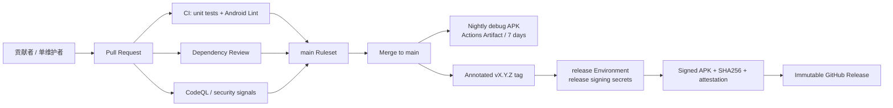

# GKD-SDP 开源项目基础设施标准化 Implementation Plan

> **For Codex:** REQUIRED SUB-SKILL: Use `superpowers:executing-plans` to implement this plan task-by-task；开始前使用 `superpowers:using-git-worktrees`，涉及工作流或脚本改动时使用 `superpowers:test-driven-development`，每个阶段结束前使用 `superpowers:requesting-code-review` 与 `superpowers:verification-before-completion`，准备合并时使用 `superpowers:finishing-a-development-branch`。不要把所有任务压成一个巨型提交；按本文的 PR/commit 边界推进，并在每次 GitHub Actions 失败后先读取日志、定位根因，再修改。

**Goal:** 在不引入付费平台、不增加不必要维护负担、不中断现有 Android 功能的前提下，把 GKD-SDP 建设成适合个人长期维护的标准开源项目：具备清晰治理、可用的 Issues/Discussions、稳定质量门禁、依赖与代码安全检查、独立版本号、不可覆盖的正式发布历史、可验证的 APK 来源，以及可恢复的发布与维护手册。

**Architecture:** 继续以 GitHub 作为唯一协作、CI/CD、安全告警和发布中心。Pull Request 进入统一 `CI` 工作流，经 JVM/Android 单元测试、Android Lint、构建和依赖审查后才能合并；`main` 只生成短期 Nightly Actions Artifact，不再移动 tag 或覆盖 Release；只有不可复用的 `vX.Y.Z[-prerelease]` tag 才能触发受 `release` Environment 隔离的签名发布，输出 APK、SHA-256 校验值和 GitHub provenance attestation。仓库治理采用“单维护者”模型，规则保护要求 PR 和自动检查，但审批数为 0，避免维护者被自己的规则锁死。

**Tech Stack:** GitHub Free（公开仓库）、GitHub Actions 标准 hosted runner、GitHub Rulesets、Issues、Discussions、Projects、Releases、Dependabot、Dependency Review、CodeQL default setup、Secret Scanning、Private Vulnerability Reporting、Artifact Attestations、GitHub CLI、Gradle/JDK 21、Android Lint、Kotlin/JUnit、GPL-3.0、Semantic Versioning 2.0、Keep a Changelog。

---

## 一、执行摘要

### 1. 当前项目并不是“完全没有 CI/CD”

截至 2026-08-02，审计基线为：

- 仓库：`wskeei/gkd-SDP`。
- 分支：`main`。
- 提交：`ce11d37279f3e77c93fa033f64d43d4b7707b82f`。
- 仓库为公开的个人账户 fork，来源是 `gkd-kit/gkd`。
- 已有 `.github/workflows/Verify-Merge.yml`：PR 上运行 selector/app 单元测试并构建多个 APK。
- 已有 `.github/workflows/Build-Apk.yml`：`main` 上构建签名 APK，但会强制移动 `latest` tag，并覆盖同一个预发布 Release。
- 已有 `.github/workflows/Build-Release.yml`：`v*` tag 能发布 APK，但没有独立版本校验、Android Lint、校验和、来源证明和不可变发布纪律。
- 最近的现有 Actions 能成功完成，所以应在现有基础上演进，不能推倒重写业务工程。

结论：项目已经有一条可工作的 CI/CD 雏形；主要缺口是治理、质量门禁、安全供应链和正式版本管理，而不是从零创建 Actions。

### 2. 当前最重要的缺口

| 领域 | 当前状态 | 风险 | 目标优先级 |
|---|---|---|---|
| 贡献入口 | Issues、Discussions 关闭；现有 Issue Form 指向上游 GKD | 用户无法正确反馈，问题容易流失到上游 | P0 |
| 社区文档 | 缺少 CONTRIBUTING、SECURITY、SUPPORT、GOVERNANCE、CODE_OF_CONDUCT、PRIVACY | 贡献、安全报告、维护权责和敏感权限说明不清 | P0 |
| 分支保护 | `main` 无 branch protection/ruleset | 可误推、强推、删除，CI 不能形成门禁 | P0 |
| Actions 权限 | 默认 `GITHUB_TOKEN` 为 write，工作流可批准 PR | 权限超出需要 | P0 |
| CI 质量 | 有单测和构建，但没有 Android Lint、依赖审查和稳定 required check | 编译通过不等于质量门禁完整 | P0 |
| 依赖安全 | Vulnerability alerts、Dependabot security updates 未启用 | 已知漏洞无法主动提醒 | P0 |
| 代码扫描 | 没有 CodeQL 分析 | Kotlin/Java 安全问题缺少静态扫描 | P1 |
| 发布历史 | `latest` tag 被强制移动且 Release 被覆盖 | Releases 页面永远像只有一个版本，资产不可追溯 | P0 |
| 应用版本 | `versionName = 1.12.1`、`versionCode = 92` 仍沿用上游 | SDP 自己的变化没有可识别版本 | P0 |
| 更新日志 | `CHANGELOG.md` 仍是上游单次发布文案和上游下载链接 | 无法描述 SDP 的历史和升级内容 | P0 |
| 许可证说明 | README 同时写 GPL-3.0 和“禁止商业用途” | GPL-3.0 允许商业使用，附加禁令造成法律表述冲突 | P0 |
| 文档一致性 | README 写 SDK 36，实际/README_DEV 写 SDK 37 | 构建说明漂移 | P1 |
| 发布密钥恢复 | Actions 中已有签名 secrets，但没有恢复手册和证书指纹校验 | 密钥丢失或替换后用户无法正常升级 | P0 |
| fork 来源管理 | 没有持久化 upstream remote/sync 手册 | 上游同步容易再次造成大范围回归 | P1 |

### 3. 采用的总体方案

采用“分阶段、GitHub 原生、零付费优先”方案：

1. 先补社区、法律、隐私和上游关系文档，开放正确的反馈入口。
2. 再统一 CI，加入 Lint、依赖审查、最小权限和稳定检查名称。
3. CI 首次成功后才启用 Ruleset，避免尚不存在的 required check 锁住 `main`。
4. 启用 Dependabot、CodeQL、漏洞提醒和私密漏洞报告。
5. 建立 GKD-SDP 独立版本源，停止覆盖 Release。
6. Nightly 只作为短期 Actions Artifact；正式 tag 才签名并发布到 Releases。
7. 最后发布 `v2.0.0-beta.1`，以真实发布演练验证整套流程。

### 4. 明确不采用的方案

- **不要求 1 名人工审批。** 仓库目前只有一个维护者，维护者不能有效地给自己的 PR 提供独立审批；设置为 1 会造成自锁。审批数设为 0，但必须经过 PR、自动检查并解决所有会话。
- **不引入 Sentry、SonarCloud、Codecov、Firebase Test Lab 或商业制品库。** 当前收益不足以抵消费用、隐私和维护负担。
- **不启用 Dependabot 自动合并。** 单人项目也必须看到依赖升级的测试结果和 breaking change。
- **不使用 stale bot 自动关闭真实问题。** 低流量个人项目不需要用机器人制造额外噪音。
- **不马上要求签名 commit/tag。** 先保护发布 APK 的签名密钥和 provenance；开发者 Git/GPG 密钥管理可在后续成熟后评估。
- **不立即加入 OpenSSF Scorecard Action。** 官方 action 当前明确不支持在 fork 仓库中运行；保留 fork 来源比为了一个分数/徽章解除 fork 更重要。
- **不迁移 GitHub Organization。** 目前只有一名维护者，个人仓库足够；等有可信共同维护者后再评估组织和第二管理员。
- **不为基础设施改造重写应用业务逻辑。** 除版本元数据、仓库/更新链接、测试和构建配置外，不修改数字自律、无障碍、悬浮窗、数据库和运行时行为。应用内更新必须改到 GKD-SDP 自己的 Releases，否则正式版本体系会和客户端更新入口互相矛盾。

---

## 二、目标仓库模型



### 1. 协作面

- Issues：只承载可复现 bug 和已经明确的工作项。
- Discussions：承载使用问答、想法讨论、规则交流和不确定的问题。
- Pull Requests：所有非紧急的 `main` 变更入口，包括维护者自己的改动。
- Projects：可选地维护一个轻量看板；不要求复杂 Sprint、Story Point 或多人流程。
- Security Advisories / Private Vulnerability Reporting：承载未公开安全漏洞，禁止先在公开 Issue 泄露。

### 2. 质量面

- `CI / quality`：selector JVM 测试、app 单元测试、Android Lint。
- `CI / build`：GKD debug、Play debug、GKD release 编译验证。
- `CI / dependency-review`：只在 PR 上审查新增依赖，阻止 high/critical 已知漏洞。
- CodeQL：使用 GitHub default setup，避免维护一份重复的 CodeQL workflow。
- Android instrumentation：先补有意义的测试，再使用每周/手动 Gradle Managed Device；不放到每个 PR 的第一阶段门禁。

### 3. 发布面

- Nightly：`main` 成功后构建 `GkdDebug`，使用 `.debug` applicationId 和 debug key；只保留为短期 Actions Artifact，不进入 Releases，不接触正式签名密钥。
- Prerelease：`v2.0.0-beta.1`、`v2.0.0-rc.1` 等不可复用 tag，进入 GitHub Releases 的 prerelease 历史。
- Stable：`v2.0.0`、`v2.0.1` 等不可复用 tag，成为稳定 Release。
- 每一个出现在 Releases 页面、供用户安装的更新都必须拥有唯一 `versionName`、递增 `versionCode`、对应 tag 和本版本更新说明；beta/rc 也不能复用同一个“最新版”条目。
- 已发布版本永不替换资产、永不移动 tag；有问题就发布新的 patch/prerelease，并在旧版本说明中标记已知问题。

---

## 三、成本与维护约束

| 能力 | 采用方式 | 预期直接费用 | 控制措施 |
|---|---|---:|---|
| CI/CD | GitHub Actions 标准 hosted runner，公开仓库 | 0 | 不使用 larger runner；设置 concurrency 和 timeout |
| 构建产物 | GitHub Actions Artifact | 0 起 | PR/Nightly 保留 7 天；不要永久上传每次完整 build 目录 |
| 正式安装包 | GitHub Releases | 0 | 仅 tag 发布，资产精简为 APK、校验值和必要说明 |
| 依赖升级 | Dependabot | 0 | 每周一次、限制开放 PR 数、分组 minor/patch |
| 漏洞扫描 | CodeQL、Dependency Review、Secret Scanning | 0（公开仓库） | 使用默认设置；不接第三方扫描 SaaS |
| 反馈与问答 | Issues、Discussions | 0 | Issue 用于工作，Discussion 用于支持，降低维护噪音 |
| 项目管理 | GitHub Projects（可选） | 0 | 只设 Todo/In progress/Done 三列 |
| 监控/遥测 | 不接入 | 0 | 默认不收集用户行为和无障碍内容 |

执行者还要在 GitHub Billing 中确认 Actions spending/budget 不允许意外使用付费 larger runner；本计划所有 workflow 必须使用 `ubuntu-latest` 标准 runner。

---

## 四、实施纪律与 PR 划分

### 1. 工作方式

1. 从最新 `origin/main` 创建隔离 worktree 和 `codex/` 前缀分支。
2. 不在脏工作树上覆盖用户改动。
3. 每个任务按“先写可失败验证或验收条件，再改实现，再验证”的顺序执行。
4. 本地环境不作为 Android 编译结论来源；本地只运行轻量静态检查。Gradle 的权威结果来自 GitHub Actions。
5. 每次推送后用 `gh pr checks --watch` 或 `gh run watch` 等待结果；失败时读取具体 job 日志，不允许仅靠猜测反复提交。
6. 所有 GitHub 仓库设置改动都要在文件型配置合并并成功运行之后进行。
7. 不读取、打印、下载或提交 secret 值；只检查 secret 名称是否存在。

### 2. 推荐分成四个 PR

| PR | 内容 | 何时合并 |
|---|---|---|
| PR A `codex/community-foundation` | 社区/治理/隐私/上游文档、Issue/PR 模板、README 修正 | 文档检查通过后 |
| PR B `codex/ci-security-foundation` | CI 重构、Lint、Dependency Review、Dependabot、权限收紧 | 新 CI 全绿后；随后启用 Ruleset/CodeQL |
| PR C `codex/versioned-releases` | 独立版本、CHANGELOG、Nightly/Release 工作流、发布手册 | 手动签名 dry-run 与 CI 全绿后 |
| PR D `codex/android-smoke-tests` | 有意义的 instrumentation tests 与每周 GMD | 可选，前三个阶段稳定后 |

如执行环境只能维护一个分支，也必须保持下文的独立 commit 边界，并在每个阶段推送一次、等待 Actions 全绿；不要把十几个文件一次性提交后再找问题。

---

## 五、Phase 0：建立可恢复基线

### Task 0：审计执行环境，不改仓库状态

**Files:** 无。

**Step 1: 创建隔离 worktree**

执行 `superpowers:using-git-worktrees`，确认 `.worktrees/` 已被忽略，然后基于最新 `origin/main` 创建 PR A 分支。

**Step 2: 记录只读基线**

```bash
git status --short --branch
git rev-parse HEAD
gh auth status
gh repo view wskeei/gkd-SDP \
  --json nameWithOwner,isFork,isPrivate,defaultBranchRef,hasDiscussionsEnabled,hasWikiEnabled,licenseInfo,url
gh api repos/wskeei/gkd-SDP/rulesets
gh api repos/wskeei/gkd-SDP/actions/permissions/workflow
gh api repos/wskeei/gkd-SDP/actions/permissions
gh release list --repo wskeei/gkd-SDP --limit 20
gh run list --repo wskeei/gkd-SDP --limit 20
```

把输出保存在会话记录或本机临时目录，不把账户信息/API 快照提交到仓库。

**Step 3: 记录需要保护的现状**

- Secret scanning 和 push protection 已启用，后续不得关闭。
- 现有 release signing secrets 名称为 `GKD_STORE_FILE_BASE64`、`GKD_STORE_PASSWORD`、`GKD_KEY_ALIAS`、`GKD_KEY_PASSWORD`；只确认名称，不显示值。
- 现有 `latest` prerelease/tag 暂时保留；任何删除、改 tag 都属于破坏性操作，必须在新发布完成后单独向仓库所有者确认。

**Verification:** 确认 worktree clean、`gh` 有仓库管理权限、当前 Actions 有成功基线。

**Commit:** 无。

---

## 六、Phase 1：社区、治理、法律与隐私基础（PR A）

### Task 1：建立单维护者治理和贡献文档

**Files:**

- Create: `CONTRIBUTING.md`
- Create: `CODE_OF_CONDUCT.md`
- Create: `SECURITY.md`
- Create: `SUPPORT.md`
- Create: `GOVERNANCE.md`
- Create: `PRIVACY.md`
- Create: `UPSTREAM.md`
- Create: `docs/releasing.md`
- Create: `docs/testing/release-smoke-checklist.md`
- Modify: `README.md`
- Modify: `README_DEV.md`
- Delete or Modify: `.github/FUNDING.yml`

**Step 1: 先写文档验收清单**

在提交前逐项确认：

- 新贡献者能从 `README.md` 找到构建、贡献、支持、安全和发布入口。
- 明确这是 GKD 的非官方 fork，当前 upstream base 是 `gkd-kit/gkd@v1.12.1`。
- 明确个人维护者 `@wskeei` 对路线、合并和发布有最终决定权。
- 明确没有响应时间 SLA；维护者可以基于时间和项目方向决定是否采纳。
- 明确安全漏洞不得先公开披露，使用 GitHub Private Vulnerability Reporting。
- 明确应用涉及 Accessibility、Overlay、Notification、Shizuku、屏幕内容/快照等高敏感权限。
- 隐私文档只描述代码审计能证明的行为，不能无依据写“完全不联网”或“绝不收集任何数据”。
- README 不再附加“禁止商业用途”；GPL-3.0 的权利和义务以 `LICENSE` 为准。

**Step 2: 编写 `CONTRIBUTING.md`**

至少包含：

- 先搜 Discussion/Issue；不确定是否是 bug 时先发 Discussion。
- Bug、功能请求、规则订阅问题和上游 GKD 问题的分流方式。
- 开发环境：JDK 21、Android SDK、Gradle Wrapper；本项目官方验证环境为 GitHub Actions。
- 分支命名、Conventional-style commit 示例，但不强制贡献者重写历史。
- PR 必须小而清晰、包含测试、更新相关文档/Room schema。
- 涉及无障碍、悬浮窗、通知、Shizuku、数据库迁移时需要的手工测试说明。
- 禁止在 Issue/日志中上传申请理由、网址、屏幕内容、账号、token、keystore 等敏感数据；上传前脱敏。
- GPL-3.0 贡献许可说明：提交贡献即表示有权按项目许可证提供该代码；当前不增加 CLA/DCO 门槛。

**Step 3: 编写 `CODE_OF_CONDUCT.md`**

- 采用 Contributor Covenant 2.1 的正文和归属链接，不自创模糊规则。
- 适用范围包括代码、Issue、Discussion、PR 和代表项目参与的公开空间。
- 当前由 `@wskeei` 执行处理；处罚采用纠正、警告、临时限制和永久限制的递进方式。
- 私密行为报告通过维护者 GitHub profile 中明确、可接收的私密联系方式提交；合并前必须确认该联系方式真实可用。不要要求受影响者在公开 Issue 描述骚扰细节，也不要滥用 Security Advisory 接收非安全事件。
- 不承诺固定处理时限，但承诺尽量保密、避免利益冲突并记录必要处置。

**Step 4: 编写 `GOVERNANCE.md`**

采用简单的 single-maintainer/BDFL 模型：

- `@wskeei` 是当前维护者和 release owner。
- 设计决策优先公开记录在 Issue/Discussion/PR。
- 贡献不保证合并；维护者按产品方向、风险、维护成本决定。
- 连续、可靠贡献者未来可以被邀请为 triager/maintainer，但没有自动晋升承诺。
- 紧急绕过 Ruleset 仅用于 CI 平台故障或严重安全修复，事后必须补 PR/Issue 和验证记录。
- 如果未来有第二名可信维护者，再评估 Organization、双人 review 和发布环境审批。

**Step 5: 编写 `SECURITY.md`**

包含：

- 支持策略：只支持最新 stable；最新 prerelease 仅 best-effort；旧版本不承诺修复。
- 报告方式：仓库 Security 页面中的 “Report a vulnerability”。
- 禁止公开提交 exploit、敏感日志和未修复漏洞。
- 期望报告内容：版本、Android 版本、运行模式、影响、复现、最小脱敏证据。
- 维护者流程：确认、私密协作、修复、发布新的不可变版本、再披露。
- 不承诺固定响应 SLA，但会尽力处理高影响问题。

**Step 6: 编写 `SUPPORT.md` 与 `PRIVACY.md`**

`SUPPORT.md` 说明：使用问题和不确定问题进入 Discussions，可复现产品 bug 进入 Issues，安全问题进入 private vulnerability reporting，第三方订阅规则问题联系规则维护者，上游 GKD 问题在确认与 SDP 无关后才转交上游。明确维护者 best-effort、没有免费技术支持 SLA。

`PRIVACY.md` 先审计再落文案：

先审计再落文案：

```bash
rg -n -i "firebase|analytics|crashlytics|sentry|telemetry|amplitude|mixpanel|posthog" .
rg -n "android.permission.(INTERNET|QUERY_ALL_PACKAGES|BIND_ACCESSIBILITY_SERVICE|SYSTEM_ALERT_WINDOW|POST_NOTIFICATIONS)" app/src
rg -n "https?://|wss?://" app/src/main README.md README_DEV.md
```

文档按以下结构写：

- 应用处理的数据类型：本机应用列表、规则/订阅、使用申请理由/记录、无障碍节点/快照、URL 规则、日志。
- 每类数据的用途、存储位置、何时可能离开设备（例如用户主动分享日志/快照、订阅更新、用户配置的服务器能力）。
- 权限用途与不开权限时的降级行为。
- `FLAG_SECURE` 只保护项目自己的安全 Overlay 区域，不能承诺所有 OEM 截图行为一致。
- 如何导出、清除应用数据、撤销系统权限。
- 项目默认不添加自有广告/行为分析 SDK；若审计发现已有上游网络行为，必须如实列出，不能笼统掩盖。
- 任何未来遥测都必须先公开设计、默认关闭、最小化数据并更新本文；本计划不实现遥测。

**Step 7: 编写 `UPSTREAM.md`**

记录：

- Upstream：`https://github.com/gkd-kit/gkd`。
- 当前基线：`v1.12.1`；GKD-SDP 不是上游官方版本。
- 上游 tag 和 SDP tag 的命名边界。
- 同步流程：添加 `upstream` remote、fetch tags、从 `main` 创建 `codex/upstream-vX.Y.Z`、先阅读 upstream changelog、merge 而非强制覆盖、处理冲突、运行完整 CI 和数字自律手工回归、通过 PR 合并。
- 严禁为了“同步干净”使用 `git reset --hard upstream/main` 覆盖 SDP 历史。
- 每次同步后更新 `UPSTREAM.md` 的 base 版本和日期。

**Step 8: 编写发布与设备验收手册骨架**

`docs/releasing.md` 此阶段先写角色、版本规则、密钥安全、回滚原则；具体命令在 PR C 补齐。

`docs/testing/release-smoke-checklist.md` 至少覆盖：

- 从上一稳定版升级安装，数据和 Room migration 正常。
- 冷启动、基础设置、订阅加载。
- Accessibility 与 Automation/Shizuku 两种运行模式。
- 使用申请、应用拦截、Self Control、URL 拦截、专注模式。
- 无障碍守护通知时间线、悬浮窗、自动重开、锁定模式。
- Android 13+ 通知权限与前台服务；悬浮窗权限拒绝路径。
- 使用申请理由倒计时条的 `FLAG_SECURE` 截图/录屏验证。
- 普通返回、Home、最近任务划走和系统 Force stop 的差异。
- 安装包签名证书指纹与预期一致。

明确哪些只能在真实设备验证；不要写成 CI 已覆盖。

**Step 9: 修正 README 和 FUNDING**

- SDK 文档统一为实际的 compile/target SDK 37。
- 免责声明改为：GPL-3.0 允许在遵守许可证的前提下使用、修改和再分发；项目不鼓励/不保证非法或绕过安全策略用途。不得用 README 创造与 GPL 冲突的非商业附加限制。
- 增加 `CONTRIBUTING.md`、`SECURITY.md`、`PRIVACY.md`、`SUPPORT.md`、`UPSTREAM.md`、Releases 的链接。
- `.github/FUNDING.yml` 当前指向上游维护者赞助地址。若仓库所有者没有明确想把 Sponsor 按钮交给上游，删除该配置，避免用户误以为款项支持 GKD-SDP；仍可在 README 致谢处保留上游赞助链接和清楚标注。不要擅自添加个人收款地址。

**Verification:**

```bash
git diff --check
rg -n "CONTRIBUTING|SECURITY|PRIVACY|SUPPORT|UPSTREAM|releases" README.md
rg -n "compileSdk.*37|targetSdk.*37|SDK 37" README.md README_DEV.md
! rg -n "禁止用于商业用途|禁止商业用途" README.md CONTRIBUTING.md
rg -n "Private Vulnerability|Report a vulnerability" SECURITY.md
```

人工检查所有链接直接指向 `wskeei/gkd-SDP` 或明确标注的 upstream，不得把用户误导到 `gkd-kit/gkd` 报告 SDP 问题。

**Commit:**

```bash
git add README.md README_DEV.md CONTRIBUTING.md CODE_OF_CONDUCT.md SECURITY.md SUPPORT.md GOVERNANCE.md PRIVACY.md UPSTREAM.md docs/releasing.md docs/testing/release-smoke-checklist.md .github/FUNDING.yml
git commit -m "docs: establish open source governance and support"
```

### Task 2：修复 Issue/PR 入口和所有权说明

**Files:**

- Modify: `.github/ISSUE_TEMPLATE/bug_report.yml`
- Modify: `.github/ISSUE_TEMPLATE/feature_request.yml`
- Modify: `.github/ISSUE_TEMPLATE/config.yml`
- Create: `.github/PULL_REQUEST_TEMPLATE.md`
- Create: `.github/CODEOWNERS`

**Step 1: 重写 Bug Form**

现有表单指向上游仓库并使用不存在的 `pending triage` label。改成 GKD-SDP 自己的入口，字段至少包含：

- GKD-SDP 版本和下载来源（Release/Nightly/self-build）。
- Android 版本、设备型号/ROM。
- 运行模式（Accessibility 或 Automation/Shizuku）。
- 相关权限状态（通知、悬浮窗、无障碍、Shizuku）。
- 影响的功能区域。
- 最小复现步骤、预期结果、实际结果、复现频率。
- 回归信息：上一版本是否正常。
- 脱敏日志/截图（根据问题需要，不应对所有问题强制要求原始敏感日志）。
- 醒目隐私提示：删除申请理由、URL、账号、屏幕文本、token 和密钥。

Label 使用实际存在或本任务将创建的 `bug`、`status: needs-triage`。

**Step 2: 重写 Feature Form**

字段包括问题场景、期望行为、为何现有功能不足、替代方案、权限/隐私/耗电影响、是否会改变锁定与退出语义。把模糊想法优先引导到本仓库 Discussions。

**Step 3: 修复 `config.yml`**

- `blank_issues_enabled: false`。
- Discussion 链接改为 `https://github.com/wskeei/gkd-SDP/discussions`。
- 上游规则/选择器问题可以单列清楚标注的 contact link，但不能把 SDP 功能 bug 推给上游。
- 增加私密安全报告链接到仓库 Security 页面。

**Step 4: 添加 PR 模板**

清单包含：

- 变更目的和范围。
- 对应 Issue/Discussion。
- 测试（JVM、Lint、Actions、真机）和未验证项。
- Android 权限/后台/电量影响。
- 数据库 migration/schema 影响。
- 隐私/日志影响。
- 截图或录屏是否包含敏感内容。
- 文档/CHANGELOG 是否更新。
- 明确“勾选不代表自动通过”，避免形式主义。

**Step 5: 添加 CODEOWNERS**

```text
* @wskeei
/.github/ @wskeei
/app/src/main/kotlin/li/songe/gkd/sdp/a11y/ @wskeei
/app/src/main/kotlin/li/songe/gkd/sdp/service/ @wskeei
/app/src/main/kotlin/li/songe/gkd/sdp/db/ @wskeei
```

CODEOWNERS 用于公开责任边界和通知，不在 Ruleset 中要求 code owner approval。

**Step 6: 创建精简标签集**

保留现有默认标签，不批量删除历史标签。通过 `gh label create --force` 创建/统一：

- `status: needs-triage`
- `status: blocked`
- `area: accessibility`
- `area: digital-self-discipline`
- `area: build-release`
- `area: upstream-sync`
- `priority: p0`
- `priority: p1`
- `priority: p2`

颜色和描述必须可读；Issue Form 中引用的每个 label 都必须实际存在。

**Verification:**

```bash
git diff --check
rg -n "wskeei/gkd-SDP" .github/ISSUE_TEMPLATE
! rg -n "gkd-kit/gkd/(issues|discussions|releases/latest)" .github/ISSUE_TEMPLATE
gh label list --repo wskeei/gkd-SDP --limit 100
```

**Commit:**

```bash
git add .github/ISSUE_TEMPLATE .github/PULL_REQUEST_TEMPLATE.md .github/CODEOWNERS
git commit -m "chore: add repository contribution templates"
```

### Task 3：合并 PR A 后启用正确的 GitHub 协作入口

**Files:** 无代码文件；GitHub repository settings。

**Step 1: 推送并创建 PR A**

```bash
git push -u origin codex/community-foundation
gh pr create --repo wskeei/gkd-SDP \
  --base main \
  --head codex/community-foundation \
  --title "docs: establish open source project foundation" \
  --body-file /tmp/gkd-sdp-community-pr.md
gh pr checks --repo wskeei/gkd-SDP --watch
```

合并前检查 Files changed，不得混入应用功能代码。

**Step 2: 合并后启用 Issues、Discussions 和自动删分支**

```bash
gh repo edit wskeei/gkd-SDP \
  --enable-issues \
  --enable-discussions \
  --delete-branch-on-merge
```

保持 Wiki 关闭，避免文档同时散落在 Git 和 Wiki；Projects 可保留开启但不强制使用。

**Step 3: 在网页验证**

- 新建 Issue 页面能看到两个表单和正确 contact links。
- Discussions 至少启用 `Announcements`、`Q&A`、`Ideas`、`General`；只有维护者在 Announcements 发帖。
- 创建一条欢迎 Discussion，说明问题分流和当前个人维护状态。
- 不创建虚假的 roadmap 日期或 SLA。

**Verification:**

```bash
gh repo view wskeei/gkd-SDP --json hasDiscussionsEnabled,issues,url
gh api repos/wskeei/gkd-SDP/contents/.github/ISSUE_TEMPLATE/bug_report.yml --jq .sha
```

---

## 七、Phase 2：CI、质量门禁与供应链安全（PR B）

### Task 4：把现有验证工作流整理成稳定 CI

**Files:**

- Create: `.github/workflows/ci.yml`
- Delete: `.github/workflows/Verify-Merge.yml`
- Modify if needed: Android Lint source/config files reported by first run
- Create only if justified by triage: `app/lint-baseline.xml`

**Step 1: 先定义稳定 job 名和失败预期**

Required checks 将依赖 job 名，因此一旦启用 Ruleset 后不要随意重命名：

- Workflow name：`CI`
- Job id/name：`quality`
- Job id/name：`build`
- Job id/name：`dependency-review`

先在 PR 中运行成功，再到 Ruleset 页面从“最近成功的 checks”选择真实 context；不要凭文档猜 context 字符串。

**Step 2: 创建 `ci.yml`**

要求：

- Trigger：`pull_request`、`push` 到 `main`、`workflow_dispatch`。
- Required CI 不使用 `paths-ignore`。否则 docs-only PR 可能不产生 required check，导致无法合并。
- `permissions: contents: read` 为全局默认。
- `concurrency` 按 PR number/ref 分组，`cancel-in-progress: true`。
- 每个 job 设置合理 `timeout-minutes`，例如 quality 30、build 40、dependency review 10。
- runner 只使用 `ubuntu-latest` 标准 runner。
- Checkout、setup-java、upload-artifact、dependency-review、Gradle actions 全部固定到完整 commit SHA，并在同一行注释可读版本，例如 `# v6.x.y`。
- 使用 JDK 21 和 Gradle Wrapper。
- 继续使用 `gradle/actions/setup-gradle`；官方 action 已包含 Gradle Wrapper validation，不再叠加已废弃/重复的 wrapper validation action。
- PR CI 不依赖 `GRADLE_CACHE_ENCRYPTION_KEY` secret，确保外部 fork PR 也能运行。
- `quality` 执行：

```bash
./gradlew --stacktrace \
  :selector:jvmTest \
  :app:testGkdDebugUnitTest \
  :app:lintGkdDebug \
  :app:lintPlayDebug
```

- `build` 依赖 `quality`，执行：

```bash
./gradlew --stacktrace \
  :app:assembleGkdDebug \
  :app:assemblePlayDebug \
  :app:assembleGkdRelease
```

这里的 PR `GkdRelease` 只是 R8/资源/编译验证；没有 release Environment secrets 时，不能把它称为可信正式签名包。

- `quality` 在 `if: always()` 下上传 test/lint 报告；`build` 上传 APK。Artifact retention 为 7 天，`if-no-files-found` 根据预期选择 `error` 或 `warn`，不能静默吞掉应有 APK。
- Artifact 名包含 run number/commit，避免重跑冲突。

**Step 3: 让 Android Lint 先真实失败，再处理**

第一次 PR run 不预设 baseline。读取所有 lint errors：

1. 新引入/明确错误直接修复。
2. 对权限、无障碍、前台服务、PendingIntent、Compose 状态等高风险项不能 baseline 掉。
3. 若上游遗留 warning 数量极大，才生成 `app/lint-baseline.xml`；在 PR 中说明数量、主要类别，并创建 `technical debt` Issue。
4. 禁止通过 `abortOnError = false`、全局 disable lint 或只运行一个无关 variant 伪造绿色。

**Step 4: 删除旧 workflow**

新 `ci.yml` 能覆盖旧 `Verify-Merge.yml` 后删除旧文件，避免每个 PR 重复构建和浪费 Actions 时间。

**Verification:**

```bash
git diff --check
rg -n "name: CI|quality:|build:|dependency-review:" .github/workflows/ci.yml
rg -n "lintGkdDebug|lintPlayDebug|testGkdDebugUnitTest|selector:jvmTest" .github/workflows/ci.yml
! rg -n "paths-ignore" .github/workflows/ci.yml
! rg -n "uses: [^#\n]+@(v|main|master|latest)" .github/workflows
```

推送 PR B 的第一个 commit，等待 GitHub Actions；只有 `quality`、`build` 都成功才继续。

**Commit:**

```bash
git add .github/workflows/ci.yml .github/workflows/Verify-Merge.yml app/lint-baseline.xml
git commit -m "ci: establish stable Android quality checks"
```

### Task 5：添加 Dependency Review、Dependabot 与 dependency graph submission

**Files:**

- Modify: `.github/workflows/ci.yml`
- Create: `.github/dependabot.yml`
- Create: `.github/workflows/dependency-graph.yml`

**Step 1: 添加 PR Dependency Review job**

- 只在 `pull_request` 执行。
- 使用 GitHub 官方 `actions/dependency-review-action`，固定完整 SHA。
- 最低失败阈值设为 `high`；critical 当然也会失败。
- 第一阶段不设置许可证黑名单。Android/Kotlin 依赖许可证兼容性需要单独审计，不能随便列 deny list 造成误报。
- job 只需要 `contents: read`。

**Step 2: 添加每周 Dependabot**

`.github/dependabot.yml` 配置两个 ecosystem：

- `gradle`，目录 `/`，每周一次，Asia/Shanghai 工作时段，开放 PR 上限 5。
- `github-actions`，目录 `/`，每周一次，开放 PR 上限 3。
- minor/patch 可以各自按 ecosystem 分组；major 保持独立以便人工评估。
- PR label 使用实际存在的 `dependencies`（若没有则创建）和 `area: build-release`。
- 不配置 auto-merge，不一次性忽略所有 major。

**Step 3: 添加最小权限 dependency submission**

`dependency-graph.yml` 只在以下情况运行：

- `workflow_dispatch`。
- `main` 上 Gradle manifest/wrapper/version catalog 变化。

使用官方 `gradle/actions/dependency-submission` 并固定 SHA；只有这个 job 授予 `contents: write`，其他 workflow 继续 read-only。设置 concurrency 和 timeout。

**Step 4: 验证 fork/Dependabot 行为**

- Dependabot PR 不应获得 release signing secrets。
- PR build 不需要 secrets。
- dependency submission 只在 trusted `main` commit 上运行，不在 fork PR 上授予 write。

**Verification:**

```bash
git diff --check
rg -n "package-ecosystem: (gradle|github-actions)|open-pull-requests-limit|groups:" .github/dependabot.yml
rg -n "dependency-review-action|fail-on-severity" .github/workflows/ci.yml
rg -n "permissions:|contents: write|dependency-submission" .github/workflows/dependency-graph.yml
```

GitHub Actions 全绿后，在仓库 Insights/Dependency graph 检查 Gradle 依赖已提交。

**Commit:**

```bash
git add .github/dependabot.yml .github/workflows/ci.yml .github/workflows/dependency-graph.yml
git commit -m "ci: add dependency security automation"
```

### Task 6：固定 Actions 供应链并收紧 token 权限

**Files:**

- Modify: `.github/workflows/ci.yml`
- Modify: `.github/workflows/dependency-graph.yml`
- Modify: `.github/workflows/Build-Apk.yml`
- Modify: `.github/workflows/Build-Release.yml`
- Modify: `docs/releasing.md`

**Step 1: 审计所有 action 来源**

```bash
rg -n "uses:" .github/workflows
```

只保留 GitHub 官方 actions、GitHub security actions 和 Gradle 官方 actions。PR C 会移除 `softprops/action-gh-release`，改用 runner 预装的 GitHub CLI；在那之前先固定其完整 SHA，不能继续用浮动 `@v2`。

完整 SHA 必须从 action 官方 release/tag 解析并核对 owner，不能复制搜索结果中的随机 SHA。Dependabot 的 GitHub Actions updater 后续负责更新 pin。

**Step 2: 收紧仓库默认 workflow permission**

PR B 合并且现有 workflow 已显式声明权限后执行：

```bash
gh api --method PUT repos/wskeei/gkd-SDP/actions/permissions/workflow \
  -f default_workflow_permissions=read \
  -F can_approve_pull_request_reviews=false
```

每个需要写权限的 workflow/job 单独声明，不通过仓库默认 write 偷渡。

**Step 3: 限制可使用的 Actions**

先确认所有 workflow 只使用 `actions/*`、`github/*`/CodeQL 内建能力和 `gradle/actions/*`，再在 Actions settings 选择：

- Allow actions created by GitHub。
- Allow verified creators（Gradle）。
- 不允许任意未经核对 action。

如果设置后 workflow 立即报 “action is not allowed”，先恢复到允许所有 actions，核对精确 allowlist 后再启用；不得为了绕过而把 action 复制到仓库。

**Step 4: 确认 secrets 边界**

- PR、Dependabot、CodeQL、Nightly 不读取正式签名 secrets。
- 只有 release workflow 的 `release` job 读取签名 secrets。
- Workflows 不使用 `pull_request_target` checkout 未受信代码。
- 禁止把密码写入 artifact、日志、`$GITHUB_OUTPUT` 或仓库内 `gradle.properties`。

**Verification:**

```bash
gh api repos/wskeei/gkd-SDP/actions/permissions/workflow
rg -n "^permissions:|permissions:" .github/workflows
! rg -n "pull_request_target" .github/workflows
! rg -n "uses: [^#\n]+@(v|main|master|latest)" .github/workflows
```

**Commit:**

```bash
git add .github/workflows docs/releasing.md
git commit -m "ci: pin actions and enforce least privilege"
```

### Task 7：启用 GitHub 原生安全功能

**Files:** GitHub settings；已有 `SECURITY.md`。

**Step 1: 合并 PR B 前先保证新 CI 全绿**

```bash
git push -u origin codex/ci-security-foundation
gh pr create --repo wskeei/gkd-SDP --base main --head codex/ci-security-foundation \
  --title "ci: add quality and security foundation" \
  --body-file /tmp/gkd-sdp-ci-pr.md
gh pr checks --repo wskeei/gkd-SDP --watch
```

**Step 2: 合并后启用漏洞能力**

```bash
gh api --method PUT repos/wskeei/gkd-SDP/vulnerability-alerts
gh api --method PUT repos/wskeei/gkd-SDP/automated-security-fixes
gh api --method PUT repos/wskeei/gkd-SDP/private-vulnerability-reporting
```

保持 Secret scanning 和 Push protection 开启。

**Step 3: 启用 CodeQL default setup**

在 GitHub `Settings → Code security` 中为 Java/Kotlin 启用 CodeQL default setup，使用 default query suite。也可以使用当时官方 API，但执行前必须按当前 GitHub API 文档确认字段，不要把过时 payload 写进自动脚本。

第一轮扫描：

- 0 个 high/critical：可以在 Ruleset 中要求 CodeQL high+ 通过。
- 有告警：先逐项确认 true/false positive；高影响问题通过私密 advisory/修复 PR 处理。在基线未清理前不要简单关闭扫描或批量 dismiss。

**Step 4: 验证**

```bash
gh api repos/wskeei/gkd-SDP/vulnerability-alerts --include
gh api repos/wskeei/gkd-SDP/private-vulnerability-reporting
gh api repos/wskeei/gkd-SDP/code-scanning/default-setup
gh api repos/wskeei/gkd-SDP/code-scanning/alerts --paginate
```

预期：安全功能开启、CodeQL 有成功分析、Dependabot Security Updates 打开。

---

## 八、Phase 3：独立版本与不可覆盖发布（PR C）

### Task 8：建立 GKD-SDP 独立版本源

**Files:**

- Create: `gradle/version.properties`
- Modify: `app/build.gradle.kts`
- Create: `scripts/verify-release-metadata.sh`
- Create: `scripts/test-verify-release-metadata.sh`
- Modify: `README_DEV.md`
- Modify: `UPSTREAM.md`

**Version decision:** 首个 GKD-SDP 版本采用 `2.0.0-beta.1`，`versionCode = 93`。

理由：

- 当前公开安装包使用上游 `versionName 1.12.1`、`versionCode 92`。
- 从 `1.0.0` 开始会在用户界面看起来像“降级”，虽然 Android 真正按 versionCode 判断升级。
- `2.0.0` 清楚表达产品已经从上游自动点击工具扩展成数字自律 fork。
- beta 阶段允许先验证新发布流程和升级兼容性，再发布 `2.0.0` stable。
- Upstream 版本以后单独记录为 `upstreamBase=1.12.1`，不再冒充产品版本。

**Step 1: 先为 release metadata verifier 写失败测试**

`scripts/test-verify-release-metadata.sh` 至少验证：

1. tag 与 `versionName` 相同通过。
2. tag 不匹配失败。
3. `versionCode` 非正整数失败。
4. CHANGELOG 缺少对应版本标题失败。
5. 相对上一 GKD-SDP tag 的 `versionCode` 没有增加时失败。
6. 上游 `v1.x` tags 不应被当成上一 GKD-SDP 发布；只比较 `v2.*` 或未来明确的 SDP 版本范围。

测试使用临时 git repo/fixture，不修改真实 tags 和 CHANGELOG。

**Step 2: 添加版本文件**

```properties
versionName=2.0.0-beta.1
versionCode=93
upstreamBase=1.12.1
```

`app/build.gradle.kts` 使用 `java.util.Properties` 读取并严格校验：

- versionName 非空。
- versionCode 是正整数。
- 不再在多个 workflow/README 中硬编码产品版本。
- 保留非 tag 构建的 commit suffix 行为。
- Release workflow 额外保证 exact tag 是 `v${versionName}`；不能只依赖 `git describe` 恰好找到任意 upstream tag。

**Step 3: 实现 verifier**

`scripts/verify-release-metadata.sh` 提供：

- `--tag <tag>`：发布时必填并检查。
- `--no-tag`：普通 CI 检查 properties 和 CHANGELOG 结构。
- 错误信息指出实际值、期望值和修复文件。
- 不访问 secrets，不写仓库。
- 兼容 GitHub Ubuntu runner 的 Bash；使用 `set -euo pipefail`。

**Step 4: 运行脚本测试**

```bash
bash scripts/test-verify-release-metadata.sh
bash scripts/verify-release-metadata.sh --no-tag
```

预期先看到错误用例失败，再看到测试套件整体成功。

**Commit:**

```bash
git add gradle/version.properties app/build.gradle.kts scripts/verify-release-metadata.sh scripts/test-verify-release-metadata.sh README_DEV.md UPSTREAM.md
git commit -m "build: establish independent SDP version metadata"
```

### Task 9：重建 CHANGELOG 与 release notes 分类

**Files:**

- Modify: `CHANGELOG.md`
- Create: `.github/release.yml`
- Modify: `docs/releasing.md`

**Step 1: 改成 Keep a Changelog 结构**

结构：

```markdown
# Changelog

All notable changes to GKD-SDP are documented in this file.

## [Unreleased]

### Added

### Changed

### Fixed

### Security

## [2.0.0-beta.1] - YYYY-MM-DD
...
```

规则：

- 不伪造不存在的历史 SDP Releases。
- `2.0.0-beta.1` 作为“从 upstream GKD v1.12.1 分化以来的首个 SDP 版本”汇总已合并功能和修复。
- 内容必须根据 git log、已合并 PR 和实际代码整理；不能复制旧的上游“更新方式/下载链接”。
- 添加 `[Unreleased]`、版本 compare/link definitions。
- 每个用户可感知功能只写一次，技术细节链接到 PR。

**Step 2: 添加 `.github/release.yml`**

为 GitHub generated notes 配置最小分类：

- Breaking Changes
- Features
- Fixes
- Security
- Documentation
- Dependencies
- Other Changes

按实际 labels 映射，排除 `duplicate`、`invalid`、`wontfix` 和纯内部无发布意义 label。正式 workflow 的 release body 以 CHANGELOG 版本段为主，generated notes 可作为 PR 列表补充，不能把整个 CHANGELOG 塞进每个 Release。

**Step 3: 补全 `docs/releasing.md`**

定义：

- SemVer major/minor/patch/prerelease 规则。
- `versionCode` 每次发布严格增加，任何回滚也不能复用旧值。
- release branch/PR → CI → merge main → annotated tag → Actions → draft → publish。
- 发布失败如何处理；tag 尚未发布且未公开时可删除重建，已发布 tag/asset 永不替换。
- stable/prerelease 支持策略。
- Upstream base 与产品版本分别维护。

**Verification:**

```bash
git diff --check
bash scripts/verify-release-metadata.sh --no-tag
rg -n "Unreleased|2.0.0-beta.1|Added|Changed|Fixed|Security" CHANGELOG.md
! rg -n "gkd.li/guide|play.google.com/store/apps/details\?id=li.songe.gkd" CHANGELOG.md
```

**Commit:**

```bash
git add CHANGELOG.md .github/release.yml docs/releasing.md
git commit -m "docs: start versioned SDP changelog"
```

### Task 10：让应用内版本、仓库链接和检查更新指向 GKD-SDP

**Confirmed current problem:**

- `AboutPage` 已经显示 `META.versionName`/`META.versionCode`，接入新的 Gradle 版本源后无需另做一套 UI。
- 但 `UpdateChannelOption` 仍从 `@gkd-kit/app`、`@gkd-kit/app-beta` 的 npm mirror 获取上游版本。
- `REPOSITORY_URL`、`ISSUES_URL` 和 `AppMeta.commitUrl` 仍指向 `gkd-kit/gkd`。
- 如果只改 GitHub Releases 而不改这些入口，用户可能从 GKD-SDP 内收到上游 GKD 安装包，问题反馈和 commit 链接也会跳错仓库。

**Files:**

- Modify: `app/src/main/kotlin/li/songe/gkd/sdp/util/Constants.kt`
- Modify: `app/src/main/kotlin/li/songe/gkd/sdp/App.kt`
- Modify: `app/src/main/kotlin/li/songe/gkd/sdp/util/Option.kt`
- Modify: `app/src/main/kotlin/li/songe/gkd/sdp/util/Upgrade.kt`
- Create: `app/src/main/kotlin/li/songe/gkd/sdp/util/GitHubReleaseUpdateSource.kt`
- Create: `app/src/test/kotlin/li/songe/gkd/sdp/util/GitHubReleaseUpdateSourceTest.kt`
- Create: `scripts/generate-update-manifest.sh`
- Create: `scripts/test-generate-update-manifest.sh`
- Modify: `docs/releasing.md`
- Modify: `PRIVACY.md`

**Step 1: 先写更新源解析测试**

使用固定 JSON fixtures，不在 JVM test 中访问真实 GitHub。至少覆盖：

1. Stable channel 只选择最新 non-draft、non-prerelease Release。
2. Beta channel 选择最新 non-draft Release，可以是 prerelease 或 stable。
3. 忽略 draft、缺少 `update.json` 资产的 Release。
4. 正确解析 tag、APK/manifest 的 `browser_download_url`、asset size/digest 和 manifest。
5. manifest 的 versionCode/versionName/fileSize/SHA-256 非法时失败。
6. 当前 versionCode 不低于远端时返回“无更新”。
7. API rate limit、404、空列表和 malformed JSON 返回可理解错误，不崩溃。
8. 不接受非 HTTPS 或不属于预期 GitHub Release 的下载链接。

先运行测试，确认它因 source 尚未实现而失败。

**Step 2: 定义 GitHub-native update manifest**

每个正式 Release 附带一个 `update.json`：

```json
{
  "versionCode": 93,
  "versionName": "2.0.0-beta.1",
  "changelog": "本版本更新说明",
  "downloadUrl": "https://github.com/wskeei/gkd-SDP/releases/download/v2.0.0-beta.1/gkd-sdp-v2.0.0-beta.1.apk",
  "fileSize": 12345678,
  "sha256": "<64 lowercase hex characters>",
  "versionLogs": [
    {
      "name": "2.0.0-beta.1",
      "code": 93,
      "desc": "本版本更新说明"
    }
  ]
}
```

`scripts/generate-update-manifest.sh` 从 `gradle/version.properties`、提取后的 CHANGELOG、本次 APK 文件大小、APK SHA-256 和可预测 Release URL 生成该文件。测试验证 JSON 转义、空更新说明、错误 tag、缺失 APK、file size 和 SHA-256。

不要手写两份版本号；manifest 必须由 workflow 从同一个版本源生成。

**Step 3: 实现 GitHub Releases 更新源**

- API endpoint：`https://api.github.com/repos/wskeei/gkd-SDP/releases`。
- Stable 选择最新非 prerelease；Beta 选择最新可见版本（包含 stable/prerelease）。
- 从目标 Release assets 中寻找准确名称 `update.json`，再解析现有 `NewVersion` 模型。
- 同时找到 manifest 指向的 APK asset；当 GitHub API 返回 asset `size`/`digest` 时，必须与 manifest 的 fileSize/SHA-256 一致，防止错误资产组合。
- 请求设置 GitHub 推荐 `Accept` 和可识别 `User-Agent`，不在 APK 中内置 GitHub token。
- 继续保留当前一天一次的自动检查节流；手动检查遇到 API rate limit 时显示清楚错误和 Releases 备用链接。
- 下载 APK 前验证 HTTPS、预期仓库/tag/文件名；下载完成后核对实际 byte count 和 SHA-256，不一致就删除临时文件并拒绝安装。最终 APK 仍由 Android Package Installer 验证签名，哈希不能取代 APK 签名。
- `PRIVACY.md` 如实写明“检查更新会访问 GitHub API/Release asset”。

GitHub API 是本计划采用的免费原生来源。不要为 update JSON 新建付费服务器、npm 包或第三方镜像；如果中国大陆网络可用性后续确实成为问题，再以独立 Issue 评估免费镜像和供应链风险。

**Step 4: 修正仓库身份链接**

- `REPOSITORY_URL = "https://github.com/wskeei/gkd-SDP"`。
- `ISSUES_URL` 随之进入本仓库。
- 如仍需在 UI 中展示上游，新增命名清楚的 `UPSTREAM_REPOSITORY_URL`，不能复用产品仓库常量。
- `AppMeta.commitUrl` 指向 GKD-SDP 的 tag/commit。
- 保留源码注释中用于解释 bug 的历史上游 Issue 链接；不要机械替换那些溯源链接。

**Step 5: 验证 About/Crash/Update UI**

- About 页显示 `2.0.0-beta.1 (93)` 或现有布局中的等价信息。
- “问题反馈”与 crash report 跳转 `wskeei/gkd-SDP/issues`。
- commit/tag 链接进入 GKD-SDP。
- Stable 用户看不到 prerelease；Beta 用户能看到最新 beta/rc/stable。
- 更新弹窗展示对应 Release 的更新说明，而不是整个 CHANGELOG。
- 相同/更低 versionCode 不提示升级。

**Verification:**

```bash
bash scripts/test-generate-update-manifest.sh
./gradlew :app:testGkdDebugUnitTest --tests '*GitHubReleaseUpdateSourceTest'
rg -n "wskeei/gkd-SDP" app/src/main/kotlin/li/songe/gkd/sdp/util/Constants.kt app/src/main/kotlin/li/songe/gkd/sdp/App.kt
! rg -n "@gkd-kit/app(-beta)?/latest" app/src/main/kotlin/li/songe/gkd/sdp
```

本地无 Android/JDK 环境时只运行 shell 测试；Gradle 测试必须由 PR GitHub Actions 提供成功证据。

**Commit:**

```bash
git add app/src/main/kotlin/li/songe/gkd/sdp/util/Constants.kt app/src/main/kotlin/li/songe/gkd/sdp/App.kt app/src/main/kotlin/li/songe/gkd/sdp/util/Option.kt app/src/main/kotlin/li/songe/gkd/sdp/util/Upgrade.kt app/src/main/kotlin/li/songe/gkd/sdp/util/GitHubReleaseUpdateSource.kt app/src/test/kotlin/li/songe/gkd/sdp/util/GitHubReleaseUpdateSourceTest.kt scripts/generate-update-manifest.sh scripts/test-generate-update-manifest.sh docs/releasing.md PRIVACY.md
git commit -m "feat: use GKD-SDP releases for app updates"
```

### Task 11：把覆盖式 `latest` Release 改成短期 Nightly Artifact

**Files:**

- Create: `.github/workflows/nightly.yml`
- Delete: `.github/workflows/Build-Apk.yml`
- Modify: `README.md`
- Modify: `docs/releasing.md`

**Step 1: 写 Nightly 的验收条件**

- `main` 代码变化或手动触发时运行。
- 权限只有 `contents: read`。
- 不读取 release signing secrets。
- 不创建、不移动、不强推任何 tag。
- 不创建或覆盖 GitHub Release。
- 构建 `GkdDebug`，其 applicationId 为 debug variant，避免和稳定签名包混淆。
- Artifact 名包含短 SHA/run number，保留 7 天。
- 构建前运行 `scripts/verify-release-metadata.sh --no-tag`；质量测试由 main CI 提供，Nightly 可只构建，避免同一提交重复运行完整测试。如果 GitHub 的 job 依赖不能跨 workflow，README 明确 Nightly 不等于 stable release。

**Step 2: 实现并删除覆盖逻辑**

删除以下行为：

- `git tag -f latest`。
- `git push -f origin latest`。
- `softprops/action-gh-release` 的 `overwrite_files`。
- main push 上的正式 signing secret 解码。

`nightly.yml` 使用 pinned GitHub/Gradle actions，concurrency 和 timeout 与 CI 一致。

**Step 3: 文档标识**

- README 的 Nightly 链接指向 Actions workflow，不把它叫“最新版正式版”。
- Releases 页面只用于不可覆盖的 tagged releases。
- 旧 `latest` prerelease 暂时保留，标记为历史自动快照；本任务不删除它。

**Verification:**

```bash
git diff --check
! rg -n "git tag -f|git push -f|overwrite_files|GKD_STORE_FILE_BASE64" .github/workflows/nightly.yml
! rg -n "softprops/action-gh-release" .github/workflows
rg -n "assembleGkdDebug|retention-days: 7|contents: read" .github/workflows/nightly.yml
```

**Commit:**

```bash
git add .github/workflows/nightly.yml .github/workflows/Build-Apk.yml README.md docs/releasing.md
git commit -m "ci: replace mutable latest release with nightly artifacts"
```

### Task 12：建立可验证的正式 Release workflow

**Files:**

- Create: `.github/workflows/release.yml`
- Delete: `.github/workflows/Build-Release.yml`
- Modify: `docs/releasing.md`
- Modify: `docs/testing/release-smoke-checklist.md`

**Step 1: 支持安全 dry-run**

Workflow triggers：

- `push.tags: ['v[0-9]*']`：真实发布。
- `workflow_dispatch`：只做签名构建/校验并上传短期 Artifact，默认 `publish=false`；手动触发永远不能在没有明确 tag 的情况下创建 Release。

配置 `environment: release`。Workflow 默认 `contents: read`，只有真实发布 job 具有：

- `contents: write`
- `id-token: write`
- `attestations: write`

**Step 2: 发布前置检查**

按顺序执行：

1. Checkout full history/tags。
2. JDK 21、Gradle setup。
3. `bash scripts/test-verify-release-metadata.sh`。
4. Tag 发布时执行 `bash scripts/verify-release-metadata.sh --tag "$GITHUB_REF_NAME"`；dry-run 执行 `--no-tag`。
5. 运行 selector/app 单测和两个 flavor 的 Lint。
6. 检查 tag 所指 commit 已包含于 `origin/main`；不允许从未合并 feature commit 发布。
7. 检查同名 GitHub Release 不存在；禁止 overwrite。

**Step 3: 隔离签名材料**

- Keystore 写入 `$RUNNER_TEMP`，不写 workspace。
- Gradle signing properties 写入 runner 临时文件或仅当前进程可读位置。
- `umask 077`，不打印 secret。
- 缺少任何 secret 立即失败。
- `if: always()` 清理临时 keystore/properties。
- 不上传 keystore、properties、密码或完整构建目录。

**Step 4: 构建、验签并生成 update manifest**

```bash
./gradlew --stacktrace :app:assembleGkdRelease
```

然后使用 Android SDK `apksigner verify --verbose --print-certs`：

- APK 签名有效。
- 证书 SHA-256 与 repository/environment variable `RELEASE_CERT_SHA256` 相同。
- 文件名是 `gkd-sdp-v2.0.0-beta.1.apk` 形式。
- 调用 `scripts/generate-update-manifest.sh` 生成 `update.json`，其中 versionName/versionCode、APK URL、file size 和本版本更新说明都来自单一可信输入。
- 生成 `SHA256SUMS.txt`，包含 APK 和 `update.json`。

证书指纹不是密码，可以写进 `docs/releasing.md`；仍要由所有者从可信本机/已发布 APK 独立核对一次。

**Step 5: 生成 release notes**

脚本从 `CHANGELOG.md` 精确提取当前版本段。提取不到、内容为空或混入下一版本标题时失败。不要把完整 CHANGELOG 作为 body。

**Step 6: 创建 provenance attestation**

使用 GitHub 官方 `actions/attest-build-provenance`（完整 SHA pin）为签名 APK 和/或 checksum 生成 attestation。发布后必须能执行：

```bash
gh attestation verify gkd-sdp-v2.0.0-beta.1.apk \
  --repo wskeei/gkd-SDP
sha256sum --check SHA256SUMS.txt
```

**Step 7: Draft-first 发布**

用 runner 已安装的 `gh`，不再依赖第三方 release action：

1. `gh release create <tag> --draft --verify-tag --notes-file ...`。
2. 上传 APK、`update.json` 和 `SHA256SUMS.txt`。
3. prerelease tag 使用 `--prerelease`；stable 才设置 latest。
4. 所有上传成功后再把 draft 发布。
5. 任一步失败保留 draft 供维护者检查，不强行覆盖资产；修正前删除 draft 需要明确确认。

**Step 8: 设置 Artifact retention**

Workflow 内部调试产物最多 7～14 天；正式资产长期留在 Release。不要上传 `app/build/outputs` 全量 ZIP。

**Verification:**

```bash
git diff --check
rg -n "workflow_dispatch|push:|tags:|environment: release" .github/workflows/release.yml
rg -n "attest-build-provenance|SHA256SUMS|update.json|apksigner|verify-release-metadata" .github/workflows/release.yml
! rg -n "overwrite|git push -f|softprops/action-gh-release" .github/workflows/release.yml
! rg -n "uses: [^#\n]+@(v|main|master|latest)" .github/workflows/release.yml
```

**Commit:**

```bash
git add .github/workflows/release.yml .github/workflows/Build-Release.yml docs/releasing.md docs/testing/release-smoke-checklist.md
git commit -m "ci: publish verifiable immutable releases"
```

### Task 13：建立 release Environment 和密钥恢复机制

**Files:**

- Modify: `docs/releasing.md`
- Create: `docs/maintenance/recovery-runbook.md`

**Step 1: 创建 GitHub Environment**

在 `Settings → Environments` 创建 `release`：

- 只允许符合 `v*` 的发布 tag/受保护分支部署。
- 当前不要求 reviewer，因为只有一个维护者；否则会自锁。
- 将四个 signing secrets 复制为 environment secrets。
- 添加 `RELEASE_CERT_SHA256` environment/repository variable。

不要先删除 repository secrets。先做一次 workflow_dispatch signed dry-run，确认 Environment 中的 secrets 可用且指纹一致；成功后再请求仓库所有者确认是否删除旧 repository-level copies。

**Step 2: 离线恢复**

`docs/maintenance/recovery-runbook.md` 只记录操作，不记录秘密：

- Keystore 至少有两个加密离线副本，位于不同介质/位置。
- 密码存入可靠的本地密码管理器，不放 GitHub Issue、Actions artifact 或仓库。
- 记录 alias、创建日期、证书 SHA-256、最近一次恢复演练日期；不记录密码。
- 保存 GitHub 2FA recovery codes，确认账户恢复方式。
- 每季度在离线临时目录验证 keystore 可读取并与指纹匹配，完成后安全删除临时文件。
- Keystore 丢失不能靠重新生成修复已安装用户的升级签名；必须视为最高优先级资产。

**Step 3: 发布 dry-run**

从已合并 PR C 的 `main` 手动触发 release workflow，`publish=false`：

- signed APK 构建成功。
- `apksigner` 指纹匹配。
- Artifact 可下载但没有创建 Release/tag。
- 日志不出现 base64、password、alias secret 内容。

**Verification:** 查看 Actions 日志和 Environment deployment 记录；只报告 secret 是否存在，不回显值。

**Commit:**

```bash
git add docs/releasing.md docs/maintenance/recovery-runbook.md
git commit -m "docs: add release key recovery runbook"
```

---

## 九、Phase 4：主分支规则和仓库设置

### Task 14：为单维护者启用不会自锁的 main Ruleset

**Files:**

- Create: `docs/maintenance/github-settings.md`
- GitHub repository ruleset/settings

**Step 1: 先记录目标设置**

`docs/maintenance/github-settings.md` 记录以下期望状态和审计命令，但不包含 token/secret：

- Default branch：`main`。
- Merge commit：允许，保留定期提交历史。
- Squash：可允许给外部单提交/杂乱提交 PR。
- Force push：禁止。
- Branch deletion：禁止。
- Required PR：是。
- Required approvals：0。
- Dismiss stale approvals/code owner approval/last push approval：不要求。
- Resolve conversations：要求。
- Required checks：从最近成功 PR 中选择 `CI / quality`、`CI / build`、`CI / dependency-review` 的真实名称。
- Require branch up to date：是。
- CodeQL：首次基线清理后要求 high/critical 不存在。
- Require linear history：否。
- Signed commits：暂不要求。
- Admin bypass：仅 pull-request bypass/emergency；不作为日常直推方式。

**Step 2: 安全顺序**

1. 确认 PR B 已合并且新 CI 在 `main` 成功至少一次。
2. 确认 PR C 的分支能产生同名 checks。
3. 创建 Ruleset 时先保存为 disabled（若当前 UI/API支持），核对目标只包含 default branch。
4. 激活后用一个只改文档的测试 PR 验证 checks 会运行并能由维护者合并。
5. 验证普通直接 push 被拒绝。
6. 不用强推测试；通过设置/API读取确认 force push 被禁止。

**Step 3: 紧急绕过规则**

允许仓库管理员在 GitHub 平台故障或严重安全事件时使用 “For pull requests only” bypass。每次绕过后必须：

- 创建 Issue/私密 advisory 记录原因。
- 在平台恢复后补跑 CI。
- 如变更有问题，发布后续修复，不改写发布历史。

**Step 4: 验证 Ruleset**

```bash
gh api repos/wskeei/gkd-SDP/rulesets
gh api repos/wskeei/gkd-SDP/rules/branches/main
```

验证测试 PR 能在 0 approvals 情况下、所有 checks 通过且 conversations resolved 后合并。若维护者被锁死，立即禁用 ruleset，修正规则后再启用，不能用 force push 绕过。

**Commit:**

```bash
git add docs/maintenance/github-settings.md
git commit -m "docs: record repository protection settings"
```

### Task 15：完善仓库展示和维护入口

**Files:**

- Modify: `README.md`
- Modify: `SUPPORT.md`
- Modify: `GOVERNANCE.md`

**Step 1: GitHub repository metadata**

设置简短描述和 topics，例如：

- `android`
- `kotlin`
- `jetpack-compose`
- `accessibility`
- `digital-wellbeing`
- `self-control`
- `gkd`

不要堆无关 topic。Homepage 可留空或指向 README/Release；没有正式站点就不要伪造。

**Step 2: README 状态区**

- 添加 GitHub 原生 Actions workflow badge（`ci.yml`）。
- 提供 Stable Releases、Prereleases、Nightly Actions 的清楚区别。
- 不为好看接入一排第三方动态 badge。
- 标注当前由个人维护、响应 best-effort。
- 增加“报告问题”和“安全问题”入口。

**Step 3: Projects 看板（可选但免费）**

若所有者希望使用，只建立 Todo / In progress / Done 三列，并用 Issue/PR 自动状态；不要引入 Sprint、估时和复杂自动化。若不使用，关闭 Projects 比放一个空看板更清晰。

**Verification:** 用未登录/隐私窗口访问仓库首页，确保新用户能在两次点击内找到下载、问题反馈、贡献和安全报告入口。

**Commit:**

```bash
git add README.md SUPPORT.md GOVERNANCE.md
git commit -m "docs: clarify project status and release channels"
```

---

## 十、Phase 5：首次标准版本发布与全链路验收

### Task 16：合并 PR C 并验证 main/Nightly

**Step 1: 创建 PR C**

```bash
git push -u origin codex/versioned-releases
gh pr create --repo wskeei/gkd-SDP --base main --head codex/versioned-releases \
  --title "ci: establish versioned and verifiable releases" \
  --body-file /tmp/gkd-sdp-release-pr.md
gh pr checks --repo wskeei/gkd-SDP --watch
```

**Step 2: Review checkpoint**

请求代码审查重点检查：

- version properties 与 tag 校验。
- PR/main 是否意外读取 signing secrets。
- workflow permissions 是否最小。
- 临时 keystore 是否能清理。
- Nightly 是否完全没有 force tag/release overwrite。
- Release 是否 draft-first 且拒绝覆盖。
- CHANGELOG 内容是否和实际代码一致。

**Step 3: 合并后验证**

- `main` 的 CI 全绿。
- `nightly.yml` 产出 7 天 Artifact。
- Releases 页面没有被 main push 覆盖。
- dependency graph 更新成功。
- CodeQL 继续成功。

### Task 17：执行首个 `v2.0.0-beta.1` 发布演练

**Preconditions:**

- PR C 已合并。
- release Environment signed dry-run 成功。
- `CHANGELOG.md` 的发布日期已填写。
- `versionCode 93` 高于已发布的 92。
- 真机 release smoke checklist 完成并记录设备/Android 版本和未覆盖项。
- 所有 CI/CodeQL/Dependency Review 通过。

**Step 1: 从最新 main 创建 annotated tag**

```bash
git fetch origin main --tags
git switch main
git pull --ff-only origin main
git tag -a v2.0.0-beta.1 -m "GKD-SDP v2.0.0-beta.1"
git show v2.0.0-beta.1 --no-patch
git push origin v2.0.0-beta.1
```

Push 前最后一次确认 tag 指向正确 commit。Tag push 是发布动作，不能在未确认时执行。

**Step 2: 观察 Release workflow**

```bash
gh run list --repo wskeei/gkd-SDP --workflow release.yml --limit 5
gh run watch --repo wskeei/gkd-SDP <run-id>
```

失败时：

- 不移动已推送 tag 到另一 commit。
- 如果还没有公开 Release，先修复 main、增加 versionCode/versionName 到新的 prerelease（例如 beta.2），再发新 tag。
- 不开启 overwrite 来“救”旧 tag。

**Step 3: 下载并独立验证资产**

在本机临时目录：

```bash
gh release download v2.0.0-beta.1 --repo wskeei/gkd-SDP
sha256sum --check SHA256SUMS.txt
gh attestation verify gkd-sdp-v2.0.0-beta.1.apk --repo wskeei/gkd-SDP
```

再检查 `update.json` 与 APK/CHANGELOG 一致，用 `apksigner` 核对证书指纹、APK package/versionCode/versionName，并安装到测试设备进行升级/冷启动和应用内“检查更新”检查。

**Step 4: 启用 immutable releases**

在稳定 workflow 已证明 draft-first 正常后，启用 GitHub Immutable Releases。该设置只保护之后发布的 Releases；旧 `latest` prerelease 不应被当作可信不可变版本。启用后再做一次 prerelease 演练，确认 assets、tag 和 release metadata 发布后不可修改。

如果 GitHub 当前界面/API尚未为该仓库提供此功能，记录为待办，但仍严格遵守“不覆盖、不移动 tag”的 workflow 规则。

**Step 5: 处理旧 `latest`（人工确认门）**

默认行为：停止更新并保留，Release 描述标注“Deprecated mutable snapshot; use versioned releases/nightly workflow”。

只有仓库所有者明确批准后才能删除旧 `latest` Release/tag。删除前先下载资产和保存 metadata；删除是破坏性操作，不是完成本计划的必要条件。

---

## 十一、Phase 6：真实设备与可选 Android 仪器测试（PR D）

### Task 18：先补有意义的 instrumentation tests，再启用定时模拟器

**Files（按现有测试结构调整准确路径）:**

- Modify: `app/build.gradle.kts`
- Create/Modify: `app/src/androidTest/**`
- Create: `.github/workflows/android-smoke.yml`
- Modify: `docs/testing/release-smoke-checklist.md`

**Why optional:** 当前主要 Android 行为涉及系统无障碍、Overlay、前台服务、通知、Shizuku 和 OEM 策略，普通 emulator 无法可靠覆盖全部链路。仓库如果只有示例 instrumentation test，先每周启动模拟器只会增加时间，不会增加真实信心。

**Step 1: 选择 2～3 个稳定、有价值的测试**

优先：

- Application/MainActivity 基础启动和关键 Compose 路由 smoke。
- Room migration 使用导出的 schemas 从旧版本迁移到当前版本。
- 不依赖真实 Accessibility/Shizuku 权限的关键持久化/导航契约。

不要写依赖 sleep、系统弹窗坐标或厂商 UI 文案的脆弱测试。

**Step 2: 用 Gradle Managed Device 配置一个代表设备**

- 选择项目支持范围内、GitHub runner 可用的 x86_64 API。
- 使用 software rendering/SwiftShader。
- 先 `workflow_dispatch`，稳定后再每周运行一次。
- 设置 45～60 分钟 timeout、concurrency、7 天报告 retention。
- 不放进第一阶段每个 PR required checks；当连续稳定且执行时间可接受后再评估。

**Step 3: 保留真机检查**

每个正式 release 仍必须手工验证高风险功能。Emulator 成功不能替代 Accessibility、Notification banner、Overlay 层级、Force stop、OEM 电池策略和截图保护检查。

**Verification:** GitHub Actions 手动运行连续 3 次成功且没有 flaky retry，才启用 weekly schedule。

**Commit:**

```bash
git add app/build.gradle.kts app/src/androidTest .github/workflows/android-smoke.yml docs/testing/release-smoke-checklist.md
git commit -m "test: add scheduled Android smoke coverage"
```

---

## 十二、长期维护节奏

### 每个 PR

- CI / dependency review / CodeQL 通过。
- 检查权限、日志和隐私影响。
- 功能变更更新 `[Unreleased]`。
- Room entity 变化必须有 migration、schema 和测试。
- 高风险 Android 功能在 PR 中说明真机验证结果或明确未验证。

### 每周（约 15～30 分钟）

- 处理 Dependabot minor/patch PR；不要盲目合并 major。
- 查看 failed Actions、CodeQL、Dependabot alerts。
- Triage 新 Issue；不能马上处理就标 `status: needs-triage`/`blocked`，不要许诺日期。

### 每月

- 检查 GitHub Actions artifact/storage 使用量和失败率。
- 检查 workflow action SHA 更新。
- 更新支持版本表和 README 的当前稳定版本链接。
- 看一次 upstream release；只有确有价值/安全需要时同步。

### 每季度

- 做一次 keystore 离线恢复/指纹验证。
- 检查 GitHub 2FA recovery codes 和账户恢复方式。
- 审计仓库管理员、secrets、Environment、Ruleset bypass。
- 审计 `PRIVACY.md` 是否仍和真实网络/数据流一致。
- 评估是否出现可信共同维护者；没有则继续单维护者模型，不为“标准”强行扩张组织。

### 每个 Release

- 版本 PR、CHANGELOG、CI、CodeQL、真机清单。
- Annotated immutable tag。
- 签名指纹、SHA-256、attestation 独立验证。
- 发布后从 Release 页面重新下载测试，不只测试 workflow 内文件。
- 出现严重问题时发布新版本，不覆盖旧资产。

---

## 十三、最终验收矩阵

| 验收项 | 通过标准 | 证据 |
|---|---|---|
| 贡献入口 | Issues/Discussions 已启用且链接均指向 GKD-SDP | 未登录网页检查 |
| 社区文档 | Community health 核心文件可见 | Default branch 文件/API |
| 法律一致性 | GPL-3.0 与 README 无非商业冲突 | `rg` + 人工审查 |
| 隐私 | 权限、数据、本地/网络行为和删除方式写清楚 | `PRIVACY.md` + 代码审计 |
| CI | quality/build/dependency-review 全绿 | PR checks + main run |
| Lint | 两个 flavor lint 运行；未全局禁用 | Actions 日志/报告 |
| 主分支保护 | PR 必需、0 approvals、会话解决、禁止强推/删除 | Ruleset API + 测试 PR |
| Token 权限 | 默认 read，release/dependency submission 局部 write | Actions settings/workflow |
| 依赖安全 | Dependabot weekly、alerts/security updates 开启 | Security/Dependabot 页面 |
| 代码安全 | CodeQL Java/Kotlin default setup 有成功分析 | Code scanning 页面/API |
| Nightly | 只产出 7 天 debug Artifact，不动 tag/Release/密钥 | Workflow 日志 + git refs |
| 独立版本 | versionName 2.0.0-beta.1、versionCode 93、upstreamBase 分离 | Gradle metadata/APK dump |
| 应用内版本入口 | About/Issue/commit/update channel 都指向 GKD-SDP，stable/beta 分流正确 | JVM tests + 真机手动检查 |
| 正式发布 | 每个新 tag 创建独立 Release，旧 Release 不被覆盖且每版有更新说明 | Releases 页面 + CHANGELOG |
| 资产完整性 | SHA256、APK 签名和 attestation 均验证通过 | 本机独立验证输出 |
| 密钥恢复 | 两份加密离线备份与恢复日期存在，不在 GitHub | 所有者线下确认，不提交秘密 |
| 回归 | 数字自律高风险功能按真机清单通过 | Release checklist 记录 |

任何一项没有证据，都不能在 PR/最终报告中写“已完成”或“已通过”。特别是 GitHub Actions、CodeQL、签名 APK、attestation 和真机行为必须引用实际 run/Release/测试结果。

---

## 十四、建议的完整 commit 序列

执行中可因真实 lint/CI 修复增加小提交，但不要减少以下审计边界：

1. `docs: establish open source governance and support`
2. `chore: add repository contribution templates`
3. `ci: establish stable Android quality checks`
4. `ci: add dependency security automation`
5. `ci: pin actions and enforce least privilege`
6. `build: establish independent SDP version metadata`
7. `docs: start versioned SDP changelog`
8. `feat: use GKD-SDP releases for app updates`
9. `ci: replace mutable latest release with nightly artifacts`
10. `ci: publish verifiable immutable releases`
11. `docs: add release key recovery runbook`
12. `docs: record repository protection settings`
13. `docs: clarify project status and release channels`
14. 可选：`test: add scheduled Android smoke coverage`

每个 commit 前运行 `git diff --check`；每个 PR 推送后等待 GitHub Actions；不得把失败修复全部 squash 成无法审计的一个提交，除非合并策略明确要求。仓库允许 merge commit，以保留这些实施记录。

---

## 十五、官方参考资料

执行时以最新官方文档为准：

- GitHub 社区健康文件与 community profile：<https://docs.github.com/en/communities/setting-up-your-project-for-healthy-contributions/about-community-profiles-for-public-repositories>
- GitHub Rulesets 可用规则：<https://docs.github.com/en/repositories/configuring-branches-and-merges-in-your-repository/managing-rulesets/available-rules-for-rulesets>
- 创建 repository ruleset：<https://docs.github.com/en/repositories/configuring-branches-and-merges-in-your-repository/managing-rulesets/creating-rulesets-for-a-repository>
- GitHub Actions 计费与公开仓库标准 runner：<https://docs.github.com/en/billing/concepts/product-billing/github-actions>
- GitHub Actions 安全使用与完整 SHA pin：<https://docs.github.com/en/actions/reference/security/secure-use>
- Dependabot version updates：<https://docs.github.com/en/code-security/how-tos/secure-your-supply-chain/secure-your-dependencies/configure-version-updates>
- Dependabot 支持 Gradle/GitHub Actions：<https://docs.github.com/en/code-security/reference/supply-chain-security/supported-ecosystems-and-repositories>
- Dependency Review：<https://docs.github.com/en/code-security/concepts/supply-chain-security/dependency-review>
- CodeQL code scanning default setup：<https://docs.github.com/en/code-security/how-tos/find-and-fix-code-vulnerabilities/configure-code-scanning/configure-code-scanning>
- Private Vulnerability Reporting：<https://docs.github.com/en/code-security/how-tos/report-and-fix-vulnerabilities/report-privately>
- Artifact attestations：<https://docs.github.com/en/actions/how-tos/secure-your-work/use-artifact-attestations/use-artifact-attestations>
- Immutable releases：<https://docs.github.com/en/code-security/concepts/supply-chain-security/immutable-releases>
- GitHub Releases 管理：<https://docs.github.com/en/repositories/releasing-projects-on-github/managing-releases-in-a-repository>
- GitHub Releases REST API 与公开 Release assets：<https://docs.github.com/en/rest/releases/releases>
- 自动生成 release notes：<https://docs.github.com/en/repositories/releasing-projects-on-github/automatically-generated-release-notes>
- Gradle 官方 GitHub Actions 指南：<https://docs.gradle.org/current/userguide/github_actions.html>
- Android Lint：<https://developer.android.com/studio/write/lint>
- Android 持续集成与 Managed Devices：<https://developer.android.com/training/testing/continuous-integration/automation>
- Semantic Versioning 2.0：<https://semver.org/>
- Keep a Changelog：<https://keepachangelog.com/en/2.0.0/>
- Open Source Guides 治理：<https://opensource.guide/leadership-and-governance/>
- Contributor Covenant 2.1：<https://www.contributor-covenant.org/version/2/1/code_of_conduct/>
- GNU GPL 关于商业分发的官方 FAQ：<https://www.gnu.org/licenses/gpl-faq.html#GPLCommercially>
- OpenSSF Scorecard Action fork 限制：<https://github.com/ossf/scorecard-action>

---

## 十六、完成定义

本计划不是以“文件都创建了”为完成，而是同时满足：

1. 三个必需 PR（community、CI/security、versioned releases）按阶段合并。
2. GitHub Actions 在真实 PR 和 `main` 上通过。
3. Ruleset 不会锁死单维护者，同时阻止日常直接写入和强推。
4. Issues/Discussions/Private Vulnerability Reporting 可用。
5. Dependabot、Dependency Review、CodeQL、Secret Scanning 都有真实运行证据。
6. `main` 不再覆盖 Release 或移动 `latest`。
7. About/Issue/commit/应用内检查更新均使用 GKD-SDP 自己的版本与仓库，不再向用户推送上游 GKD APK。
8. `v2.0.0-beta.1` 形成独立、签名、带更新说明、`update.json`、checksum/attestation 的 Release。
9. Release APK 从 GitHub 重新下载后通过签名、哈希、attestation、应用内更新和真机 smoke 验证。
10. 密钥有可恢复的离线备份，但任何秘密都没有进入 Git、日志或 Artifact。
11. 所有项目文档准确区分 GKD-SDP、upstream GKD、Nightly、prerelease 和 stable。

Phase 6 的 instrumentation/GMD 是推荐增强项，不阻塞前三阶段和首个标准 prerelease；OpenSSF Scorecard、GitHub Organization、付费监控、双人审批不属于当前完成定义。
