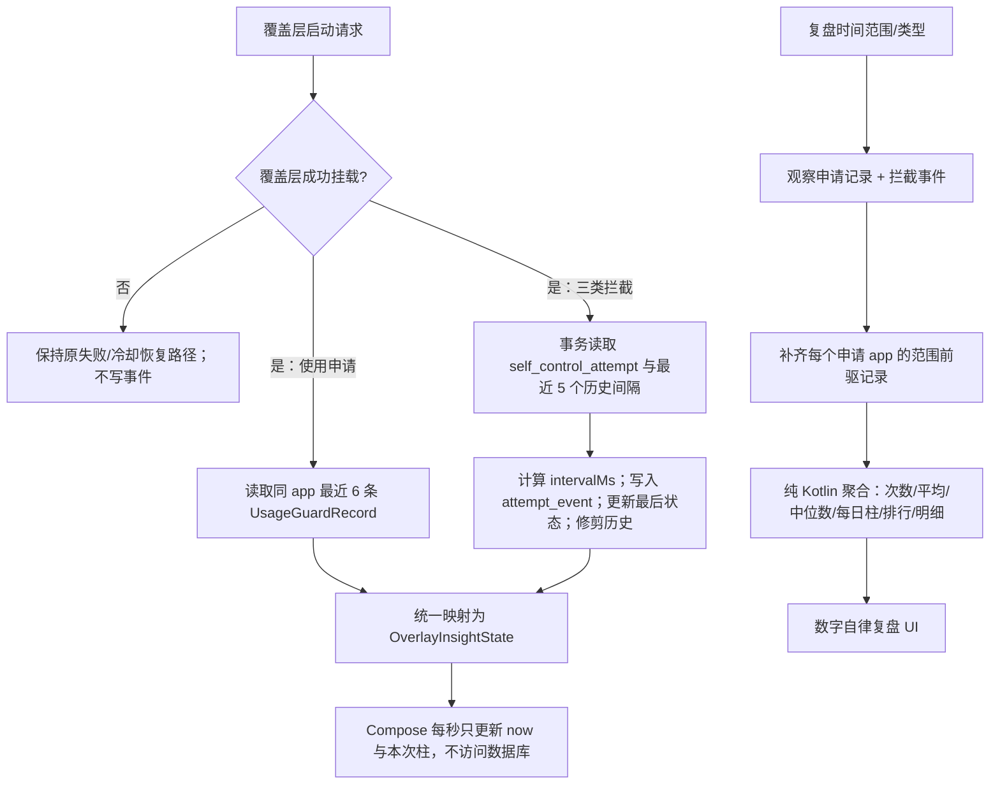

# 数字自律间隔洞察与复盘 Implementation Plan

> **For Codex:** REQUIRED SUB-SKILL: Use superpowers:executing-plans to implement this plan task-by-task.

**Goal:** 在不改变使用申请、应用拦截、选择器拦截和网址拦截原有判定与放行逻辑的前提下，把“距离上一次”的实时计时扩展为可解释的近期时间间隔洞察，并把使用申请与拦截间隔汇聚到“数字自律复盘”中，最后通过 GitHub Actions 验证、合并并发布新的版本化 Release。

**Architecture:** `UsageGuardRecord` 继续作为“成功提交使用申请”的唯一事实来源；现有 `self_control_attempt` 继续保存每个拦截目标的最后一次触发时间；新增一个有保留期限和容量上限的 `self_control_attempt_event` 事件表，专门保存拦截历史。共享的纯 Kotlin 统计策略把两种数据统一为间隔观察值，弹窗只读取最近样本并在内存中每秒更新“本次”柱，复盘页按时间范围聚合；所有数据库失败都只能让洞察降级，不能改变拦截或申请的业务结果。

**Tech Stack:** Kotlin、Jetpack Compose Material 3、Room（数据库 31 → 32）、Kotlin Flow/Coroutines、项目已固定的 Vico `2.0.0-alpha.28`、JUnit、GitHub Actions、GitHub CLI、现有签名与 Release workflow。

---

## 0. 文档状态与执行基线

- 设计日期：2026-08-03。
- 调研基线：`main` / `origin/main` 均位于 `2b1acddc`，当前已发布标签为 `v2.0.0-beta.2`。
- 当前版本：`versionName=2.0.0-beta.2`，`versionCode=94`。
- 预期下一个版本：`v2.0.0-beta.3` / `versionCode=95`。执行到发布阶段时必须再次查询标签、Release 和 `gradle/version.properties`；如果期间已有新版本，改用下一个未占用版本与递增的 `versionCode`，不得覆盖既有标签或 Release。
- 本计划只新增间隔洞察，不重写现有申请、倒计时、放行、冷却、回桌面、锁定模式或运行时协调逻辑。
- 仓库根目录当前另有未跟踪文件 `docs/plans/2026-08-03-usage-guard-request-runtime-repair.md`。它属于既有工作，执行者不得删除、覆盖或误提交。
- 本地机器不是权威编译环境。可以运行轻量检查和已有依赖可支持的测试，但最终结论必须来自 GitHub Actions。
- 实施使用独立分支 `codex/self-control-interval-insights`，频繁小提交；功能合并后再使用独立发布分支 `codex/release-v2.0.0-beta.3`。

## 1. 需求整理与产品目标

### 1.1 用户在弹窗中应当得到什么

每次进入以下界面时：

1. 使用申请表单；
2. 应用拦截全屏界面；
3. 选择器规则拦截界面；
4. 网址规则拦截界面；

用户都应当看到：

- 现有的“距离上一次”秒级实时计时，继续每秒增长；
- 当前目标最近最多 5 个已经完成的有效间隔；
- 一个随实时计时增长的“本次”柱；
- 最近样本的算术平均值；
- 最近样本的中位数与样本数；
- “本次距离近期平均还差多久”或“本次已超过近期平均多久”的中性说明；
- 数据不足、首次记录或读取失败时清晰但不打扰原业务的降级状态。

### 1.2 用户在“数字自律复盘”中应当得到什么

- 范围：今日、近 7 天、近 30 天；
- 类型：使用申请、拦截尝试；
- 拦截子类型：全部、应用拦截、选择器拦截、网址拦截；
- 事件总次数、有效间隔样本数、平均间隔、中位间隔；
- 与上一等长周期的平均间隔变化（样本充分时才显示）；
- 今日的最近间隔柱状图，或 7/30 天的每日典型间隔柱状图；
- 最近 10 条间隔明细和高频目标排行；
- 原有使用申请次数、申请时长、高频应用/标签、结束状态等复盘内容继续存在。

### 1.3 产品措辞边界

- 使用“间隔更长/更短”“近期平均”“样本不足”“仅供复盘”等描述。
- 不使用“自制力变好/变差”“前额叶修复”“成瘾程度”“健康评分”等未经项目验证的医学或诊断性表述。
- 不用红/绿、好/坏、奖惩分数给用户贴标签；颜色只区分数据系列或当前项。
- 图表是觉察工具，不宣称单靠数据显示就一定能改变行为。

## 2. 代码与资料调研结论

### 2.1 当前代码事实

| 位置 | 当前能力 | 对本需求的影响 |
| --- | --- | --- |
| `app/src/main/kotlin/li/songe/gkd/sdp/data/UsageGuardRecord.kt` | 成功提交申请后追加完整记录；可按时间范围查询 | 可以从同一应用的连续 `requestedAt` 精确推导申请间隔，无需复制申请数据 |
| `app/src/main/kotlin/li/songe/gkd/sdp/data/SelfControlAttempt.kt` | 每个稳定 `eventKey` 只保存一个 `lastOccurredAt` | 只能展示上一次，无法计算最近多次或每日统计，必须新增拦截事件历史 |
| `app/src/main/kotlin/li/songe/gkd/sdp/util/SelfControlElapsedPolicy.kt` | 定义三种上下文、稳定事件键、实时计时格式和首发状态 | 保留现有语义，在其上扩展洞察而不是替换 |
| `app/src/main/kotlin/li/songe/gkd/sdp/ui/component/SelfControlElapsedCard.kt` | 使用 `System.currentTimeMillis()` 每秒刷新 | 可复用同一个 ticker 同步驱动数字与“本次”柱，不能每秒查询数据库 |
| `UsageGuardRequestOverlayService.kt` | 读取当前应用最后一条成功申请；取消不写记录 | 当前实时间隔应继续以最后一次成功申请为锚点；取消后不能重置 |
| `AppBlockerOverlayService.kt` / `InterceptOverlayService.kt` | 只有成功挂载覆盖层后才记录尝试；重复 start 不记录 | 新事件也必须保持同样的“成功挂载才记一次”边界 |
| `UsageGuardReviewPage.kt` / `UsageGuardReviewPolicy.kt` | 只有今日/近 7 天的申请复盘 | 路由可保持兼容，页面内部扩展成综合数字自律复盘 |
| `ActionLogPage.kt` | 已使用 Vico 柱状图 | 无需引入新图表依赖，复用已被项目编译过的 API 路径 |
| `AppDb.kt` | Room 版本 31，已有 30 → 31 自动迁移，禁止破坏性迁移 | 新表与新索引需要 31 → 32 迁移并提交 `32.json` |
| `.github/workflows/ci.yml` | `quality`、`build`、`dependency-review` | 这三个是 `main-quality-gate` 规则集要求的状态检查 |
| `.github/workflows/release.yml` | 标签触发签名、校验、清单、校验和、attestation、Draft Release | 发布必须沿用该流程，不手工上传未验证 APK |

### 2.2 外部资料带来的约束

- Android 官方说明 Room 自动迁移依赖新旧导出 schema，schema 应进入版本控制；错误迁移可能导致启动失败，因此本计划要求保留 31、提交 32 并做真实升级测试：[Room database migrations](https://developer.android.com/training/data-storage/room/migrating-db-versions)。
- Room 的可观察查询会在关联表变化后重新发出数据，适合复盘页，但弹窗秒级变化应在内存完成而不是触发数据库查询：[Asynchronous Room queries](https://developer.android.com/training/data-storage/room/async-queries)。
- Compose 官方明确不建议把频繁变化的倒计时设置为 live region，以免 TalkBack 持续打断；自定义图表还需要显式语义：[Compose semantics](https://developer.android.com/develop/ui/compose/accessibility/semantics)。
- 图表需要有等价的文字摘要，不能把颜色或图形作为唯一信息来源：[W3C text alternatives](https://www.w3.org/WAI/fundamentals/accessibility-principles/)。
- Vico 官方项目支持 Compose，且本项目已经固定并使用它；本计划不升级版本、不添加图表依赖：[Vico](https://github.com/patrykandpatrick/vico)。
- 屏幕时间干预与自我监测的研究结果并非单向确定：设计摩擦研究观察到部分减少效果，而另一项实时自我监测 RCT 未发现客观久坐行为的显著改善。因此产品只承诺提供反馈与复盘，不承诺健康或行为结果：[Digital Strategies for Screen Time Reduction](https://doi.org/10.1089/cyber.2022.0027)、[Self-monitoring RCT](https://pmc.ncbi.nlm.nih.gov/articles/PMC7448798/)。

## 3. 方案选择

### 3.1 数据方案比较

| 方案 | 优点 | 问题 | 结论 |
| --- | --- | --- | --- |
| 只读取现有表 | 改动最小 | `self_control_attempt` 没有历史，无法得到最近多次或每日数据 | 不可行 |
| 把 `self_control_attempt` 改成纯事件表 | 结构表面统一 | 失去 O(1) 的最后状态；升级后无法自然承接 beta.2 已保存的最后时间；风险大 | 不采用 |
| 保留申请记录和最后状态，新增有界拦截事件表 | 申请无重复数据；拦截可统计；升级后第一次新事件可接续旧最后时间；降级简单 | 需要把两种来源映射为统一领域模型 | **采用** |

### 3.2 图表方案比较

| 方案 | 适合程度 | 结论 |
| --- | --- | --- |
| 折线图 | 更适合连续时间序列；在弹窗中会暗示两个离散间隔之间存在连续趋势 | 弹窗不采用；复盘首版也不采用 |
| 柱状图 | 每个间隔是一个独立样本，能直接比较“前几次”和“本次”，且项目已有实现 | **弹窗和复盘均采用** |
| 饼图/环图 | 不适合表达间隔随时间变化 | 不采用 |

### 3.3 最终视觉结构

弹窗紧凑卡片：

```text
┌──────────────────────────────────┐
│ 距离上次申请                     │
│ 01:42:18                         │
│ 上次申请：2026年08月03日 10:20:01│
│                                  │
│ 最近间隔                         │
│   ▃    ▆    ▂    █    ▅    ▇    │
│  前5  前4  前3  前2  前1  本次  │
│ 最近 5 次平均 01:55:00           │
│ 中位数 01:42:10 · 5 个有效样本  │
│ 距离近期平均还差 00:12:42        │
└──────────────────────────────────┘
```

复盘页主要结构：

```text
数字自律复盘
[今日] [近 7 天] [近 30 天]
[使用申请] [拦截尝试]
（拦截时显示：[全部] [应用] [选择器] [网址]）

事件 8 次  |  有效间隔 7 个
平均 2小时14分  |  中位数 1小时48分
较上一周期：平均间隔 +23分（样本充分时）

每日典型间隔（柱状图，7/30 天使用每日中位数）
最近间隔明细（最多 10 条）
高频目标排行

原有：申请时长 / 高频应用与标签 / 结束状态
```

## 4. 统计口径（实现不得自行改义）

### 4.1 事件与间隔定义

| 类型 | 一个事件何时发生 | 间隔如何计算 | 稳定分组键 |
| --- | --- | --- | --- |
| 使用申请 | 用户成功提交合法申请并写入 `UsageGuardRecord` | 同一 `appId` 相邻两条成功申请的 `requestedAt` 之差 | `appId` |
| 应用拦截 | 拦截覆盖层成功挂载并接受本次启动 | 同一应用相邻两次已接受拦截的时间差 | `app_blocker:<package>` |
| 选择器拦截 | 选择器覆盖层成功挂载并接受本次启动 | 同一订阅、实际应用和规则组相邻触发时间差 | `selector_intercept:<subsId>:<actualAppId>:<groupKey>` |
| 网址拦截 | 网址规则覆盖层成功挂载并接受本次启动 | 同一规则 ID 相邻触发时间差 | `url_intercept:<ruleId>` |

硬性规则：

- 不跨应用、不跨规则计算间隔。
- 使用申请的取消不创建记录，也不重置实时计时。
- 拦截界面的“继续/退出”结果不影响事件是否记录；事件语义是“覆盖层已成功出现”。
- 覆盖层挂载失败、intent 非法、重复 `onStartCommand`、运行时拒绝启动时都不得记录事件。
- 间隔归属到后一个事件发生的本地日期。例如周一 23:00 到周二 08:00 的 9 小时间隔归入周二。
- 时间戳相同时使用主键 ID 作为稳定次序；0 毫秒间隔合法，负间隔视为系统时钟回拨并排除出统计。
- 存储事件时使用 wall-clock epoch，因为跨进程、重启和多日间隔无法只靠 monotonic clock；显示时对 `now - anchor` 做 `coerceAtLeast(0)`。

### 4.2 弹窗“近期”定义

- 最多使用最近 5 个已完成、非负的同目标间隔。
- 申请弹窗需要读取最近 6 条成功申请记录才能得到最多 5 个已完成间隔。
- 拦截弹窗在写入本次事件前读取最近 5 个历史有效间隔，再原子写入本次事件。
- “本次”是 `now - previousOccurredAt/requestedAt`，每秒变化。
- 历史平均值和中位数**不包含本次实时值**，避免用户停留越久基线也跟着变化。
- 没有历史锚点：保留现有“首次记录/此前没有申请”状态，不显示伪造的 0。
- 有锚点但没有已完成历史间隔：显示“正在形成第一个可比较间隔”。
- 只有 1 个有效历史样本：显示该样本和平均值，但标注“样本较少”。
- 2 个及以上：显示平均值、中位数和相对平均的差值。

### 4.3 平均值、中位数与周期比较

- 平均值：有效 `intervalMs` 的算术平均，使用 `Long`/`Double` 的安全累计方式，最终四舍五入到毫秒。
- 中位数：排序后取中间值；偶数样本取两个中间值的安全平均，避免 `a + b` 溢出。
- 弹窗主要文案比较当前值与近期平均值；中位数用于提醒平均值可能受超长间隔影响。
- 复盘页周期变化比较“当前周期平均值 - 上一等长周期平均值”。
- 只有当前周期和上一周期都至少有 3 个有效间隔时，才显示周期变化；否则显示“样本不足，暂不比较”。
- 不计算综合分数，不把三类拦截和使用申请混成一个平均值。

### 4.4 日期范围

以用户当前 `ZoneId` 的自然日计算，函数必须接收可注入的 `nowEpochMs` 与 `ZoneId`：

- 今日：本地今日 00:00 到明日 00:00；上一周期是昨天。
- 近 7 天：含今天的 7 个自然日；上一周期是紧邻的前 7 个自然日。
- 近 30 天：含今天的 30 个自然日；上一周期是紧邻的前 30 个自然日。
- 页面跨过本地午夜后 60 秒内刷新边界，不要求用户重新进入页面。
- DST、时区偏移变化使用 `LocalDate.atStartOfDay(zoneId)`，不能用固定 `24 * 60 * 60 * 1000` 推导自然日。

### 4.5 图表点

- 弹窗：最多 5 个历史柱，按从旧到新排列，再追加“本次”柱。
- 今日复盘：按时间从旧到新显示最近 10 个有效间隔。
- 7/30 天复盘：每个有有效样本的日期显示一个“每日中位数”柱；无样本日期是缺失，不是 0。
- 30 天横轴最多展示每 5 天一个文字刻度；完整日期和值由文字明细/语义提供。
- Y 轴单位按最大值统一选择秒、分钟、小时或天；数据本体仍保存毫秒。
- 柱高保持线性，不截断异常值；跨度过大时显示“最长间隔会影响柱高，请结合中位数阅读”。

## 5. 数据模型与隐私设计

### 5.1 新实体

创建 `app/src/main/kotlin/li/songe/gkd/sdp/data/SelfControlAttemptEvent.kt`：

```kotlin
@Entity(
    tableName = "self_control_attempt_event",
    indices = [
        Index(value = ["event_key", "occurred_at"]),
        Index(value = ["event_kind", "occurred_at"]),
        Index(value = ["occurred_at"]),
    ],
)
data class SelfControlAttemptEvent(
    @PrimaryKey(autoGenerate = true)
    @ColumnInfo(name = "id") val id: Long = 0,
    @ColumnInfo(name = "event_key") val eventKey: String,
    @ColumnInfo(name = "event_kind") val eventKind: Int,
    @ColumnInfo(name = "subject_id") val subjectId: String,
    @ColumnInfo(name = "subject_label") val subjectLabel: String,
    @ColumnInfo(name = "occurred_at") val occurredAt: Long,
    @ColumnInfo(name = "interval_ms") val intervalMs: Long?,
)
```

字段约束：

- `eventKind` 继续复用 `SelfControlAttempt.KIND_APP_BLOCKER`、`KIND_SELECTOR_INTERCEPT`、`KIND_URL_INTERCEPT`。
- `subjectId`：应用包名、选择器实际应用包名或网址规则 ID；不能放实际 URL。
- `subjectLabel`：应用显示名、当前规则名或安全回退文案；写入前折叠空白、截断到 80 个 Unicode code points。
- 网址规则名为空时保存“网址规则 #ID”；不得保存 `pattern`、实际命中 URL、跳转 URL。
- 不保存申请理由、拦截提示语、页面文本、选择器内容、截图、设备标识或云端标识。
- `intervalMs` 在无前次记录或时钟回拨时为 `null`。

### 5.2 为什么申请记录不复制到新表

- `UsageGuardRecord` 已经是追加式完整历史，复制会产生双写和不一致风险。
- 申请弹窗和复盘通过纯策略从连续的 `requestedAt` 推导间隔。
- 新表只补足现有拦截事件缺失的历史，领域层再统一两种来源。

### 5.3 保留与容量

- 拦截事件只保留最近 90 天。
- 同时设置全局硬上限 10,000 行；超过时按 `occurredAt ASC, id ASC` 删除最旧记录。
- 每次成功写入事件的事务内先删除过期行，再在超过上限时按差额修剪。
- `self_control_attempt` 最后状态不随事件修剪删除，因此超过 90 天后第一次再次触发仍能得到真实的长间隔。
- `UsageGuardRecord` 沿用项目当前保留策略，本计划不删除用户既有申请记录。
- 数据仅保存在本机 Room 数据库；不上传、不加入日志、不加入通知 payload、不加入 App Widget。

### 5.4 Room 迁移

- `AppDb.version`：31 → 32。
- `entities` 加入 `SelfControlAttemptEvent::class`。
- 新增 `AutoMigration(from = 31, to = 32)`。
- `UsageGuardRecord` 保留现有 `(app_id, ended_at)` 索引，并新增 `(app_id, requested_at)` 索引，加速弹窗和前驱查询。
- 生成并提交 `app/schemas/li.songe.gkd.sdp.db.AppDb/32.json`。
- 保留 `fallbackToDestructiveMigration(false)`；不得通过打开破坏性迁移来绕过 schema 错误。
- 31 → 32 只新增表与索引，不回填伪造事件。升级后首次拦截通过现有 `self_control_attempt.last_occurred_at` 计算第一条新事件间隔，实现 beta.2 到 beta.3 的连续性。

## 6. 运行时数据流



### 6.1 事务返回值

扩展 `SelfControlAttempt.SelfControlAttemptDao`，定义不持久化的结果：

```kotlin
data class RecordedAttemptInsight(
    val previousOccurredAt: Long?,
    val recentCompletedIntervalsMs: List<Long>, // oldest -> newest, max 5
)
```

`recordEventAndGetInsight(...)` 必须在同一个 `@Transaction` 中按顺序执行：

1. 根据 `eventKey` 读取旧 `self_control_attempt`；
2. 从事件表读取最近 5 个 `intervalMs IS NOT NULL AND interval_ms >= 0` 的历史值；
3. 计算 `currentInterval = occurredAt - previous.lastOccurredAt`；若为负则存 `null`；
4. 插入 `SelfControlAttemptEvent`；
5. upsert 最新 `SelfControlAttempt`；
6. 清理 90 天前事件；
7. 若总量超过 10,000，删除最旧差额；
8. 返回旧锚点和写入前的历史基线。

这个顺序确保“近期平均”不会包含当前事件，同时即使应用升级前只有最后状态，第一条新事件也能得到有效间隔。

### 6.2 申请范围的前驱记录

复盘不能只读取范围内记录，否则每个应用在范围内的第一条申请会丢失跨边界间隔。为避免依赖 Android 旧 SQLite 不一定支持的窗口函数：

1. 观察“上一比较周期开始 → 当前周期结束”的申请记录；
2. 按 `appId` 找到查询结果内第一条 `(requestedAt, id)`；
3. 通过 DAO 方法为每个不同 `appId` 查询严格早于该二元组的最近一条记录；
4. 将这些前驱与范围记录一起交给纯策略；
5. 只在最终聚合时按后一个事件时间筛选周期。

DAO 前驱条件必须同时处理同毫秒记录：

```sql
WHERE app_id = :appId
  AND (
    requested_at < :requestedAt
    OR (requested_at = :requestedAt AND id < :id)
  )
ORDER BY requested_at DESC, id DESC
LIMIT 1
```

范围最多 60 天（当前 30 天 + 上一 30 天），不同应用数量通常很小；这组有索引的前驱查询只在 Room Flow 发出新数据或范围变化时执行，不在秒级 ticker 中执行。

## 7. 领域模型与 UI 状态

### 7.1 纯 Kotlin 策略

创建 `app/src/main/kotlin/li/songe/gkd/sdp/util/SelfControlIntervalPolicy.kt`，不依赖 Android/Room/Compose：

- `IntervalObservation(eventKey, kind, subjectId, subjectLabel, occurredAt, intervalMs)`；
- `IntervalStats(sampleCount, averageMs, medianMs, minMs, maxMs)`；
- `OverlayInsight(history, currentAnchorAt, stats, sampleQuality, comparison)`；
- `ChartPoint(key, label, occurredAt, valueMs, isCurrent)`；
- `formatDurationCompact`、`formatDurationClock`、`chooseAxisUnit`；
- 申请记录排序与相邻间隔推导；
- 负值过滤、最近 5 个截取、平均/中位数与差值计算。

创建 `app/src/main/kotlin/li/songe/gkd/sdp/util/DigitalSelfDisciplineReviewPolicy.kt`：

- `Range.Today / SevenDays / ThirtyDays`；
- `ReviewType.UsageRequest / InterceptAttempt`；
- `InterceptKindFilter.All / AppBlocker / Selector / Url`；
- 当前与上一周期的 `RangeBounds`；
- `ReviewSummary`、`DailyIntervalBucket`、`RecentIntervalItem`、`RankedTarget`；
- 跨午夜刷新判定；
- 今日最近 10 个样本和多日每日中位数图表点；
- 周期比较最小样本数规则。

### 7.2 弹窗状态

创建 `SelfControlIntervalUiState`，避免把数据库对象传入 Compose：

```kotlin
sealed interface SelfControlIntervalUiState {
    data object Loading : SelfControlIntervalUiState
    data class Ready(
        val elapsed: SelfControlElapsedPolicy.ElapsedState.Running,
        val recentCompletedIntervalsMs: List<Long>,
    ) : SelfControlIntervalUiState
    data class NoHistory(
        val elapsed: SelfControlElapsedPolicy.ElapsedState,
    ) : SelfControlIntervalUiState
    data object Unavailable : SelfControlIntervalUiState
}
```

可以根据最终代码复用既有 `ElapsedState`，但必须保证：

- 一个 ticker 同时驱动数字和本次柱；
- `Ready` 中历史顺序固定为 oldest → newest；
- UI 每秒只做最多 6 个数字的纯计算；
- 数据库错误显示现有不可用文案，主按钮和倒计时仍可用。

## 8. UI、可访问性和性能规范

### 8.1 弹窗组件

新增：

- `app/src/main/kotlin/li/songe/gkd/sdp/ui/component/SelfControlIntervalInsightCard.kt`
- `app/src/main/kotlin/li/songe/gkd/sdp/ui/component/SelfControlIntervalChart.kt`

修改：

- `app/src/main/kotlin/li/songe/gkd/sdp/ui/component/SelfControlElapsedCard.kt`

实现要求：

- 保留原标题、实时大数字、绝对时间和辅助文案；在同一视觉卡片中用 Divider 分隔近期间隔。
- 使用现有 Vico `CartesianChartModelProducer`、`columnSeries`、`rememberColumnCartesianLayer`、`CartesianChartHost` 路径，不升级 Vico。
- 图表最多 6 柱，高度控制在约 132–160dp；申请表单和拦截页继续可纵向滚动。
- 使用 `MaterialTheme.colorScheme`，不硬编码红绿；“本次”至少通过横轴文字和可见摘要区分，不能只靠颜色。
- 首次/无样本时不渲染空坐标系，改为简短说明。
- Vico API 若无法在固定版本可靠实现平均参考线，不为此升级依赖；数字平均值是正式验收项，参考线不是。
- 图表模型每秒最多更新一次；历史列表未变化时不重复构建重量级对象。
- 不启动持续入场动画；若固定版本默认动画导致每秒闪动，保留秒级数字更新并关闭/压缩图表动画，而不是降低计时精度。

### 8.2 复盘页

修改：

- `app/src/main/kotlin/li/songe/gkd/sdp/ui/UsageGuardReviewPage.kt`
- `app/src/main/kotlin/li/songe/gkd/sdp/ui/home/HomeVm.kt`
- `app/src/main/kotlin/li/songe/gkd/sdp/ui/home/ControlPage.kt`

要求：

- 路由 `UsageGuardReviewRoute` 和页面标题“数字自律复盘”不改名，避免导航兼容问题。
- 顶部范围与类型 FilterChip 可换行；拦截子类型只在拦截页签出现。
- 新增综合摘要、间隔图表、明细、拦截目标排行；原有申请复盘卡片在其后保留。
- “无样本”显示文案，不把缺失数据画成 0。
- Home 卡片至少补充“今日 X 次申请 · Y 次拦截”，仍点击进入原复盘路由。
- `UsageGuardReviewWidget` 本期保持申请专用，不因每次拦截刷新 Glance Widget；这是明确的性能与范围边界。

### 8.3 可访问性

- 图表容器提供一次性、稳定的语义摘要，例如：“最近 5 个申请间隔，平均 1 小时 20 分，中位数 1 小时 05 分；本次间隔正在增长”。
- 历史柱值在可见文字明细中也能读到；图表不是唯一信息源。
- 不给每秒变化的数字或图表设置 `liveRegion`，避免 TalkBack 每秒播报。
- 允许用户聚焦实时数字时读取当前值，但不主动打断。
- 合并合理的 descendants，避免每根柱成为一个无意义焦点。
- 验证 TalkBack 顺序、200% 字体、360dp 宽屏、横屏和深色主题。
- 所有新可点击控件最小触摸目标 48dp。

### 8.4 性能和故障隔离

- 弹窗只做一次 Room 读/写；之后每秒纯内存更新。
- 复盘图表最多 30 个每日点，明细最多 10 条，排行最多 5 条。
- Room 查询使用新增索引；数据库工作保持在 Room/IO 调度，不阻塞 overlay 挂载。
- 记录洞察失败时不得改变：是否拦截、是否允许继续、10 秒退出倒计时、使用申请提交、冷却、Home 行为。
- 图表渲染异常不得导致 Service 崩溃；状态映射和 Vico model 更新用可恢复边界处理并留下不含个人内容的类型级日志。
- 日志只能写错误类别与 event kind，不能写理由、规则消息、实际 URL 或完整事件历史。

## 9. 本期范围与后续延伸

### 9.1 本期必须完成

- 4 个弹窗上下文的实时柱状洞察；
- 拦截历史事件表、保留策略、31 → 32 迁移；
- 使用申请与拦截的统一统计策略；
- 今日/7天/30天综合复盘；
- 平均、中位数、样本数、上一周期比较；
- 隐私、无障碍、升级、CI、PR、Release 全流程。

### 9.2 明确不在本期

- 云同步、账号、服务器、遥测；
- AI 行为诊断或医学结论；
- “自律分数”、排行榜、勋章和连续打卡；
- 记录申请取消、拦截退出/继续的决策结果；
- 把理由、URL、页面文字放进新事件表；
- CSV 导出、周报通知、自定义目标线；
- 修改 App Widget 为实时拦截统计；
- 升级 Vico、Room、Compose 或 Gradle。

### 9.3 可在后续独立设计的方向

1. 在明确隐私说明后记录“取消申请/提交申请”“退出/继续”的结果，计算主动放弃率。
2. 允许用户设置每个应用的目标间隔，并在图表显示目标线。
3. 本地生成周报通知，用户可完全关闭。
4. 增加应用/规则下钻页和长期 90 天趋势。
5. 提供本地 CSV 导出与单独清除间隔历史入口。
6. 研究按标签聚合申请间隔，但必须避免把具体申请理由暴露到通知或日志。

---

## 10. 实施任务

> 每个任务都遵循 RED → GREEN → REFACTOR；一项任务一个主题提交。不要攒到最后一次提交。每完成 2–3 个提交就推送并观察 GitHub Actions，数据库迁移和三类 Service 接入后必须各有一次远端 CI 检查点。

### Task 0: 建立隔离工作区并锁定基线

**Files:**

- Read: `docs/plans/2026-08-03-digital-self-discipline-interval-insights.md`
- Read: `gradle/version.properties`
- Read: `.github/workflows/ci.yml`
- Read: `.github/workflows/codeql-java-kotlin.yml`
- Read: `.github/workflows/release.yml`

**Step 1: 同步只读状态**

```bash
git fetch origin --prune --tags
git status --short --branch
git log -5 --oneline --decorate
gh pr list --state open
gh release list --limit 10
```

Expected:

- 确认起点仍可安全基于 `origin/main`；
- 记录实际最新版本；
- 不处理或删除无关未跟踪文件。

**Step 2: 使用 worktree/独立分支**

按照 `superpowers:using-git-worktrees` 创建 `.worktrees/self-control-interval-insights`，分支名：

```text
codex/self-control-interval-insights
```

工作树创建后再次运行：

```bash
git status --short --branch
git diff --check
```

**Step 3: 记录基线而不改业务代码**

把本计划作为该功能分支的设计依据。若计划文件尚未进入分支，在第一个文档提交中加入；不得把另一个未跟踪修复计划一起提交。

### Task 1: 先实现纯间隔算法契约

**Files:**

- Create: `app/src/main/kotlin/li/songe/gkd/sdp/util/SelfControlIntervalPolicy.kt`
- Create: `app/src/test/kotlin/li/songe/gkd/sdp/util/SelfControlIntervalPolicyTest.kt`
- Modify: `app/src/main/kotlin/li/songe/gkd/sdp/util/SelfControlElapsedPolicy.kt`

**Step 1: 写失败测试**

至少覆盖：

1. 同一应用 6 条成功申请产生 5 个间隔；
2. 不同 app、不同 eventKey 绝不互相配对；
3. 输入乱序时按 `(occurredAt/requestedAt, id)` 稳定排序；
4. 同毫秒事件产生 0 间隔；
5. 负间隔被排除；
6. 最近 5 个截取后保持从旧到新；
7. 奇数/偶数样本中位数；
8. 平均值不包含本次实时值；
9. 0/1/2 个样本的质量文案状态；
10. 当前值短于/长于平均值的差值；
11. 秒、分钟、小时、天单位选择；
12. 大值计算不溢出；
13. `now < anchor` 时实时值钳制为 0。

**Step 2: 运行目标测试，确认 RED**

```bash
./gradlew :app:testGkdDebugUnitTest --tests 'li.songe.gkd.sdp.util.SelfControlIntervalPolicyTest'
```

如果本机依赖不可用，记录失败的环境原因，不修改 Gradle wrapper；在第一次推送后的 Actions 中完成 RED/GREEN 证据。

**Step 3: 最小实现并复用现有语义**

- 不改变 `SelfControlElapsedPolicy` 现有 event key 格式；
- 把新增格式化/统计放入新策略；
- 所有依赖当前时间的函数接收显式参数。

**Step 4: 测试 GREEN 与提交**

```bash
./gradlew :app:testGkdDebugUnitTest --tests 'li.songe.gkd.sdp.util.SelfControlIntervalPolicyTest'
git diff --check
git add app/src/main/kotlin/li/songe/gkd/sdp/util/SelfControlIntervalPolicy.kt \
        app/src/main/kotlin/li/songe/gkd/sdp/util/SelfControlElapsedPolicy.kt \
        app/src/test/kotlin/li/songe/gkd/sdp/util/SelfControlIntervalPolicyTest.kt
git commit -m "feat: define self-control interval metrics"
```

### Task 2: 新增有界拦截事件历史与 Room 32

**Files:**

- Create: `app/src/main/kotlin/li/songe/gkd/sdp/data/SelfControlAttemptEvent.kt`
- Modify: `app/src/main/kotlin/li/songe/gkd/sdp/data/SelfControlAttempt.kt`
- Modify: `app/src/main/kotlin/li/songe/gkd/sdp/data/UsageGuardRecord.kt`
- Modify: `app/src/main/kotlin/li/songe/gkd/sdp/db/AppDb.kt`
- Create: `app/schemas/li.songe.gkd.sdp.db.AppDb/32.json`（由 Room 生成，禁止手写 identity hash）
- Create: `app/src/test/kotlin/li/songe/gkd/sdp/data/SelfControlAttemptEventDaoContractTest.kt`
- Modify: `app/src/test/kotlin/li/songe/gkd/sdp/data/SelfControlAttemptDaoContractTest.kt`
- Modify: `app/src/test/kotlin/li/songe/gkd/sdp/data/UsageGuardRecordDaoContractTest.kt`

**Step 1: 写 DAO/迁移契约失败测试**

断言以下方法与约束存在：

- 读取同 key 最近有效事件；
- 按 kind/时间范围观察事件；
- 插入事件和 upsert 最后状态；
- 删除 cutoff 前事件；
- 统计总量并删除最旧 N 条；
- `recordEventAndGetInsight` 返回写入前的基线；
- 申请 DAO 能取最近 N 条、严格前驱；
- 申请实体同时具有旧索引与新 `(app_id, requested_at)` 索引；
- `AppDb` 版本为 32、包含新实体和 31 → 32 迁移。

**Step 2: 实现实体、DAO 和事务**

清理常量集中定义：

```kotlin
const val RETENTION_DAYS = 90L
const val MAX_EVENT_ROWS = 10_000
const val OVERLAY_HISTORY_LIMIT = 5
```

事务必须遵循第 6.1 节顺序。若 `occurredAt - previous` 为负，事件仍可记为一次触发，但 `intervalMs=null`，最后状态更新为本次时间，使系统能从新时钟基线继续。

**Step 3: 升级 AppDb 并生成 schema**

先在分支推送 WIP 以使用 GitHub Actions 生成/验证 schema：

```bash
git add app/src/main/kotlin/li/songe/gkd/sdp/data/SelfControlAttemptEvent.kt \
        app/src/main/kotlin/li/songe/gkd/sdp/data/SelfControlAttempt.kt \
        app/src/main/kotlin/li/songe/gkd/sdp/data/UsageGuardRecord.kt \
        app/src/main/kotlin/li/songe/gkd/sdp/db/AppDb.kt \
        app/src/test/kotlin/li/songe/gkd/sdp/data/SelfControlAttemptEventDaoContractTest.kt \
        app/src/test/kotlin/li/songe/gkd/sdp/data/SelfControlAttemptDaoContractTest.kt \
        app/src/test/kotlin/li/songe/gkd/sdp/data/UsageGuardRecordDaoContractTest.kt
git commit -m "feat: persist bounded self-control attempt history"
git push -u origin codex/self-control-interval-insights
gh workflow run ci.yml --ref codex/self-control-interval-insights
gh run list --workflow ci.yml --branch codex/self-control-interval-insights \
  --event workflow_dispatch --limit 3
```

`ci.yml` 的普通 feature-branch push 不在自动触发范围内，因此这里必须显式 `workflow_dispatch`；不要误以为“已经 push”就一定启动了 CI。

如果本地不能生成 `32.json`：

1. 等待 `quality` job 运行到 Room/KSP；
2. 用下列命令解析 run ID 并下载对应 artifact；
3. 从 artifact 取出由 Room 生成的 `32.json`；
4. 对比 31 → 32，只允许新增事件表和申请索引以及对应 identity hash；
5. 将生成文件加入分支；
6. 再次推送让完整 CI 从干净 checkout 验证。

不得手写 schema，也不得从其他数据库包名目录复制旧 schema。

```bash
schema_run_id="$(gh run list --workflow ci.yml \
  --branch codex/self-control-interval-insights \
  --event workflow_dispatch --limit 1 \
  --json databaseId --jq '.[0].databaseId')"
gh run watch "$schema_run_id"
schema_artifact_dir="$(mktemp -d)"
gh run download "$schema_run_id" \
  --name "ci-quality-reports-${schema_run_id}" \
  --dir "$schema_artifact_dir"
find "$schema_artifact_dir" -path '*/li.songe.gkd.sdp.db.AppDb/32.json' -print
```

即使首轮结论为失败，也应先看 `gh run view "$schema_run_id" --log-failed` 判断是预期的 schema/编译问题还是其他回归；只从该次 run 的 artifact 获取生成文件。

**Step 4: 提交 schema**

```bash
git add app/schemas/li.songe.gkd.sdp.db.AppDb/32.json
git commit -m "chore: record Room schema 32"
git push
```

**Step 5: Actions 验证点**

```bash
gh workflow run ci.yml --ref codex/self-control-interval-insights
ci_run_id="$(gh run list --workflow ci.yml \
  --branch codex/self-control-interval-insights \
  --event workflow_dispatch --limit 1 \
  --json databaseId --jq '.[0].databaseId')"
gh run view "$ci_run_id" --json status,conclusion,url
gh run watch "$ci_run_id" --exit-status
```

Expected: `quality`、`build` 成功；分支 push 不运行 `dependency-review` 属正常，PR 时必须运行。

### Task 3: 建立数据协调层并验证升级连续性

**Files:**

- Create: `app/src/main/kotlin/li/songe/gkd/sdp/data/SelfControlIntervalRepository.kt`
- Create: `app/src/test/kotlin/li/songe/gkd/sdp/data/SelfControlIntervalRepositoryTest.kt`
- Modify: `app/src/main/kotlin/li/songe/gkd/sdp/db/AppDb.kt`（仅暴露已确定 DAO，不新增全局可变缓存）

**Step 1: 用 fake DAO 写失败测试**

测试：

- beta.2 已有 `self_control_attempt`、事件表为空时，第一次 beta.3 触发能得到旧锚点和一个有效新间隔；
- 首次触发返回无锚点、写入 `intervalMs=null`；
- 写入前的最近 5 个样本不含当前事件；
- 第 6 个历史样本被截断；
- 负间隔不进入基线；
- 90 天和 10,000 行修剪次序正确；
- 使用申请最近 6 条只来自同一个 app；
- 范围前驱按 timestamp + id 严格选取；
- DAO 抛错时返回明确失败状态，不伪造空历史。

**Step 2: 实现 repository**

Repository 负责：

- `loadUsageRequestOverlay(appId)`；
- `recordInterceptAndLoadOverlay(descriptor, occurredAt)`；
- `observeReviewSource(bounds)`；
- Room 对象到纯 `IntervalObservation` 的映射；
- 安全 label 规范化。

它不负责：

- 决定是否拦截；
- 启动/停止 Service；
- 每秒计时；
- 业务按钮结果。

**Step 3: GREEN、重构与提交**

```bash
./gradlew :app:testGkdDebugUnitTest \
  --tests 'li.songe.gkd.sdp.data.SelfControlIntervalRepositoryTest' \
  --tests 'li.songe.gkd.sdp.util.SelfControlIntervalPolicyTest'
git diff --check
git add app/src/main/kotlin/li/songe/gkd/sdp/data/SelfControlIntervalRepository.kt \
        app/src/test/kotlin/li/songe/gkd/sdp/data/SelfControlIntervalRepositoryTest.kt
git commit -m "feat: coordinate self-control interval sources"
```

### Task 4: 构建共享紧凑柱状洞察组件

**Files:**

- Create: `app/src/main/kotlin/li/songe/gkd/sdp/ui/component/SelfControlIntervalInsightCard.kt`
- Create: `app/src/main/kotlin/li/songe/gkd/sdp/ui/component/SelfControlIntervalChart.kt`
- Modify: `app/src/main/kotlin/li/songe/gkd/sdp/ui/component/SelfControlElapsedCard.kt`
- Create: `app/src/test/kotlin/li/songe/gkd/sdp/ui/component/SelfControlIntervalPresentationTest.kt`

**Step 1: 写 presentation 失败测试**

把以下输出做成纯函数后测试：

- 0/1/5 个历史样本的标题和辅助文案；
- 6 个图表点的 label 顺序；
- 本次值每秒增长但历史值不变；
- 平均差值文案；
- 图表语义摘要包含样本数、平均、中位数，不包含申请理由；
- 无历史/不可用时不生成误导性的 0 柱；
- 30 倍跨度提示。

**Step 2: 实现单 ticker 和 Vico chart**

- 把 `nowEpochMs` ticker 提升到洞察卡共享层；
- 保持 `delay(1_000L)` 和组件销毁自动取消；
- `remember` model producer、axis formatter、颜色 component；
- `LaunchedEffect(chartValues)` 更新最多 6 个值；
- 让实时文本为正式信息，柱状图为增强信息。

**Step 3: 手工布局检查**

用 Compose Preview 或真机至少查看：

- 浅色/深色；
- 360dp 宽；
- 横屏；
- 200% 字体；
- 0、1、5 个历史样本；
- 10 秒内本次柱增长；
- 天级超长间隔。

**Step 4: 提交**

```bash
git add app/src/main/kotlin/li/songe/gkd/sdp/ui/component/SelfControlIntervalInsightCard.kt \
        app/src/main/kotlin/li/songe/gkd/sdp/ui/component/SelfControlIntervalChart.kt \
        app/src/main/kotlin/li/songe/gkd/sdp/ui/component/SelfControlElapsedCard.kt \
        app/src/test/kotlin/li/songe/gkd/sdp/ui/component/SelfControlIntervalPresentationTest.kt
git commit -m "feat: show recent interval insight chart"
```

### Task 5: 接入使用申请表单

**Files:**

- Modify: `app/src/main/kotlin/li/songe/gkd/sdp/service/UsageGuardRequestOverlayService.kt`
- Modify: `app/src/main/kotlin/li/songe/gkd/sdp/data/UsageGuardRecord.kt`
- Create: `app/src/test/kotlin/li/songe/gkd/sdp/service/UsageGuardRequestIntervalContractTest.kt`
- Modify: `app/src/test/kotlin/li/songe/gkd/sdp/data/UsageGuardRecordDaoContractTest.kt`

**Step 1: 写回归测试**

断言：

- 当前 app 最近 6 条记录映射为最多 5 个已完成间隔；
- 其他 app 记录不出现；
- 取消不写 `UsageGuardRecord`；
- 合法提交仍只写一条原记录；
- 读取失败时申请字段、提交验证和取消按钮不受影响；
- 现有 reason、tag、duration、grant mode 语义没有变化。

**Step 2: 接入 repository 与新卡片**

- Overlay 成功挂载后异步读取；
- 读取期间显示 Loading；
- 数据准备好后显示最近历史 + 以最后成功申请为锚点的本次柱；
- 没有成功申请时沿用 NoHistory；
- 不能为了图表延迟显示表单或阻止输入。

**Step 3: 运行申请相关回归**

```bash
./gradlew :app:testGkdDebugUnitTest \
  --tests 'li.songe.gkd.sdp.service.UsageGuardRequestIntervalContractTest' \
  --tests 'li.songe.gkd.sdp.data.UsageGuardRecordDaoContractTest' \
  --tests 'li.songe.gkd.sdp.util.UsageGuardPolicyTest' \
  --tests 'li.songe.gkd.sdp.util.UsageGuardUiStatePolicyTest'
```

**Step 4: 提交**

```bash
git add app/src/main/kotlin/li/songe/gkd/sdp/service/UsageGuardRequestOverlayService.kt \
        app/src/main/kotlin/li/songe/gkd/sdp/data/UsageGuardRecord.kt \
        app/src/test/kotlin/li/songe/gkd/sdp/service/UsageGuardRequestIntervalContractTest.kt \
        app/src/test/kotlin/li/songe/gkd/sdp/data/UsageGuardRecordDaoContractTest.kt
git commit -m "feat: add interval insight to usage requests"
git push
```

### Task 6: 接入三类拦截且不改变运行时判定

**Files:**

- Modify: `app/src/main/kotlin/li/songe/gkd/sdp/a11y/AppBlockerEngine.kt`
- Modify: `app/src/main/kotlin/li/songe/gkd/sdp/a11y/A11yRuleEngine.kt`
- Modify: `app/src/main/kotlin/li/songe/gkd/sdp/a11y/UrlBlockerEngine.kt`
- Modify: `app/src/main/kotlin/li/songe/gkd/sdp/service/AppBlockerOverlayService.kt`
- Modify: `app/src/main/kotlin/li/songe/gkd/sdp/service/InterceptOverlayService.kt`
- Modify: `app/src/test/kotlin/li/songe/gkd/sdp/a11y/SelfControlModeParityTest.kt`
- Modify: `app/src/test/kotlin/li/songe/gkd/sdp/a11y/SelfControlOverlayLauncherTest.kt`
- Create: `app/src/test/kotlin/li/songe/gkd/sdp/service/SelfControlAttemptRecordingContractTest.kt`

**Step 1: 为 intent 元数据和记录边界写失败测试**

新增 extras 或等价 descriptor：

- `eventKey`；
- `eventKind`；
- `subjectId`；
- `subjectLabel`。

测试：

- App blocker 使用 package 稳定键；
- selector 使用实际 `rightAppId`，不能错误使用配置中的空/泛化 appId；
- URL 使用 rule ID 和安全规则名，绝不传实际 URL/pattern；
- 只有 `showOverlay(...) == true` 后才调用记录；
- `view != null` 的重复 start 不写事件；
- mount rejected 不写事件并保留原 cooldown 恢复；
- selector/url 原有 Continue、Exit、cooldown 行为不变；
- App blocker 仍只有回桌面路径和 10 秒倒计时。

**Step 2: 最小接入**

- 先挂载，再在 `lifecycleScope`/IO 中原子记录并取基线；
- label 缺失时使用安全回退，不能让 label 查询失败阻止记录；
- UI 显示 Running/NoHistory/Unavailable；
- 服务销毁后 ticker 和加载任务随生命周期取消。

**Step 3: 全部 runtime 回归**

```bash
./gradlew :app:testGkdDebugUnitTest \
  --tests 'li.songe.gkd.sdp.a11y.SelfControlModeParityTest' \
  --tests 'li.songe.gkd.sdp.a11y.SelfControlOverlayLauncherTest' \
  --tests 'li.songe.gkd.sdp.service.SelfControlAttemptRecordingContractTest' \
  --tests 'li.songe.gkd.sdp.util.AppBlockerDecisionPolicyTest' \
  --tests 'li.songe.gkd.sdp.util.SelfControlRuntimeReadinessTest'
```

**Step 4: 提交并用 Actions 建立第二验证点**

```bash
git add app/src/main/kotlin/li/songe/gkd/sdp/a11y/AppBlockerEngine.kt \
        app/src/main/kotlin/li/songe/gkd/sdp/a11y/A11yRuleEngine.kt \
        app/src/main/kotlin/li/songe/gkd/sdp/a11y/UrlBlockerEngine.kt \
        app/src/main/kotlin/li/songe/gkd/sdp/service/AppBlockerOverlayService.kt \
        app/src/main/kotlin/li/songe/gkd/sdp/service/InterceptOverlayService.kt \
        app/src/test/kotlin/li/songe/gkd/sdp/a11y/SelfControlModeParityTest.kt \
        app/src/test/kotlin/li/songe/gkd/sdp/a11y/SelfControlOverlayLauncherTest.kt \
        app/src/test/kotlin/li/songe/gkd/sdp/service/SelfControlAttemptRecordingContractTest.kt
git commit -m "feat: persist and chart intercepted attempt intervals"
git push
gh workflow run ci.yml --ref codex/self-control-interval-insights
gh run list --workflow ci.yml --branch codex/self-control-interval-insights \
  --event workflow_dispatch --limit 1
```

如 Actions 失败，使用 `superpowers:systematic-debugging` 或 `github:gh-fix-ci`，先读取失败 job 日志再改代码；不得通过跳过测试或降低 lint 规则来变绿。

### Task 7: 实现综合复盘统计策略与 ViewModel 数据流

**Files:**

- Create: `app/src/main/kotlin/li/songe/gkd/sdp/util/DigitalSelfDisciplineReviewPolicy.kt`
- Create: `app/src/test/kotlin/li/songe/gkd/sdp/util/DigitalSelfDisciplineReviewPolicyTest.kt`
- Modify: `app/src/main/kotlin/li/songe/gkd/sdp/util/UsageGuardReviewPolicy.kt`（只做兼容组合，不删除原字段）
- Modify: `app/src/main/kotlin/li/songe/gkd/sdp/ui/UsageGuardReviewPage.kt`（先改 VM/state 部分）
- Modify: `app/src/main/kotlin/li/songe/gkd/sdp/data/SelfControlIntervalRepository.kt`

**Step 1: 写范围与聚合失败测试**

至少覆盖：

- 今日、7 天、30 天当前与上一周期边界；
- `Asia/Shanghai` 普通日期；
- 一个有 DST 的 `ZoneId` 的春季/秋季边界；
- 间隔归到后一个事件日期；
- 申请跨范围前驱被正确计入；
- 不同 app/key 不配对；
- 事件次数与有效间隔样本数不同；
- 每日无样本为 missing 而不是 0；
- 今日最多 10 个最近间隔；
- 7/30 天每日中位数；
- 平均、中位数、排行与最近明细；
- 拦截四种 filter；
- 当前/上一周期任一少于 3 样本时不比较；
- 页面跨午夜刷新；
- label 为空或目标已删除时安全回退。

**Step 2: 实现 VM Flow**

- `rangeFlow`、`reviewTypeFlow`、`interceptFilterFlow`；
- 本地日期 ticker 每分钟只在日期改变时触发新边界；
- `flatMapLatest`/`combine` 观察所需 Room 范围；
- 所有聚合走纯策略；
- 不把数据库 entity 暴露给 Composable；
- `stateInit` 提供明确 Loading/Empty/Ready/Error，而不是把错误当空数据。

**Step 3: GREEN 与提交**

```bash
./gradlew :app:testGkdDebugUnitTest \
  --tests 'li.songe.gkd.sdp.util.DigitalSelfDisciplineReviewPolicyTest' \
  --tests 'li.songe.gkd.sdp.util.UsageGuardReviewPolicyTest'
git add app/src/main/kotlin/li/songe/gkd/sdp/util/DigitalSelfDisciplineReviewPolicy.kt \
        app/src/main/kotlin/li/songe/gkd/sdp/util/UsageGuardReviewPolicy.kt \
        app/src/main/kotlin/li/songe/gkd/sdp/ui/UsageGuardReviewPage.kt \
        app/src/main/kotlin/li/songe/gkd/sdp/data/SelfControlIntervalRepository.kt \
        app/src/test/kotlin/li/songe/gkd/sdp/util/DigitalSelfDisciplineReviewPolicyTest.kt
git commit -m "feat: aggregate self-control interval review data"
```

### Task 8: 完成复盘 UI 和首页入口摘要

**Files:**

- Modify: `app/src/main/kotlin/li/songe/gkd/sdp/ui/UsageGuardReviewPage.kt`
- Create: `app/src/main/kotlin/li/songe/gkd/sdp/ui/component/SelfControlReviewChart.kt`
- Modify: `app/src/main/kotlin/li/songe/gkd/sdp/ui/home/HomeVm.kt`
- Modify: `app/src/main/kotlin/li/songe/gkd/sdp/ui/home/ControlPage.kt`
- Create: `app/src/test/kotlin/li/songe/gkd/sdp/ui/DigitalSelfDisciplineReviewPresentationTest.kt`

**Step 1: 先测 UI presentation model**

覆盖：

- 使用申请/拦截切换时标题、统计和图表点同步；
- 拦截子 filter 只在拦截页签出现；
- Today 使用最近样本，7/30 天使用每日中位数；
- Loading/Empty/Error 文案；
- 上一周期样本不足文案；
- 文字摘要与图表值一致；
- Home 摘要同时包含申请与拦截次数。

**Step 2: 实现页面**

顺序固定为：

1. 范围选择；
2. 类型/子类型选择；
3. 综合间隔摘要；
4. 柱状图及文字替代；
5. 最近明细；
6. 高频目标；
7. 原有使用申请复盘内容。

当选择拦截时，原申请专属卡片可以放在“使用申请补充复盘”区继续展示，但不能被删除。

**Step 3: 首页摘要**

- `HomeVm` 组合今日申请 Flow 与今日拦截事件 Flow；
- 首页只显示次数与一个短提示，不渲染图表；
- 不改 App Widget 数据源；
- 跨午夜能刷新。

**Step 4: 提交**

```bash
git add app/src/main/kotlin/li/songe/gkd/sdp/ui/UsageGuardReviewPage.kt \
        app/src/main/kotlin/li/songe/gkd/sdp/ui/component/SelfControlReviewChart.kt \
        app/src/main/kotlin/li/songe/gkd/sdp/ui/home/HomeVm.kt \
        app/src/main/kotlin/li/songe/gkd/sdp/ui/home/ControlPage.kt \
        app/src/test/kotlin/li/songe/gkd/sdp/ui/DigitalSelfDisciplineReviewPresentationTest.kt
git commit -m "feat: expand digital self-discipline review"
```

### Task 9: 隐私、无障碍、性能与完整回归

**Files:**

- Modify: `docs/testing/release-smoke-checklist.md`
- Create: `docs/testing/self-control-interval-insights-test-matrix.md`
- Modify: relevant tests under `app/src/test/kotlin/li/songe/gkd/sdp/`

**Step 1: 更新真实设备矩阵**

新增检查：

- beta.2 → 新版升级不丢数据库且不崩溃；
- 升级前已经有最后拦截时间，升级后第一条新事件能显示连续间隔；
- 使用申请取消后再次打开，计时继续；
- 使用申请提交后，下次锚点更新；
- 三类拦截分别只与自己的 key 比较；
- duplicate start/mount failure 不增加次数；
- 今日/7/30 天与上一周期；
- 跨午夜、手工改系统时间、改时区；
- 90 天/10,000 行清理可用构造数据验证；
- TalkBack、200% 字体、横屏、深色主题；
- 数据库不可用时业务仍可提交/退出/继续；
- 图表无理由、实际 URL、规则 pattern 泄露；
- 申请表单滚动和 10 秒拦截按钮仍可见可用。

**Step 2: 静态隐私检查**

```bash
rg -n "reasonText|interceptMessage|pattern|redirectUrl|actualUrl" \
  app/src/main/kotlin/li/songe/gkd/sdp/data/SelfControlAttemptEvent.kt \
  app/src/main/kotlin/li/songe/gkd/sdp/data/SelfControlIntervalRepository.kt
rg -n "liveRegion" app/src/main/kotlin/li/songe/gkd/sdp/ui/component
```

Expected:

- 新事件持久化/日志路径没有敏感字段；
- 秒级计时没有 live region。

**Step 3: 完整测试与静态检查**

本机可执行时：

```bash
./gradlew \
  :selector:jvmTest \
  :app:testGkdDebugUnitTest \
  :app:lintGkdDebug \
  :app:lintPlayDebug
git diff --check
git status --short
```

本机失败若是网络/SDK/Gradle 环境问题，只记录证据；功能成功必须以远端 clean checkout 为准。

**Step 4: 文档提交**

```bash
git add docs/testing/release-smoke-checklist.md \
        docs/testing/self-control-interval-insights-test-matrix.md
# 再根据 git status，把本任务实际修改的测试文件逐个列名加入；禁止目录级 add。
git diff --cached --name-only
git commit -m "test: cover self-control interval insights"
git push
```

### Task 10: 创建 PR、Actions 修复与合并功能分支

**Step 1: 提交前审查**

使用 `superpowers:requesting-code-review` 检查：

- 需求与统计口径；
- 数据丢失/迁移风险；
- 业务逻辑是否被洞察失败影响；
- 事件是否重复记录；
- 敏感字段；
- Room 查询与 Compose 重组性能；
- 测试是否只测实现细节而未测行为。

修复发现的问题并单独提交，例如：

```text
fix: isolate interval insight failures from blocking
fix: preserve cross-boundary request intervals
```

**Step 2: 创建 Ready PR**

```bash
git push
# 先用 apply_patch 准备 /tmp/self-control-interval-insights-pr.md，内容遵循下方 PR body 清单。
gh pr create \
  --base main \
  --head codex/self-control-interval-insights \
  --title "feat: add digital self-discipline interval insights" \
  --body-file /tmp/self-control-interval-insights-pr.md
```

PR body 必须包含：

- 用户可见变化；
- 四类事件的口径；
- 31 → 32 迁移与保留策略；
- 不收集的敏感字段；
- 自动测试与真实设备未覆盖项；
- 截图：申请弹窗、应用拦截、复盘页浅/深色；截图使用无真实理由、URL 或个人应用数据的测试样本。

**Step 3: 等待全部检查**

规则集强制：

- `quality`
- `build`
- `dependency-review`

同时要求 CodeQL 的 `Analyze (actions)` 和 `Analyze (java-kotlin)` 成功：

```bash
feature_pr_number="$(gh pr view codex/self-control-interval-insights \
  --json number --jq '.number')"
gh pr checks "$feature_pr_number" --watch --fail-fast
```

任何失败都先下载/查看对应 job 日志。不得把 CI 失败当成“可能没问题”。每次修复单独提交并重新等待检查。

**Step 4: 合并**

```bash
gh pr view "$feature_pr_number" --json mergeStateStatus,reviewDecision,statusCheckRollup
gh pr merge "$feature_pr_number" --merge --delete-branch
```

Expected: merge commit 已进入 `origin/main`，远端功能分支被删除。

**Step 5: 同步主线**

```bash
git fetch origin --prune --tags
git switch main
git pull --ff-only origin main
git log -3 --oneline --decorate
```

删除本地已合并的功能分支和对应 worktree；不得强删未合并或不属于本任务的分支。

### Task 11: 真实设备升级与发布候选检查

**Files:**

- Modify: `docs/testing/release-smoke-checklist.md`（勾选/记录外部执行结果时不要提交设备隐私）

**Step 1: 从 Actions 下载功能合并后的 APK**

- 等待 `main` 上 CI/Nightly 成功；
- 下载由 `main` clean checkout 生成的 GKD debug APK；
- 不把 feature 分支本地产物当发布候选。

**Step 2: 真实 Android 设备测试**

至少一台支持悬浮窗和无障碍服务的设备：

1. 安装 `v2.0.0-beta.2` 并制造：2 次申请、2 次应用拦截、2 次 selector/url 中至少一种拦截；
2. 升级安装新 APK，不清数据；
3. 确认应用启动和 Room 31 → 32 正常；
4. 再触发同一目标，确认最后状态连续；
5. 检查申请取消/提交、三类拦截、倒计时与按钮；
6. 检查复盘范围、类型、平均、中位数、明细；
7. 检查 TalkBack、字体、横屏、深色；
8. 记录 OEM、Android 版本、测试日期和未覆盖项。

如果无法获得设备，这一步是发布阻断项：可以合并功能代码，但不能宣称完成 Release 发布。

### Task 12: 准备 `v2.0.0-beta.3` 发布 PR

> 若执行时 beta.3 或 versionCode 95 已占用，以下名称和数字统一替换为下一个未占用版本。

**Files:**

- Modify: `gradle/version.properties`
- Modify: `CHANGELOG.md`

**Step 1: 从最新 main 建发布分支**

```bash
git fetch origin --prune --tags
git switch main
git pull --ff-only origin main
git switch -c codex/release-v2.0.0-beta.3
gh release view v2.0.0-beta.3 || true
git tag -l 'v2.0.0-beta.3'
```

Expected: tag/Release 均不存在。

**Step 2: 更新版本与 CHANGELOG**

`gradle/version.properties`：

```properties
versionName=2.0.0-beta.3
versionCode=95
upstreamBase=1.12.1
upstreamVersionCode=92
```

CHANGELOG 新版本至少写明：

- 新增申请与三类拦截的近期间隔柱状洞察；
- 新增平均、中位数和本次实时比较；
- 扩展数字自律复盘为今日/7/30 天；
- 新增有界、本机拦截事件历史；
- Room 31 → 32 保留升级；
- 不上传理由或 URL。

更新 `[Unreleased]` 与版本比较链接，日期使用实际发布日期。

**Step 3: 元数据测试与提交**

```bash
bash scripts/test-verify-release-metadata.sh
bash scripts/verify-release-metadata.sh --no-tag
git diff --check
git add gradle/version.properties CHANGELOG.md
git commit -m "release: prepare v2.0.0-beta.3"
git push -u origin codex/release-v2.0.0-beta.3
```

**Step 4: 发布 PR 与检查**

```bash
gh pr create \
  --base main \
  --head codex/release-v2.0.0-beta.3 \
  --title "release: publish GKD-SDP v2.0.0-beta.3" \
  --body "Prepare the verified interval-insights prerelease."
release_pr_number="$(gh pr view codex/release-v2.0.0-beta.3 \
  --json number --jq '.number')"
gh pr checks "$release_pr_number" --watch --fail-fast
gh pr merge "$release_pr_number" --merge --delete-branch
```

再次等待 `quality`、`build`、`dependency-review` 与 CodeQL；版本 PR 也不能绕过规则集。

### Task 13: 标签、Release Action、资产核验与正式发布

**Step 1: 同步并核对合并提交**

```bash
git fetch origin --prune --tags
git switch main
git pull --ff-only origin main
bash scripts/verify-release-metadata.sh --no-tag
git status --short --branch
```

工作树必须无本任务未提交更改。不要把根目录另一个未跟踪计划误带入标签提交。

**Step 2: 创建 annotated tag**

```bash
git tag -a v2.0.0-beta.3 -m "GKD-SDP v2.0.0-beta.3"
bash scripts/verify-release-metadata.sh --tag v2.0.0-beta.3
git push origin v2.0.0-beta.3
```

不得创建 lightweight tag，不得移动已推送标签。

**Step 3: 等待 Release workflow**

```bash
gh run list --workflow release.yml --limit 5
release_run_id="$(gh run list --workflow release.yml \
  --branch v2.0.0-beta.3 --limit 1 \
  --json databaseId --jq '.[0].databaseId')"
gh run watch "$release_run_id" --exit-status
```

Release workflow 必须完成：

- 单元测试、lint、release compile；
- release Environment 签名；
- `apksigner` 证书指纹校验；
- applicationId/versionName/versionCode 校验；
- `update.json`、`SHA256SUMS.txt`；
- provenance attestation；
- Draft prerelease 和三项资产上传。

**Step 4: 下载并独立核验 Draft 资产**

```bash
release_verify_dir="$(mktemp -d)"
gh release download v2.0.0-beta.3 --dir "$release_verify_dir"
cd "$release_verify_dir"
sha256sum --check SHA256SUMS.txt
gh attestation verify gkd-sdp-v2.0.0-beta.3.apk --repo wskeei/gkd-SDP
```

同时核对：

- 只有预期 APK、`update.json`、`SHA256SUMS.txt` 三个发布资产；
- APK applicationId 为 `li.songe.gkd.sdp`；
- versionName/versionCode 为 `2.0.0-beta.3`/`95`；
- 证书 SHA-256 与仓库变量一致；
- release notes 正确、无理由、URL、token、设备信息；
- `update.json` 下载 URL、版本、SHA256 与 APK 一致。

**Step 5: 发布 Draft prerelease**

只有 Step 3、4 和真实设备检查全部通过后：

```bash
gh release edit v2.0.0-beta.3 --draft=false --prerelease
gh release view v2.0.0-beta.3 --json url,isDraft,isPrerelease,assets
```

Expected: `isDraft=false`、`isPrerelease=true`，历史 beta.1/beta.2 Release 仍保留。

**Step 6: 最终同步和分支清理**

```bash
git fetch origin --prune --tags
git switch main
git pull --ff-only origin main
git status --short --branch
git branch --merged main
gh pr list --state open
```

- 删除本任务已经合并的本地功能/发布分支和 worktree；
- 确认对应远端分支已由 PR merge 删除；
- 不删除未合并、未知归属或其他任务仍使用的分支；
- 本地 `main`、`origin/main`、发布标签指向预期提交。

---

## 11. GitHub Actions 故障处理规则

1. 使用 `gh run view <id> --log-failed` 或 `gh pr checks` 找到第一处真实错误。
2. Room/KSP 失败：先检查实体、索引、31/32 schema 与 AutoMigration，不删除旧 schema。
3. Kotlin compile 失败：以仓库固定 Vico API 为准，参考 `ActionLogPage.kt`，不通过升级 Vico 逃避。
4. 单测失败：修实现或修错误测试假设，不跳过测试。
5. lint 失败：修可访问性/Compose 生命周期问题，不加入全局 suppress。
6. dependency-review 失败：本计划本不需要新依赖；先撤销意外依赖变更。
7. CodeQL 失败：阅读具体 data flow；不得关闭查询或缩小 workflow 触发范围。
8. Release 签名/元数据失败：不能手工上传 APK 替代；修复 release 环境或元数据后，用新提交/新未占用版本重新走流程。已推送标签不得移动。

## 12. 最终验收标准

### 12.1 功能

- [ ] 使用申请表单显示秒级计时、最近最多 5 个已完成间隔、本次动态柱、平均和中位数。
- [ ] 取消申请不重置锚点；成功提交后下一次以该提交为锚点。
- [ ] 应用、选择器、网址三类拦截分别记录并只比较同一稳定 key。
- [ ] 只有覆盖层成功挂载才记拦截事件，重复 start/mount failure 不记。
- [ ] 拦截洞察失败不改变继续、退出、冷却、10 秒倒计时或 Home 行为。
- [ ] 数字自律复盘支持今日、7 天、30 天与申请/拦截类型筛选。
- [ ] 复盘显示事件数、有效样本、平均、中位数、周期比较、柱状图、明细和排行。
- [ ] 原有申请复盘卡片和首页入口仍正常。

### 12.2 数据正确性

- [ ] 不跨 app/eventKey 配对。
- [ ] 申请跨周期第一条能使用范围前驱，不漏算。
- [ ] 无样本不显示为 0；负间隔不进入统计。
- [ ] 当前实时值不进入历史平均。
- [ ] 周期比较双方少于 3 个样本时不下结论。
- [ ] 自然日边界在时区/DST 下正确，跨午夜可刷新。
- [ ] 拦截事件保留 90 天且最多 10,000 行；最后状态持续保留。

### 12.3 数据库与升级

- [ ] AppDb 32、31 → 32 migration 与 Room `32.json` 已提交。
- [ ] `fallbackToDestructiveMigration(false)` 保持不变。
- [ ] beta.2 → 新版真实升级成功且既有数据保留。
- [ ] 升级后的第一条新拦截能承接 beta.2 最后时间。

### 12.4 隐私、无障碍和性能

- [ ] 新事件不含申请理由、实际 URL、pattern、页面文本或截图。
- [ ] 数据仅本地保存，不新增遥测和网络请求。
- [ ] 图表有可见文字与 semantics 替代，不依赖颜色。
- [ ] 秒级内容没有 live region；TalkBack 不持续打断。
- [ ] 200% 字体、360dp、横屏、深色主题可用。
- [ ] 每秒无数据库查询；弹窗最多 6 个点、复盘最多 30 个每日点。

### 12.5 工程与发布

- [ ] 提交历史按策略、数据、UI、接入、测试、发布分阶段，非单一巨型提交。
- [ ] 功能 PR 的 `quality`、`build`、`dependency-review` 与 CodeQL 成功。
- [ ] 功能 PR 已合并到 main，并清理本任务分支。
- [ ] 发布 PR 已合并，版本号和 CHANGELOG 正确。
- [ ] annotated tag 触发 Release workflow 成功。
- [ ] APK、update manifest、checksum、签名、attestation 和真实设备检查通过。
- [ ] Draft 已发布为 prerelease，历史 Release 未被覆盖。
- [ ] 本地 main、origin/main、标签和 Release 最终同步。

## 13. 建议提交序列

```text
feat: define self-control interval metrics
feat: persist bounded self-control attempt history
chore: record Room schema 32
feat: coordinate self-control interval sources
feat: show recent interval insight chart
feat: add interval insight to usage requests
feat: persist and chart intercepted attempt intervals
feat: aggregate self-control interval review data
feat: expand digital self-discipline review
test: cover self-control interval insights
fix: <review/CI 中发现的具体问题，按需多条>
release: prepare v2.0.0-beta.3
```

这组提交只是建议边界；每条提交都必须可解释、`git diff --check` 通过，并且不得混入无关文件。
