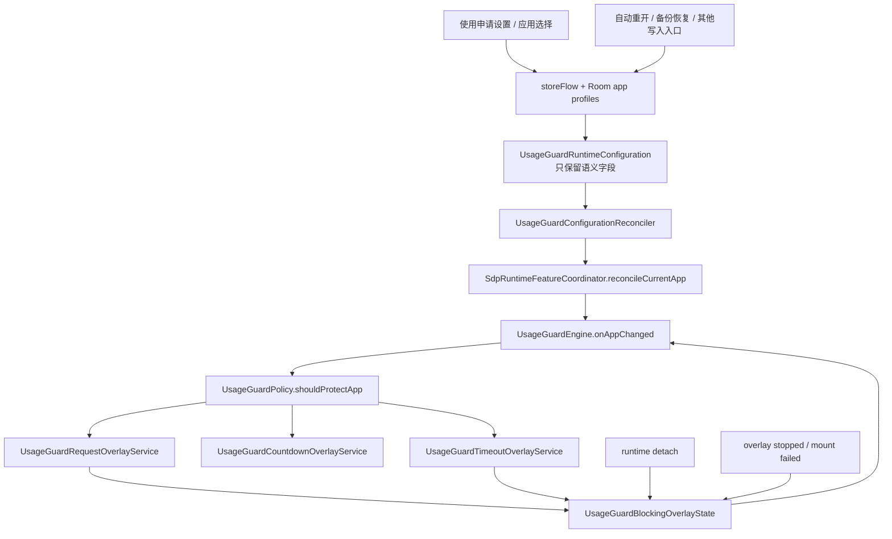

# 使用申请运行时重算与悬浮层状态修复 Implementation Plan

> **For Codex:** REQUIRED SUB-SKILL: Use `superpowers:executing-plans` to implement this plan task-by-task. 开始前使用 `superpowers:using-git-worktrees`；每个修复增量使用 `superpowers:systematic-debugging` 和 `superpowers:test-driven-development`；完成前使用 `superpowers:requesting-code-review`、`superpowers:verification-before-completion` 和 `superpowers:finishing-a-development-branch`。

**Goal:** 修复“数字自律 → 使用申请”中受控应用已加入严格/普通模式、但打开应用不弹使用申请表单的问题，并保证配置更新、运行时断开重连、悬浮层取消或异常销毁后都能恢复正常判定。

**Architecture:** 不采用只在 `UsageGuardVm` 保存完成后手动重算的 UI 层补丁。由 `UsageGuardEngine` 观察运行判定所依赖的设置与 Room 配置，生成不包含 `updatedAt` 的语义快照；快照变化后通过现有 `SdpRuntimeFeatureCoordinator.reconcileCurrentApp()` 重新判断当前前台应用。同时把请求/超时悬浮层的内存标记收敛为可测试的状态对象，任何停止、取消、挂载失败或运行时断开都先清理状态，再进行受 owner/token 保护的后续动作。

**Tech Stack:** Android 8.0+（minSdk 26）、Kotlin、Kotlin Coroutines/Flow、Room 2.8.4、`AccessibilityService`、UiAutomation/Shizuku、Jetpack Compose、`LifecycleService`、`WindowManager.TYPE_APPLICATION_OVERLAY`、JUnit 4、Gradle/JDK 21、GitHub CLI、GitHub Actions。

---

## 一、执行前必须理解的结论

### 1. 上一份“已修复”总结不能作为代码基线

截至本计划编写时，仓库实际状态为：

- `main` 与 `origin/main` 均为 `ac83a82b4c3783fb32fa10c55bdcf1aec9e1658c`。
- GitHub 远端只有 `main` 分支。
- 提交 `4c0752e8` 不存在于本地对象库和 GitHub 仓库。
- 不存在标题为 `fix: re-evaluate usage requests after app configuration changes` 的 PR。
- 不存在以下声称已新增的文件：
  - `app/src/main/kotlin/li/songe/gkd/sdp/ui/UsageGuardConfigurationReconciler.kt`
  - `app/src/test/kotlin/li/songe/gkd/sdp/ui/UsageGuardConfigurationReconcilerTest.kt`
- 没有任何 GitHub Actions 运行验证过该提交。

执行者必须以最新 `origin/main` 为准重新实现，不得假设 `4c0752e8` 可以 cherry-pick，也不得在交付说明中引用不存在的 PR 或 CI 结果。

### 2. “配置保存竞态”存在可能性，但不足以解释持续失效

当前选择器确认后立即关闭对话框：

```kotlin
onConfirm = {
    vm.saveSelectedTargets(it)
    showSelectedPicker = false
}
```

而 `saveSelectedTargets()` 在 `viewModelScope.launch(Dispatchers.IO)` 中异步写 Room。若用户确认后立刻切到目标应用，前台应用事件可能先于数据库写入完成，`UsageGuardEngine` 会查询到旧配置；写入完成后没有新的前台应用事件，当前这一轮就会漏弹。

但这只能解释“保存后第一次立刻打开”这一窄场景。只要用户再次离开并重新打开目标应用，引擎就会重新查询 Room。若反复打开仍不弹，仅补一个 `persistAndReconcile()` 不能证明根因已修复。

### 3. 已确认存在更危险的悬浮层状态残留路径

当前 `UsageGuardEngine` 有两个进程内全局标记：

```kotlin
private var requestOverlayAppId: String? = null
private var timeoutOverlayAppId: String? = null
```

只要任意一个非空，所有受控应用都会在下面的分支直接返回：

```kotlin
if (requestOverlayAppId != null || timeoutOverlayAppId != null) {
    stopCountdownOverlay(...)
    return
}
```

最近的 owner/token 加固又让停止回调在运行时不存在或前台应用已变化时提前返回：

```kotlin
val owner = sdpRuntimeFeatureCoordinator.currentOwner() ?: return@withLock
if (appId != null && !isCurrentRequest(appId, owner, token)) return@withLock
```

与此同时，`onRuntimeDisconnected()` 只清理倒计时状态，没有清理 `requestOverlayAppId` 或 `timeoutOverlayAppId`。因此可以构造以下确定的代码路径：

1. 请求表单或超时层已启动，内存标记被置为非空。
2. 无障碍/Automation 运行时断开，coordinator 先把 `currentOwner` 设为 `null`。
3. 悬浮层随后销毁并回调 `onRequestOverlayStopped()` / `onTimeoutOverlayStopped()`。
4. 回调因没有 owner 而在清理标记之前返回。
5. 运行时重连后，残留标记让后续所有使用申请在统一短路分支退出，直到应用进程重启。

这条路径与用户描述的“基础功能在一系列更新后持续失效”更吻合。计划必须同时修复配置重算和悬浮层生命周期；只做其中一个不算完成。

### 4. 设备侧根因仍需验证，不得伪造

本计划来自源码、Git 历史和 GitHub 状态审计，当前没有连接用户手机，也没有设备日志。因此：

- 可以确认代码中存在配置漏重算窗口和悬浮层状态残留缺陷。
- 不能在没有真机证据时宣称用户手机只命中了其中某一条路径。
- 实施后必须用自动化测试覆盖两条路径，并从 GitHub Actions 下载 APK 做真机冒烟；若执行环境没有设备，要明确记录“真机验证待用户完成”，不能写成已经验证。

---

## 二、范围与非目标

### 本次必须修复

1. 使用申请总开关、作用范围、默认模式或应用 profile 发生语义变化后，重新判断当前前台应用。
2. 受控应用保存完成晚于前台切换时，保存完成后仍能补触发申请表单。
3. 请求层取消、成功提交、异常挂载、被其他悬浮层停止、前台应用变化以及运行时断开时，阻塞标记都能回收。
4. 无障碍模式与 Automation/Shizuku 模式行为一致。
5. 严格模式、普通模式、全局白名单、专注模式和应用拦截优先级保持不变。
6. 缺少悬浮窗权限或 Service/Window 启动失败时，不得留下“已经显示”的假状态。
7. 最近一次判定不得再以无诊断信息的方式静默停在“已有悬浮层”分支。

### 本次明确不做

- 不修改 Room schema，不增加数据库版本或迁移。
- 不改变申请理由最少字数、标签、申请时长或记录语义。
- 不改变普通模式与严格模式的产品定义。
- 不修改倒计时理由横条的截图隐藏行为。
- 不重做数字自律 UI，不引入新的第三方依赖。
- 不借机重构专注模式、应用拦截或 URL 拦截业务。
- 不通过定时轮询前台应用来掩盖事件/状态错误。

---

## 三、方案比较

### 方案 A：仅在 `UsageGuardVm` 保存后调用 `reconcileCurrentApp()`

优点：改动少，能覆盖“选中应用保存晚于前台切换”的直接竞态。

缺点：

- 只能覆盖经过该 ViewModel 的写入。
- 会漏掉自动重开、备份恢复以及未来其他写入入口。
- 不处理 `requestOverlayAppId` / `timeoutOverlayAppId` 残留。
- 一个只验证“先 persist、后 reconcile”顺序的测试，不能证明实际表单会恢复。

结论：可作为补充，但不能独立作为本次修复。

### 方案 B：运行时配置语义快照 + 悬浮层状态机（采用）

做法：

- 将影响使用申请判定的设置和 app profile 映射为稳定的语义快照。
- `UsageGuardEngine` 观察快照，初始加载及每次实际变化都请求 coordinator 重算当前 app。
- 将请求/超时层标记放入小型可测试状态对象。
- 所有结束回调先无条件回收“与该 app 匹配”的状态，再检查 owner/token 是否允许执行倒计时等后续副作用。
- 运行时真正断开时清空全部阻塞状态并停止三个使用申请 Overlay Service；重连时由 coordinator 对当前 app 做幂等重算。

优点：覆盖所有当前配置来源，能修复长期卡死状态，测试边界清晰，不需要轮询。

代价：比 UI 单点补丁多一个小型状态对象和一个配置观察器。

### 方案 C：每隔数秒轮询配置和前台应用

优点：表面上容易兜底。

缺点：浪费电量、引入弹层延迟和重复启动风险，掩盖生命周期问题，难以保证优先级与幂等。

结论：拒绝。

---

## 四、目标运行链路



必须维持以下不变量：

1. Room 的 `suspend insert()` 返回后才允许认为该次 profile 已持久化。
2. `updatedAt`、profile 查询顺序等非语义变化不能触发重算风暴。
3. 第一次有效配置快照也要允许重算，以覆盖 engine 初始化与 Room 首次加载的时序。
4. 同一语义快照重复发射不重算。
5. Overlay 停止回调的“状态回收”不依赖当前 owner，也不依赖该 app 仍在前台。
6. owner/token 只保护重新显示倒计时、关闭记录等后续副作用，不能阻止资源和内存状态清理。
7. runtime disconnect 不关闭有效的 `UsageGuardRecord`；重连后仍按原有严格/普通模式规则判断。
8. 同一时刻最多存在一个请求层或超时层；状态与实际 Service 生命周期最终一致。

---

## 五、文件地图

### Create

- `app/src/main/kotlin/li/songe/gkd/sdp/a11y/UsageGuardBlockingOverlayState.kt`
- `app/src/main/kotlin/li/songe/gkd/sdp/a11y/UsageGuardConfigurationReconciler.kt`
- `app/src/test/kotlin/li/songe/gkd/sdp/a11y/UsageGuardBlockingOverlayStateTest.kt`
- `app/src/test/kotlin/li/songe/gkd/sdp/a11y/UsageGuardConfigurationReconcilerTest.kt`

### Modify

- `app/src/main/kotlin/li/songe/gkd/sdp/a11y/UsageGuardEngine.kt`
- `app/src/test/kotlin/li/songe/gkd/sdp/a11y/SdpRuntimeFeatureCoordinatorTest.kt`

### Inspect, normally do not modify

- `app/src/main/kotlin/li/songe/gkd/sdp/ui/UsageGuardVm.kt`
- `app/src/main/kotlin/li/songe/gkd/sdp/ui/UsageGuardPage.kt`
- `app/src/main/kotlin/li/songe/gkd/sdp/a11y/SdpRuntimeFeatureCoordinator.kt`
- `app/src/main/kotlin/li/songe/gkd/sdp/service/UsageGuardRequestOverlayService.kt`
- `app/src/main/kotlin/li/songe/gkd/sdp/service/UsageGuardTimeoutOverlayService.kt`
- `app/src/main/kotlin/li/songe/gkd/sdp/service/UsageGuardCountdownOverlayService.kt`
- `app/src/main/kotlin/li/songe/gkd/sdp/service/AccessibilityGuardOverlayService.kt`
- `app/src/main/kotlin/li/songe/gkd/sdp/service/AutoReenableEnforcer.kt`
- `.github/workflows/ci.yml`

如果执行过程中发现必须修改 “normally do not modify” 文件，先用失败测试证明原因，并在 PR 说明中单独列出；不得顺手重构。

---

## 六、任务拆分

### Task 0：建立隔离工作区并重新确认基线

**Files:**

- Inspect: repository and GitHub metadata only

**Step 1：读取执行技能并检查工作区**

使用 `superpowers:using-git-worktrees` 创建隔离工作区。执行前运行：

```bash
git fetch origin --prune
git status --short --branch
git worktree list --porcelain
git branch --all --verbose --no-abbrev
```

Expected：主工作区无未提交变更；若存在用户变更，保留并避开，不得 reset、checkout 或覆盖。

**Step 2：建立任务分支**

建议分支：

```text
codex/usage-guard-request-runtime-repair
```

建议 worktree：

```text
.worktrees/usage-guard-request-runtime-repair
```

worktree 必须从最新 `origin/main` 创建。不要在 `main` 上直接开发。

**Step 3：核验上一份摘要**

```bash
git cat-file -e '4c0752e8^{commit}'
gh pr list --repo wskeei/gkd-SDP --state all \
  --search 're-evaluate usage requests after app configuration changes'
rg --files app/src/main/kotlin app/src/test/kotlin \
  | rg 'UsageGuardConfigurationReconciler'
```

Expected：在当前基线仍应找不到该提交、PR 和文件。如果执行时它们已经出现，必须先逐行审查，不能同时保留两套 reconciliation 实现。

**Step 4：记录现有控制流证据**

```bash
rg -n 'requestOverlayAppId|timeoutOverlayAppId|onRuntimeDisconnected|onRequestOverlayStopped|onTimeoutOverlayStopped' \
  app/src/main/kotlin/li/songe/gkd/sdp/a11y/UsageGuardEngine.kt
rg -n 'usageGuardEnabled|usageGuardScopeMode|usageGuardDefaultGrantMode|usageGuardAppProfileDao' \
  app/src/main/kotlin/li/songe/gkd/sdp
```

Expected：确认所有配置来源以及所有阻塞状态读写点，作为后续完整替换清单。

---

### Task 1：用失败测试固定阻塞 Overlay 状态语义

**Files:**

- Create: `app/src/test/kotlin/li/songe/gkd/sdp/a11y/UsageGuardBlockingOverlayStateTest.kt`
- Create later: `app/src/main/kotlin/li/songe/gkd/sdp/a11y/UsageGuardBlockingOverlayState.kt`

**Step 1：写状态回收测试**

测试至少覆盖：

```kotlin
package li.songe.gkd.sdp.a11y

import org.junit.Assert.assertEquals
import org.junit.Assert.assertFalse
import org.junit.Assert.assertNull
import org.junit.Assert.assertTrue
import org.junit.Test

class UsageGuardBlockingOverlayStateTest {
    @Test
    fun matchingRequestStopClearsStateEvenWithoutRuntimeContext() {
        val state = UsageGuardBlockingOverlayState()
        state.markRequestStarted("com.example.video")

        assertTrue(state.clearRequest("com.example.video"))
        assertFalse(state.hasBlockingOverlay)
        assertNull(state.requestAppId)
    }

    @Test
    fun staleStopFromAnotherAppDoesNotClearCurrentRequest() {
        val state = UsageGuardBlockingOverlayState()
        state.markRequestStarted("com.example.reader")

        assertFalse(state.clearRequest("com.example.old"))
        assertEquals("com.example.reader", state.requestAppId)
    }

    @Test
    fun runtimeDisconnectClearsRequestAndTimeoutState() {
        val state = UsageGuardBlockingOverlayState()
        state.markTimeoutStarted("com.example.video")

        state.clearAll()

        assertFalse(state.hasBlockingOverlay)
        assertNull(state.requestAppId)
        assertNull(state.timeoutAppId)
    }

    @Test
    fun startingTimeoutReplacesAnyRequestState() {
        val state = UsageGuardBlockingOverlayState()
        state.markRequestStarted("com.example.reader")

        state.markTimeoutStarted("com.example.video")

        assertNull(state.requestAppId)
        assertEquals("com.example.video", state.timeoutAppId)
    }

    @Test
    fun successfulGrantCanClearRequestBeforeServiceDestroyCallback() {
        val state = UsageGuardBlockingOverlayState()
        state.markRequestStarted("com.example.reader")

        assertTrue(state.clearRequest("com.example.reader"))
        assertFalse(state.hasBlockingOverlay)
    }
}
```

再补充：

- `clearRequest(null)` 能清理未知/损坏 Intent 对应的请求状态。
- `clearTimeout()` 与 request 具有相同的匹配规则。
- `activeKind` 能区分 `request` 与 `timeout`，用于安全诊断。

**Step 2：运行测试并确认红灯原因正确**

```bash
./gradlew :app:testGkdDebugUnitTest \
  --tests li.songe.gkd.sdp.a11y.UsageGuardBlockingOverlayStateTest
```

Expected：FAIL，原因是 `UsageGuardBlockingOverlayState` 尚不存在；不能接受 Gradle 下载失败以外的无关编译错误。

---

### Task 2：实现最小阻塞 Overlay 状态对象

**Files:**

- Create: `app/src/main/kotlin/li/songe/gkd/sdp/a11y/UsageGuardBlockingOverlayState.kt`
- Test: `app/src/test/kotlin/li/songe/gkd/sdp/a11y/UsageGuardBlockingOverlayStateTest.kt`

**Step 1：实现纯 Kotlin 状态对象**

建议最小实现：

```kotlin
package li.songe.gkd.sdp.a11y

internal class UsageGuardBlockingOverlayState {
    var requestAppId: String? = null
        private set
    var timeoutAppId: String? = null
        private set

    val hasBlockingOverlay: Boolean
        get() = requestAppId != null || timeoutAppId != null

    val activeKind: String?
        get() = when {
            requestAppId != null -> "request"
            timeoutAppId != null -> "timeout"
            else -> null
        }

    fun markRequestStarted(appId: String) {
        requestAppId = appId
        timeoutAppId = null
    }

    fun markTimeoutStarted(appId: String) {
        requestAppId = null
        timeoutAppId = appId
    }

    fun clearRequest(appId: String?): Boolean {
        if (appId != null && requestAppId != appId) return false
        val changed = requestAppId != null
        requestAppId = null
        return changed
    }

    fun clearTimeout(appId: String?): Boolean {
        if (appId != null && timeoutAppId != appId) return false
        val changed = timeoutAppId != null
        timeoutAppId = null
        return changed
    }

    fun clearAll() {
        requestAppId = null
        timeoutAppId = null
    }
}
```

约束：

- 类本身不访问 Android、Room、全局单例或协程。
- 线程安全继续由 `UsageGuardEngine.stateMutex` 提供，不在这个类里新增锁。
- `markRequestStarted()` 与 `markTimeoutStarted()` 必须互相替换，确保 request/timeout 不会同时被标记为 active。
- 不保存理由、应用名或任何隐私数据。

**Step 2：运行定向测试**

```bash
./gradlew :app:testGkdDebugUnitTest \
  --tests li.songe.gkd.sdp.a11y.UsageGuardBlockingOverlayStateTest
```

Expected：PASS。

**Step 3：提交第一个增量**

```bash
git add \
  app/src/main/kotlin/li/songe/gkd/sdp/a11y/UsageGuardBlockingOverlayState.kt \
  app/src/test/kotlin/li/songe/gkd/sdp/a11y/UsageGuardBlockingOverlayStateTest.kt
git commit -m "test: cover usage guard overlay lifecycle state"
```

---

### Task 3：接入状态对象并修复 runtime disconnect 卡死

**Files:**

- Modify: `app/src/main/kotlin/li/songe/gkd/sdp/a11y/UsageGuardEngine.kt`
- Test: `app/src/test/kotlin/li/songe/gkd/sdp/a11y/UsageGuardBlockingOverlayStateTest.kt`

**Step 1：用状态对象替换两个裸字段**

删除：

```kotlin
private var requestOverlayAppId: String? = null
private var timeoutOverlayAppId: String? = null
```

新增：

```kotlin
private val blockingOverlayState = UsageGuardBlockingOverlayState()
```

必须替换文件内全部读写点，最终下面的搜索不得再命中旧字段声明或直接赋值：

```bash
rg -n 'requestOverlayAppId\s*=|timeoutOverlayAppId\s*=' \
  app/src/main/kotlin/li/songe/gkd/sdp/a11y/UsageGuardEngine.kt
```

**Step 2：停止回调必须先清状态**

`onRequestOverlayStopped()` 的顺序必须是：

```kotlin
stateMutex.withLock {
    blockingOverlayState.clearRequest(appId)
    val owner = sdpRuntimeFeatureCoordinator.currentOwner() ?: return@withLock
    val token = appChangeToken.get()
    if (appId == null || !isCurrentRequest(appId, owner, token)) return@withLock

    val record = DbSet.usageGuardRecordDao.getActiveRecord(appId) ?: run {
        stopCountdownOverlay(appId = appId, owner = owner, token = token)
        return@withLock
    }
    scheduleExpiryWatch(record, owner, token)
    syncCountdownOverlay(
        activeRecord = record,
        foregroundAppId = appId,
        owner = owner,
        token = token,
    )
}
```

关键点：owner/token 检查只能阻止后续倒计时副作用，不能阻止 `clearRequest()`。

`onTimeoutOverlayStopped()` 和 `onCountdownOverlayStopped()` 同样先回收本地状态，不再因为 `currentOwner() == null` 而跳过清理。

**Step 3：成功提交申请时提前清 request 状态**

`onRequestGranted(appId)` 进入 mutex 后，必须先执行：

```kotlin
blockingOverlayState.clearRequest(appId)
```

然后再读取 owner/token 和 active record。这样不依赖 `Service.onDestroy()` 与 `onRequestGranted()` 两个异步任务的先后顺序。

**Step 4：运行时断开时做对称 teardown**

`onRuntimeDisconnected()` 必须：

1. 递增 `appChangeToken`。
2. 进入 `stateMutex` 后再次检查 `sdpRuntimeFeatureCoordinator.currentOwner()`；如果已有新 owner 接管则退出，不能让旧 runtime 的异步 teardown 清掉新 runtime 刚启动的 Overlay。
3. 只有在确实没有新 owner 时，清空 `lastProtectedAppId`、expiry watch、blocking state 和 countdown state。
4. 停止以下三个 Service：
   - `UsageGuardRequestOverlayService`
   - `UsageGuardTimeoutOverlayService`
   - `UsageGuardCountdownOverlayService`
5. 不结束或删除任何 `UsageGuardRecord`。

可使用现有 `selfControlOverlayLauncher.stop(Intent(...))`。即使停止回调稍后到达，也只能得到已经清空的幂等状态。

关键结构应包含：

```kotlin
appScope.launch {
    stateMutex.withLock {
        if (sdpRuntimeFeatureCoordinator.currentOwner() != null) return@withLock
        // clear state and stop the three services
    }
}
```

这项二次检查不能移到协程启动之前，否则 detach 与新 owner attach 之间仍有竞态。

**Step 5：挂载失败和 Accepted 路径统一使用状态对象**

- `onOverlayMountFailed("request", appId)` 调用 `clearRequest(appId)`。
- `onOverlayMountFailed("timeout", appId)` 调用 `clearTimeout(appId)`。
- request 启动返回 `Accepted` 且 owner/token 仍有效时调用 `markRequestStarted(appId)`。
- timeout 启动返回 `Accepted` 且 owner/token 仍有效时调用 `markTimeoutStarted(appId)`。
- `syncCountdownOverlay()` 读取 `blockingOverlayState.requestAppId` 与 `timeoutAppId`。

**Step 6：禁止静默短路**

原“已有请求/超时层就直接 return”的分支改为：

```kotlin
if (blockingOverlayState.hasBlockingOverlay) {
    sdpRuntimeFeatureCoordinator.recordDecision(
        owner,
        "usage-guard",
        packageName,
        "blocking_overlay_${blockingOverlayState.activeKind ?: "unknown"}",
    )
    stopCountdownOverlay(appId = packageName, owner = owner, token = token)
    return
}
```

日志只包含公开状态和包名，不记录理由文本。

**Step 7：运行定向与相关测试**

```bash
./gradlew :app:testGkdDebugUnitTest \
  --tests li.songe.gkd.sdp.a11y.UsageGuardBlockingOverlayStateTest \
  --tests li.songe.gkd.sdp.util.UsageGuardCountdownOverlayPolicyTest \
  --tests li.songe.gkd.sdp.a11y.SdpRuntimeFeatureCoordinatorTest
```

Expected：PASS。

**Step 8：提交第二个增量**

```bash
git add \
  app/src/main/kotlin/li/songe/gkd/sdp/a11y/UsageGuardEngine.kt \
  app/src/main/kotlin/li/songe/gkd/sdp/a11y/UsageGuardBlockingOverlayState.kt \
  app/src/test/kotlin/li/songe/gkd/sdp/a11y/UsageGuardBlockingOverlayStateTest.kt
git commit -m "fix: recover usage guard after overlay teardown"
```

---

### Task 4：用失败测试定义配置语义快照与重算规则

**Files:**

- Create: `app/src/test/kotlin/li/songe/gkd/sdp/a11y/UsageGuardConfigurationReconcilerTest.kt`
- Create later: `app/src/main/kotlin/li/songe/gkd/sdp/a11y/UsageGuardConfigurationReconciler.kt`

**Step 1：写纯 Kotlin 回归测试**

测试必须覆盖：

1. 第一份有效快照触发一次 reconcile。
2. 完全相同的快照重复到达不触发。
3. `enabled`、`scopeMode`、`defaultGrantMode` 任一变化会触发。
4. profile 的 `selectedTarget`、`globalWhitelist`、`grantMode` 任一变化会触发。
5. 仅 `updatedAt` 或列表顺序变化不触发。
6. reconcile reason 固定为 `usage-guard-configuration-updated`。

测试轮廓：

```kotlin
@Test
fun semanticConfigurationChangesReconcileCurrentAppExactlyOnce() {
    val reasons = mutableListOf<String>()
    val reconciler = UsageGuardConfigurationReconciler(reasons::add)
    val initial = UsageGuardRuntimeConfiguration(
        enabled = true,
        scopeMode = UsageGuardPolicy.SCOPE_SELECTED_ONLY,
        defaultGrantMode = UsageGuardPolicy.GRANT_MODE_RESUMABLE,
        profiles = listOf(
            UsageGuardRuntimeConfiguration.AppProfile(
                appId = "com.example.video",
                selectedTarget = true,
                globalWhitelist = false,
                grantMode = UsageGuardPolicy.GRANT_MODE_RESUMABLE,
            )
        ),
    )

    reconciler.accept(initial)
    reconciler.accept(initial)
    reconciler.accept(initial.copy(enabled = false))

    assertEquals(
        listOf(
            "usage-guard-configuration-updated",
            "usage-guard-configuration-updated",
        ),
        reasons,
    )
}
```

另写映射测试，用两个只在 `updatedAt` 和输入顺序上不同的 `UsageGuardAppProfile` 列表断言生成的快照相等。

**Step 2：运行测试并确认红灯**

```bash
./gradlew :app:testGkdDebugUnitTest \
  --tests li.songe.gkd.sdp.a11y.UsageGuardConfigurationReconcilerTest
```

Expected：FAIL，原因是新类型尚未实现。

---

### Task 5：实现配置语义快照和幂等 reconciler

**Files:**

- Create: `app/src/main/kotlin/li/songe/gkd/sdp/a11y/UsageGuardConfigurationReconciler.kt`
- Test: `app/src/test/kotlin/li/songe/gkd/sdp/a11y/UsageGuardConfigurationReconcilerTest.kt`

**Step 1：实现语义快照**

建议结构：

```kotlin
package li.songe.gkd.sdp.a11y

import li.songe.gkd.sdp.data.UsageGuardAppProfile
import li.songe.gkd.sdp.store.SettingsStore

internal data class UsageGuardRuntimeConfiguration(
    val enabled: Boolean,
    val scopeMode: Int,
    val defaultGrantMode: Int,
    val profiles: List<AppProfile>,
) {
    data class AppProfile(
        val appId: String,
        val selectedTarget: Boolean,
        val globalWhitelist: Boolean,
        val grantMode: Int,
    )

    companion object {
        fun from(
            settings: SettingsStore,
            profiles: List<UsageGuardAppProfile>,
        ): UsageGuardRuntimeConfiguration {
            return UsageGuardRuntimeConfiguration(
                enabled = settings.usageGuardEnabled,
                scopeMode = settings.usageGuardScopeMode,
                defaultGrantMode = settings.usageGuardDefaultGrantMode,
                profiles = profiles.map { profile ->
                    AppProfile(
                        appId = profile.appId,
                        selectedTarget = profile.selectedTarget,
                        globalWhitelist = profile.globalWhitelist,
                        grantMode = profile.grantMode,
                    )
                }.sortedBy(AppProfile::appId),
            )
        }
    }
}
```

不要把 `updatedAt`、应用名称、理由、历史记录或时长选项放入快照。时长与理由门槛由已显示的表单直接观察 `storeFlow`，不影响“是否保护当前 app”的判定。

**Step 2：实现幂等 reconciler**

```kotlin
internal class UsageGuardConfigurationReconciler(
    private val reconcileCurrentApp: (reason: String) -> Unit,
) {
    private var lastConfiguration: UsageGuardRuntimeConfiguration? = null

    fun accept(configuration: UsageGuardRuntimeConfiguration) {
        if (lastConfiguration == configuration) return
        lastConfiguration = configuration
        reconcileCurrentApp("usage-guard-configuration-updated")
    }
}
```

第一份快照触发一次是有意行为：它可补偿 engine 初始化、Room 首次发射和 runtime attach 之间的时序差；没有 owner 时现有 coordinator 会安全地不分发。

**Step 3：运行定向测试**

```bash
./gradlew :app:testGkdDebugUnitTest \
  --tests li.songe.gkd.sdp.a11y.UsageGuardConfigurationReconcilerTest
```

Expected：PASS。

**Step 4：提交第三个增量**

```bash
git add \
  app/src/main/kotlin/li/songe/gkd/sdp/a11y/UsageGuardConfigurationReconciler.kt \
  app/src/test/kotlin/li/songe/gkd/sdp/a11y/UsageGuardConfigurationReconcilerTest.kt
git commit -m "test: define usage guard configuration reconciliation"
```

---

### Task 6：在 `UsageGuardEngine` 观察所有配置来源

**Files:**

- Modify: `app/src/main/kotlin/li/songe/gkd/sdp/a11y/UsageGuardEngine.kt`
- Modify: `app/src/test/kotlin/li/songe/gkd/sdp/a11y/SdpRuntimeFeatureCoordinatorTest.kt`
- Test: `app/src/test/kotlin/li/songe/gkd/sdp/a11y/UsageGuardConfigurationReconcilerTest.kt`

**Step 1：增加 coordinator 的同 app 手动重算特征测试**

在 `SdpRuntimeFeatureCoordinatorTest` 增加：

```kotlin
@Test
fun manualReconcileRedispatchesTheSameForegroundApp() = runBlocking {
    val foreground = MutableStateFlow("com.example.video")
    val seen = mutableListOf<String>()
    val coordinator = coordinator(foreground) {
        onAppChanged = { appId, _ -> seen += appId }
    }

    coordinator.attach("a11y", AutomatorModeOption.A11yMode)
    awaitCondition { seen.size == 1 }

    coordinator.reconcileCurrentApp("usage-guard-configuration-updated")
    awaitCondition { seen.size == 2 }

    assertEquals(
        listOf("com.example.video", "com.example.video"),
        seen,
    )
}
```

该测试是对现有基础设施的特征锁定；若失败，先修正对 coordinator 行为的理解，不得绕过它另建轮询器。

**Step 2：在 engine 中创建单一 reconciler**

```kotlin
private val configurationReconciler = UsageGuardConfigurationReconciler { reason ->
    sdpRuntimeFeatureCoordinator.reconcileCurrentApp(reason)
}
```

**Step 3：观察 store 与 Room 的语义组合**

在 `UsageGuardEngine` 的 `init` 中启动一个 `appScope` collector：

```kotlin
init {
    appScope.launch(Dispatchers.IO) {
        combine(
            storeFlow,
            DbSet.usageGuardAppProfileDao.queryAll(),
        ) { settings, profiles ->
            UsageGuardRuntimeConfiguration.from(settings, profiles)
        }.collect(configurationReconciler::accept)
    }
}
```

约束：

- 只允许一个 collector，不在 `UsageGuardVm`、页面和 Service 中各建一份。
- 使用 DAO 原始 Flow 的实际首次结果，不使用带 `emptyList()` 初值的 UI StateFlow 制造假配置。
- 快照自身完成去重；不得使用固定 `delay()` 或无限重试。
- 配置变化发生在 runtime disconnected 状态时允许 no-op；下一次 `attach()` 已有当前 app reconcile。
- 该观察器自然覆盖 `UsageGuardVm`、`AutoReenableEnforcer`、备份恢复和未来 Room 写入，不额外修改这些调用点。

**Step 4：不得叠加 UI-only reconciler**

不要再创建 `ui/UsageGuardConfigurationReconciler.kt`，也不要在 `UsageGuardVm` 的每个保存函数后重复调用 coordinator。若执行基线中已经出现类似改动，二选一保留运行时观察器，并删除重复调用，以免一次保存触发多次全功能分发。

**Step 5：运行定向测试**

```bash
./gradlew :app:testGkdDebugUnitTest \
  --tests li.songe.gkd.sdp.a11y.UsageGuardConfigurationReconcilerTest \
  --tests li.songe.gkd.sdp.a11y.SdpRuntimeFeatureCoordinatorTest \
  --tests li.songe.gkd.sdp.a11y.UsageGuardBlockingOverlayStateTest
```

Expected：PASS。

**Step 6：提交第四个增量**

```bash
git add \
  app/src/main/kotlin/li/songe/gkd/sdp/a11y/UsageGuardEngine.kt \
  app/src/test/kotlin/li/songe/gkd/sdp/a11y/SdpRuntimeFeatureCoordinatorTest.kt
git commit -m "fix: reconcile usage guard after configuration changes"
```

---

### Task 7：做静态审计和完整 JVM 回归

**Files:**

- Inspect all changed files

**Step 1：确认没有漏掉旧状态字段**

```bash
rg -n 'requestOverlayAppId|timeoutOverlayAppId' \
  app/src/main/kotlin/li/songe/gkd/sdp/a11y/UsageGuardEngine.kt
rg -n 'blockingOverlayState' \
  app/src/main/kotlin/li/songe/gkd/sdp/a11y/UsageGuardEngine.kt
```

Expected：旧名字只能在传给 `UsageGuardCountdownOverlayPolicy` 的局部命名参数中出现；所有真实状态读写都经过 `blockingOverlayState`。

**Step 2：确认配置写入覆盖范围**

```bash
rg -n 'usageGuardEnabled\s*=|usageGuardScopeMode\s*=|usageGuardDefaultGrantMode\s*=|usageGuardAppProfileDao\.(insert|deleteUnusedProfiles)' \
  app/src/main/kotlin
```

Expected：无论写入来自 UI、自动重开或其他入口，最终都改变 `storeFlow` 或 DAO Flow，能被唯一配置观察器看到。

**Step 3：运行完整单元测试与 lint**

```bash
./gradlew \
  :selector:jvmTest \
  :app:testGkdDebugUnitTest \
  :app:lintGkdDebug \
  :app:lintPlayDebug
```

Expected：全部 PASS，lint 无新增错误。

**Step 4：构建三个 CI 变体**

```bash
./gradlew \
  :app:assembleGkdDebug \
  :app:assemblePlayDebug \
  :app:assembleGkdRelease
```

Expected：全部 BUILD SUCCESSFUL。

如果本地因 Gradle 分发包、JDK 或网络代理失败：

- 保留完整错误输出。
- 不把静态 `rg` 检查称为编译验证。
- 继续通过 GitHub Actions 执行相同任务。
- 只有 Actions 的 `quality` 与 `build` 都成功，才能写“编译通过”。

**Step 5：检查 diff 质量**

```bash
git diff --check origin/main...HEAD
git diff --stat origin/main...HEAD
git diff origin/main...HEAD -- \
  app/src/main/kotlin/li/songe/gkd/sdp/a11y/UsageGuardEngine.kt \
  app/src/main/kotlin/li/songe/gkd/sdp/a11y/UsageGuardBlockingOverlayState.kt \
  app/src/main/kotlin/li/songe/gkd/sdp/a11y/UsageGuardConfigurationReconciler.kt \
  app/src/test/kotlin/li/songe/gkd/sdp/a11y
```

Expected：无空白错误、无无关 UI/数据库/依赖改动。

---

### Task 8：真机/人工验收矩阵

**Files:**

- No source changes unless a failing case produces a new test first

从 GitHub Actions 的 `ci-apk-outputs-<run_id>` 下载 `GkdDebug` APK。每个场景记录“运行模式、权限、设置、步骤、结果”；日志不得记录申请理由正文。

| 场景 | 操作 | 预期 |
|---|---|---|
| 普通模式，正常保存 | 加入目标应用，等“受控应用已保存”后打开 | 弹使用申请表单 |
| 普通模式，立即切换 | 确认选择后立刻打开目标应用 | 保存完成后补弹表单，不要求再次切换 |
| 严格模式 | 加入严格模式后打开 | 弹表单；离开后授权按原规则结束 |
| 取消后重开 | 表单点取消回桌面，再打开目标应用 | 再次弹表单，不被旧 request 状态短路 |
| 提交后回调竞态 | 提交申请后快速切换应用再返回 | 有效期内显示倒计时；到期后显示超时层 |
| runtime 断开 | 表单显示时关闭无障碍/Automation，再重新连接 | 旧层被清理；重连后当前/下次目标 app 能重新判定 |
| 无障碍与 Automation | 两种模式分别执行普通模式用例 | 两种模式均弹表单 |
| 悬浮窗权限缺失 | 撤销权限后打开目标 app | 不崩溃、不留下假 active 状态；恢复权限并重新进入后可弹 |
| 全局模式白名单 | 全局生效，白名单/非白名单各测试一项 | 白名单跳过，非白名单弹表单 |
| 优先级 | 同一 app 同时命中专注/应用拦截/使用申请 | 保持专注 > 应用拦截 > 使用申请，不叠两层 |
| 普通模式有效记录 | 已批准后离开再返回 | 不重复申请，显示现有安全倒计时横条和理由 |
| 进程重启 | 强制停止并重开 GKD，再打开受控 app | Room 配置恢复并正常弹表单 |

若没有可用 Android 设备：

- 在 PR checklist 中将这些项目标记为 `Not run — no device available`。
- 提供 Actions APK artifact 链接供用户测试。
- 不得把“代码审查通过”替代为“真机功能已验证”。

---

### Task 9：GitHub Actions、代码审查、PR 与合并

**Files:**

- No new source files unless CI/review reveals a defect

**Step 1：确认提交边界**

```bash
git status --short --branch
git log --oneline --decorate origin/main..HEAD
git diff --check origin/main...HEAD
```

Expected：只有本计划列出的业务与测试文件；至少保留上述多个有意义的增量 commit，不要把所有开发过程挤成一个“fix”提交。

**Step 2：请求代码审查**

使用 `superpowers:requesting-code-review`，重点检查：

- 清理状态是否发生在 owner/token gate 之前。
- runtime disconnect 是否清除 request、timeout、countdown 三类状态和 Service。
- 是否可能关闭有效申请记录。
- 配置快照是否漏掉保护判定字段或误包含 `updatedAt`。
- 配置 collector 是否只创建一次。
- 是否引入重复 Overlay、死锁或 coordinator 递归重算。
- 测试是否验证生产类，而不是只对静态文本做 `rg` 计数。

解决所有 P0/P1/P2 反馈；每一项修改后重新运行对应定向测试。

**Step 3：推送任务分支并创建 PR**

```bash
git push -u origin codex/usage-guard-request-runtime-repair
gh pr create \
  --repo wskeei/gkd-SDP \
  --base main \
  --head codex/usage-guard-request-runtime-repair \
  --title "fix: restore usage request interception after runtime changes" \
  --body-file <prepared-pr-body.md>
```

PR 正文必须包含：

- 用户可见故障和复现步骤。
- 两条修复路径：配置重算、阻塞 Overlay 状态回收。
- 为什么 UI-only `persistAndReconcile` 不足。
- 单元测试、lint、构建结果。
- 真机矩阵结果或明确的未验证项。
- 不存在/未使用提交 `4c0752e8` 的说明。

临时 PR body 文件应放在系统临时目录，不要提交进仓库。

**Step 4：等待 GitHub Actions**

```bash
gh pr checks --repo wskeei/gkd-SDP --watch <PR_NUMBER>
```

必须成功：

- `CI / quality`
- `CI / build`
- `CI / dependency-review`
- 仓库要求的 CodeQL 或其他 required checks

如有失败，使用 `gh run view <RUN_ID> --log-failed` 读取真实日志；先定位根因、补失败测试、提交单一修复，再 push。不得通过重跑掩盖确定性失败。

**Step 5：合并前同步 main**

```bash
git fetch origin --prune
git rev-list --left-right --count origin/main...HEAD
```

若 `main` 已前进，在任务分支上 rebase 或合并最新 `origin/main`，解决冲突后重新运行定向测试并等待所有 Actions 重新通过。不得 force-push `main`。

**Step 6：完成合并**

只有以下条件同时满足才允许合并：

1. 全部 required checks 成功。
2. 没有未解决审查意见。
3. diff 只包含计划范围。
4. 自动化测试覆盖两条根因路径。
5. 真机结果已记录；若无设备，PR 明确标注限制且用户接受由 artifact 验证。

仓库允许 merge commit 时使用：

```bash
gh pr merge --repo wskeei/gkd-SDP <PR_NUMBER> --merge --delete-branch
```

使用 merge commit 可保留定期提交记录。若仓库规则只允许 squash，遵从规则，但 PR 中仍保留完整提交历史供审查。

**Step 7：同步本地并只清理本任务分支**

在主工作区执行：

```bash
git switch main
git pull --ff-only origin main
git fetch origin --prune
git status --short --branch
```

确认合并提交已在 `main` 后，移除本任务 worktree，并删除本地任务分支。只清理 `codex/usage-guard-request-runtime-repair`；不得删除其他用户或其他任务仍在使用的分支。

最终状态：

- 本地 `main` 与 `origin/main` 同步。
- 主工作区干净。
- PR 为 `MERGED`。
- 远端任务分支已删除。
- GitHub Actions 在合并提交上成功。

---

## 七、最终验收标准

以下各项全部满足才算完成：

- [ ] 添加到普通模式或严格模式的应用能触发使用申请表单。
- [ ] 保存后立即切到目标应用不会永久漏掉第一次申请。
- [ ] 配置已保存后反复打开目标应用不会持续静默失效。
- [ ] request/timeout Overlay 销毁时，无 owner 或前台已变化也能回收阻塞状态。
- [ ] runtime disconnect 清理全部 Overlay 内存状态和实际 Service。
- [ ] runtime reconnect 后无需杀进程即可恢复判定。
- [ ] 成功申请、取消、挂载失败、缺权限路径都不会留下假 active 状态。
- [ ] 自动重开或其他非 UI 配置写入也能触发当前 app 重算。
- [ ] 普通/严格、全局白名单、倒计时理由、截图隐藏和历史记录语义未回归。
- [ ] 无障碍与 Automation/Shizuku 两种运行模式均通过对应验证。
- [ ] 新测试验证真实生产状态对象和 coordinator 行为，不使用静态 `rg` 数量冒充行为测试。
- [ ] GitHub Actions 的 quality、build、dependency review 与 required checks 全部成功。
- [ ] PR 已审查并合并，任务分支已清理，本地与远端 `main` 已同步。

---

## 八、失败时的诊断顺序

若实现后真机仍不弹，不要继续叠补丁。按以下顺序读取 `SdpRuntimeFeatureCoordinator.statusFlow.lastDecision` 和日志：

1. `connected=false`：运行时未连接，先查 A11y/Automation attach。
2. `outside_scope`：读取总开关、scope 和目标 app profile 的实际值。
3. `focus_priority`：专注模式按设计优先。
4. `app_blocker_priority`：应用拦截按设计优先。
5. `blocking_overlay_request/timeout`：检查实际 Service 是否仍在运行；若没有，说明状态机仍有漏清理路径。
6. `request_MissingPermission`：悬浮窗权限问题。
7. `request_Rejected`：读取结构化失败类别，检查后台 Service 启动限制或安全异常。
8. `request_Accepted` 但无画面：检查 `UsageGuardRequestOverlayService.showOverlay()` 的 `WindowManager.addView()` 失败日志。
9. 已存在 active record：普通模式应显示倒计时，过期记录应显示 timeout，而不是新申请表单。

任何新增修复都必须先形成一个能失败的自动化测试或最小可复现脚本，然后再修改实现。
