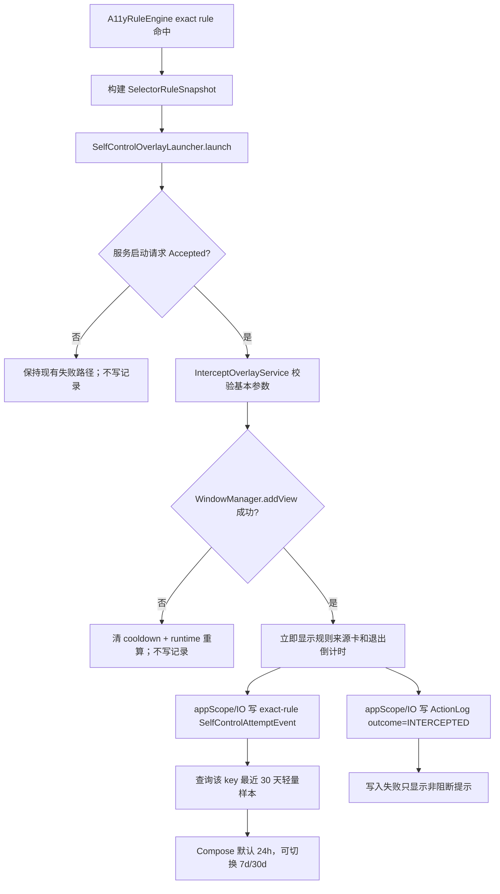
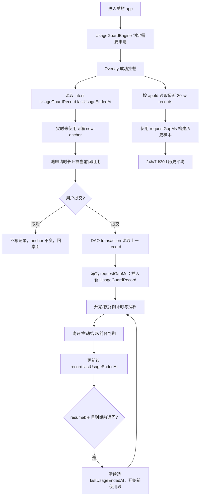

# 规则拦截归因、未使用间隔与“间用比” Implementation Plan

> **For Codex:** REQUIRED SUB-SKILL: Use superpowers:executing-plans to implement this plan task-by-task.

**Goal:** 修复“选择器规则已触发拦截但首页触发记录缺失”的确定性链路，在所有拦截 Overlay 中显示安全、可定位的规则来源；把使用申请间隔改为“上次实际结束使用到本次申请”的未使用间隔，并提供默认近 24 小时、可切换近 7 天/近 30 天的间隔与“间用比”洞察，最终通过自动化验证、PR、签名和资产核验发布一个新的 GKD-SDP prerelease。

**Architecture:** `ActionLog` 继续作为首页“触发记录”的唯一列表，但增加“动作已执行 / 命中后已拦截”的结果类型和规则名称快照；选择器拦截记录只能在 Overlay 真正挂载成功后写入，且绝不调用 `rule.trigger()`。`UsageGuardRecord` 继续作为成功申请的事实来源，新增“本次授权最后一次实际结束使用时间”和“申请前未使用间隔”字段；共享的纯 Kotlin policy 负责滚动时间窗、图表聚合和“间用比”计算，Compose 只消费轻量 UI model。所有洞察、归因和记录写入失败都必须降级，不得改变申请、拦截、冷却、锁定、自动重开、HOME 回退或两种 runtime owner 的既有行为。

**Tech Stack:** Kotlin/JVM 11、Android API 26–37、Jetpack Compose Material 3、Room 32 → 33、Kotlin Coroutines/Flow、Vico 2.0.0-alpha.28、JUnit 4、Python unittest、GitHub Actions/JDK 21、GitHub CLI、现有 release Environment 与签名/attestation 流程。

---

## 0. 文档状态、执行基线与授权边界

- 计划日期：2026-08-04，时区：Asia/Shanghai。
- 调研基线：`main` / `origin/main` 均为 `34594394`。
- 当前版本：`versionName=2.0.0-beta.3`，`versionCode=95`。
- 当前最新公开 Release：`v2.0.0-beta.3`，发布时间 2026-08-04。
- 当前 Room schema：32；本计划预计新增 schema 33。
- 推荐发布版本：`v2.0.0-beta.4` / `versionCode=96`。这只是当前基线下的推荐值；执行发布任务时必须重新查询 tag、Release 和 `gradle/version.properties`。若 beta.4 已被占用，使用下一个未占用 prerelease 与更大的 `versionCode`，不得复用或覆盖。
- 根工作区已有两份用户未跟踪文档：
  - `docs/plans/2026-08-03-digital-self-discipline-interval-insights.md`
  - `docs/plans/2026-08-03-usage-guard-request-runtime-repair.md`
  执行者不得删除、覆盖、格式化或提交它们。本计划是新的独立文件，不修改历史计划。
- 用户明确要求：**不把真机/OEM 验收设为开发或发布前置条件**。执行者不得伪造设备结论；Release 交接必须写明“未执行真机/OEM 验证”，由用户在公开 prerelease 后下载验证。
- 本计划授权的远端范围包括：功能 PR、等待并修复检查、合并功能 PR、发布版本 PR、合并发布 PR、创建并推送 annotated tag、等待 Release workflow、核验 Draft 资产并发布 prerelease。不得直接推送或强推 `main`，不得覆盖既有 tag/Release/资产。
- 本机当前没有可用 Java Runtime，且 `gradlew` 没有执行位。计划执行时可以用 `bash ./gradlew ...`；若执行环境仍无 JDK/Android SDK，则只运行可用静态/Python 检查，并以 GitHub Actions 为权威，不得修改 wrapper 或依赖来迁就本机。
- 实施前必须使用：
  - `@superpowers:using-git-worktrees`
  - `@superpowers:test-driven-development`
  - 遇到任何失败时使用 `@superpowers:systematic-debugging`
  - 完成前使用 `@superpowers:verification-before-completion`
  - PR 前使用 `@superpowers:requesting-code-review`
  - 合并/发布分支收尾使用 `@superpowers:finishing-a-development-branch`

## 1. 已确认的代码事实与根因

### 1.1 “触发了但没有记录”不是随机 Room 丢写

当前选择器执行链在 `A11yRuleEngine.queryAction()` 中是：

1. 规则 selector 找到 `target`；
2. 查询 `InterceptConfig`；
3. 若拦截启用且未临时放行，则启动 `InterceptOverlayService`；
4. 启动请求被接受后直接 `return`；
5. 只有未进入拦截分支时才调用 `rule.performAction(target)`；
6. 只有 `actionResult.result == true` 时才调用 `rule.trigger()` 和 `addActionLog(...)`。

因此，**凡是被拦截 Overlay 截住的选择器规则，都不会进入 `addActionLog()`**。首页标题虽然叫“触发记录”，表内实际只保存“动作执行成功”的记录。用户看到 Overlay，说明规则确实命中了，但当前代码设计上不会保存这次命中。这是本需求的已确认根因。

对应当前源码：

- `app/src/main/kotlin/li/songe/gkd/sdp/a11y/A11yRuleEngine.kt:455-505`：命中、启动拦截并提前返回；
- `app/src/main/kotlin/li/songe/gkd/sdp/a11y/A11yRuleEngine.kt:508-520`：动作成功后才记录；
- `app/src/main/kotlin/li/songe/gkd/sdp/a11y/A11yState.kt:284-313`：`addActionLog` 只接收成功动作；
- `app/src/main/kotlin/li/songe/gkd/sdp/data/ActionLog.kt`：没有 outcome 字段。

### 1.2 当前拦截 Overlay 只知道规则组，不知道具体规则

选择器拦截 Intent 当前只携带：

- `subsId`
- `groupKey`
- `message`
- `cooldown`
- group 级 `eventKey`
- 实际前台 `appId`
- 文案 `"规则组 <groupKey>"`

没有携带：

- subscription 名称/版本；
- group 名称与 groupType；
- exact rule 的 `name`、`key`、`index`；
- 命中时 activity；
- 命中时间。

而且当前 selector 间隔键为：

```text
selector_intercept:<subsId>:<actualAppId>:<groupKey>
```

同一个规则组内不同规则会被合并统计，与“定位是哪条规则”目标不一致。

### 1.3 当前申请间隔定义确实包含了获准使用时间

`SelfControlIntervalRepository.loadUsageRequestOverlay()` 把同 app 的 `requestedAt` 映射为事件，再用相邻 `requestedAt` 相减。`DigitalSelfDisciplineReviewPolicy.requestSamples()` 也使用：

```text
current.requestedAt - previous.requestedAt
```

所以当前申请间隔包括：

```text
上次提交申请 → 获准使用 → 离开/结束 → 未使用 → 本次申请
```

这与新需求不一致。

### 1.4 不能直接把 `UsageGuardRecord.endedAt` 当作实际结束使用

`UsageGuardRecord` 有 `endedAt`，但两种 grant mode 的语义不同：

- strict：离开受控应用会关闭 record，`endedAt` 接近实际离开时间；
- resumable：离开应用不会关闭 record，到授权到期前可以返回；`endedAt` 可能在更晚的到期/重算路径才写入。

一个 resumable record 期间还可能多次离开和返回。新定义需要的是**最后一次真实离开/终止使用的时间**，不是 record 最终关闭时间。因此必须增加独立事实字段，不能只改减法公式。

### 1.5 Overlay 成功边界必须继续保持

当前 `AppBlockerOverlayService` 和 `InterceptOverlayService` 只有在 `WindowManager.addView` 成功后才记录 `SelfControlAttemptEvent`；非法 Intent、重复 start、挂载失败不会记录。这个边界是仓库高风险不变量。

本计划要求：

- 选择器 `ActionLog` 的 intercepted 行也只能在 `addView` 成功后写入；
- `SelfControlOverlayLauncher.Accepted` 只代表服务启动请求被接受，不能当作“已展示”；
- 记录必须使用 `appScope`/进程级持久 scope，不能因 Service 立即退出被取消；
- 挂载失败继续清除暂定 cooldown 并触发 runtime 重算；
- 绝不因记录失败改变 10 秒倒计时、退出按钮或 HOME 路径。

## 2. 产品术语与统计口径（实现不得自行改义）

### 2.1 用户侧名称：间用比

采用名称：**间用比**。

固定解释文案：

> 间用比 = 上次结束使用后的未使用间隔 ÷ 本次申请时长

选择这个名字的理由：

- 比“间申比”更准确：分母是申请时长，但分子不是申请之间的完整时间；
- 比“休用比”中性：用户离开应用后不一定在休息；
- 比“自律分数/健康分”更可证实，不暗示医学或价值判断；
- 足够短，可以在手机表单和图表 metric 切换中显示。

替代方案及结论：

| 名称 | 问题 | 结论 |
| --- | --- | --- |
| 间申比 | 容易理解成“申请提交间隔 ÷ 申请时长”，与新口径不完全一致 | 不采用 |
| 休用比 | 把所有未使用该 app 的时间都称为“休息”，语义过度 | 不采用 |
| 使用节律指数 | 听起来像评分或诊断，公式不直观 | 不采用 |
| 间用比 | 简短、中性；配合固定公式即可理解 | **采用** |

### 2.2 未使用间隔

对某 app 的一次新申请：

```text
未使用间隔 = 本次 requestedAt - 上一个申请 record 的 lastUsageEndedAt
```

其中：

- `lastUsageEndedAt` 是上一份授权 record 下，最后一次可确认的实际使用结束时间；
- 它不是完整 session history：如果同一 resumable grant 后来又恢复使用，先前结束点不再是
  最终 anchor，必须先清为 null，等下一次真实离开再写；
- 本次申请表单尚未提交时，用 `now - lastUsageEndedAt` 实时展示；
- 提交成功时，把当时的差值冻结到新 record 的 `requestGapMs`；
- 取消表单不写 record、不改变 anchor，未使用间隔继续增长；
- 首次使用、升级后的旧记录、漏失结束事件或时钟回拨导致无法可靠计算时，值为未知，不显示为 0；
- 任一 timestamp 为负数时视为无效；只有两个非负 timestamp 且本次不早于 anchor 才相减；
- 0 毫秒合法，例如结束后立即重新申请；
- 负数无效，不能纳入图表、平均值或间用比。

### 2.3 什么算“实际结束使用”

以下事件更新当前 active `UsageGuardRecord.lastUsageEndedAt`：

1. 受控 app 从前台切到不同 app/Home；
2. strict record 因离开 app 被关闭；
3. 用户在倒计时悬浮条确认“结束使用”；
4. 授权在该 app 仍处于前台时到期。

若新申请提交时仍异常残留一条 active record，只能把它关闭为 `REPLACED`；不得把
`requestedAt` 猜成实际结束时间。原 row 已有字段可以原样保留，但这次新申请的
`requestGapMs` 必须为 null，因为 active 残留本身意味着 final end 不可证明。这样进程
死亡、force-stop 或漏失前台事件不会被伪装成 0 间隔。

resumable 模式下：

- 离开 app 只更新 `lastUsageEndedAt`，不关闭仍有效的授权；
- 在到期前返回 app 开始下一段使用时，把该 record 的 `lastUsageEndedAt` 清为 null；
- 在到期前返回 app 后再次离开，再次更新到更晚的结束时间；
- 下一次真正需要申请时，使用最后一次离开的时间。

若授权在用户已离开 app 后到期：

- 保留先前离开时记录的 `lastUsageEndedAt`；
- 关闭 record 时不得把到期检测时间覆盖成“实际使用结束”。

Android force-stop、进程被系统杀死或 runtime 完全断开时，平台可能不再给出离开事件。
由于进入/恢复使用时已经清除了旧候选结束点，该场景缺失时显示“暂无可用结束记录”，
不得回退到更早的一次离开或猜测。

### 2.4 间用比公式

历史单次样本：

```text
ratio = requestGapMs / (requestedDurationMinutes * 60_000)
```

当前表单样本：

```text
currentRatio = (now - previousLastUsageEndedAt) /
               (currentlySelectedDurationMinutes * 60_000)
```

实现时先把分钟转为 `Long` 再乘 `60_000L`，禁止先做 Int 乘法后再转换。

规则：

- 只对使用申请计算；应用拦截、选择器拦截、网址拦截没有申请时长分母，不显示间用比；
- `requestGapMs == null`、负数、申请时长 `<= 0` 时无样本；
- 历史平均值是**每次有效 ratio 的算术平均**，不是 `sum(gap) / sum(duration)`；
- 当前尚未提交的 ratio 不进入历史平均；
- 申请表单同时给出近 24 小时、近 7 天、近 30 天三个历史平均；图表下拉只决定当前展开
  哪个范围，不隐藏另外两个平均概览；
- 显示使用 `×`，例如 `4.0×`；
- 数值小于 10 时最多 2 位小数且至少保留 1 位（如 `4.0×`、`4.25×`），大于等于 10 时
  最多 1 位，去除多余尾零；
- 不设置“及格线”，不把数值标成好/坏，不用红绿评价；
- 可显示“本次比近 24 小时平均高/低 0.6×”，只描述差值。

这里的“约束”首版采用**选择前反馈**：用户拉长申请时长时，分母变大、本次间用比会立即
下降，并能与三个历史平均对照。需求没有给出合法阈值或锁定策略，因此不能擅自阻止提交；
若未来需要硬阈值，应作为独立产品需求定义默认值、可配置性、锁定绕过和迁移。

示例：

```text
上次结束使用：10:00
当前：12:00
当前未使用间隔：120 分钟
当前选择申请时长：30 分钟
本次间用比：4.0×
```

### 2.5 Overlay 时间范围

Overlay 使用滚动窗口，而不是自然日：

| 选项 | 范围 | 图表聚合桶（数据过多时） |
| --- | --- | --- |
| 近 24 小时 | `[now - 24h, now]` | 1 小时，最多 24 桶 |
| 近 7 天 | `[now - 7×24h, now]` | 6 小时，最多 28 桶 |
| 近 30 天 | `[now - 30×24h, now]` | 24 小时，最多 30 桶 |

要求：

- 表中的 `now` 是 Overlay 成功挂载时捕获一次的 `insightAnchorAt`；历史窗口在本次
  Overlay 生命周期内固定，秒级 ticker 只更新尚未提交的 current gap/ratio；
- 默认选择近 24 小时；
- 每次进入 Overlay 都回到默认，不新增持久化设置；
- 下拉选择近 7 天/近 30 天；
- 统计平均值/中位数/样本数使用窗口内**全部有效原始样本**；
- 原始样本 `<= 30` 时可以逐点显示；
- 原始样本 `> 30` 时只对图表做时间桶聚合，metric 仍使用全部原始样本；
- 空桶是缺失，不画成 0；
- 聚合点使用桶内算术平均；ratio 图先算每条 ratio，再平均 ratio，不能用桶内
  `sum(gap)/sum(duration)`；文字明确显示“已按小时/6 小时/天聚合”；
- 申请样本按本次 `requestedAt` 归入窗口；
- 拦截样本按本次 `occurredAt` 归入窗口。

### 2.6 选择器规则稳定键

新 selector 拦截 key 必须包含 exact rule：

```text
selector_intercept:v2:
  <subsId>:<actualAppId>:<groupType>:<groupKey>:<ruleIdentity>
```

`ruleIdentity`：

- 有 `ruleKey`：`key:<ruleKey>`，跨 subscription version 保持；
- 无 `ruleKey`：`version:<subsVersion>:index:<ruleIndex>`，subscription 更新后不把不同规则混为一条。

旧 group 级 key 无法可靠回填 exact rule。升级后：

- 新 selector 图表从 exact-rule key 重新积累；
- 旧事件继续留在 90 天本地复盘中，直到既有保留策略清理；
- 不伪造旧事件归属；
- app blocker 和 URL key 不变，历史继续衔接。

### 2.7 “触发记录”的精确语义

`ActionLog.outcome` 首期只有：

- `OUTCOME_ACTION_EXECUTED = 1`：动作执行成功；旧行默认属于此类；
- `OUTCOME_INTERCEPTED = 2`：selector 命中，且拦截 Overlay 已成功挂载，动作未执行。

明确不记录：

- selector 只匹配但动作失败、且没有展示拦截 Overlay；
- Overlay launch 被拒绝；
- `addView` 失败；
- 非法 Intent；
- 同一 Service 已有 view 时的重复 start。

intercepted 行：

- 必须显示“已拦截”状态；
- 必须带 exact rule snapshot；
- 不得调用 `rule.trigger()`；
- 不得增加 `actionCountFlow`；
- 不得改变 actionMaximum、preKeys、action cooldown 等 selector 状态；
- 只用于可观察性与定位。

## 3. 方案比较与最终选择

### 3.1 触发记录

| 方案 | 优点 | 风险/问题 | 结论 |
| --- | --- | --- | --- |
| 在 `A11yRuleEngine` 命中时立刻 `addActionLog` | 改动少 | Overlay 可能挂载失败，却留下“已拦截”假记录；违反成功边界 | 不采用 |
| 新建另一张 selector match 表 | 与 action log 分离 | 首页需要合并分页、删除、统计、导航；形成两套真相 | 不采用 |
| 扩展 `ActionLog` outcome，并由 Overlay 挂载成功后写 intercepted 行 | 首页继续单表；能区分动作/拦截；保持成功边界 | 需要把安全的 rule snapshot 传到 Service | **采用** |

### 3.2 使用结束时间

| 方案 | 优点 | 风险/问题 | 结论 |
| --- | --- | --- | --- |
| 直接用 `endedAt` | 无 schema 新字段 | resumable 离开不关闭；到期检测时刻不等于离开时刻 | 不采用 |
| 从 `AppVisitLog` 反推 | 不改申请表 | visit log 是通用、会裁剪、无法证明当时属于哪份授权 | 不采用 |
| 新建每段 usage session 表 | 最完整 | 当前只需要最后结束时间和申请前 gap，表与迁移过重 | 暂不采用 |
| 在 `UsageGuardRecord` 增加 `lastUsageEndedAt` 与 `requestGapMs` | 与申请事实同表；支持 resumable 多次离开；范围查询简单 | 需要审计全部结束路径 | **采用** |

### 3.3 图表

| 方案 | 优点 | 风险/问题 | 结论 |
| --- | --- | --- | --- |
| 直接画窗口内全部点 | 信息完整 | 30 天高频数据不可读，Vico/semantics 负担大 | 不采用 |
| 间隔柱 + ratio 折线双纵轴 | 一屏两指标 | 手机上认知负担高，双轴容易误读 | 不采用 |
| 范围下拉 + “间隔/间用比”指标切换 + 最多 30 个点 | 清晰、可访问、可控；平均仍用全量 | 需要一个额外交互 | **采用** |

### 3.4 历史数据迁移

| 方案 | 优点 | 风险/问题 | 结论 |
| --- | --- | --- | --- |
| 用旧 `requestedAt` 差回填 | 升级即有数据 | 继续包含使用时间，违背新定义 | 不采用 |
| 用旧 `endedAt` 回填 | 部分记录看似可用 | resumable 与延迟关闭会产生错误数据 | 不采用 |
| 新字段 nullable，升级后只积累可信样本 | 口径正确、不伪造 | 升级初期样本少 | **采用** |

UI 必须说明：“新口径从本版本开始积累；旧版记录缺少实际结束时间，不纳入间用比。”

## 4. 目标数据流

### 4.1 选择器拦截



注意：

- J 与 K 独立失败隔离；优先写 ActionLog，再写洞察事件；
- 图表查询失败不能回滚已经成功的触发记录；
- 进程在两次写之间被杀死时，宁可保留定位所需的 ActionLog，也不能为了图表原子性让两者一起丢失；
- 两次写都不能使用 `lifecycleScope`；
- `rule.trigger()` 不在这条链路中出现。

### 4.2 使用申请



### 4.3 Overlay 只加载一次 30 天原始数据

- Service/Repository 在进入时按稳定 key 查询最近 30 天；
- Service 同时保存固定 `insightAnchorAt`，三种历史窗口都以它为结束点；
- Compose 的范围切换只在内存过滤/聚合，不重复查 Room；
- 秒级 ticker 只更新当前未使用间隔和当前 ratio；
- 历史 stats 不随 ticker 重算数据库；
- 拦截 Overlay 仅 10 秒，范围切换必须即时；
- 数据库失败后主界面继续可用。

## 5. Room 33 数据设计

### 5.1 `ActionLog`

修改 `app/src/main/kotlin/li/songe/gkd/sdp/data/ActionLog.kt`：

```kotlin
@ColumnInfo(name = "outcome", defaultValue = "1")
val outcome: Int = OUTCOME_ACTION_EXECUTED

@ColumnInfo(name = "subs_name_snapshot")
val subsNameSnapshot: String? = null

@ColumnInfo(name = "group_name_snapshot")
val groupNameSnapshot: String? = null

@ColumnInfo(name = "rule_name_snapshot")
val ruleNameSnapshot: String? = null
```

companion constants：

```kotlin
const val OUTCOME_ACTION_EXECUTED = 1
const val OUTCOME_INTERCEPTED = 2
const val MAX_ROWS = 500
const val PRUNE_EVERY_ROWS = 100
```

说明：

- 旧行通过 default 1 自动成为“动作已执行”；
- snapshot 只保存 subscription/group/rule 的显示名；
- 不保存 selector、node text、拦截 message、申请理由、实际 URL；
- exact identity 继续使用已有 `subsId/subsVersion/groupType/groupKey/ruleIndex/ruleKey/appId/activityId`；
- UI 使用 snapshot 优先、当前 subscription 内容次之、数字标识兜底；
- 规则或规则组更新/从订阅内容中移除后，仍可用 snapshot 看见触发时名称；
- 用户显式删除整个 subscription 时，继续遵守现有 `deleteBySubsId` 清理 ActionLog 的行为，
  不为了 snapshot 改变删除语义。

把 ActionLog 裁剪改成基于实际插入行，而不是 `actionCountFlow`，并保留当前 500 行
保留上限，不借此需求扩大日志留存：

```kotlin
@Transaction
suspend fun insertBounded(log: ActionLog): Long {
    val rowId = insertOne(log)
    if (rowId % PRUNE_EVERY_ROWS == 0L) {
        deleteKeepLatest(MAX_ROWS)
    }
    return rowId
}
```

不要每次 selector action 都扫描/删除表。按**所有 outcome 共用的成功 insert rowId** 每
100 行裁剪，替代当前只看 `actionCountFlow` 的触发条件；这样只产生 intercepted 行时也会
裁剪。目标保留最近 500 行，两个裁剪点之间最多暂存 599 行，与既有批量策略相当。
`query()` 的 1,000 只是读取上限，不应被误当作新的保留策略。测试至少插入 600 个纯
intercepted fake row，断言执行裁剪且只保留最新 500。

### 5.2 `UsageGuardRecord`

修改 `app/src/main/kotlin/li/songe/gkd/sdp/data/UsageGuardRecord.kt`：

```kotlin
@ColumnInfo(name = "last_usage_ended_at")
val lastUsageEndedAt: Long? = null

@ColumnInfo(name = "request_gap_ms")
val requestGapMs: Long? = null
```

字段含义：

- `lastUsageEndedAt`：该授权 record 下最后一次已观察到的实际使用结束；
- `requestGapMs`：创建本 record 时，距前一 record 的 `lastUsageEndedAt` 的非负差值；
- 旧数据均为 null，不回填。

DAO 新契约：

```kotlin
suspend fun queryByAppAndRequestedAtRange(
    appId: String,
    startAt: Long,
    endAt: Long,
): List<UsageRequestInsightRow>

suspend fun getLatestInsightRow(
    appId: String,
): UsageRequestInsightRow?

suspend fun markUsageEnded(
    id: Long,
    endedAt: Long,
): Int

suspend fun markUsageStarted(
    id: Long,
): Int

suspend fun closeRecordFromActiveUse(
    id: Long,
    endedAt: Long,
    endReason: Int,
): Int

@Transaction
suspend fun insertRequestWithGap(record: UsageGuardRecord): Long
```

`UsageRequestInsightRow` 是非 Entity 的 Room projection，只包含：

```text
id
requestedAt
requestedDurationMinutes
lastUsageEndedAt
requestGapMs
```

Overlay 的 30 天 query 必须显式 `SELECT` 这些列，不能读取 `reasonText`、`tagNames`、
appName 或其他无关字段。复盘现有完整 record Flow 继续服务其既有页面，不强行共用这个
projection。

`markUsageEnded` 必须单调更新，重复/乱序事件不能把更晚结束时间改早。
`markUsageStarted` 在同一 resumable grant 确认重新进入前台时把候选结束点清为 null，表示
当前存在尚未结束的新使用段。`closeRecordFromActiveUse` 同时设置 `ended_at`、`end_reason`
和单调的 `last_usage_ended_at`。普通 `closeRecord` 保留给“已在后台、只是在稍后发现授权
过期”的路径，不能误写使用结束时间。

两个 end-marker UPDATE 都应以 `ended_at = 0` 或等价 active 条件保护；stale record id、
旧 owner/token 或已经关闭的 row 返回 0，不覆写历史。Engine 只在 owner/token 检查前后都
成立时调用。

`insertRequestWithGap` 的顺序：

1. 读取当前 active record；
2. 若异常存在 active record，使用本次 `requestedAt` 将其以 REPLACED 关闭，但不凭空写
   `lastUsageEndedAt`；
3. 若有上述异常 active，直接令新 row 的 gap 为 null；否则读取同 app 最新的前一条已
   关闭 record；
4. 只用该 closed record 已有的可信 `lastUsageEndedAt` 与新 `requestedAt` 计算非负 gap；
5. 插入 `record.copy(requestGapMs = gap)`；
6. 返回新 row id。

### 5.3 `SelfControlAttemptEvent`

表结构不新增敏感列。新增 DAO 查询：

```kotlin
@Query(
    """
    SELECT * FROM self_control_attempt_event
    WHERE event_key = :eventKey
      AND occurred_at >= :startAt
      AND occurred_at <= :endAt
      AND interval_ms IS NOT NULL
      AND interval_ms >= 0
    ORDER BY occurred_at ASC, id ASC
    """
)
suspend fun queryWindowEvents(
    eventKey: String,
    startAt: Long,
    endAt: Long,
): List<SelfControlAttemptEvent>
```

现有 `(event_key, occurred_at)` 索引覆盖该查询。

### 5.4 Schema 与迁移

修改：

- `app/src/main/kotlin/li/songe/gkd/sdp/db/AppDb.kt`
  - version 32 → 33；
  - `AutoMigration(from = 32, to = 33)`。
- 生成并提交：
  - `app/schemas/li.songe.gkd.sdp.db.AppDb/33.json`

33 只增加列，无删除/重命名，不使用 destructive migration。保留所有旧 schema。

新增 Python schema 契约测试：

- `scripts/tests/test_room_schema_33.py`

至少断言：

1. schema version 是 33；
2. v32 的所有表仍存在；
3. `action_log.outcome` 非空、default 为 1；
4. 三个 snapshot 列 nullable；
5. `usage_guard_record.last_usage_ended_at` 与 `request_gap_ms` nullable；
6. 原有 action log、usage guard、attempt event 索引仍存在；
7. `AppDb.kt` 声明 32 → 33 AutoMigration；
8. `fallbackToDestructiveMigration(false)` 未被移除。

## 6. 纯 Kotlin 领域模型

### 6.1 Exact selector attribution

创建：

- `app/src/main/kotlin/li/songe/gkd/sdp/data/SelectorRuleSnapshot.kt`

建议结构：

```kotlin
@Serializable
data class SelectorRuleSnapshot(
    val matchedAt: Long,
    val appId: String,
    val activityId: String?,
    val subsId: Long,
    val subsVersion: Int,
    val subsName: String?,
    val groupType: Int,
    val groupKey: Int,
    val groupName: String?,
    val ruleIndex: Int,
    val ruleKey: Int?,
    val ruleName: String?,
) {
    fun eventKey(): String
    fun toActionLog(outcome: Int): ActionLog
}
```

构建 snapshot 时：

- `matchedAt` 只调用一次 `clock()`；
- 名称 trim、折叠空白、按 Unicode code point 截断 80；
- `activityId` 使用命中时 `topActivity`；
- `ruleIndex` 保留 0-based exact 值；
- UI 可以显示“第 N 条”，其中 N 是 `ruleIndex + 1`，同时小字显示 `index=<0-based>`；
- JSON Intent payload 只含上述字段；
- decode/validation 失败只降级 attribution，不阻止 Overlay。

### 6.2 Window/metric model

扩展 `SelfControlIntervalPolicy.kt`，或拆出：

- `SelfControlInsightWindowPolicy.kt`
- `UsageRequestRhythmPolicy.kt`

推荐拆分，避免一个 object 同时承担时间窗、时长格式、ratio 和 review：

```kotlin
enum class InsightWindow(
    val label: String,
    val durationMs: Long,
    val bucketMs: Long,
) {
    Last24Hours("近 24 小时", 24L * HOUR_MS, HOUR_MS),
    Last7Days("近 7 天", 7L * DAY_MS, 6L * HOUR_MS),
    Last30Days("近 30 天", 30L * DAY_MS, DAY_MS),
}

enum class InsightMetric {
    Interval,
    UsageRatio,
}

data class IntervalSample(
    val occurredAt: Long,
    val intervalMs: Long,
    val requestedDurationMinutes: Int? = null,
)

data class RatioStats(
    val sampleCount: Int,
    val average: Double?,
    val median: Double?,
    val min: Double?,
    val max: Double?,
)

data class WindowInsight(
    val window: InsightWindow,
    val rawSampleCount: Int,
    val intervalStats: SelfControlIntervalPolicy.Stats,
    val ratioStats: RatioStats?,
    val chartPoints: List<ChartPoint>,
    val aggregated: Boolean,
)
```

必须是可注入 `nowEpochMs` 的纯函数，不调用 Android/Room/Compose/真实时钟。
使用申请一次计算并返回三个 `InsightWindow` 的结果，以便同时显示三个“平均间用比”；
下拉选择只决定当前图表和详细统计使用哪个结果。

### 6.3 统计与安全边界测试

覆盖：

- 窗口起点/终点；
- 24h/7d/30d；
- 31 个以上点触发聚合；
- 空桶不变成 0；
- metric 使用全量样本而不是 chart bucket；
- 相同 timestamp 由 id 稳定排序；
- 负 interval 排除；
- `Long.MAX_VALUE` 平均不溢出；
- ratio 分母 0/负数；
- 首次/旧数据 null；
- 当前 ratio 不进入历史平均；
- 时钟回拨返回 unavailable；
- ratio 算术平均，不使用总 gap/总 duration；
- 0 gap 合法；
- format 使用 `×` 且不产生 NaN/Infinity；
- exact selector key 有 key/无 key 两条路径；
- 不同 app/groupType/group/rule/version 不串数据。

## 7. UI 与交互规范

### 7.1 拦截来源卡

创建：

- `app/src/main/kotlin/li/songe/gkd/sdp/ui/component/InterceptionSourceCard.kt`

选择器拦截显示：

```text
本次拦截来源
订阅：<snapshot name> · v<version>
规则组：<group name>（全局/应用，key=<key>）
规则：<rule name 或 第 N 条>（key=<key> 或 index=<index>）
场景：<app name/package> · <short activity>
```

URL 拦截显示：

```text
本次拦截来源
网址规则：<rule name 或 网址规则 #id>
规则 ID：<id>
```

不得显示实际 URL、URL pattern、redirect URL。
URL rule id 全程使用 `Long` extra；不要再借 selector 的 `groupKey: Int` 或
`rule.id.toInt()` 传身份，避免大 id 截断。共用 Service 按 `eventKind` 分别验证 selector
和 URL 必填字段。

应用拦截显示：

```text
本次拦截来源
应用拦截规则：#<ruleId>
目标：<app 或 app group>
时段：<days> · <start-end> · <允许/禁止模式>
```

不要求把 app/url 拦截写入 `ActionLog`；首页“触发记录”仍是 selector 规则域。app/url 继续使用 `SelfControlAttemptEvent` 进入数字自律复盘。

### 7.2 ActionLog 页面

修改：

- `app/src/main/kotlin/li/songe/gkd/sdp/ui/ActionLogVm.kt`
- `app/src/main/kotlin/li/songe/gkd/sdp/ui/ActionLogPage.kt`

每行增加文本/形状 badge：

- `已执行`
- `已拦截`

不能只靠颜色。snapshot 名称优先；旧记录和缺失 snapshot 使用当前 subscription 或数字 identity。

详情 Dialog：

- 保留“查看规则组”和排除入口；
- 顶部显示 outcome；
- 显示记录时 subscription version 与 exact identity；
- 被拦截行说明“规则已命中，动作未执行”。

14 天统计图继续统计两种 outcome 的总触发次数。首版不做 stacked series，不增加筛选器，避免范围膨胀。

### 7.3 新的间隔洞察卡

共享结构：

```text
┌──────────────────────────────────┐
│ 间隔洞察               [近24小时▼]│
│ 平均 1小时20分 · 中位 55分 · 8次 │
│ [间隔] [间用比]   ← 仅申请表单   │
│                                  │
│       最多 30 个柱/聚合柱         │
│                                  │
│ 当前未使用间隔 2小时04分          │
│ 本次间用比 4.1×                   │
│ 平均间用比                        │
│ 24小时 3.3× · 7天 2.9× · 30天 2.7×│
│ [查看图表文字明细]                │
└──────────────────────────────────┘
```

拦截卡没有 metric 切换，只显示 interval。

要求：

- 默认范围为近 24 小时；
- 范围使用 `DropdownMenu`，anchor 触控目标至少 48dp；
- 指标切换可用现有 `FilterChip`/segmented control，触控目标至少 48dp；
- 不使用横向滚动图表，避免与系统手势和父级 vertical scroll 冲突；
- Vico 动画关闭，范围切换只做一次模型更新；
- 图表高度约 136–152dp；
- x 轴最多显示约 6 个文字刻度：24h 用小时、7d 用日期/时段、30d 用日期；完整的最多
  30 个点通过文字明细提供，避免标签重叠；
- 颜色来自 `MaterialTheme.colorScheme`；
- selector/app/URL 的本次拦截已经成功写入，所以它是图表中的最新固定点，并用“本次”
  标签/形状而不只靠颜色区分；
- 使用申请尚未提交的 current gap/ratio 不挤进历史柱序列，单独作为“本次”参考卡显示；
  这样图表始终最多 30 点，历史平均也不会误含尚未提交的数据；
- 360dp 宽和大字体下 metric 改用 `FlowRow`/纵向布局，不强塞三列；
- 空样本不渲染空坐标，显示明确文案；
- 聚合时显示“图表已按 X 聚合，平均值仍使用全部 N 个样本”。

### 7.4 使用申请时长区域

把 ratio 感知放在“申请时长”选项之后、提交按钮之前：

```text
申请时长
[10分钟] [20分钟] [30分钟] [...]

本次选择：30分钟
上次结束使用后：2小时
本次间用比：4.0×
平均间用比：
近24小时 3.2×（6次） · 近7天 2.8×（18次） · 近30天 2.6×（42次）
公式：120分钟 ÷ 30分钟
```

切换预设/自定义时长后立即重算 current ratio，不查数据库。

自定义时长：

- 空、0、非法时显示 `—`，不得出现 Infinity/NaN；
- 现有表单 validation 不变；
- ratio 只提供反馈，不阻止合法提交；
- 三个窗口无有效样本时分别显示 `—`，不能用 0 填充；
- 提交时显示 loading/防重复点击，避免双 record；
- ratio 计算失败不能改变标签/理由/时长提交。

### 7.5 文案

修改 `SelfControlElapsedPolicy` 的 usage request copy：

- 标题：“距离上次结束使用”
- 时间标签：“上次结束使用”
- 首次申请：“此前没有成功的使用申请”
- 有旧记录但结束点缺失：“暂无可确认的上次结束时间”
- 读取失败：“暂时无法读取上次结束时间”
- 辅助：“完成一次使用并离开后开始统计；取消申请不会重置这段时间。”

不要继续写“距离上次申请”。

selector `RULE_TRIGGER` 文案要与 exact rule key 一致，不再把 group 级统计叫“这条规则”。

### 7.6 可访问性

- 图表容器合并 descendants，不让每根柱成为焦点；
- 外层卡片包含 Dropdown/FilterChip/展开按钮时不得整体 `mergeDescendants`，否则会吞掉
  子控件；只对纯文字摘要和图表画布分别合并；
- 图表 `contentDescription` 包含范围、样本数、平均、中位数、当前值和是否聚合；
- 提供“查看图表文字明细”按钮，展开最多 30 个 chart bucket 的 label/value；
- 文字明细位于父 vertical scroll，不创建第二个 scroll container；
- 不给秒级计时、ratio 或图表设置 `liveRegion`；
- range 和 metric 控件有 selected/role/清晰 label；
- 不只用颜色区分 current/outcome；
- light/dark theme 使用语义色；
- 新控件触控面积至少 48dp；
- 失败提示不抢 TalkBack 焦点。

### 7.7 性能

- 进入 Overlay 时最多一次 30 天范围查询；
- 每秒只更新 `now`、current gap、current ratio；
- 历史 stats 使用 `remember(dataset, range, metric)` 或纯 presentation 预计算；
- 图表最多 30 点；
- SelfControlAttemptEvent 全表仍有 90 天/10,000 行上限；
- exact-rule v2 会增加 latest-state key 数量，因此 `self_control_attempt` 也按
  `last_occurred_at` 清理 90 天无事件的 key，并设 10,000 行防御上限；
- 使用申请 query 有 `(app_id, requested_at)` 索引；
- chart model 更新捕获异常，仅记录 error class/stage，不记录实际内容。

## 8. 文件地图

### Create

- `app/src/main/kotlin/li/songe/gkd/sdp/data/SelectorRuleSnapshot.kt`
- `app/src/main/kotlin/li/songe/gkd/sdp/data/RuleTriggerLogRepository.kt`
- `app/src/main/kotlin/li/songe/gkd/sdp/data/UsageRequestInsightRow.kt`
- `app/src/main/kotlin/li/songe/gkd/sdp/service/MountedInterceptRecorder.kt`
- `app/src/main/kotlin/li/songe/gkd/sdp/util/SelfControlInsightWindowPolicy.kt`
- `app/src/main/kotlin/li/songe/gkd/sdp/util/UsageRequestRhythmPolicy.kt`
- `app/src/main/kotlin/li/songe/gkd/sdp/util/UsageGuardUsageEndPolicy.kt`
- `app/src/main/kotlin/li/songe/gkd/sdp/ui/component/InterceptionSourceCard.kt`
- `app/src/test/kotlin/li/songe/gkd/sdp/data/SelectorRuleSnapshotTest.kt`
- `app/src/test/kotlin/li/songe/gkd/sdp/data/ActionLogOutcomeContractTest.kt`
- `app/src/test/kotlin/li/songe/gkd/sdp/data/RuleTriggerLogRepositoryTest.kt`
- `app/src/test/kotlin/li/songe/gkd/sdp/service/MountedInterceptRecorderTest.kt`
- `app/src/test/kotlin/li/songe/gkd/sdp/util/SelfControlInsightWindowPolicyTest.kt`
- `app/src/test/kotlin/li/songe/gkd/sdp/util/UsageRequestRhythmPolicyTest.kt`
- `app/src/test/kotlin/li/songe/gkd/sdp/util/UsageGuardUsageEndPolicyTest.kt`
- `app/src/test/kotlin/li/songe/gkd/sdp/ui/component/InterceptionSourcePresentationTest.kt`
- `app/src/test/kotlin/li/songe/gkd/sdp/ui/component/SelfControlInsightAccessibilityContractTest.kt`
- `app/src/test/kotlin/li/songe/gkd/sdp/ui/component/UsageRequestRhythmPresentationTest.kt`
- `app/src/test/kotlin/li/songe/gkd/sdp/ui/ActionLogPresentationTest.kt`
- `scripts/tests/test_room_schema_33.py`
- `app/schemas/li.songe.gkd.sdp.db.AppDb/33.json`（由 Room export 生成，禁止手写 identity hash）

### Modify

- `app/src/main/kotlin/li/songe/gkd/sdp/data/ActionLog.kt`
- `app/src/main/kotlin/li/songe/gkd/sdp/data/UsageGuardRecord.kt`
- `app/src/main/kotlin/li/songe/gkd/sdp/data/SelfControlAttempt.kt`
- `app/src/main/kotlin/li/songe/gkd/sdp/data/SelfControlIntervalRepository.kt`
- `app/src/main/kotlin/li/songe/gkd/sdp/db/AppDb.kt`
- `app/src/main/kotlin/li/songe/gkd/sdp/a11y/A11yState.kt`
- `app/src/main/kotlin/li/songe/gkd/sdp/a11y/A11yRuleEngine.kt`
- `app/src/main/kotlin/li/songe/gkd/sdp/a11y/AppBlockerEngine.kt`
- `app/src/main/kotlin/li/songe/gkd/sdp/a11y/UrlBlockerEngine.kt`
- `app/src/main/kotlin/li/songe/gkd/sdp/a11y/UsageGuardEngine.kt`
- `app/src/main/kotlin/li/songe/gkd/sdp/util/AppBlockerDecisionPolicy.kt`
- `app/src/main/kotlin/li/songe/gkd/sdp/service/InterceptOverlayService.kt`
- `app/src/main/kotlin/li/songe/gkd/sdp/service/AppBlockerOverlayService.kt`
- `app/src/main/kotlin/li/songe/gkd/sdp/service/UsageGuardRequestOverlayService.kt`
- `app/src/main/kotlin/li/songe/gkd/sdp/ui/ActionLogVm.kt`
- `app/src/main/kotlin/li/songe/gkd/sdp/ui/ActionLogPage.kt`
- `app/src/main/kotlin/li/songe/gkd/sdp/ui/UsageGuardReviewPage.kt`
- `app/src/main/kotlin/li/songe/gkd/sdp/ui/component/SelfControlElapsedCard.kt`
- `app/src/main/kotlin/li/songe/gkd/sdp/ui/component/SelfControlIntervalChart.kt`
- `app/src/main/kotlin/li/songe/gkd/sdp/ui/component/SelfControlIntervalInsightCard.kt`
- `app/src/main/kotlin/li/songe/gkd/sdp/util/SelfControlElapsedPolicy.kt`
- `app/src/main/kotlin/li/songe/gkd/sdp/util/SelfControlIntervalPolicy.kt`
- `app/src/main/kotlin/li/songe/gkd/sdp/util/DigitalSelfDisciplineReviewPolicy.kt`
- `app/src/main/kotlin/li/songe/gkd/sdp/util/SubsState.kt`
- 现有相关 unit/contract tests
- `README.md`
- `README_DEV.md`
- `PRIVACY.md`
- `CHANGELOG.md`
- `docs/testing/self-control-interval-insights-test-matrix.md`
- `docs/testing/release-smoke-checklist.md`

### Inspect, normally do not modify

- `app/src/main/kotlin/li/songe/gkd/sdp/a11y/SdpRuntimeFeatureCoordinator.kt`
- `app/src/main/kotlin/li/songe/gkd/sdp/a11y/SelfControlOverlayLauncher.kt`
- `app/src/main/kotlin/li/songe/gkd/sdp/service/UsageGuardCountdownOverlayService.kt`
- `app/src/main/kotlin/li/songe/gkd/sdp/service/UsageGuardTimeoutOverlayService.kt`
- `app/src/main/kotlin/li/songe/gkd/sdp/service/FocusOverlayService.kt`
- `app/src/main/AndroidManifest.xml`
- `gradle/libs.versions.toml`
- `.github/workflows/ci.yml`
- `.github/workflows/release.yml`

不得为本需求升级依赖、Compose、Vico、Room、Gradle 或 Android SDK。

## 9. 实施任务

下面每个 Task 都按 TDD 执行：先写失败测试，确认失败原因正确，再写最小实现，再跑相关回归，最后只提交本 Task 文件。任何测试意外通过都要先确认测试是否真的覆盖需求。

### Task 0：建立隔离工作区并锁定基线

**Files:** 无业务文件修改。

**Step 1: 再次确认根工作区**

Run:

```bash
git status --short --branch
git fetch origin --tags
git rev-parse main
git rev-parse origin/main
```

Expected:

- 明确列出用户两份 untracked plan；
- 不删除、不 add；
- `main` 与 `origin/main` 若已变化，先重新审查本计划涉及的 API。

**Step 2: 使用 worktree skill**

Run from repository root:

```bash
git worktree add .worktrees/interception-usage-rhythm \
  -b codex/interception-usage-rhythm origin/main
```

`.worktrees/` 已被 `.gitignore` 忽略。若 skill 选择其他安全路径，以 skill 结果为准。

**Step 3: 在新 worktree 复核**

```bash
git status --short --branch
git log -5 --oneline
rg -n "version = 32|versionName|versionCode" \
  app/src/main/kotlin/li/songe/gkd/sdp/db/AppDb.kt \
  gradle/version.properties
```

**Step 4: 记录当前远端发布状态**

```bash
git tag --sort=-version:refname | head -20
gh release list --limit 20
gh api repos/wskeei/gkd-SDP/rulesets/20211725 \
  --jq '{name,enforcement,rules}'
```

**Step 5: 不提交空基线**

此 Task 不创建 commit。

### Task 1：先用失败测试固定 exact rule attribution 与 outcome 语义

**Files:**

- Create: `app/src/test/kotlin/li/songe/gkd/sdp/data/SelectorRuleSnapshotTest.kt`
- Create: `app/src/test/kotlin/li/songe/gkd/sdp/data/ActionLogOutcomeContractTest.kt`
- Modify later: `app/src/main/kotlin/li/songe/gkd/sdp/data/ActionLog.kt`
- Create later: `app/src/main/kotlin/li/songe/gkd/sdp/data/SelectorRuleSnapshot.kt`

**Step 1: 写 selector key 失败测试**

覆盖：

```kotlin
@Test
fun keyedRulesRemainStableAcrossSubscriptionVersions()

@Test
fun unkeyedRulesIncludeVersionAndIndex()

@Test
fun appGroupAndGlobalGroupKeysNeverCollide()

@Test
fun differentForegroundAppsNeverShareSelectorHistory()
```

Expected key 示例：

```text
selector_intercept:v2:42:demo.app:2:7:key:9
selector_intercept:v2:42:demo.app:1:7:version:123:index:2
```

**Step 2: 写 snapshot → ActionLog 失败测试**

断言：

- exact IDs 和 `matchedAt` 原样进入 log；
- outcome 为 INTERCEPTED；
- 三个 name snapshot 正确归一化；
- rule name 为空时仍保留 key/index；
- snapshot 字段中没有 selector、message、nodeText、actualUrl。

**Step 3: 写 ActionLog legacy default 失败测试**

断言常量：

```kotlin
assertEquals(1, ActionLog.OUTCOME_ACTION_EXECUTED)
assertEquals(2, ActionLog.OUTCOME_INTERCEPTED)
assertEquals(500, ActionLog.MAX_ROWS)
assertEquals(100, ActionLog.PRUNE_EVERY_ROWS)
```

**Step 4: 运行测试确认失败**

```bash
bash ./gradlew :app:testGkdDebugUnitTest \
  --tests '*SelectorRuleSnapshotTest' \
  --tests '*ActionLogOutcomeContractTest'
```

Expected: FAIL，因为类型/字段尚不存在。若本机无 Java，记录原因，继续编写测试并由 PR CI 确认红/绿；不得把“未运行”写成失败已复现。

**Step 5: Commit tests**

```bash
git add \
  app/src/test/kotlin/li/songe/gkd/sdp/data/SelectorRuleSnapshotTest.kt \
  app/src/test/kotlin/li/songe/gkd/sdp/data/ActionLogOutcomeContractTest.kt
git commit -m "test: define selector interception attribution"
```

### Task 2：实现 ActionLog outcome、snapshot 与有界写入

**Files:**

- Modify: `app/src/main/kotlin/li/songe/gkd/sdp/data/ActionLog.kt`
- Modify: `app/src/main/kotlin/li/songe/gkd/sdp/data/UsageGuardRecord.kt`（只先落两个
  nullable 字段，生命周期行为在 Task 6）
- Modify: `app/src/main/kotlin/li/songe/gkd/sdp/db/AppDb.kt`
- Create: `app/src/main/kotlin/li/songe/gkd/sdp/data/SelectorRuleSnapshot.kt`
- Create: `app/src/main/kotlin/li/songe/gkd/sdp/data/RuleTriggerLogRepository.kt`
- Modify: `app/src/main/kotlin/li/songe/gkd/sdp/a11y/A11yState.kt`
- Create: `scripts/tests/test_room_schema_33.py`
- Generate: `app/schemas/li.songe.gkd.sdp.db.AppDb/33.json`
- Create/Modify tests for repository and DAO contract

**Step 1: 添加 ActionLog 字段和常量**

按第 5.1 节实现，旧行 outcome default 必须为 1。

**Step 2: 一次性建立完整 Room 33 形状**

同一 schema 版本不能在不同提交中反复改变。此处同时：

- 给 `UsageGuardRecord` 加 `lastUsageEndedAt`、`requestGapMs` 两个 nullable 字段；
- `AppDb` 32 → 33，并声明 `AutoMigration(from = 32, to = 33)`；
- 生成完整 `33.json`，其中已经同时包含 ActionLog 和 UsageGuardRecord 新列；
- 保留 `32.json` 原样。

这里只落存储形状，不提前实现 Task 6 的结束事件和 gap 行为。

**Step 3: 实现 snapshot**

实现：

- `eventKey()`；
- `displayRuleIdentity()`；
- `toActionLog(outcome)`；
- Unicode 安全 label normalize；
- decode validation。

**Step 4: 集中 ActionLog 写入**

`RuleTriggerLogRepository` 接收可替换 sink，生产环境 sink 使用 DAO：

```kotlin
interface Sink {
    suspend fun insertBounded(log: ActionLog): Long
}
```

提供：

- `recordExecuted(snapshot)`；
- `recordIntercepted(snapshot)`。

现有 `addActionLog()` 保留 target/actionResult 的脱敏 debug 输出，但实际构建/插入改走 repository，避免 Service 复制一套裁剪逻辑。

**Step 5: 不改变成功动作语义**

确认：

- 成功动作仍先 `rule.trigger()`；
- `actionCountFlow` 只由成功动作增加；
- 旧 ActionLog 行展示不变；
- intercepted writer 本 Task 尚未接到 Overlay。

**Step 6: 生成并校验 schema**

首选在有 JDK 21 的环境执行：

```bash
bash ./gradlew :app:kspGkdDebugKotlin
python3 -m unittest discover -s scripts/tests -p 'test_room_schema_33.py' -v
git diff --exit-code -- \
  app/schemas/li.songe.gkd.sdp.db.AppDb/32.json
```

如果本机仍无 Java：

1. 先提交除 `33.json` 外的 Task 2 实现，推送当前任务分支并创建 Draft PR；这个临时提交
   允许 CI 为生成 schema 而处于 red，不能标成 ready；
2. 等待 CI `quality` 至少运行到 Room/KSP 和 always-upload report；
3. 下载该 run 的 `ci-quality-reports-<run-id>` Artifact；
4. 只取 KSP 生成的 `app/schemas/.../33.json`；
5. 比对后以 `build: export Room schema 33` 追加提交，禁止手写 identity hash，也不 force
   amend 已推历史；
6. 重新运行 Python schema test、推送并让完整 CI 重跑。

在 `33.json` 进入分支前，不得把 Draft PR 标成 ready。

**Step 7: 运行单测**

```bash
bash ./gradlew :app:testGkdDebugUnitTest \
  --tests '*SelectorRuleSnapshotTest' \
  --tests '*ActionLogOutcomeContractTest' \
  --tests '*RuleTriggerLogRepositoryTest' \
  --tests '*ActionLogChartContractTest' &&
python3 -m unittest discover -s scripts/tests -p 'test_room_schema_33.py' -v
```

Expected: PASS。

**Step 8: 静态检查**

```bash
rg -n "rule.trigger\\(|actionCountFlow" \
  app/src/main/kotlin/li/songe/gkd/sdp/a11y/A11yState.kt \
  app/src/main/kotlin/li/songe/gkd/sdp/a11y/A11yRuleEngine.kt \
  app/src/main/kotlin/li/songe/gkd/sdp/data/RuleTriggerLogRepository.kt
```

Expected: repository 不调用 `rule.trigger()` 或修改 `actionCountFlow`。

**Step 9: Commit**

```bash
git add \
  app/src/main/kotlin/li/songe/gkd/sdp/data/ActionLog.kt \
  app/src/main/kotlin/li/songe/gkd/sdp/data/UsageGuardRecord.kt \
  app/src/main/kotlin/li/songe/gkd/sdp/data/SelectorRuleSnapshot.kt \
  app/src/main/kotlin/li/songe/gkd/sdp/data/RuleTriggerLogRepository.kt \
  app/src/main/kotlin/li/songe/gkd/sdp/db/AppDb.kt \
  app/src/main/kotlin/li/songe/gkd/sdp/a11y/A11yState.kt \
  app/schemas/li.songe.gkd.sdp.db.AppDb/33.json \
  scripts/tests/test_room_schema_33.py \
  app/src/test/kotlin/li/songe/gkd/sdp/data/SelectorRuleSnapshotTest.kt \
  app/src/test/kotlin/li/songe/gkd/sdp/data/ActionLogOutcomeContractTest.kt \
  app/src/test/kotlin/li/songe/gkd/sdp/data/RuleTriggerLogRepositoryTest.kt
git commit -m "feat: add trigger attribution and usage rhythm storage"
```

若使用无本地 JDK 的 CI 生成 fallback，Step 9 拆为“实现 commit + schema export commit”，
不要再次重复提交同一文件；最终内容和验证标准不变。

### Task 3：在 Overlay 真正挂载后写 selector 触发记录

**Files:**

- Create: `app/src/main/kotlin/li/songe/gkd/sdp/service/MountedInterceptRecorder.kt`
- Modify: `app/src/main/kotlin/li/songe/gkd/sdp/a11y/A11yRuleEngine.kt`
- Modify: `app/src/main/kotlin/li/songe/gkd/sdp/service/InterceptOverlayService.kt`
- Modify: `app/src/main/kotlin/li/songe/gkd/sdp/util/SelfControlElapsedPolicy.kt`
- Create: `app/src/test/kotlin/li/songe/gkd/sdp/service/MountedInterceptRecorderTest.kt`
- Modify: `app/src/test/kotlin/li/songe/gkd/sdp/service/SelfControlAttemptRecordingContractTest.kt`
- Modify: `app/src/test/kotlin/li/songe/gkd/sdp/a11y/SelfControlModeParityTest.kt`

**Step 1: 写挂载边界 contract test**

提取一个小的 `MountedInterceptRecorder`，用 fake sinks 测试：

- selector + mounted → 先写 one ActionLog，再写 one interval event；
- URL + mounted → 不写 ActionLog，只写 interval event；
- duplicate/invalid/mount failed → 两者都不写；
- ActionLog sink 失败 → interval 仍尝试，返回分离状态；
- interval sink 失败 → 已写 ActionLog 不回滚；
- recorder 不接收 selector/raw URL/message。

**Step 2: 运行测试确认失败**

```bash
bash ./gradlew :app:testGkdDebugUnitTest \
  --tests '*MountedInterceptRecorderTest'
```

**Step 3: A11yRuleEngine 构建 snapshot**

在 selector 命中、启动 Overlay 前：

- 捕获 `topActivityFlow.value`；
- 捕获一次 `matchedAt`；
- 从 `ResolvedRule` 构建 snapshot；
- 把 JSON 或安全 primitive extras 放入 Intent；
- 使用新的 exact event key；
- subject label 使用 `rule.name`/key/index 安全 fallback；
- 不记录 raw selector。

**Step 4: Service 只在 addView 成功后调用 recorder**

顺序固定：

```text
解析基本业务参数
→ addView
→ mounted=true
→ 显示 UI
→ appScope.launch(Dispatchers.IO) 持久化
```

不得在：

- `SelfControlOverlayLauncher.Accepted` 后；
- `showOverlay()` 前；
- `lifecycleScope`；
- duplicate start 分支

写记录。

**Step 5: 保持失败恢复**

挂载失败继续：

- `removeViewImmediate`；
- `view = null`；
- `stopSelf()`；
- 不写 ActionLog/attempt event。

共用 Service 已有 `eventKind`，必须精确路由恢复：

- URL → `UrlBlockerEngine.clearCooldown()`；
- selector → 新增一个窄的 `A11yRuleEngine.onInterceptOverlayMountFailed()` 公共 hook，只请求
  coordinator 重新判定当前 app，不操作 URL cooldown；
- 非法/未知 kind → 不清理另一引擎，只 stop。

测试断言 selector mount failure 不清空 URL 状态，URL mount failure 不调用 selector hook。
这不是新业务功能，而是避免本次新增 source 分支继续沿用错误的跨引擎恢复标签。

**Step 6: 运行回归**

```bash
bash ./gradlew :app:testGkdDebugUnitTest \
  --tests '*MountedInterceptRecorderTest' \
  --tests '*SelfControlAttemptRecordingContractTest' \
  --tests '*SelfControlModeParityTest' \
  --tests '*SelfControlOverlayLauncherTest'
```

**Step 7: 人工源码审计**

确认 intercepted 分支仍在 `rule.performAction()` 之前 return，且没有：

```text
rule.trigger()
addActionLog() from engine before mount
actionCountFlow update
```

**Step 8: Commit**

```bash
git add \
  app/src/main/kotlin/li/songe/gkd/sdp/a11y/A11yRuleEngine.kt \
  app/src/main/kotlin/li/songe/gkd/sdp/service/MountedInterceptRecorder.kt \
  app/src/main/kotlin/li/songe/gkd/sdp/service/InterceptOverlayService.kt \
  app/src/main/kotlin/li/songe/gkd/sdp/util/SelfControlElapsedPolicy.kt \
  app/src/test/kotlin/li/songe/gkd/sdp/service/MountedInterceptRecorderTest.kt \
  app/src/test/kotlin/li/songe/gkd/sdp/service/SelfControlAttemptRecordingContractTest.kt \
  app/src/test/kotlin/li/songe/gkd/sdp/a11y/SelfControlModeParityTest.kt
git commit -m "fix: record mounted selector interceptions"
```

### Task 4：显示 exact 拦截来源并更新触发记录 UI

**Files:**

- Create: `app/src/main/kotlin/li/songe/gkd/sdp/ui/component/InterceptionSourceCard.kt`
- Modify: `app/src/main/kotlin/li/songe/gkd/sdp/service/InterceptOverlayService.kt`
- Modify: `app/src/main/kotlin/li/songe/gkd/sdp/service/AppBlockerOverlayService.kt`
- Modify: `app/src/main/kotlin/li/songe/gkd/sdp/a11y/AppBlockerEngine.kt`
- Modify: `app/src/main/kotlin/li/songe/gkd/sdp/util/AppBlockerDecisionPolicy.kt`
- Modify: `app/src/main/kotlin/li/songe/gkd/sdp/a11y/UrlBlockerEngine.kt`
- Modify: `app/src/main/kotlin/li/songe/gkd/sdp/ui/ActionLogVm.kt`
- Modify: `app/src/main/kotlin/li/songe/gkd/sdp/ui/ActionLogPage.kt`
- Modify: `app/src/main/kotlin/li/songe/gkd/sdp/util/SubsState.kt`
- Create: `app/src/test/kotlin/li/songe/gkd/sdp/ui/component/InterceptionSourcePresentationTest.kt`
- Create: `app/src/test/kotlin/li/songe/gkd/sdp/ui/ActionLogPresentationTest.kt`

**Step 1: 写纯 presentation 失败测试**

覆盖：

- selector 有名称；
- selector 无 rule name 但有 key；
- selector 只有 index；
- 当前 subscription 内容暂不可用，或原 rule/group 已从内容中移除时使用 snapshot；
- URL 不输出 pattern/actualUrl；
- app blocker schedule；
- ActionLog outcome 文案；
- Activity 长文本中间省略但 identity 不丢。

**Step 2: 运行确认失败**

```bash
bash ./gradlew :app:testGkdDebugUnitTest \
  --tests '*InterceptionSourcePresentationTest' \
  --tests '*ActionLogPresentationTest'
```

**Step 3: 创建共享来源卡**

使用 Material 3 `Card/Column/Text`，不引入图标依赖。显示名称与 numeric identity，允许纵向换行。

**Step 4: selector / URL 接入**

`InterceptScreen` 新增 `source` 参数：

- selector 使用 snapshot；
- URL 使用独立的 Long rule id + rule name，不再把 id cast 成 selector groupKey；
- attribution decode 失败显示“本次规则信息暂不可用”，但 message、计时、退出不变。

**Step 5: app blocker 接入**

`AppBlockerEngine` 根据 `AppBlockerDecision.Block.ruleId` 从 snapshot 找到命中的 `BlockTimeRule`，构建安全来源：

- ruleId；
- target type/id 的友好 label；
- days/time/mode。

不改变 decision 排序、时间窗口或 cooldown。

**Step 6: ActionLog 页面接入**

增加 outcome badge 和 snapshot fallback。被拦截详情明确“动作未执行”。保留现有导航/排除/删除行为。

**Step 7: 审计所有 ActionLog consumer**

当前其他读取方的文案都是“最近触发”，所以：

- `queryLatest()`、`queryLatestByAppId()`、`queryLatestUniqueAppIds()` 和 14 天 stats 有意包含
  EXECUTED + INTERCEPTED；
- `AppConfigVm` 的“按最近触发”可以由 intercepted row 排序；
- `latestRecordDescFlow` 使用当前 group name，缺失时回退 `groupNameSnapshot`；
- 任何真正需要“动作执行次数”的代码必须显式 `WHERE outcome=EXECUTED`，不能把 total
  trigger count 当 action count；
- `actionCountFlow` 继续只统计执行成功，不从 Room total 推导。

为这些语义增加 `ActionLogOutcomeContractTest`/presentation 断言。

**Step 8: 运行测试**

```bash
bash ./gradlew :app:testGkdDebugUnitTest \
  --tests '*InterceptionSourcePresentationTest' \
  --tests '*ActionLogPresentationTest' \
  --tests '*ActionLogChartContractTest' \
  --tests '*AppBlockerDecisionPolicyTest'
```

**Step 9: 隐私 grep**

```bash
rg -n "pattern|actualUrl|reasonText|selector" \
  app/src/main/kotlin/li/songe/gkd/sdp/ui/component/InterceptionSourceCard.kt \
  app/src/main/kotlin/li/songe/gkd/sdp/data/SelectorRuleSnapshot.kt \
  app/src/main/kotlin/li/songe/gkd/sdp/data/ActionLog.kt
```

Expected: 只有防泄露说明/测试允许；生产 snapshot/log 没有敏感字段。

**Step 10: Commit**

```bash
git add \
  app/src/main/kotlin/li/songe/gkd/sdp/ui/component/InterceptionSourceCard.kt \
  app/src/main/kotlin/li/songe/gkd/sdp/service/InterceptOverlayService.kt \
  app/src/main/kotlin/li/songe/gkd/sdp/service/AppBlockerOverlayService.kt \
  app/src/main/kotlin/li/songe/gkd/sdp/a11y/AppBlockerEngine.kt \
  app/src/main/kotlin/li/songe/gkd/sdp/util/AppBlockerDecisionPolicy.kt \
  app/src/main/kotlin/li/songe/gkd/sdp/a11y/UrlBlockerEngine.kt \
  app/src/main/kotlin/li/songe/gkd/sdp/ui/ActionLogVm.kt \
  app/src/main/kotlin/li/songe/gkd/sdp/ui/ActionLogPage.kt \
  app/src/main/kotlin/li/songe/gkd/sdp/util/SubsState.kt \
  app/src/test/kotlin/li/songe/gkd/sdp/data/ActionLogOutcomeContractTest.kt \
  app/src/test/kotlin/li/songe/gkd/sdp/ui/component/InterceptionSourcePresentationTest.kt \
  app/src/test/kotlin/li/songe/gkd/sdp/ui/ActionLogPresentationTest.kt
git commit -m "feat: show exact interception sources"
```

### Task 5：先用 TDD 定义未使用间隔与间用比

**Files:**

- Create: `app/src/test/kotlin/li/songe/gkd/sdp/util/UsageRequestRhythmPolicyTest.kt`
- Create later: `app/src/main/kotlin/li/songe/gkd/sdp/util/UsageRequestRhythmPolicy.kt`

**Step 1: 写 gap 测试**

用固定毫秒值覆盖：

- 结束 10:00，本次 12:00 → 2h；
- null anchor → null；
- same timestamp → 0；
- current earlier than anchor → null；
- Long 边界不溢出。

**Step 2: 写 ratio 测试**

- 120 分钟 gap / 30 分钟 duration → 4.0；
- 90 / 30 → 3.0；
- duration 0/负数 → null；
- gap null/负数 → null；
- 大值不为 Infinity；
- format。

**Step 3: 写平均口径测试**

构造：

```text
sample A: gap 120m / duration 30m = 4
sample B: gap 60m / duration 60m = 1
```

断言平均为 2.5，而不是 `(120+60)/(30+60)=2.0`。

**Step 4: 写当前值不进入历史测试**

历史平均固定；改变 `now` 或选择时长只改变 current ratio。

**Step 5: 运行确认失败**

```bash
bash ./gradlew :app:testGkdDebugUnitTest \
  --tests '*UsageRequestRhythmPolicyTest'
```

**Step 6: 实现最小纯 policy**

不得依赖 Room/Android/Compose/真实时钟。

**Step 7: 运行确认通过**

同上，Expected: PASS。

**Step 8: Commit**

```bash
git add \
  app/src/main/kotlin/li/songe/gkd/sdp/util/UsageRequestRhythmPolicy.kt \
  app/src/test/kotlin/li/songe/gkd/sdp/util/UsageRequestRhythmPolicyTest.kt
git commit -m "feat: define usage gap and ratio semantics"
```

### Task 6：把真实使用结束写入 UsageGuardRecord

**Files:**

- Modify: `app/src/main/kotlin/li/songe/gkd/sdp/data/UsageGuardRecord.kt`
- Create: `app/src/main/kotlin/li/songe/gkd/sdp/data/UsageRequestInsightRow.kt`
- Modify: `app/src/main/kotlin/li/songe/gkd/sdp/a11y/UsageGuardEngine.kt`
- Modify: `app/src/main/kotlin/li/songe/gkd/sdp/service/UsageGuardRequestOverlayService.kt`
- Create: `app/src/main/kotlin/li/songe/gkd/sdp/util/UsageGuardUsageEndPolicy.kt`
- Modify: `app/src/test/kotlin/li/songe/gkd/sdp/data/UsageGuardRecordDaoContractTest.kt`
- Create: `app/src/test/kotlin/li/songe/gkd/sdp/util/UsageGuardUsageEndPolicyTest.kt`
- Modify related Engine/overlay state tests

**Step 1: 写 DAO contract 失败测试**

断言存在：

- `lastUsageEndedAt`
- `requestGapMs`
- `markUsageEnded`
- `markUsageStarted`
- `closeRecordFromActiveUse`
- `insertRequestWithGap`
- `queryByAppAndRequestedAtRange`
- `getLatestInsightRow`

契约还要断言 Overlay projection 的 SQL 不选择 `reason_text`、`tag_names`、`app_name`。

**Step 2: 写纯生命周期 policy 测试**

创建纯 `UsageGuardUsageEndPolicy`，避免在 Engine 中散落条件，覆盖：

- strict leave → mark + close；
- resumable leave → mark only；
- resumable return → clear previous candidate end，再开始 countdown；
- runtime 在受控 app 使用中断开 → 旧 candidate 不得被后续申请当作最终 anchor；
- foreground expiry → mark + close；
- background expiry discovered later → close only；
- explicit terminate → mark + close；
- submit 遇到异常 active → close REPLACED，但新 request gap=null；
- repeated/lower timestamp 不回退；
- owner/token stale → Engine 不应调用 DAO（保留现有 fence 测试）。

**Step 3: 运行确认失败**

```bash
bash ./gradlew :app:testGkdDebugUnitTest \
  --tests '*UsageGuardRecordDaoContractTest' \
  --tests '*UsageGuardUsageEndPolicyTest'
```

**Step 4: 添加 DAO 方法**

实体 nullable 字段已在 Task 2 随 Room 33 一次性落地；本 Task 按第 5.2 节实现 DAO
更新/查询/事务方法。所有时间参数由调用方注入/捕获一次。

**Step 5: 修改离开路径**

在 `closePreviousSessionIfNeeded()` 中：

1. 停 countdown/cancel watch；
2. 读取 active record；
3. 对 strict 和 resumable 都先记录最后实际结束使用；
4. strict 再关闭，resumable 保持 active；
5. stale owner/token 检查继续存在。

最好用单一 DAO 方法完成 strict 的 mark+close。

**Step 6: 修改返回/开始使用路径**

当 `handleAppChanged()` 在目标 app 前台找到仍有效的 resumable active record：

1. owner/token 再校验；
2. 调 `markUsageStarted(activeRecord.id)` 清除上一段 leave candidate；
3. 再 schedule expiry/countdown；
4. 重复同一前台事件应幂等；
5. 不修改 `requestGapMs`。

首次 grant 的字段本来就是 null。runtime disconnect 时，如果当前 `lastProtectedAppId` 对应
active record 且正在使用，也应让候选 end 失效；实现必须在清空内存 bookkeeping 前捕获
record id，并保持 owner handoff 安全。

**Step 7: 修改前台到期路径**

以下路径使用 `closeRecordFromActiveUse`：

- `scheduleExpiryWatch()` 在目标 app 仍前台时到期；
- `terminateActiveUsage()`。

以下路径继续普通 `closeRecord`：

- 用户已离开、稍后再次进入才发现旧 record 过期，且已有 `lastUsageEndedAt`。

**Step 8: 修改申请提交**

用 `insertRequestWithGap` 取代 Service 中“先手工 close active，再 insert”的两步写法。
异常 active 只关闭为 REPLACED，不猜测 `lastUsageEndedAt`，且本次 gap 强制为 null。
增加提交中状态，防止重复点击。

**Step 9: 保持事实来源**

- 成功 insert 后才 `UsageGuardEngine.onRequestGranted(appId)`；
- 取消不写；
- reason/tag/duration 字段不变；
- active reason 仍从 record 读取；
- Widget 仍在成功写入后 refresh。

**Step 10: 运行相关测试**

```bash
bash ./gradlew :app:testGkdDebugUnitTest \
  --tests '*UsageGuardRecordDaoContractTest' \
  --tests '*UsageGuardUsageEndPolicyTest' \
  --tests '*UsageGuardPolicyTest' \
  --tests '*UsageGuardCountdownOverlayPolicyTest' \
  --tests '*UsageGuardBlockingOverlayStateTest' \
  --tests '*UsageGuardConfigurationReconcilerTest' \
  --tests '*UsageGuardVmTest'
```

**Step 11: 静态审计全部 start/end/close**

```bash
rg -n "closeRecord\\(|updateEndReason\\(|markUsageStarted|markUsageEnded|closeRecordFromActiveUse" \
  app/src/main/kotlin/li/songe/gkd/sdp
```

对每个结果标注“使用开始并清候选 / 在前台实际结束 / 后台延迟关闭 / 仅更新结束原因”，
不能漏路径。

**Step 12: Commit**

```bash
git add \
  app/src/main/kotlin/li/songe/gkd/sdp/data/UsageGuardRecord.kt \
  app/src/main/kotlin/li/songe/gkd/sdp/data/UsageRequestInsightRow.kt \
  app/src/main/kotlin/li/songe/gkd/sdp/a11y/UsageGuardEngine.kt \
  app/src/main/kotlin/li/songe/gkd/sdp/service/UsageGuardRequestOverlayService.kt \
  app/src/main/kotlin/li/songe/gkd/sdp/util/UsageGuardUsageEndPolicy.kt \
  app/src/test/kotlin/li/songe/gkd/sdp/data/UsageGuardRecordDaoContractTest.kt \
  app/src/test/kotlin/li/songe/gkd/sdp/util/UsageGuardUsageEndPolicyTest.kt \
  app/src/test/kotlin/li/songe/gkd/sdp/a11y/UsageGuardBlockingOverlayStateTest.kt
git commit -m "feat: persist actual usage end times"
```

### Task 7：实现 24h/7d/30d 时间窗、全量统计和最多 30 点图表模型

**Files:**

- Create: `app/src/main/kotlin/li/songe/gkd/sdp/util/SelfControlInsightWindowPolicy.kt`
- Create: `app/src/test/kotlin/li/songe/gkd/sdp/util/SelfControlInsightWindowPolicyTest.kt`
- Modify: `app/src/main/kotlin/li/songe/gkd/sdp/util/SelfControlIntervalPolicy.kt`

**Step 1: 写范围边界失败测试**

固定 `now=40 days`，在边界前/等于边界/等于 now/now 后各放样本。断言三个窗口。

**Step 2: 写聚合失败测试**

覆盖：

- 24h 31+ 点 → <=24 bucket；
- 7d → <=28；
- 30d → <=30；
- 空 bucket 不输出；
- bucket value 是内部平均；
- chart point 排序稳定；
- raw sample count 保留；
- stats 用原始点而不是 bucket 点。

**Step 3: 写 metric 失败测试**

同一 dataset：

- Interval chart 使用 gapMs；
- UsageRatio chart 使用 ratio；
- ratio 缺失的记录只从 ratio metric 排除，不从事件 count 伪装成 0；
- 使用申请的 current reference 与历史 chart series 分离且不进入 stats；拦截的当前事件已
  持久化，因此正常作为固定历史点参与所选窗口。

**Step 4: 运行确认失败**

```bash
bash ./gradlew :app:testGkdDebugUnitTest \
  --tests '*SelfControlInsightWindowPolicyTest'
```

**Step 5: 实现纯模型**

硬性常量：

```text
MAX_CHART_POINTS = 30
default window = Last24Hours
```

聚合标签使用传入 `ZoneId`，但范围用固定滚动 duration。

**Step 6: 运行 policy 回归**

```bash
bash ./gradlew :app:testGkdDebugUnitTest \
  --tests '*SelfControlInsightWindowPolicyTest' \
  --tests '*SelfControlIntervalPolicyTest'
```

**Step 7: Commit**

```bash
git add \
  app/src/main/kotlin/li/songe/gkd/sdp/util/SelfControlInsightWindowPolicy.kt \
  app/src/main/kotlin/li/songe/gkd/sdp/util/SelfControlIntervalPolicy.kt \
  app/src/test/kotlin/li/songe/gkd/sdp/util/SelfControlInsightWindowPolicyTest.kt \
  app/src/test/kotlin/li/songe/gkd/sdp/util/SelfControlIntervalPolicyTest.kt
git commit -m "feat: add rolling interval insight windows"
```

### Task 8：把 Overlay 数据源改为一次加载最近 30 天可信样本

**Files:**

- Modify: `app/src/main/kotlin/li/songe/gkd/sdp/data/SelfControlAttempt.kt`
- Modify: `app/src/main/kotlin/li/songe/gkd/sdp/data/SelfControlIntervalRepository.kt`
- Modify: `app/src/main/kotlin/li/songe/gkd/sdp/data/UsageGuardRecord.kt`
- Modify if using direct compile adapter: `app/src/main/kotlin/li/songe/gkd/sdp/service/UsageGuardRequestOverlayService.kt`
- Modify if using direct compile adapter: `app/src/main/kotlin/li/songe/gkd/sdp/service/InterceptOverlayService.kt`
- Modify if using direct compile adapter: `app/src/main/kotlin/li/songe/gkd/sdp/service/AppBlockerOverlayService.kt`
- Modify: `app/src/test/kotlin/li/songe/gkd/sdp/data/SelfControlAttemptEventDaoContractTest.kt`
- Modify: `app/src/test/kotlin/li/songe/gkd/sdp/data/SelfControlIntervalRepositoryTest.kt`
- Modify: `app/src/test/kotlin/li/songe/gkd/sdp/service/SelfControlAttemptRecordingContractTest.kt`

**Step 1: 先写 DAO 查询契约失败测试**

`SelfControlAttemptDao` 必须有按 exact `eventKey` 和时间范围查询的方法，SQL 断言：

```text
event_key = :eventKey
occurred_at >= :startAt
occurred_at <= :endAt
interval_ms IS NOT NULL
interval_ms >= 0
ORDER BY occurred_at ASC, id ASC
```

`UsageGuardRecordDao` 必须有：

```text
WHERE app_id = :appId
  AND requested_at >= :startAt
  AND requested_at <= :endAt
ORDER BY requested_at ASC, id ASC
```

不要给两个表加重复索引；现有 `(event_key, occurred_at)` 与
`(app_id, requested_at)` 已覆盖。

**Step 2: 写 repository 失败测试**

使用 fake sources 和固定 `now` 覆盖：

- usage overlay 只把 `requestGapMs >= 0` 映射为间隔样本；
- ratio 样本同时携带该 row 的 `requestedDurationMinutes`；
- 最新 record 有 `lastUsageEndedAt` 时成为 current anchor；
- 最新 record 的 anchor 为 null 时，不回退到更旧 record，避免跨过一段未知使用；
- 无 previous row / 有 row 但 end 缺失 / 有可信 end 分别映射三个 anchor status；
- 31 天前的 record 不进 dataset，但最新 record 仍可单独提供 anchor；
- 同时间按 id 稳定排序；
- selector exact key、app key、URL key 不串；
- 旧 selector group key 不并入 v2 exact key；
- DAO 抛错由调用方得到明确 failure，不返回伪造空历史。

**Step 3: 写“记录后立即查询”失败测试**

对拦截事件的事务覆盖：

1. 读取 `self_control_attempt` 的 previous timestamp；
2. 非负时计算当前 `intervalMs`，时钟回拨时为 null；
3. 插入当前 `SelfControlAttemptEvent`；
4. 更新 latest-state `SelfControlAttempt`；
5. 执行既有 90 天与 10,000 行裁剪；
6. 查询 `[occurredAt-30d, occurredAt]` 同 key 有效样本；
7. 返回数据必须包含刚成功插入的本次固定事件。

还要覆盖：

- previous 与 current 同时刻 → 0 是合法样本；
- clock rollback → 当前 interval null，但本次 timestamp 成为后续新基线；
- app/URL 既有 key 仍延续 beta.3 历史；
- selector v2 第一次没有 previous，不伪接 group 级历史；
- pruning 后返回窗口不包含已删除 row。

exact-rule v2 会让无 key 的规则随 subscription version 产生新 latest-state key，因此同时
为 `self_control_attempt` 增加基于 `last_occurred_at` 的 90 天清理和 10,000 行防御上限。
表已有 timestamp，首版不为低频有界清理新增索引/迁移列。测试必须证明当前刚写入 key
不会被清掉。

**Step 4: 运行确认失败**

```bash
bash ./gradlew :app:testGkdDebugUnitTest \
  --tests '*SelfControlAttemptEventDaoContractTest' \
  --tests '*SelfControlIntervalRepositoryTest' \
  --tests '*SelfControlAttemptRecordingContractTest'
```

**Step 5: 重塑 repository DTO**

用领域样本替换 `recentCompletedIntervalsMs`：

```kotlin
data class UsageRequestOverlayData(
    val insightAnchorAt: Long,
    val anchorStatus: UsageGapAnchorStatus,
    val previousLastUsageEndedAt: Long?,
    val samples: List<IntervalSample>,
)

data class InterceptOverlayData(
    val insightAnchorAt: Long,
    val samples: List<IntervalSample>,
    val currentEventId: Long?,
)
```

约束：

- `UsageGapAnchorStatus` 至少区分 `NoPreviousRequest`、`Available`、
  `MissingActualEnd`；数据库异常由外层 `Unavailable` 表示；
- status 为 `Available` 时 timestamp 必须非 null，其他状态必须为 null；
- `UsageRequestOverlayData.samples` 不包含尚未提交的本次表单；
- `InterceptOverlayData.samples` 包含刚写入的本次事件；
- DTO 不暴露 Room entity 给 Compose；
- `nowEpochMs`/`occurredAt` 由 Service 捕获一次后传入，不在 repository 内再次读取时钟；
- 30 天起点使用防溢出的纯函数。

为保证 Task 8 自身可编译，采用以下二选一，优先第一种：

1. 在本 Task 同步把三个 Service 的 repository 调用改成新 DTO，但暂时仍把 presentation
   降维成旧卡能消费的数据，Task 9–11 再换 UI；或
2. 保留一个明确标记为临时的兼容 adapter，它必须委托同一个新 transaction/dataset，
   不能重复写 event、不能重复查 30 天。

不得提交“repository 已换签名、Service 要到下个 Task 才修”的红色中间 commit。Task 10/11
结束时用 `rg` 证明 `recentCompletedIntervalsMs`、`latestRequestedAt` 和兼容 adapter 已从
生产调用链删除。

**Step 6: 实现 DAO transaction**

把现有 `recordEventAndGetInsight()` 改造为“记录并返回 30 天窗口”，或新增等价事务后迁移
所有调用方。不得保留两条行为不同的 Overlay 写入路径。

每个拦截依然只写：

- 一行 append-only event；
- 一个 latest-state key；
- event 与 latest-state 两张表必要的有界清理。

不新增请求理由、URL、pattern、selector 或 node text。

**Step 7: 保持复盘 Flow API**

`observeReviewSource()` 仍可使用全局时间范围 Flow；Overlay 的 exact-key suspend query
不能替换或破坏复盘观察链。Task 12 才移除 usage predecessor 查询。

**Step 8: 运行回归**

```bash
bash ./gradlew :app:testGkdDebugUnitTest \
  --tests '*SelfControlAttemptEventDaoContractTest' \
  --tests '*SelfControlIntervalRepositoryTest' \
  --tests '*SelfControlAttemptRecordingContractTest' \
  --tests '*SelfControlIntervalPolicyTest' \
  --tests '*DigitalSelfDisciplineReviewPolicyTest'
```

Expected: PASS；repository 测试还要断言 30 天只查询一次，范围切换不访问 source。

**Step 9: Commit**

```bash
git add \
  app/src/main/kotlin/li/songe/gkd/sdp/data/SelfControlAttempt.kt \
  app/src/main/kotlin/li/songe/gkd/sdp/data/SelfControlIntervalRepository.kt \
  app/src/main/kotlin/li/songe/gkd/sdp/data/UsageGuardRecord.kt \
  app/src/test/kotlin/li/songe/gkd/sdp/data/SelfControlAttemptEventDaoContractTest.kt \
  app/src/test/kotlin/li/songe/gkd/sdp/data/SelfControlIntervalRepositoryTest.kt \
  app/src/test/kotlin/li/songe/gkd/sdp/service/SelfControlAttemptRecordingContractTest.kt
git commit -m "feat: load rolling self-control insight datasets"
```

若 Step 5 选择直接适配 Service，把实际修改的三个 Service 一并加入这个 commit；不要留下
未提交的编译修复，也不要为了照抄命令漏文件。

### Task 9：重做共享图表、范围选择和可访问文字明细

**Files:**

- Modify: `app/src/main/kotlin/li/songe/gkd/sdp/ui/component/SelfControlElapsedCard.kt`
- Modify: `app/src/main/kotlin/li/songe/gkd/sdp/ui/component/SelfControlIntervalInsightCard.kt`
- Modify: `app/src/main/kotlin/li/songe/gkd/sdp/ui/component/SelfControlIntervalChart.kt`
- Modify/Create: presentation models in the same component package
- Modify: `app/src/test/kotlin/li/songe/gkd/sdp/ui/component/SelfControlIntervalPresentationTest.kt`
- Create: `app/src/test/kotlin/li/songe/gkd/sdp/ui/component/SelfControlInsightAccessibilityContractTest.kt`

**Step 1: 写 presentation 失败测试**

固定一份 30 天 dataset，断言：

- 初始 range 是 `Last24Hours`；
- 切换 7 天/30 天使用内存中的同一 dataset；
- selected range 的平均/中位数/样本数来自原始点；
- 24h/7d/30d 三个 ratio 平均可同时形成概览；
- interval/ratio metric 有不同数值和轴单位；
- ratio 缺失不显示为 0；
- 聚合说明含 raw count 与 bucket 粒度；
- 文字明细最多 30 行，与可见 chart point 一一对应；
- 空态不创建空 axis；
- 使用申请 current reference 不进入历史 point/stats；
- 当前拦截事件能被标为“本次”。

**Step 2: 写无障碍源码契约失败测试**

断言：

- Dropdown/metric chip/展开按钮都有可访问 label；
- 图表画布有 `contentDescription`；
- 没有 `liveRegion`；
- 图表高度在 136–152dp；
- `animationSpec = null` 且 `runInitialAnimation = false`；
- 不存在 `horizontalScroll`/`LazyRow`；
- 外层含交互控件的 Card 不整体 `mergeDescendants`；
- 图表自身合并语义，不让每根柱单独获取焦点。

这些是 JVM/源码契约，不冒充 TalkBack 真机测试。

**Step 3: 运行确认失败**

```bash
bash ./gradlew :app:testGkdDebugUnitTest \
  --tests '*SelfControlIntervalPresentationTest' \
  --tests '*SelfControlInsightAccessibilityContractTest'
```

**Step 4: 定义可复用 UI contract**

建议把状态提升到调用方：

```kotlin
@Composable
fun SelfControlIntervalInsightCard(
    allWindows: Map<InsightWindow, WindowInsight>,
    selectedWindow: InsightWindow,
    onWindowSelected: (InsightWindow) -> Unit,
    selectedMetric: InsightMetric,
    onMetricSelected: (InsightMetric) -> Unit,
    supportsUsageRatio: Boolean,
    currentReference: CurrentInsightReference?,
    currentEventId: Long?,
)
```

调用方持有 selected range，保证：

- 使用表单的 current ratio 摘要与图表范围一致；
- Service 重组不会意外回到其他范围；
- 新 Overlay 实例仍默认 24 小时；
- app/selector/URL 都复用同一张卡。

Task 9 结束时 app 必须仍可编译。在 Task 10/11 尚未迁移所有 Service 前，可以保留一个
纯 UI 兼容 overload 接收旧参数并委托旧 presentation；它不能访问 Room，也不能成为第二套
统计 policy。Task 10/11 全部接入后删除该 overload，并用源码契约断言生产代码只剩新
window contract。

**Step 5: 实现范围 Dropdown**

- anchor 用 48dp 最小高度的 `TextButton`/`Box`；
- 当前 label 始终可见；
- menu 只有“近 24 小时 / 近 7 天 / 近 30 天”；
- 点击后关闭 menu，再调用 `onWindowSelected`；
- 不持久化到 store/Room。

**Step 6: 实现 metric 切换**

只在 usage request 显示：

- `间隔`
- `间用比`

使用 `FilterChip` 或项目已有 segmented pattern；selected 状态除颜色外有文字和 Compose
selected semantics。拦截卡固定 interval，不留一个失效的 ratio 控件。

**Step 7: 泛化 Vico 数值与 formatter**

- interval axis 使用秒/分/小时/天；
- ratio axis 使用 `×`；
- chart input 使用有限 `Double`，进入 Vico 前过滤 NaN/Infinity；
- 颜色来自 `MaterialTheme.colorScheme`；
- 不升级 Vico；
- 最多 30 point；
- bottom axis 只显示 presentation policy 选出的约 6 个 label，不让 24–30 个文字相互覆盖；
- raw point 与 bucket point 使用同一种轻量 model；
- current intercept 用 label/形状或明确“本次”文本，不只换色。

**Step 8: 实现可折叠文字明细**

默认收起，按钮文案：

- “查看图表文字明细”
- “收起图表文字明细”

展开内容直接放在 Overlay 父级 vertical scroll 中，使用普通 `Column`，每行含时间标签、
数值和“平均桶”标记。不要创建嵌套滚动容器。

**Step 9: 处理小屏和大字体**

- 统计摘要使用 `FlowRow` 或自动纵向换行；
- 不给三项平均值设置相互挤压的固定 `weight(1f)`；
- 长 label 最多两行，并保留完整 semantics；
- controls 在 360dp 时仍保持 48dp；
- dark/light 都只用主题色。

在组件文件增加不读取 Room 的 `@Preview` fixture，至少覆盖：

- 360dp、近 30 天、30 个聚合点；
- 360dp、较大 fontScale、三个 ratio 平均；
- dark theme；
- 空历史；
- 超长规则/时间 label。

若执行环境能渲染 Compose Preview，把截图附到 PR 做视觉审查；不能渲染时只记录未执行，
不把 Preview 代替真机。

**Step 10: 运行测试和 lint**

```bash
bash ./gradlew :app:testGkdDebugUnitTest \
  --tests '*SelfControlIntervalPresentationTest' \
  --tests '*SelfControlInsightAccessibilityContractTest' \
  --tests '*SelfControlInsightWindowPolicyTest'
bash ./gradlew :app:lintGkdDebug :app:lintPlayDebug
```

**Step 11: Commit**

```bash
git add \
  app/src/main/kotlin/li/songe/gkd/sdp/ui/component/SelfControlElapsedCard.kt \
  app/src/main/kotlin/li/songe/gkd/sdp/ui/component/SelfControlIntervalInsightCard.kt \
  app/src/main/kotlin/li/songe/gkd/sdp/ui/component/SelfControlIntervalChart.kt \
  app/src/test/kotlin/li/songe/gkd/sdp/ui/component/SelfControlIntervalPresentationTest.kt \
  app/src/test/kotlin/li/songe/gkd/sdp/ui/component/SelfControlInsightAccessibilityContractTest.kt
git commit -m "feat: redesign rolling self-control insight charts"
```

### Task 10：在使用申请表单接入 current gap、间用比和三个平均

**Files:**

- Modify: `app/src/main/kotlin/li/songe/gkd/sdp/service/UsageGuardRequestOverlayService.kt`
- Modify: `app/src/main/kotlin/li/songe/gkd/sdp/util/SelfControlElapsedPolicy.kt`
- Modify: `app/src/test/kotlin/li/songe/gkd/sdp/service/UsageGuardRequestIntervalContractTest.kt`
- Create: `app/src/test/kotlin/li/songe/gkd/sdp/ui/component/UsageRequestRhythmPresentationTest.kt`
- Modify relevant usage request/overlay state tests

**Step 1: 写 Service contract 失败测试**

断言源码/提取状态机满足：

- Overlay `addView` 成功后才开始加载 dataset；
- load 失败只进入 insight unavailable，不关闭表单；
- latest anchor 来自 `lastUsageEndedAt`，没有 `latestRequestedAt`；
- 一个 1 秒 ticker 同时驱动 current gap 与 current ratio；
- range 变化不重新调用 repository；
- duration 变化不访问 Room；
- loading/提交中时不能重复 submit；
- 取消不调用 insert/mark/close；
- 成功 `insertRequestWithGap` 后才 refresh widget、通知 Engine、stop service。

**Step 2: 写 presentation 失败测试**

覆盖：

- anchor 10:00、now 12:00、30 分钟 → `2小时` 与 `4.0×`；
- 切 60 分钟 → `2.0×`，历史平均完全不变；
- 自定义空/0/负/超范围 → `—`，提交使用既有 validation；
- 24h/7d/30d 三个平均及各自有效样本数；
- 某窗口无样本只显示该窗口 `—`；
- 时钟回拨 → current gap/ratio 都不可用；
- ratio 比历史高/低的描述不使用红绿或“优秀/失败”；
- 新版本尚无可信历史时显示“新口径从本版本开始积累”；
- 首次申请显示首次状态；有旧 row 但缺 end 显示“暂无可确认结束时间”；真正读取异常显示
  “暂时无法读取”，三者不能混成同一状态。

**Step 3: 运行确认失败**

```bash
bash ./gradlew :app:testGkdDebugUnitTest \
  --tests '*UsageGuardRequestIntervalContractTest' \
  --tests '*UsageRequestRhythmPresentationTest' \
  --tests '*UsageRequestRhythmPolicyTest'
```

**Step 4: 替换 Overlay state**

删除 `recentCompletedIntervalsMs` 与 `latestRequestedAt` UI 状态，改为：

```text
datasetState: Loading | Ready(UsageRequestOverlayData) | Unavailable
selectedWindow: Last24Hours
selectedMetric: Interval
nowEpochMs
isSubmitting
```

`selectedWindow` 必须提升到 `UsageGuardRequestContent`，供图表和“本次间用比”区块共享。

**Step 5: 只保留一个 ticker**

当 anchor 有效且 Service 可见时每秒更新 `nowEpochMs`。不要让
`SelfControlElapsedCard`、ratio 区域和 chart 各自启动循环。不要设置 live region。

**Step 6: 接入时长选择**

定义 `effectiveRequestedDurationMinutes`：

- 预设项直接使用选择值；
- 自定义开启时只在合法整数通过现有上下限校验后可用；
- 输入非法时 current ratio 为 null；
- 切换标签/理由不触发 ratio 重算以外的副作用。

在时长控件之后渲染：

1. 本次选择时长；
2. 距离上次结束使用；
3. 本次间用比；
4. 公式；
5. 近 24 小时/7 天/30 天平均与样本数；
6. 只描述当前与 selected window 平均的差值。

三项平均使用自适应布局；不得强塞成狭窄三列。

**Step 7: 更新 elapsed 文案和状态**

`SelfControlElapsedPolicy.Context.USAGE_REQUEST`：

```text
距离上次结束使用
上次结束使用
此前没有成功的使用申请
暂无可确认的上次结束时间
暂时无法读取上次结束时间
完成一次使用并离开后开始统计；取消申请不会重置这段时间。
```

attempt context 使用事件发生时刻的固定 interval；不要让 10 秒 Overlay 中的“本次”
柱继续增长。

**Step 8: 防重复提交**

点击合法 submit 后立即设置 `isSubmitting=true` 并禁用：

- 提交按钮；
- 时长选项；
- 自定义时长；
- 第二次回调。

DAO 失败时：

- 回主线程恢复 `isSubmitting=false`；
- 显示中性错误；
- 不调用 `onRequestGranted`；
- 不关闭 Overlay；
- 不记录虚假 request。

成功后按现有顺序 refresh widget、`UsageGuardEngine.onRequestGranted(appId)`、`stopSelf()`。

**Step 9: 保持 Overlay 原行为**

- 理由最小长度、标签必选和时长 validation 不变；
- grant mode 不变；
- 取消仍回 HOME；
- mount failure 仍通知 Engine；
- 统计失败不阻止合法提交；
- active reason 仍只来自成功写入的 `UsageGuardRecord`。

**Step 10: 运行回归**

```bash
bash ./gradlew :app:testGkdDebugUnitTest \
  --tests '*UsageGuardRequestIntervalContractTest' \
  --tests '*UsageRequestRhythmPresentationTest' \
  --tests '*UsageRequestRhythmPolicyTest' \
  --tests '*UsageGuardBlockingOverlayStateTest' \
  --tests '*UsageGuardCountdownOverlayPolicyTest' \
  --tests '*UsageGuardVmTest'
```

**Step 11: Commit**

```bash
git add \
  app/src/main/kotlin/li/songe/gkd/sdp/service/UsageGuardRequestOverlayService.kt \
  app/src/main/kotlin/li/songe/gkd/sdp/util/SelfControlElapsedPolicy.kt \
  app/src/test/kotlin/li/songe/gkd/sdp/service/UsageGuardRequestIntervalContractTest.kt \
  app/src/test/kotlin/li/songe/gkd/sdp/ui/component/UsageRequestRhythmPresentationTest.kt
git commit -m "feat: show usage gaps and interval-to-use ratios"
```

### Task 11：在 selector、URL、应用拦截 Overlay 接入范围图表

**Files:**

- Modify: `app/src/main/kotlin/li/songe/gkd/sdp/service/InterceptOverlayService.kt`
- Modify: `app/src/main/kotlin/li/songe/gkd/sdp/service/AppBlockerOverlayService.kt`
- Modify: `app/src/main/kotlin/li/songe/gkd/sdp/a11y/AppBlockerEngine.kt`
- Modify: `app/src/main/kotlin/li/songe/gkd/sdp/a11y/UrlBlockerEngine.kt`
- Modify: `app/src/main/kotlin/li/songe/gkd/sdp/util/AppBlockerDecisionPolicy.kt`
- Modify: `app/src/test/kotlin/li/songe/gkd/sdp/service/SelfControlAttemptRecordingContractTest.kt`
- Modify: `app/src/test/kotlin/li/songe/gkd/sdp/a11y/AppBlockerDecisionPolicyTest.kt`
- Create/Modify Overlay presentation contract tests

**Step 1: 写三类 Overlay 状态失败测试**

对 selector、URL、app blocker 分别断言：

- 初始 range 24h；
- 可切 7d/30d；
- 只显示 interval，不显示 ratio；
- 本次 mounted event 是固定最新点；
- current event 无 previous 时显示首次状态，不造 0；
- 数据读取失败时来源卡、message、10 秒倒计时、退出按钮仍存在；
- duplicate start 不重置/重复记录；
- mount failed 不产生 event/ActionLog；
- range 变化不写第二次 event；
- 退出仍调用公共 HOME bridge。

**Step 2: 固定来源 snapshot**

Task 4 已接入来源卡，本 Task 补齐安全 extras 的契约：

- selector：`SelectorRuleSnapshot`；
- URL：rule id + normalized name；
- app blocker：命中 `BlockTimeRule` 的 id、target type/id、group/app label、
  days/time/mode。

对 app blocker，可让 `AppBlockerDecision.Block` 携带不可变的安全 source snapshot，
或由 Engine 用 `ruleId` 在同一次 cached snapshot 中解析。不得在 Service 重新查询并可能
拿到另一条后来更新的规则。

**Step 3: 挂载成功后记录并加载**

`MountedInterceptRecorder` 的 interval sink 调用 Task 8 的“record and load 30 days”
事务：

```text
addView success
→ persist current event
→ load same exact key 30d
→ build all three WindowInsight
→ update Compose state
```

ActionLog 与 attempt event 失败继续隔离。ActionLog 优先；图表 failure 不回滚触发日志。

**Step 4: 明确 exact key**

- selector 使用 `SelectorRuleSnapshot.eventKey()` v2；
- URL 继续 `url_intercept:<ruleId>`；
- app blocker 继续 `app_blocker:<packageName>`，维持 beta.3 连续历史。

不要把 app blocker 改成 ruleId key：它的产品问题是“再次尝试打开同一 app”的间隔；
来源卡负责告诉用户这次具体命中哪条时段规则。

**Step 5: 接入共享卡**

布局建议从上到下：

1. 拦截 message；
2. “本次拦截来源”卡；
3. 间隔洞察卡；
4. 非阻断错误/空态；
5. 退出倒计时按钮。

父级只保留一个 vertical scroll。10 秒倒计时从 mount 后立即开始，不等待 Room。

**Step 6: 隐私和日志检查**

URL source 不显示或记录：

- 当前 URL；
- pattern；
- redirect URL；
- page title/node text。

selector source 不显示或记录 selector 文本。日志只允许 event kind、稳定 ID、阶段和错误
class；不要输出申请理由或拦截 message。

**Step 7: 运行回归**

```bash
bash ./gradlew :app:testGkdDebugUnitTest \
  --tests '*SelfControlAttemptRecordingContractTest' \
  --tests '*MountedInterceptRecorderTest' \
  --tests '*InterceptionSourcePresentationTest' \
  --tests '*AppBlockerDecisionPolicyTest' \
  --tests '*SelfControlModeParityTest' \
  --tests '*SelfControlOverlayLauncherTest'
```

**Step 8: 静态成功边界审计**

```bash
rg -n "addView|recordIntercept|recordIntercepted|insertBounded|clearCooldown" \
  app/src/main/kotlin/li/songe/gkd/sdp/service/InterceptOverlayService.kt \
  app/src/main/kotlin/li/songe/gkd/sdp/service/AppBlockerOverlayService.kt \
  app/src/main/kotlin/li/songe/gkd/sdp/service/MountedInterceptRecorder.kt

if rg -n "recentCompletedIntervalsMs|latestRequestedAt|DEFAULT_OVERLAY_HISTORY_LIMIT" \
  app/src/main/kotlin/li/songe/gkd/sdp/service \
  app/src/main/kotlin/li/songe/gkd/sdp/ui/component; then
  exit 1
fi
```

逐条确认所有持久化调用在 `addView` 成功分支，所有失败分支没有调用 recorder。
第二个检查必须无匹配，证明临时五条样本/兼容 UI contract 已删除。

**Step 9: Commit**

```bash
git add \
  app/src/main/kotlin/li/songe/gkd/sdp/service/InterceptOverlayService.kt \
  app/src/main/kotlin/li/songe/gkd/sdp/service/AppBlockerOverlayService.kt \
  app/src/main/kotlin/li/songe/gkd/sdp/a11y/AppBlockerEngine.kt \
  app/src/main/kotlin/li/songe/gkd/sdp/a11y/UrlBlockerEngine.kt \
  app/src/main/kotlin/li/songe/gkd/sdp/util/AppBlockerDecisionPolicy.kt \
  app/src/test/kotlin/li/songe/gkd/sdp/service/SelfControlAttemptRecordingContractTest.kt \
  app/src/test/kotlin/li/songe/gkd/sdp/a11y/AppBlockerDecisionPolicyTest.kt
git commit -m "feat: add rolling insights to interception overlays"
```

### Task 12：让“数字自律复盘”的申请间隔使用同一新口径

**Files:**

- Modify: `app/src/main/kotlin/li/songe/gkd/sdp/data/SelfControlIntervalRepository.kt`
- Modify: `app/src/main/kotlin/li/songe/gkd/sdp/util/DigitalSelfDisciplineReviewPolicy.kt`
- Modify: `app/src/main/kotlin/li/songe/gkd/sdp/ui/UsageGuardReviewPage.kt`
- Inspect/Modify if copy changes: `app/src/main/kotlin/li/songe/gkd/sdp/widget/UsageGuardReviewWidget.kt`
- Modify: `app/src/test/kotlin/li/songe/gkd/sdp/util/DigitalSelfDisciplineReviewPolicyTest.kt`
- Modify: `app/src/test/kotlin/li/songe/gkd/sdp/ui/DigitalSelfDisciplineReviewPresentationTest.kt`

**Step 1: 写新口径失败测试**

构造：

```text
request A requestedAt=10:00, lastUsageEndedAt=10:30
request B requestedAt=12:00, requestGapMs=90m
```

断言 B 的复盘间隔为 90m，不是 `B.requestedAt - A.requestedAt = 120m`。

再覆盖：

- `requestGapMs=null` 不进入 interval stats/detail；
- `requestGapMs=0` 合法；
- request event count 仍包含成功申请，即使 interval 无效；
- valid sample count 与 request count 分开；
- 今日/7天/30天按 current row 的 `requestedAt` 归属；
- previous-period comparison 使用两边各自有效 `requestGapMs`；
- 旧数据全 null 显示“暂无有效未使用间隔”，不是 0；
- 拦截复盘逻辑不变。

**Step 2: 运行确认失败**

```bash
bash ./gradlew :app:testGkdDebugUnitTest \
  --tests '*DigitalSelfDisciplineReviewPolicyTest' \
  --tests '*DigitalSelfDisciplineReviewPresentationTest' \
  --tests '*SelfControlIntervalRepositoryTest'
```

**Step 3: 移除 predecessor 推导**

`requestGapMs` 已冻结在当前 record，不再需要为了计算相邻 `requestedAt` 加载窗口前一条
record。删除 `getPreviousRecord()` 的 Overlay/review 依赖和 N+1 predecessor 查询；如果
其他业务仍调用 DAO 方法则可暂留 DAO API，不要为清理而扩大改动。

**Step 4: 修改 `requestSamples()`**

每个当前窗口 record：

```text
occurredAt = record.requestedAt
intervalMs = record.requestGapMs（仅非负）
```

不重新用 `lastUsageEndedAt` 现场计算，保证历史值不随后续事件变化。

**Step 5: 更新复盘文案**

- “申请间隔”改为“未使用间隔”；
- 解释为“上次结束使用后到本次申请”；
- 显示有效样本数；
- 旧版/未知数据说明新口径从本版本开始积累；
- 不在本 Task 把“间用比”扩到首页复盘，需求范围是 Overlay 的 24h/7d/30d 表和申请表单。

**Step 6: 运行回归**

```bash
bash ./gradlew :app:testGkdDebugUnitTest \
  --tests '*DigitalSelfDisciplineReviewPolicyTest' \
  --tests '*DigitalSelfDisciplineReviewPresentationTest' \
  --tests '*SelfControlIntervalRepositoryTest' \
  --tests '*UsageGuardReviewPolicyTest'
```

**Step 7: Commit**

```bash
git add \
  app/src/main/kotlin/li/songe/gkd/sdp/data/SelfControlIntervalRepository.kt \
  app/src/main/kotlin/li/songe/gkd/sdp/util/DigitalSelfDisciplineReviewPolicy.kt \
  app/src/main/kotlin/li/songe/gkd/sdp/ui/UsageGuardReviewPage.kt \
  app/src/main/kotlin/li/songe/gkd/sdp/widget/UsageGuardReviewWidget.kt \
  app/src/test/kotlin/li/songe/gkd/sdp/util/DigitalSelfDisciplineReviewPolicyTest.kt \
  app/src/test/kotlin/li/songe/gkd/sdp/ui/DigitalSelfDisciplineReviewPresentationTest.kt
git commit -m "fix: align review intervals with actual usage ends"
```

若 Widget 无需修改，不要为了匹配命令而触碰它，也不要把未改文件加入 commit。

### Task 13：冻结并验证 Room 33 schema

**Files:**

- Verify: `app/src/main/kotlin/li/songe/gkd/sdp/db/AppDb.kt`
- Verify: `app/src/main/kotlin/li/songe/gkd/sdp/data/ActionLog.kt`
- Verify: `app/src/main/kotlin/li/songe/gkd/sdp/data/UsageGuardRecord.kt`
- Verify: `app/schemas/li.songe.gkd.sdp.db.AppDb/32.json`
- Verify: `app/schemas/li.songe.gkd.sdp.db.AppDb/33.json`
- Verify/Modify: `scripts/tests/test_room_schema_33.py`

**Step 1: 重新生成 schema**

```bash
bash ./gradlew :app:kspGkdDebugKotlin
```

如果本机无 JDK，使用 Task 2 描述的 Draft PR `quality` Artifact 路径。最终分支必须含由
Room processor 生成的 33，不接受手写 JSON。

**Step 2: 确认 schema 32 没被覆盖**

```bash
git diff --exit-code origin/main -- \
  app/schemas/li.songe.gkd.sdp.db.AppDb/32.json
```

Expected: 无输出，exit 0。

**Step 3: 运行 schema 契约**

```bash
python3 -m unittest discover -s scripts/tests -p 'test_room_schema_33.py' -v
```

必须覆盖第 5.4 节全部断言，并额外确认：

- version 33 entity 数量不减少；
- 32 → 33 migration 声明只有新增列；
- `ActionLog.outcome` default 与 Kotlin 常量一致；
- nullable 旧数据不会被 Room 当成 0；
- 既有 31 → 32 migration 仍在。

**Step 4: 比较实体与 schema**

```bash
git diff -- app/src/main/kotlin/li/songe/gkd/sdp/db/AppDb.kt \
  app/src/main/kotlin/li/songe/gkd/sdp/data/ActionLog.kt \
  app/src/main/kotlin/li/songe/gkd/sdp/data/UsageGuardRecord.kt \
  app/schemas/li.songe.gkd.sdp.db.AppDb/33.json
```

逐列核对名字、nullability、default、index。不得加入 destructive migration，不得删除旧
schema。

**Step 5: 处理 drift**

若重新生成后 33 有 drift：

1. 判断是实体实现错误还是旧 33 生成得太早；
2. 修正实体/DAO；
3. 删除本任务 worktree 内错误的未公开 33，再由 Room 重新生成；
4. 重新跑 schema test；
5. 以独立 `fix:` commit 提交，已经 push 的历史不强制改写。

若无 drift，本 Task 不创建空 commit。

### Task 14：同步用户文档、隐私说明、测试矩阵和 Unreleased

**Files:**

- Modify: `README.md`
- Modify: `README_DEV.md`
- Modify: `PRIVACY.md`
- Modify: `CHANGELOG.md`
- Modify: `docs/testing/self-control-interval-insights-test-matrix.md`
- Modify: `docs/testing/release-smoke-checklist.md`

**Step 1: 更新 README 用户说明**

加入简明可见行为：

- selector 拦截页显示订阅/规则组/exact rule；
- 首页“触发记录”区分“已执行 / 已拦截”；
- “未使用间隔”定义；
- “间用比”公式；
- 默认 24h，可切 7d/30d；
- 旧版记录缺少实际结束时间，不回填；
- 数据只保存在本机。

不写“提高自律/改善健康”等无法验证的效果承诺。

**Step 2: 更新 README_DEV 架构事实**

记录：

- mounted selector interception → ActionLog INTERCEPTED；
- 不调用 `rule.trigger()`；
- exact selector v2 key；
- `lastUsageEndedAt` 与 `requestGapMs` 的事实边界；
- resumable leave 的 mark-only 语义；
- Overlay 30 天一次加载与 Compose 内存范围切换；
- ratio 是纯 policy；
- Room 33 migration。

**Step 3: 更新 PRIVACY**

新增最小字段说明：

- ActionLog 保存 outcome 和三个显示名称快照；
- UsageGuardRecord 保存实际结束 timestamp 与冻结 gap；
- interval/ratio 均本地计算；
- 不新增 selector、node text、申请理由副本、实际 URL、URL pattern、截图、设备 ID 或网络
  telemetry；
- ActionLog 继续按 100 行批次裁剪到最近 500（批次间最多 599），90 天/10,000 条 attempt
  event 上限不扩大；新增 exact key 后，latest-state attempt key 也使用 90 天/10,000
  行界限。

申请理由本来就在 `UsageGuardRecord`；文档不要误写成“从不保存理由”，而要写“不为图表
新增理由副本或上传”。

**Step 4: 更新 CHANGELOG `[Unreleased]`**

建议内容：

```text
Added
- Show the exact selector rule and safe app/URL blocker source on mounted interception overlays.
- Add rolling 24-hour, 7-day, and 30-day interval charts and the local “间用比” metric.

Changed
- Define usage-request gaps from the last observed end of use instead of the previous request time.

Fixed
- Record mounted selector interceptions in Home trigger history and distinguish them from executed actions.

Security
- Store only bounded safe rule-name snapshots; exclude selectors, node text, actual URLs, patterns, and duplicate request reasons.
- Prune exact-rule latest-state keys after 90 days and cap them at 10,000 rows.
```

功能 PR 只更新 `[Unreleased]`，不要提前写 beta.4 日期段；Task 17 的发布 PR 再冻结版本。
删除 `[Unreleased]` 中的 “Continue recording…” / “None yet” 占位行，不能让占位文案进入
最终 Release notes。

**Step 5: 重写自动化/手工测试矩阵**

`self-control-interval-insights-test-matrix.md` 至少增加列：

- requirement；
- data setup；
- automated test；
- expected result；
- device-only status。

覆盖：

- exact selector attribution；
- mounted success boundary；
- missing ActionLog regression；
- strict/resumable usage end；
- cancel/no reset；
- 24h/7d/30d；
- >30 point aggregation；
- ratio formula/three averages；
- legacy null；
- privacy；
- gkd/play compile。

本任务的 device-only status 统一写：

```text
未执行；用户选择在公开 prerelease 下载后自行验证，不作为本次发布门禁。
```

**Step 6: 更新通用 Release smoke checklist 的过时条目**

把 beta.3 的“距离上次成功申请、最近最多 5 个间隔、动态柱”改成：

- 距离上次实际结束使用；
- 24h/7d/30d；
- exact source；
- ActionLog outcome；
- 间用比；
- Room 32 → 33 升级。

不要删除通用真机检查项，也不要把它们勾成通过。只在本次 PR/Release 证据中明确标注用户
已将设备验收延期到公开 Release 后。

**Step 7: 文档一致性检查**

```bash
rg -n "距离上次申请|最近.{0,8}5|最多 5|schema 32|Room 32|间申比" \
  README.md README_DEV.md PRIVACY.md CHANGELOG.md docs/testing
```

逐个结果判断是历史 release note 还是过时现行文案：

- 历史 beta.3 changelog 不改写；
- 现行说明全部改新口径；
- 不全局替换历史事实。

**Step 8: Commit**

```bash
git add \
  README.md \
  README_DEV.md \
  PRIVACY.md \
  CHANGELOG.md \
  docs/testing/self-control-interval-insights-test-matrix.md \
  docs/testing/release-smoke-checklist.md
git commit -m "docs: document interception and usage rhythm insights"
```

### Task 15：执行发布前自动化验证和静态审计

此 Task 是功能分支的本地/CI 前置门禁。**不包含真机/OEM 验收**。

**Step 1: 针对性 JVM suite**

```bash
bash ./gradlew :app:testGkdDebugUnitTest \
  --tests '*SelectorRuleSnapshotTest' \
  --tests '*ActionLogOutcomeContractTest' \
  --tests '*RuleTriggerLogRepositoryTest' \
  --tests '*MountedInterceptRecorderTest' \
  --tests '*InterceptionSourcePresentationTest' \
  --tests '*ActionLogPresentationTest' \
  --tests '*UsageRequestRhythmPolicyTest' \
  --tests '*UsageGuardUsageEndPolicyTest' \
  --tests '*SelfControlInsightWindowPolicyTest' \
  --tests '*SelfControlIntervalRepositoryTest' \
  --tests '*SelfControlIntervalPresentationTest' \
  --tests '*UsageRequestRhythmPresentationTest' \
  --tests '*DigitalSelfDisciplineReviewPolicyTest' \
  --tests '*SelfControlModeParityTest' \
  --tests '*SelfControlAttemptRecordingContractTest' \
  --tests '*UsageGuardRequestIntervalContractTest' \
  --tests '*UsageGuardCountdownOverlayWindowFlagsTest'
```

Expected: BUILD SUCCESSFUL，0 failed。

**Step 2: 全量脚本与 schema tests**

```bash
python3 -m unittest discover -s scripts/tests -p 'test_*.py' -v
bash scripts/generate-security-dependency-report.sh
python3 scripts/verify-security-dependency-report.py \
  --report build/reports/security-dependencies.txt
```

Expected: all Python tests OK；security floor verify exit 0。

**Step 3: 权威 unit/lint baseline**

```bash
bash ./gradlew \
  :selector:jvmTest \
  :app:testGkdDebugUnitTest \
  :app:lintGkdDebug \
  :app:lintPlayDebug
```

Expected: BUILD SUCCESSFUL。不得只编译 gkd。

**Step 4: 双 flavor 与 release 编译**

```bash
bash ./gradlew \
  :app:assembleGkdDebug \
  :app:assemblePlayDebug \
  :app:assembleGkdRelease
```

Expected: 三个 assemble task 成功；本地 unsigned/release compilation 不是最终签名资产。

**Step 5: schema 与文本静态检查**

```bash
python3 -m unittest discover -s scripts/tests -p 'test_room_schema_33.py' -v
git diff --check
git diff --exit-code origin/main -- \
  app/schemas/li.songe.gkd.sdp.db.AppDb/32.json
```

Expected: 全部 exit 0。

**Step 6: 高风险不变量 grep**

```bash
rg -n "rule\\.trigger\\(|actionCountFlow|performAction\\(" \
  app/src/main/kotlin/li/songe/gkd/sdp/a11y/A11yRuleEngine.kt \
  app/src/main/kotlin/li/songe/gkd/sdp/service/MountedInterceptRecorder.kt \
  app/src/main/kotlin/li/songe/gkd/sdp/data/RuleTriggerLogRepository.kt

rg -n "addView|recordIntercept|recordIntercepted|insertBounded" \
  app/src/main/kotlin/li/songe/gkd/sdp/service

rg -n "closeRecord\\(|markUsageEnded|closeRecordFromActiveUse|insertRequestWithGap" \
  app/src/main/kotlin/li/songe/gkd/sdp
```

这不是“grep 通过”式门禁；执行者要给每个结果分类并写入 PR：

- executed-only；
- mounted-only；
- foreground actual end；
- background delayed close；
- submission transaction。

**Step 7: 隐私审计**

检查新增持久化/日志模型中不存在：

```text
selector text
AccessibilityNodeInfo text
actual URL
URL pattern
redirect URL
request reason duplicate
intercept message
credential/token
```

使用：

```bash
git diff origin/main...HEAD -- \
  app/src/main/kotlin/li/songe/gkd/sdp/data \
  app/src/main/kotlin/li/songe/gkd/sdp/service \
  app/src/main/kotlin/li/songe/gkd/sdp/a11y
```

不要运行会把真实设备数据、数据库或用户 URL 打到终端的命令。

**Step 8: 工作区和提交边界**

```bash
git status --short --branch
git diff --stat origin/main...HEAD
git log --oneline --decorate origin/main..HEAD
```

确认：

- 不包含根工作区那两份 2026-08-03 用户计划；
- 不包含 APK、数据库、build 输出、keystore、local properties；
- 不包含依赖升级；
- 每个 commit 只含本任务文件；
- 当前计划文档本身是否提交由用户/执行者决定，但不得误提交另外两份未跟踪计划。

**Step 9: 本机无 Java 时的处理**

如果仍出现 `Unable to locate a Java Runtime`：

- 记录具体命令和 stderr；
- 运行 Python、schema JSON、`git diff --check` 等可用检查；
- 不修改 wrapper、repository 或依赖；
- 推 Draft PR，以 GitHub Actions JDK 21 结果作为权威；
- `quality`/`build`/CodeQL 任一未绿时不得进入 Task 16 合并。

### Task 16：代码审查、功能 PR、CI 与合并

建议分支：`codex/interception-usage-rhythm`

**Step 1: 合并最新 main**

```bash
git fetch origin --tags
git merge --no-edit origin/main
```

若有冲突，保留双方业务意图，重新运行受影响测试。禁止 force push 和重写用户提交。

**Step 2: 使用代码审查 skill**

执行 `@superpowers:requesting-code-review`，审查者重点回答：

1. 两种 runtime owner 是否都经过同一 `A11yRuleEngine` hook；
2. 是否只有 addView 成功才写 intercepted history；
3. intercepted 是否意外调用 `rule.trigger()`；
4. strict/resumable/expiry/terminate 的 end marker 是否正确；
5. null legacy/clock rollback 是否被显示成 0；
6. range stats 是否使用 raw samples；
7. exact key 是否隔离；
8. URL/selector/reason 是否泄露；
9. Room 33/schema/migration 是否完整；
10. play flavor 是否被 gkd 假设破坏。

对审查意见先验证再改，必要时使用 `@superpowers:receiving-code-review`。修改后重跑针对性
测试，创建独立 fix commit。

**Step 3: 推送并创建 Draft PR**

先用 `mktemp` 创建仓库外的 PR body 文件，记录命令返回的绝对路径，再用 `apply_patch`
按第 11 节模板填入真实结果。下面的占位路径必须替换为 `mktemp` 的真实输出：

```bash
feature_pr_body_file="/absolute/path/returned/by/mktemp"
test -f "$feature_pr_body_file"
git push -u origin codex/interception-usage-rhythm
gh pr create \
  --draft \
  --base main \
  --head codex/interception-usage-rhythm \
  --title "feat: attribute interceptions and add usage rhythm insights" \
  --body-file "$feature_pr_body_file"
```

PR body 使用第 11 节模板，必须明确“未执行真机/OEM；用户选择发布后自行验证”。

**Step 4: 等待检查**

```bash
pr_number="$(gh pr view --json number --jq '.number')"
gh pr checks "$pr_number" --watch --fail-fast
gh pr view "$pr_number" \
  --json state,mergeStateStatus,statusCheckRollup,reviewDecision,url
```

必须绿色：

- `quality`
- `build`
- `dependency-review`
- CodeQL `Analyze (actions)`
- CodeQL `Analyze (java-kotlin)`

CodeQL 即使不是 ruleset 的 strict required check，本项目完成标准仍要求等待。

**Step 5: 失败处理**

```bash
gh run view <run-id> --log-failed
```

使用 systematic debugging 找根因。不得：

- rerun 到偶然绿而不解释；
- 删除/放宽测试；
- 关闭 Lint/CodeQL/dependency review；
- 通过修改依赖源迁就 CI；
- 在 pending/failing 时 merge。

**Step 6: Ready、解决 review conversations、再同步**

```bash
gh pr ready "$pr_number"
git fetch origin
```

若 strict branch 显示 behind，合并最新 `origin/main`、推送、重新等完整检查。确认所有 review
thread resolved。

**Step 7: 合并功能 PR**

```bash
gh pr merge "$pr_number" --merge
```

不得直接 push main。若仓库限制合并方式，使用允许的非强制方式，并保留可审计 PR。

**Step 8: 验证 main**

```bash
git fetch origin
feature_merge_sha="$(gh pr view "$pr_number" --json mergeCommit --jq '.mergeCommit.oid')"
git merge-base --is-ancestor "$feature_merge_sha" origin/main
gh run list --commit "$feature_merge_sha" --limit 10
```

等待 main 上 CI 和 CodeQL 绿色。Nightly 若由 main CI 触发，也检查其成功或明确 skipped；
Nightly APK 不是 Release，也不替代 Task 18。

### Task 17：创建并合并独立 Release metadata PR

建议分支：`codex/release-v2.0.0-beta.4`，但版本必须在本 Task 重新决策。

**Step 1: 从已验证 origin/main 新建干净 release worktree/branch**

使用 `@superpowers:using-git-worktrees`。确认分支只基于功能 PR 合并后的 main，不从旧 feature
worktree 继续堆 metadata。

**Step 2: 重新查询版本占用**

```bash
git fetch origin --tags
git tag --list 'v*' --sort=version:refname
gh release list --limit 30
sed -n '1,20p' gradle/version.properties
```

选择规则：

- 当前基线若仍是 beta.3/95 且 beta.4 未占用：`2.0.0-beta.4` / `96`；
- 若 beta.4 或 96 已占用：使用下一个未占用 beta 与严格更大的 versionCode；
- 不复用、移动或覆盖 tag；
- 仍发布 prerelease，不把此大改直接升为 stable。

把实际值保存为后续统一使用的变量，例如：

```bash
release_version="2.0.0-beta.4"
release_code="96"
release_tag="v${release_version}"
release_branch="codex/release-${release_tag}"
```

不得使用 `$HOME` 等系统变量承载任务值。

**Step 3: 只改版本元数据**

- `gradle/version.properties`
  - `versionName=<release_version>`
  - `versionCode=<release_code>`
- `CHANGELOG.md`
  - 保留新的空 `[Unreleased]`；
  - 把功能 PR 内容移到 `## [<release_version>] - <Asia/Shanghai 当日日期>`；
  - 更新底部 compare/release links；
  - release 段包含新增、改变、修复、安全与已知限制。

已知限制必须写：

- 旧版 record 没有实际结束 timestamp，不回填；
- selector exact-rule v2 间隔从本版本重新积累；
- Android force-stop/runtime 丢失离开事件时 gap 可能不可用；
- 本次发布前未执行真机/OEM 验证，用户将在公开 prerelease 后验证。

**Step 4: 本地 release metadata 验证**

```bash
bash scripts/test-verify-release-metadata.sh
bash scripts/verify-release-metadata.sh --no-tag
git diff --check
git diff --stat origin/main...HEAD
```

Expected:

- metadata tests PASS；
- 输出 `release metadata ok`；
- diff 只有 `gradle/version.properties` 与 `CHANGELOG.md`；
- 没有 tag。

**Step 5: Commit**

```bash
git add gradle/version.properties CHANGELOG.md
git commit -m "chore: prepare ${release_tag}"
```

**Step 6: 推送并创建 Release PR**

同样先用 `mktemp` 创建仓库外的 Release PR body，使用 `apply_patch` 填入真实结果；分支名使用
实际版本。下面的占位路径必须替换为 `mktemp` 的真实输出：

```bash
release_pr_body_file="/absolute/path/returned/by/mktemp"
test -f "$release_pr_body_file"
git push -u origin "$release_branch"
gh pr create \
  --base main \
  --head "$release_branch" \
  --title "chore: prepare ${release_tag}" \
  --body-file "$release_pr_body_file"
```

两个 body 文件都应位于仓库外；Release PR body 列出 metadata 命令结果、功能 PR、未执行
设备验证和 prerelease 决策。

**Step 7: 等待完整 PR 检查并合并**

```bash
release_pr="$(gh pr view --json number --jq '.number')"
gh pr checks "$release_pr" --watch --fail-fast
gh pr view "$release_pr" \
  --json mergeStateStatus,statusCheckRollup,reviewDecision,url
```

等待 `quality`、`build`、`dependency-review`、两项 CodeQL，解决所有 review thread，再：

```bash
gh pr merge "$release_pr" --merge
```

**Step 8: 等待发布提交的 main 检查**

```bash
git fetch origin
release_merge_sha="$(gh pr view "$release_pr" --json mergeCommit --jq '.mergeCommit.oid')"
git merge-base --is-ancestor "$release_merge_sha" origin/main
gh run list --commit "$release_merge_sha" --limit 10
```

main CI/CodeQL 未绿时不得创建 tag。

### Task 18：从受保护 main 做签名 dry-run

此 Task 只验证 GitHub `release` Environment、签名和构建链，不创建 tag/Release，也不做
真机安装。

**Step 1: 确认 main 与 metadata**

在 release worktree 同步 `origin/main`，确认 HEAD 是 `release_merge_sha`：

```bash
git fetch origin --tags
git rev-parse HEAD
git rev-parse origin/main
bash scripts/verify-release-metadata.sh --no-tag
```

**Step 2: 手动触发 publish=false**

```bash
gh workflow run release.yml --ref main -f publish=false
```

立即查询最新 workflow_dispatch run，确认 `headSha == release_merge_sha`，避免跟错并发 run：

```bash
gh run list \
  --workflow Release \
  --event workflow_dispatch \
  --branch main \
  --limit 5 \
  --json databaseId,headSha,status,conclusion,url,createdAt
```

**Step 3: 等待 dry-run**

```bash
gh run watch <run-id> --exit-status
```

必须成功的步骤：

- release metadata tests；
- selector/app unit tests；
- gkd/play lint；
- gkd release compilation；
- release Environment secrets present；
- signed APK build；
- `apksigner` verify；
- certificate SHA-256 与 `RELEASE_CERT_SHA256`；
- applicationId/versionName/versionCode；
- signed dry-run Artifact upload；
- temporary keystore cleanup。

无 tag 的 dry-run 只需要 signed APK Artifact；`update.json`、checksum、attestation 和 Draft
Release 在真实 tag run 生成。

**Step 4: 下载 Artifact 做非设备检查**

```bash
release_dryrun_dir="$(mktemp -d)"
gh run download <run-id> --dir "$release_dryrun_dir"
find "$release_dryrun_dir" -maxdepth 3 -type f -print
```

确认：

- 恰有预期 signed dry-run APK；
- 文件非空；
- 文件名含 release version 和 dry-run SHA 后缀；
- Artifact 无 keystore、properties、password/token；
- workflow 日志无 secret 值。

如果本机有 `apkanalyzer`/`apksigner`，可再次只读验证；没有则以 workflow 已通过的同名步骤
为证据，不安装额外依赖。

**Step 5: 失败处理**

- missing secret/fingerprint mismatch：停止，修复 GitHub release Environment，不绕过；
- compile/test failure：回到新的修复 PR，合并并重新 dry-run；
- Artifact 泄露：立即停止发布，按安全流程清理/轮换，不把日志贴到公开 Issue；
- GitHub 临时故障：保留同一 main commit，恢复后重新 dispatch。

Dry-run 绿色才进入 tag。

### Task 19：创建 annotated tag、核验 Draft 资产并发布 prerelease

**Step 1: 最后一次不可变性检查**

```bash
git fetch origin --tags
git status --short --branch
git rev-parse HEAD
git rev-parse origin/main
test -z "$(git tag --list "$release_tag")"
if gh release view "$release_tag" >/dev/null 2>&1; then
  exit 1
fi
```

Expected:

- release worktree clean；
- HEAD == origin/main == `release_merge_sha`；
- tag 查询为空；
-同名 Release 不存在。

如果 tag/Release 已出现，停止并重新选择新版本；不得覆盖。

**Step 2: 创建 annotated tag**

```bash
git tag -a "$release_tag" -m "GKD-SDP $release_tag"
bash scripts/verify-release-metadata.sh --tag "$release_tag"
git cat-file -t "refs/tags/$release_tag"
git rev-list -n 1 "${release_tag}^{commit}"
```

Expected:

- metadata ok；
- object type 是 `tag`，不是 `commit`；
- tag commit == origin/main。

**Step 3: 只推 tag**

```bash
git push origin "refs/tags/$release_tag"
```

不得 push main、force tag 或移动旧 tag。

**Step 4: 等待 tag-triggered Release workflow**

查询 event 为 push、head branch/tag 对应的新 run，核对 SHA 后：

```bash
gh run list --workflow Release --event push --limit 10
gh run watch <release-run-id> --exit-status
```

Expected workflow：

- 再跑 metadata/test/lint/release compile；
- 签名并验签；
- 生成 `gkd-sdp-v<version>.apk`；
- 生成 `update.json`、`SHA256SUMS.txt`；
- 创建 provenance attestation；
- 创建 **Draft prerelease**；
- 上传三项不可变资产。

**Step 5: 确认仍是 Draft**

```bash
gh release view "$release_tag" \
  --json isDraft,isPrerelease,tagName,name,url,assets
```

Expected:

- `isDraft=true`
- `isPrerelease=true`
- `tagName=$release_tag`
- 资产名只有 APK、`update.json`、`SHA256SUMS.txt`

**Step 6: 下载并校验三项资产**

```bash
release_asset_dir="$(mktemp -d)"
gh release download "$release_tag" --dir "$release_asset_dir"
find "$release_asset_dir" -maxdepth 1 -type f -print
```

```bash
if command -v sha256sum >/dev/null 2>&1; then
  (
    cd "$release_asset_dir"
    sha256sum --check SHA256SUMS.txt
  )
else
  (
    cd "$release_asset_dir"
    shasum -a 256 -c SHA256SUMS.txt
  )
fi
gh attestation verify \
  "$release_asset_dir/gkd-sdp-${release_tag}.apk" \
  --repo wskeei/gkd-SDP
```

注意实际 APK 名是 `gkd-sdp-v<version>.apk`，而 `$release_tag` 已含 `v`，所以上述构造恰好
得到相同名字；执行前仍应以 assets JSON 为准，不使用宽泛 glob。

Expected:

- APK 与 update.json checksum 都 OK；
- attestation verification PASS；
- issuer/repository/workflow 指向本仓库 Release run。

**Step 7: 校验 update.json**

```bash
apk_asset="gkd-sdp-${release_tag}.apk"
apk_path="$release_asset_dir/$apk_asset"
apk_size="$(wc -c < "$apk_path" | tr -d '[:space:]')"
if command -v sha256sum >/dev/null 2>&1; then
  apk_sha256="$(sha256sum "$apk_path" | awk '{print $1}')"
else
  apk_sha256="$(shasum -a 256 "$apk_path" | awk '{print $1}')"
fi
jq -e \
  --arg version "$release_version" \
  --arg tag "$release_tag" \
  --arg apk "$apk_asset" \
  --arg sha "$apk_sha256" \
  --argjson code "$release_code" \
  --argjson size "$apk_size" \
  '
    .versionName == $version and
    .versionCode == $code and
    .fileSize == $size and
    .sha256 == $sha and
    (.sha256 | test("^[0-9a-f]{64}$")) and
    .downloadUrl == ("https://github.com/wskeei/gkd-SDP/releases/download/" + $tag + "/" + $apk) and
    (.changelog | length > 0)
  ' "$release_asset_dir/update.json"
```

再确认 changelog 只含当前版本段，且没有敏感日志、理由或 URL。

**Step 8: 核验 APK 元数据和证书证据**

优先使用本地现有 Android build-tools 再验一次：

```text
applicationId = li.songe.gkd.sdp
versionName = release_version
versionCode = release_code
certificate SHA-256 = trusted RELEASE_CERT_SHA256
signature verifies
```

若本机没有 build-tools，必须保存 Release workflow 中
“Verify APK signature and prepare assets”成功的 run URL/step 作为证据，不能声称本地验签。

**Step 9: 核验 Release notes**

Draft body 必须：

- 与 CHANGELOG 当前版本一致；
- 说明 exact rule、记录修复、未使用间隔、24h/7d/30d、间用比；
- 说明旧数据不回填/exact selector history 新积累；
- 明确“发布前未执行真机/OEM 验证；维护者将在公开 prerelease 后下载验证”；
- 不含生成式夸大或隐私数据。

**Step 10: 发布 prerelease**

只有 Step 1–9 自动化/完整性全部通过后：

```bash
gh release edit "$release_tag" --draft=false --prerelease
```

然后验证：

```bash
gh release view "$release_tag" \
  --json isDraft,isPrerelease,tagName,publishedAt,url,assets
```

Expected:

- `isDraft=false`
- `isPrerelease=true`
- `publishedAt` 非空
- 三项资产仍是原 checksum，没有被替换

这一步完成即满足本计划的发布目标；真机/OEM 不作为其前置条件。

**Step 11: 发布后仓库状态**

- 保存 PR URL、feature merge SHA、release merge SHA、tag、Release URL、workflow run URL；
- 确认 `origin/main` 未因 tag 操作改变；
- 只清理已确认合并的本任务 worktree/本地分支；
- 不删除用户其他 worktree/branch；
- 不删除或改写已公开 tag/资产。

### Task 20：把公开 prerelease 交给用户做发布后验证

本 Task 是交接，不是 AI 发布完成门禁。

给用户提供：

1. Release 页面 URL；
2. APK 直接资产名称；
3. release version/versionCode；
4. checksum/attestation 已通过的证据；
5. “未执行真机/OEM”的明确声明；
6. 以下最小下载后检查表。

用户侧建议检查：

- 从 beta.3 升级后配置、历史、锁定状态仍在；
- 同组两条 selector 规则分别触发时，Overlay 能显示 exact rule；
- Home → 触发记录出现“已拦截”，详情写“动作未执行”；
- 规则内容更新、或 rule/group 从仍存在的订阅内容中移除后，旧 log 仍显示 snapshot 名称；
- app blocker 显示具体时段规则，URL blocker 只显示安全名称/id；
- 普通模式离开再返回、最后离开后再申请，间隔从最后离开计算；
- strict 模式离开后立即申请，gap 接近离开到申请时间；
- 改 10/30/60 分钟时长时 current 间用比按分母即时变化；
- 24h/7d/30d 下拉、三个平均和大量点聚合可读；
- 取消申请不产生 record、不重置 anchor；
- Accessibility 与 Automation/Shizuku 模式按用户设备实际可用性各检查一次；
- 深色/大字体/窄屏按用户意愿检查。

如果用户在公开 beta 中发现阻断问题：

- 不替换本次已公开的 tag 或 APK；
- 在旧 Release notes 标注已知问题（不替换资产）；
- 用普通 PR 修复；
- 发布下一个未占用 prerelease 与更大的 versionCode；
- 诊断材料只收稳定 ID/阶段/错误类型，不索取实际 URL、理由或屏幕文本。

## 10. 自动化验证矩阵

| 风险/需求 | 最小自动化证据 | 完整门禁 | 失败时禁止 |
| --- | --- | --- | --- |
| exact selector 归因 | `SelectorRuleSnapshotTest` | app unit + CodeQL | 显示 group 猜测值 |
| mounted selector 进入触发记录 | `MountedInterceptRecorderTest` | unit + success-boundary 源码审计 | 在 launch Accepted 时提前写 |
| 动作/拦截不混淆 | `ActionLogOutcomeContractTest`、presentation test | Room schema + UI unit | intercepted 调 `rule.trigger()` |
| 日志不会无限增长 | repository/DAO bounded insert test | schema + full app unit | 依赖 actionCount 才裁剪 |
| app/URL 安全来源 | `InterceptionSourcePresentationTest` | privacy diff review | 保存 URL/pattern/selector |
| actual end 事实 | `UsageGuardUsageEndPolicyTest` | Engine regression suite | 用 requestedAt/endedAt 猜测 |
| strict/resumable 分支 | lifecycle policy + blocking state tests | full app unit | resumable leave 误关闭 grant |
| 取消不重置 | request Service contract | usage tests | 取消写 UsageGuardRecord |
| gap 冻结 | DAO contract + rhythm policy | Room/KSP + unit | 页面现场重算历史 gap |
| 间用比公式 | `UsageRequestRhythmPolicyTest` | app unit | 用 `sum/sum` 代替样本均值 |
| 三个窗口平均 | rhythm presentation test | app unit | 只显示 selected range 平均 |
| 24h/7d/30d 边界 | insight window policy | app unit | 自然日替代滚动窗口 |
| 大样本图表 | aggregation tests | unit + lint | 直接渲染全部点 |
| 空/null/rollback | policy tests | app unit | 展示 0/NaN/Infinity |
| review 口径一致 | review policy/presentation tests | app unit | 继续 requestedAt 相减 |
| Room 32 → 33 | Python schema contract + Room processor | CI quality/build | destructive migration/手写 schema |
| gkd/play 边界 | lint 两 flavor | CI build | 只验证 gkd |
| 供应链 | metadata tests、signed dry-run | Release workflow | 绕过 fingerprint/signature |
| Release 资产 | checksum、attestation、update.json | Draft 核验 | 覆盖同名资产/tag |
| 真机/OEM | **本计划无前置自动化证据** | 发布后用户检查 | 声称“真机已通过” |

### 10.1 必须保存的证据

功能 PR：

- targeted test 命令与 exit；
- full Python/Gradle 命令与 exit；
- `git diff --check`；
- schema 33 文件和 schema test；
- `quality`、`build`、`dependency-review`、两项 CodeQL URL；
- code review 结论与已解决 thread；
- 明确未执行设备验证。

Release：

- release metadata PR URL；
- main CI/CodeQL URL；
- signed dry-run run URL；
- annotated tag object/commit；
- tag-triggered Release run URL；
- Draft assets JSON；
- checksum 输出；
- attestation 输出；
- update.json jq 输出；
- published prerelease URL；
- 明确未执行设备验证。

### 10.2 不可接受的验证表述

禁止写：

- “应该通过”；
- “代码看起来没问题”；
- “CI 大概会绿”；
- “真机表现正常”（未测）；
- “Room 自动迁移肯定没问题”；
- “已发布”但 Release 仍是 Draft；
- “签名正确”但 fingerprint step 未通过；
- “近 30 天平均正确”但测试只用了 5 条样本。

必须写真实状态：

```text
已运行：<command>，exit 0，<N> tests。
未运行：<command>，原因 <reason>；由 <Actions run URL> 覆盖。
未执行：真机/OEM，按用户要求延期到公开 prerelease 后。
```

## 11. 功能 PR 描述模板

```markdown
## Summary

- Record exact selector interceptions only after the overlay mounts.
- Show safe exact interception sources and distinguish executed/intercepted trigger logs.
- Redefine usage gaps from the last observed end of use.
- Add rolling 24h/7d/30d charts and the local “间用比” metric.

## Confirmed root cause

The selector interception branch returned before `rule.performAction()` and before
`addActionLog()`, so mounted interceptions were deterministically absent from Home trigger
history. This was not a random Room write failure.

## Data and migration

- Room 32 -> 33 via AutoMigration.
- ActionLog: outcome + safe display-name snapshots.
- UsageGuardRecord: nullable last_usage_ended_at + request_gap_ms.
- Legacy rows remain null; no inaccurate backfill and no destructive migration.
- Selector interval keys move to exact-rule v2; old group-level events remain under retention.

## Runtime boundaries preserved

- Both Accessibility and Automation/Shizuku owners still enter through the shared runtime.
- Intercepted rules do not execute actions or call rule.trigger().
- Overlay history is written only after WindowManager.addView succeeds.
- Locking, disable quota, auto-reenable, HOME fallback, cooldown, request validation, and
  FLAG_SECURE behavior are unchanged.

## Privacy

- No selectors, node text, actual URLs, URL patterns, redirect URLs, screenshots, credentials,
  or duplicate request reasons are added.
- Existing bounded retention remains in place.
- Latest-state keys are also pruned after 90 days and capped at 10,000 rows because exact-rule
  identities have higher cardinality.

## Verification

- [ ] Targeted JVM tests: <command/result>
- [ ] Python/schema tests: <command/result>
- [ ] selector:jvmTest + app unit + both lint: <command/result>
- [ ] gkd/play debug + gkd release assemble: <command/result>
- [ ] git diff --check
- [ ] quality
- [ ] build
- [ ] dependency-review
- [ ] CodeQL actions
- [ ] CodeQL java-kotlin

## Not verified before release

- Physical-device and OEM behavior were not tested. The user explicitly chose to download the
  public prerelease and validate these flows afterward. No device-pass claim is made.

## Release plan

After merge and green main checks, create a separate metadata PR, run the signed dry-run,
create an annotated prerelease tag, verify Draft assets/checksums/attestation, then publish.
```

## 12. 建议 Release notes

实际 Release body 从 CHANGELOG 当前版本段提取。建议中文用户摘要：

```markdown
这个预发布版本让拦截原因和申请节律更容易定位与理解。

新增

- 选择器拦截页显示命中的订阅、规则组和具体规则；应用/网址拦截也显示安全的规则来源。
- 使用申请与拦截洞察支持近 24 小时、近 7 天、近 30 天切换。
- 使用申请新增“间用比”：上次结束使用后的未使用间隔 ÷ 本次申请时长。
- 申请表单同时显示近 24 小时、近 7 天、近 30 天的平均间用比。

调整

- “距离上次申请”改为“距离上次结束使用”，不再把获准使用时间计入间隔。

修复

- 修复选择器规则已经展示拦截页、但首页“触发记录”没有记录的问题。
- 触发记录现在区分“已执行”和“已拦截”；已拦截表示规则命中但动作没有执行。

数据与隐私

- 数据继续只在本机保存；没有新增实际网址、网址 pattern、selector、屏幕文字或网络上报。
- 数据库从 Room 32 无损迁移到 33。

已知限制

- 旧版本记录没有“实际结束使用”时间，无法可靠回填，新口径从本版本开始积累。
- 选择器的 exact-rule 间隔使用新 key，也从本版本开始积累。
- force-stop、进程退出或 runtime 中断造成离开事件缺失时，间隔会显示不可用而不是猜测。
- 发布前未执行真机/OEM 验证；维护者将在公开预发布版本下载后继续验证。
```

不要在 notes 中写：

- “有效减少使用时长”；
- “提高自控力”；
- “完全修复所有厂商问题”；
- “已通过真机测试”；
- 用户真实规则名、URL、理由或日志。

## 13. 失败恢复与前向修复

### 13.1 开发/PR 阶段

- 测试失败：按 systematic debugging 复现最小失败，再修生产代码；
- schema mismatch：从实体与 32 schema 重新生成 33，不手改 identity hash；
- feature branch 落后：merge 最新 main，重跑完整检查；
- 用户未跟踪文件冲突：停止，说明路径，不覆盖；
- 新依赖似乎“更容易”：拒绝，本需求用现有 Vico/Compose/Room 完成。

### 13.2 功能合并后、tag 前

- main CI 失败：普通修复 PR；修复合并前不 tag；
- release metadata 错误：只修 release PR；
- signed dry-run 失败：修 code/metadata/environment 后重新跑；
- signing secret/fingerprint 不一致：停止并调查，禁止临时关闭验签。

### 13.3 tag 后、Draft 未发布

- workflow 在 Draft 前失败：不要移动 tag；优先评估是否能安全 rerun 同一不可变 commit；
- 如果修复需要代码变化：使用新版本/新 tag，不把旧 tag 移到新 commit；
- Draft 资产不完整：保持 Draft，不公开；
- checksum/attestation 不一致：删除未公开 Draft 需按维护手册记录，但不得伪造/手传资产。

### 13.4 已公开 prerelease

- 不覆盖 APK/update.json/SHA256SUMS；
- 不移动 tag；
- 不删除历史 schema；
- 不用 downgrade/destructive migration“回滚”用户数据库；
- 代码问题通过新 PR 和下一个未占用 prerelease/更高 versionCode 前向修复；
- 可在旧 Release body 追加已知问题和新版本链接，但不替换资产；
- 安全问题按 `SECURITY.md` 私密流程。

### 13.5 功能降级策略

| 失败 | 用户仍可用 | 降级呈现 |
| --- | --- | --- |
| ActionLog 写失败 | Overlay/退出 | 来源卡正常，记录写入失败不执行动作 |
| attempt event 写失败 | 拦截/退出 | 来源卡正常，图表 unavailable |
| 30 天读取失败 | 申请/拦截 | 表单或倒计时继续，洞察 unavailable |
| ratio 计算失败 | 合法申请 | ratio `—`，不改 validation |
| source decode 失败 | 拦截/退出 | “本次规则信息暂不可用” |
| chart model 失败 | 文字数据 | 隐藏图形，保留摘要/明细 |
| usage end event 缺失 | 后续申请 | gap/ratio unavailable，不猜 0 |

## 14. 明确不做的内容

- 不修改 selector 匹配算法或动作执行条件；
- 不把 intercepted 当作 action success；
- 不给间用比设置强制阈值、提交限制、红绿评分或健康结论；
- 不回填旧 `requestGapMs`；
- 不把旧 selector group event 猜到具体 rule；
- 不把 app/URL blocker 事件塞进 selector ActionLog；
- 不保存用户选择的 24h/7d/30d range；
- 不把滚动窗口改成自然日；
- 不新增遥测、账号同步、云端统计；
- 不保存实际 URL、pattern、selector、node text、截图；
- 不升级 Vico、Compose、Room、Gradle、SDK 或其他依赖；
- 不重写 Overlay/Engine/DAO 架构；
- 不改变锁定、每日关闭额度、自动重开、无障碍单向保护；
- 不改变 gkd/play 产品能力边界；
- 不改变 10 秒退出倒计时；
- 不恢复 selector Overlay 的继续按钮；
- 不执行或声称真机/OEM 验收；
- 不把 Nightly 当 Release；
- 不直接 push main，不覆盖 tag/资产。

## 15. 最终验收标准

### 15.1 需求 1：拦截定位与触发记录

- [ ] selector Overlay 显示 subscription/version、group type/key/name、exact rule name/key/index、
  app/activity；
- [ ] app blocker 显示 exact BlockTimeRule；
- [ ] URL blocker 显示安全 name/id，不泄露 URL/pattern；
- [ ] addView 成功后产生一条 ActionLog INTERCEPTED；
- [ ] mount fail/duplicate/invalid 不产生；
- [ ] Home 触发记录显示“已拦截”；
- [ ] 详情写“动作未执行”；
- [ ] snapshot 在规则/group 更新或从仍存在订阅内容中移除后仍可定位；
- [ ] 显式删除整个 subscription 时仍按既有策略删除其 ActionLog；
- [ ] intercepted 不调用 `rule.trigger()`，不改 action count/preKeys/cooldown；
- [ ] ActionLog 每 100 个所有-outcome row 裁剪到最近 500，纯 intercepted 流也生效；

### 15.2 需求 2：新间隔定义与时间范围

- [ ] usage current gap = now - latest record.lastUsageEndedAt；
- [ ] persisted historical gap = current.requestedAt - previous.lastUsageEndedAt；
- [ ] strict/resumable/terminate/foreground-expiry 语义正确；
- [ ] resumable return 会清除上一段候选 end，下一次离开再写，漏失事件不沿用旧 anchor；
- [ ] cancel 不写、不重置；
- [ ] legacy/missing/rollback 是 unknown；
- [ ] 默认 24h，可切 7d/30d；
- [ ] usage/selector/app/URL Overlay 都接入；
- [ ] >30 raw sample 只聚合图形，统计用全量；
- [ ] 空 bucket 不变 0；
- [ ] range 切换不查第二次 Room；
- [ ] current request reference 与历史 stats 分离；
- [ ] current intercept 是已持久化固定点。

### 15.3 需求 3：间用比

- [ ] 用户可见名称统一为“间用比”；
- [ ] 公式统一为 gap ÷ selected requested duration；
- [ ] duration 切换即时更新，不访问 Room；
- [ ] current ratio 不进历史平均；
- [ ] 历史平均是 per-sample arithmetic mean；
- [ ] 表单同时显示 24h/7d/30d 三个平均与样本数；
- [ ] selected chart 可在 interval/ratio 间切换；
- [ ] null/0 denominator/rollback 不产生 NaN/Infinity；
- [ ] ratio 只反馈，不阻止合法提交；
- [ ] 无价值评分/医学暗示。

### 15.4 数据、UI 与兼容性

- [ ] Room 33、32→33 AutoMigration、生成 schema、契约测试齐全；
- [ ] 32 schema 未变、无 destructive migration；
- [ ] 旧配置/记录/锁定列保留；
- [ ] 文字替代、最大 30 point、48dp controls、无嵌套横滚；
- [ ] 无 live region 秒级打扰；
- [ ] 图表失败有文字降级；
- [ ] gkd/play lint 和 assemble 均通过；
- [ ] 无新增依赖；
- [ ] 隐私字段最小化。

### 15.5 PR 与 Release

- [ ] feature PR review/threads/required checks/CodeQL 全绿并合并；
- [ ] merge 后 main CI/CodeQL 全绿；
- [ ] 独立 metadata PR 全绿并合并；
- [ ] signed dry-run 成功；
- [ ] tag annotated、版本唯一、commit 在 origin/main；
- [ ] Release workflow 成功；
- [ ] Draft 三资产、checksum、attestation、update.json、签名证据通过；
- [ ] prerelease 已公开且不是 Draft；
- [ ] 未替换任何历史资产/tag；
- [ ] Release/交接明确“未执行真机/OEM”；
- [ ] 用户拿到公开下载 URL 和发布后检查表。

只有上面全部满足（设备验收条目本计划明确不要求）才可向用户报告“开发到 Release 已完成”。

## 16. 建议提交序列

功能分支建议保持以下可审查提交；如某个红测试 commit 会使远端 CI 暂时失败，只在 Draft PR
阶段存在，最终 Ready 前必须全部绿色。

1. `test: define selector interception attribution`
2. `feat: add trigger attribution and usage rhythm storage`
3. `fix: record mounted selector interceptions`
4. `feat: show exact interception sources`
5. `feat: define usage gap and ratio semantics`
6. `feat: persist actual usage end times`
7. `feat: add rolling interval insight windows`
8. `feat: load rolling self-control insight datasets`
9. `feat: redesign rolling self-control insight charts`
10. `feat: show usage gaps and interval-to-use ratios`
11. `feat: add rolling insights to interception overlays`
12. `fix: align review intervals with actual usage ends`
13. `docs: document interception and usage rhythm insights`
14. 必要的 review fix commits（不得混入无关清理）

Release 分支单独：

15. `chore: prepare v2.0.0-beta.4`（实际版本动态替换）

不要在 feature commit 中修改 `versionName/versionCode`，也不要在 release metadata commit
混入业务代码。

## 17. 执行 AI 交接说明

执行者开始前：

1. 完整阅读本计划、根 `AGENTS.md`、`README_DEV.md`；
2. 发布阶段重新阅读 `docs/releasing.md` 与 recovery runbook；
3. 使用 `@superpowers:executing-plans`；
4. 先执行 Task 0，不直接在当前 main/脏工作区实现；
5. 不触碰两份用户的 2026-08-03 未跟踪计划。

建议检查点：

```text
Checkpoint A：Task 1–4
exact attribution + mounted ActionLog + source UI + Room 33 形状

Checkpoint B：Task 5–8
gap/ratio policy + actual end lifecycle + rolling datasets

Checkpoint C：Task 9–14
Compose UI + all overlays + review + schema final audit + docs

Checkpoint D：Task 15–16
full automated verification + review + feature PR/main

Checkpoint E：Task 17–20
metadata PR + signed dry-run + tag + Draft integrity + public prerelease + user handoff
```

每个 checkpoint 报告：

- 完成的 Task；
- commit SHA；
- 运行命令和真实结果；
- 尚未运行项；
- 新发现风险；
- 工作区状态；
- 下一步。

必须停止并上报的条件：

- 任务 worktree 与用户改动冲突；
- schema 33 无法由 Room processor 生成；
- 需要 destructive migration；
- required check/CodeQL 无法通过；
- release Environment secret/fingerprint 异常；
- 推荐 tag/versionCode 已被占用且无法安全选择下一个；
- Draft checksum/attestation/signature 不一致；
- 任何疑似敏感数据泄露；
- 需要扩大到新依赖、权限或云端服务。

无需停止、应按既定降级继续的条件：

- 洞察读取失败但核心 Overlay 可用；
- 某条 legacy record 没有 gap；
- range 内无样本；
- current ratio 无合法分母；
- 本机没有 JDK，但 GitHub Actions 可运行；
- 没有真机/OEM 环境。

最终交接必须给出：

- 功能 PR 和 release PR；
- merge SHAs；
- 实际 versionName/versionCode/tag；
- Release workflow 与公开 Release URL；
- checksum/attestation 结果；
- 自动化验证清单；
- “未执行真机/OEM”的声明；
- 用户发布后验证清单；
- 未解决/已知限制；
- 分支/worktree 清理状态。
